# Bank CTF - HackTheBox Room
# **!! SPOILERS !!**
#### This repository documents my walkthrough for the **Bank** CTF challenge on [HackTheBox](https://app.hackthebox.com/machines/Bank). 
---

we see open porst 22, 53 and 80

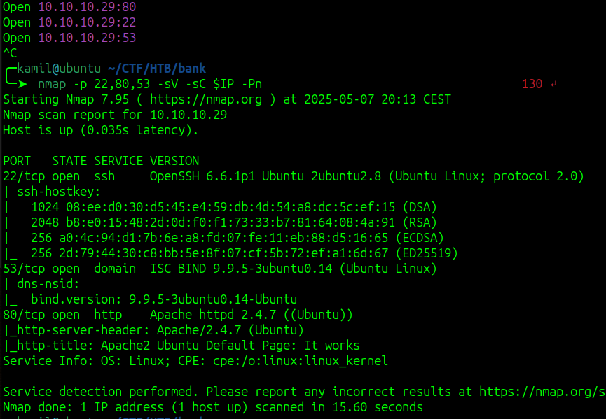

we need to add `bank.htb` to /etc/hosts

now we can access the `login.php`

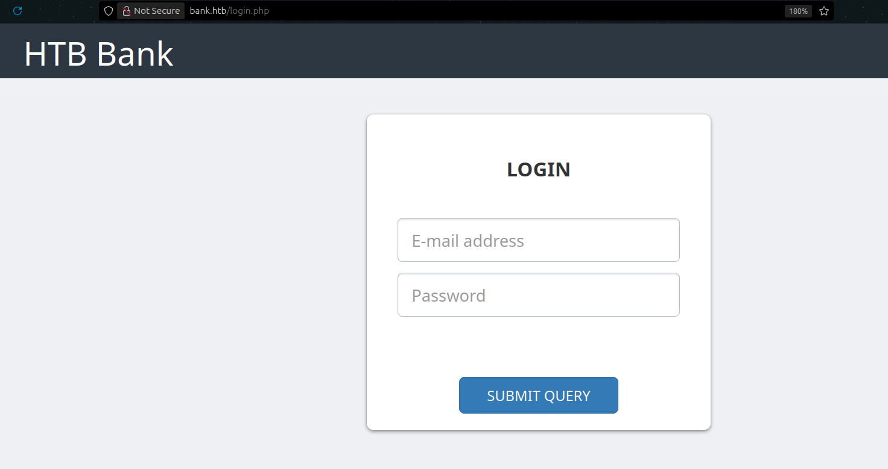


from gobuster we see hidden directories: `/uploads`, `/assets`, `/inc` and `/balance-transfer`

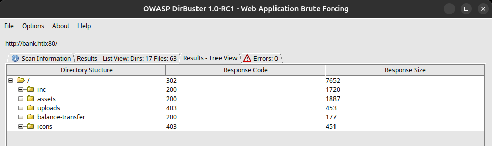

we see listing of files, one of them is smaller than others

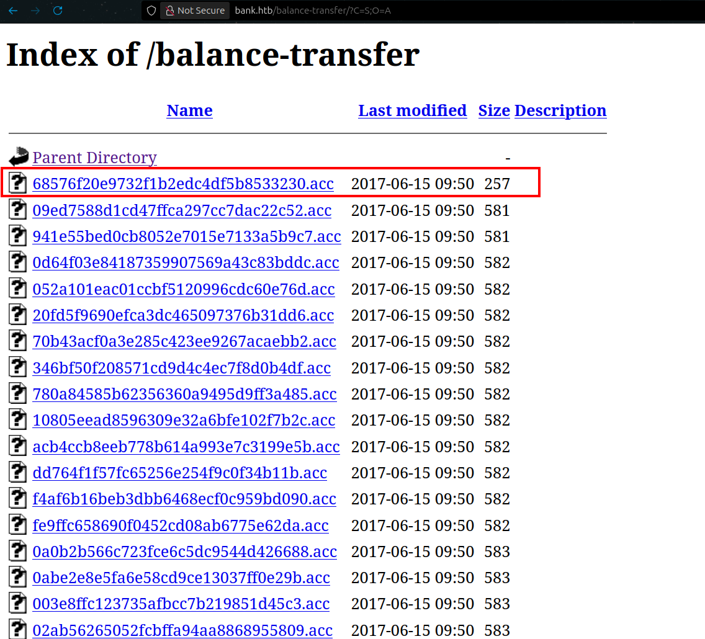

we can cat the file to get some credentials

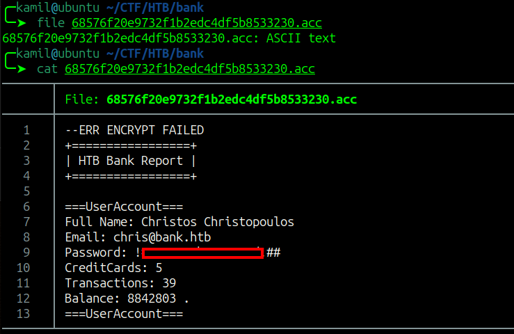

now we can login to some dashboard

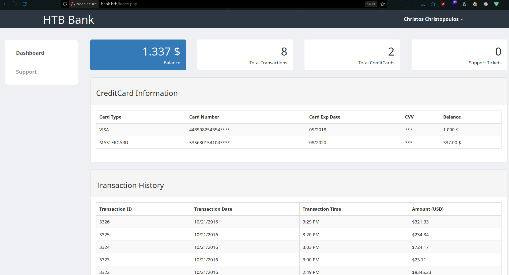

in Support we see some file upload

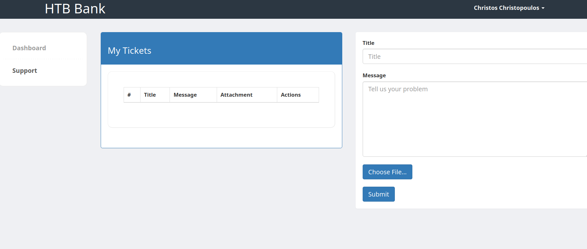

by looking at the source code we can see a comment saying that we could upload .htb files that will be executed as php, we can craft php reverse-shell and save it as .htb

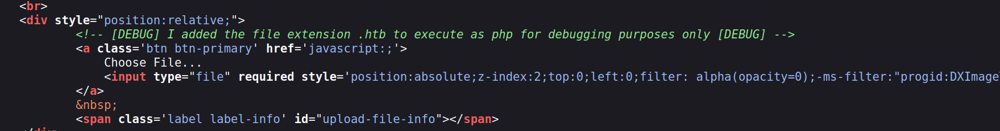

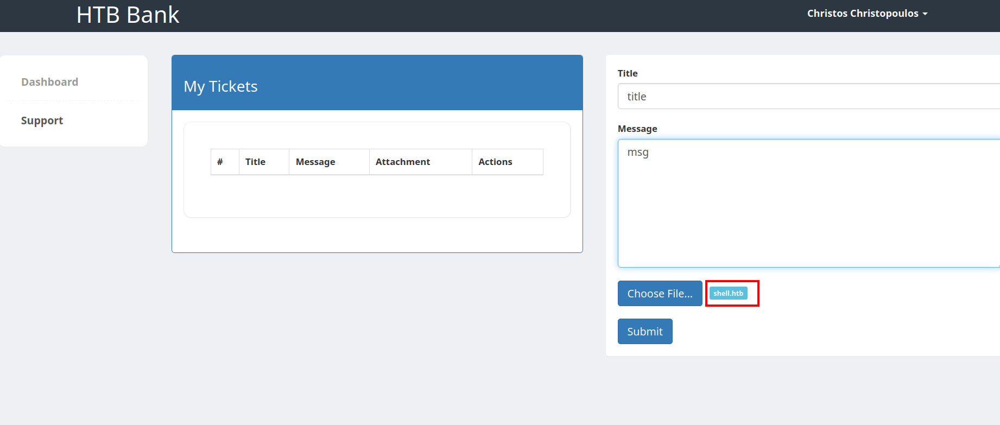

now we can click the generated link to gain shell as www-data

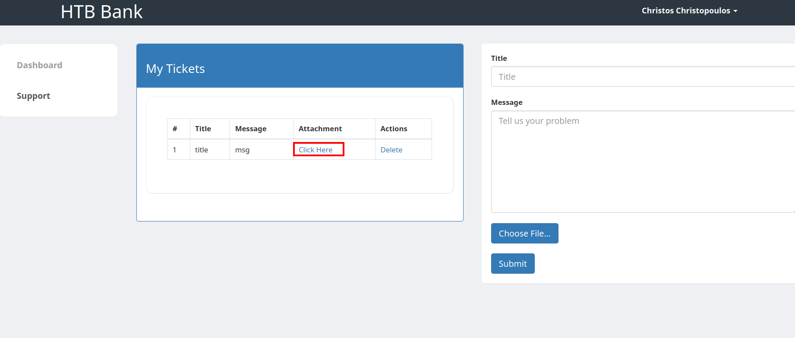

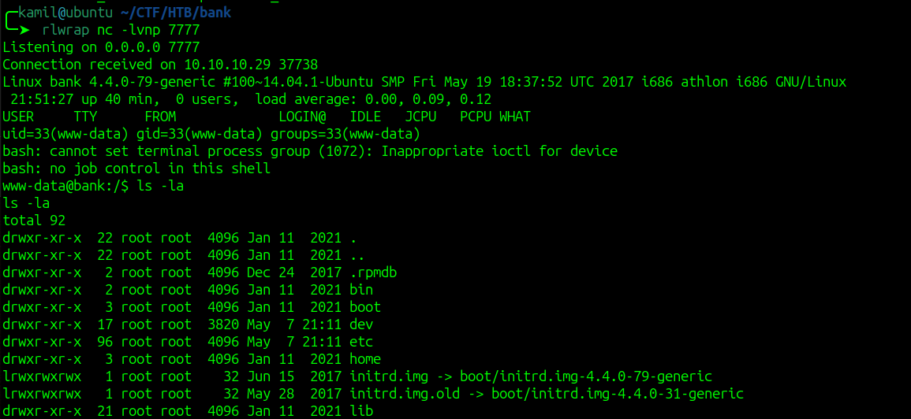

we see the user chris and we need to gain access as him to get user flag

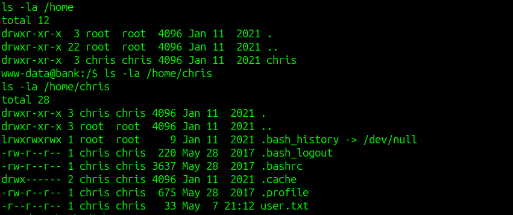

after running linpeas we see that we have write access to /etc/passwd so we can create our own root user

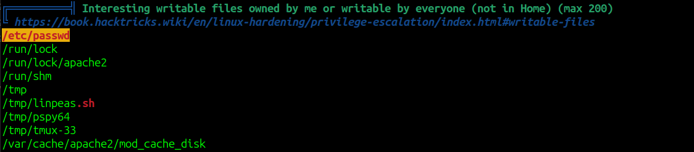

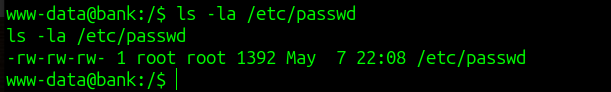

first we generate the password 

```
openssl passwd -6 "pass"
```

then we use echo to add record to /etc/passwd

```
echo 'haxor:hash:0:0:Hacker:/root:/bin/bash' >> /etc/passwd
```

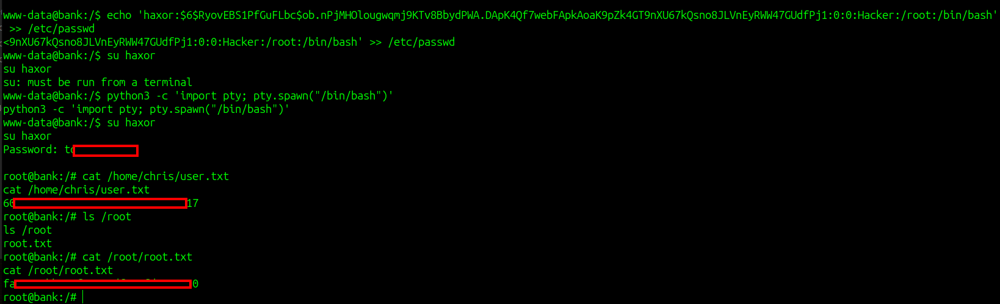

there is also easier way, we see unknown SUID binary

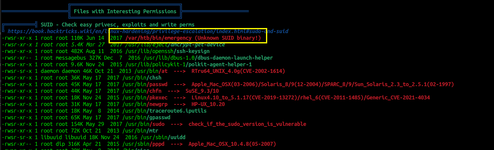

we can just run this binary to gain root access 

```
/var/htb/bin/emergency
```

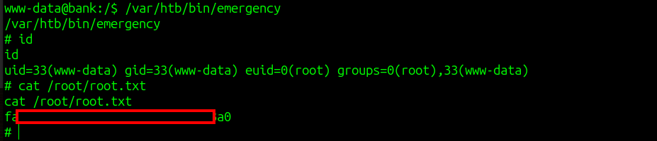

# MACHINE PWNED
