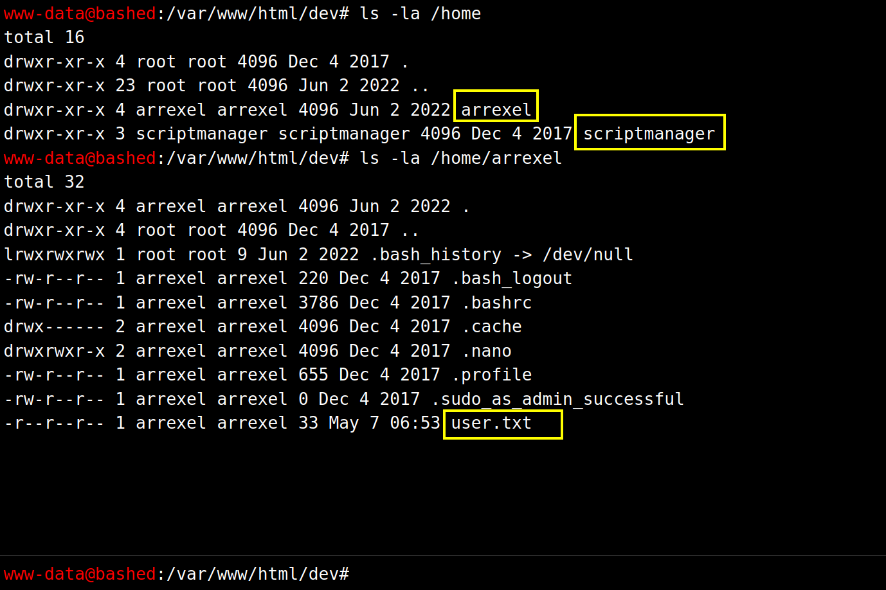

# Bashed CTF - HackTheBox Room
# **!! SPOILERS !!**
#### This repository documents my walkthrough for the **Bashed** CTF challenge on [HackTheBox](https://app.hackthebox.com/machines/118). 
---

we see open port 80


from feroxbuster we see some hidden folders 


if we head to /dev and then click on phpbash.php we see some webshell


we can execute commands as www-data


we see 2 users in /home



we can use reverse-shell to gain access in shell

by looking at the sudo -l output we see that we can run bash as scriptmanager 


```
sudo -u scriptmanager bash
```


we can now read user flag


we can run pspy64 to see what is executed, we see that file test.py is run every few minutes


we can also modify this file, we can add malicious script that will copy bash with SUID bit


after waiting for a short while we can inspect /tmp folder and we see a rootbash

now we execute 

```
/tmp/rootbash -p
```


now we have access as root and we can grab root flag

# MACHINE PWNED
