# Cronos CTF - HackTheBox Room
# **!! SPOILERS !!**
#### This repository documents my walkthrough for the **Cronos** CTF challenge on [HackTheBox](https://app.hackthebox.com/machines/Cronos). 
---

we see open ports 22, 53 and 80

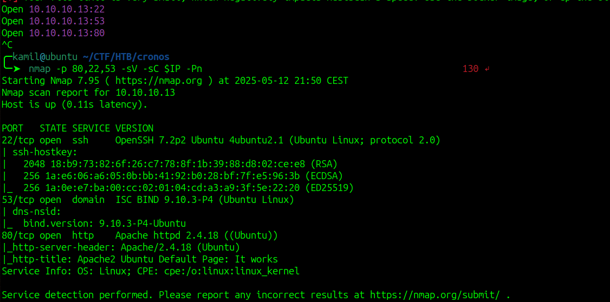

we can enumerate sub-domains 

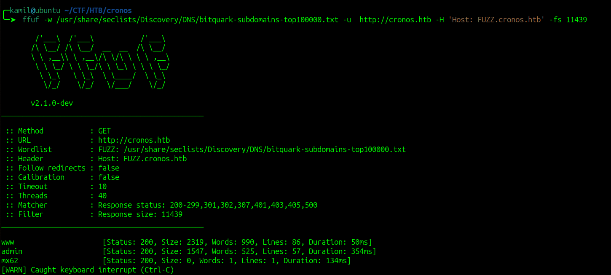

we found admin vhost

if we head to webpage we see login form 

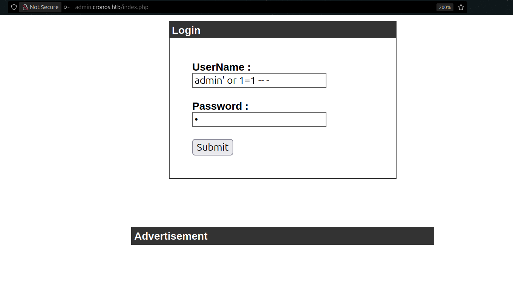

we can try simple SQLi like `admin' or 1=1 -- -`

it works and we have access to some command execution

we can use simple command injection using `;` to gain RCE

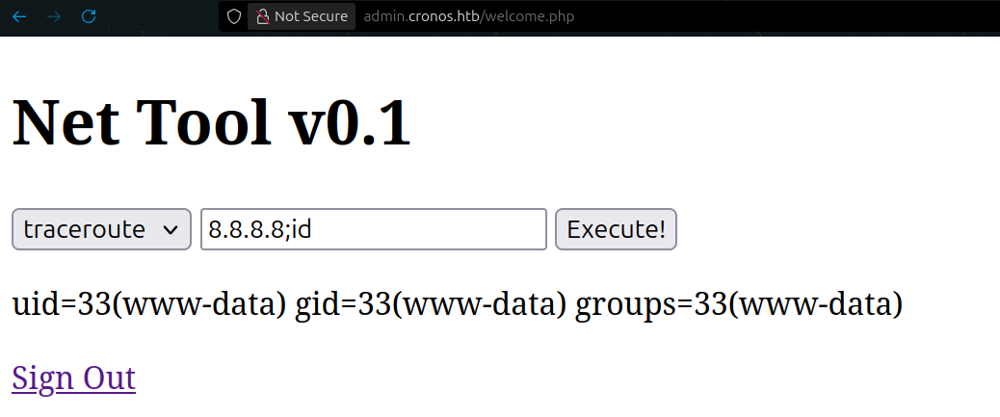

we can use `; id` to confirm it

now we can inject reverse-shell command to gain shell access

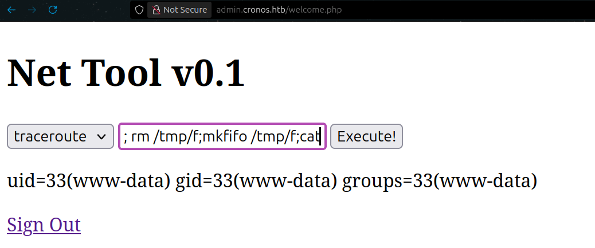

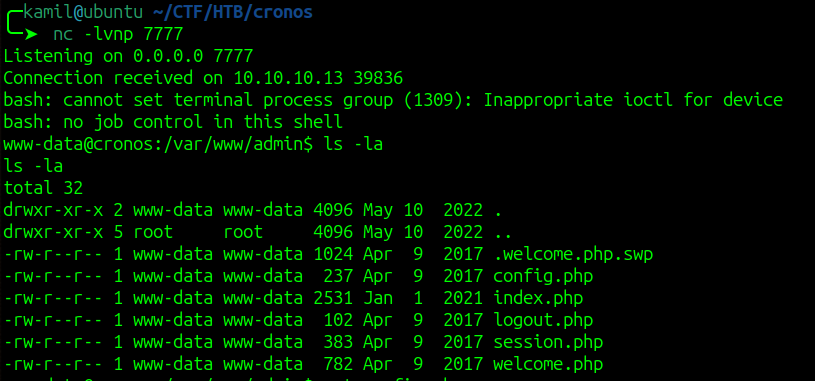

we can also grab user flag

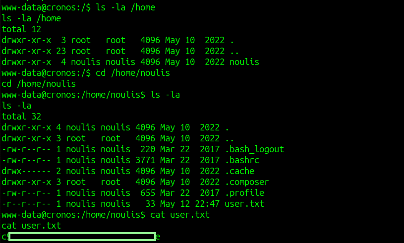

we can check crontab for cron jobs

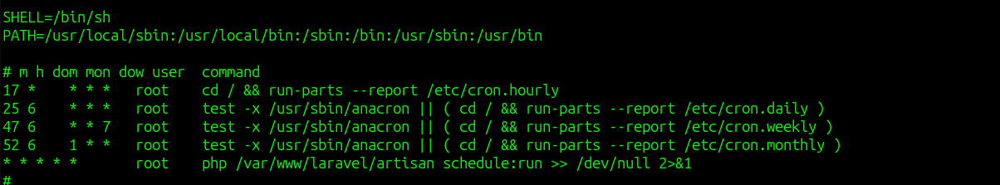

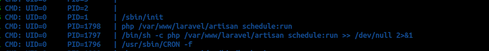

if we check permissions on file that is being executed by cron job, we have write access to it, so we can modify the file

we can send pentestmonkey php reverse shell to victim and swap it with file executed in cronjob 

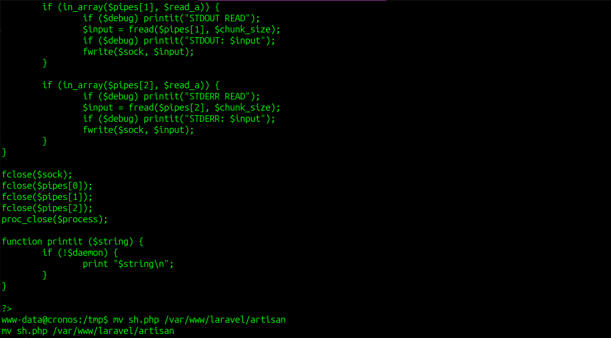

then we wait to get hit with the shell

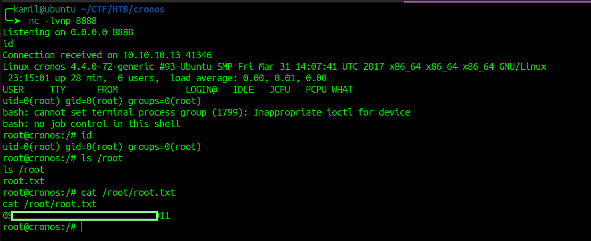

# MACHINE PWNED
