# Data CTF - HackTheBox Room
# **!! SPOILERS !!**
#### This repository documents my walkthrough for the **Data** CTF challenge on [HackTheBox](https://app.hackthebox.com/machines/Data). 
---

we see open ports 22 and 3000

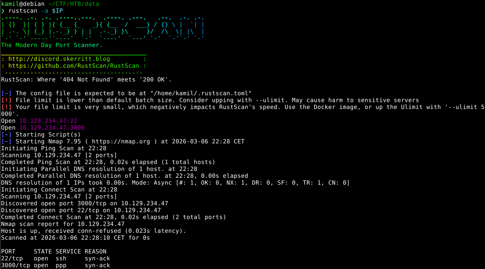

using nmap to gain more info

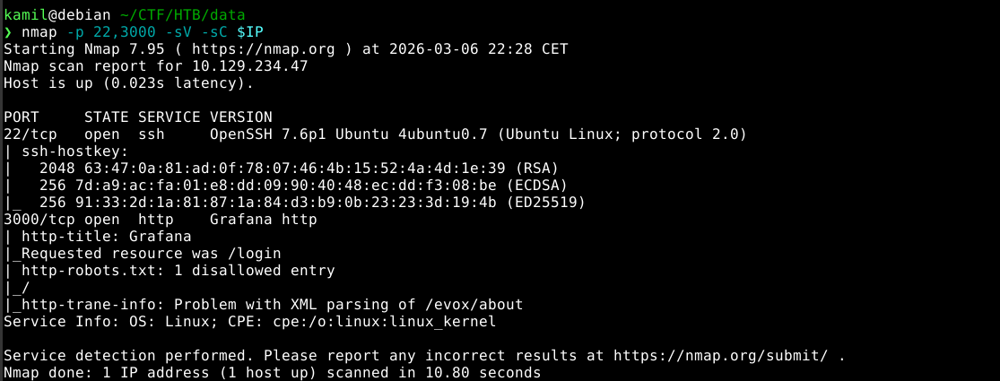

on port 3000 there is grafana instance running, we also see that the version is outdated and vulnerable to LFI via CVE-2021-43798

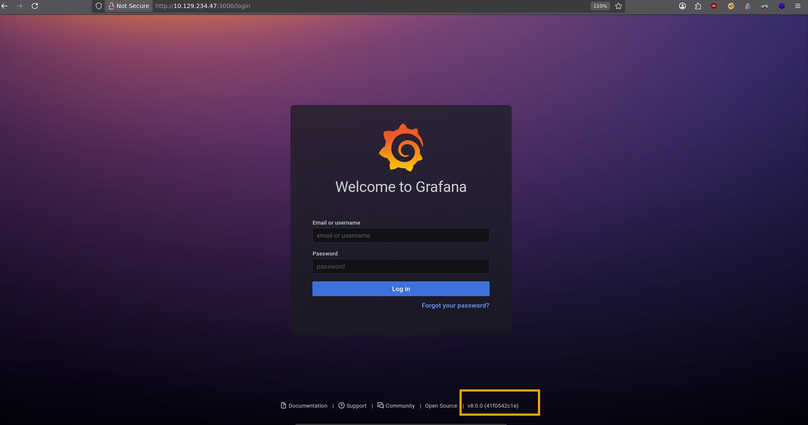

we can use the exploit from https://github.com/K3ysTr0K3R/CVE-2021-43798-EXPLOIT/blob/main/CVE-2021-43798.py to test for LFI

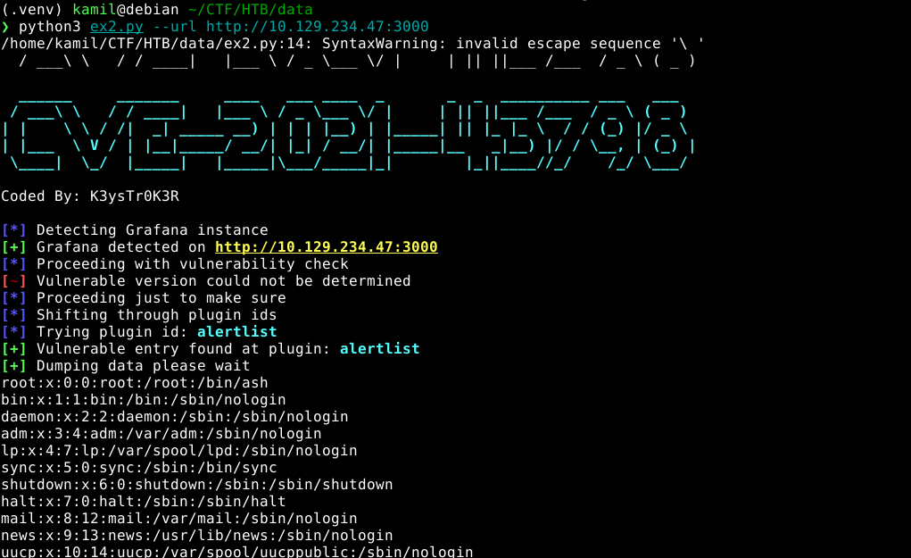

we see that the program dumped the file using this url

```
http://IP:3000/public/plugins/alertlist/../../../../../../../../../../../../../../../../../../../etc/passwd
```

we can now curl the `/etc/passwd`

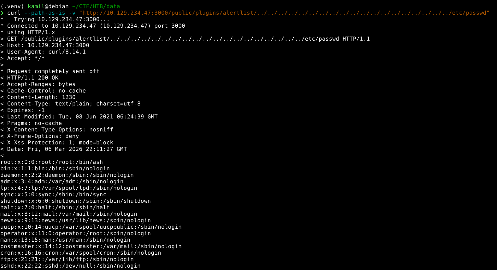

we can also curl the grafana database from `/var/lib/grafana/grafana.db`

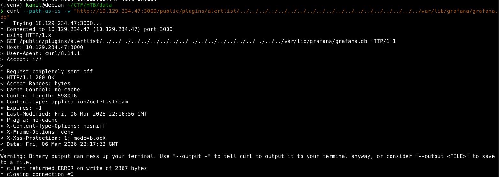

we also can dump other OS files 

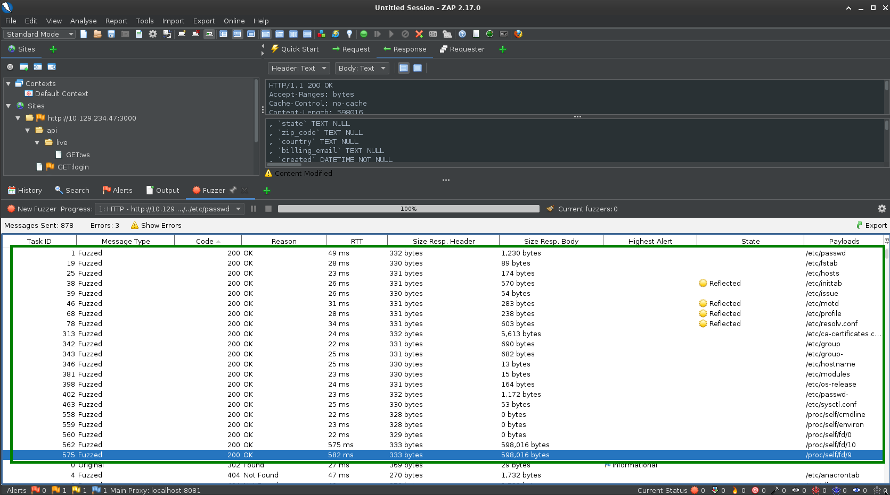

after dumping database we can look inside using sqlite3

we can find user table, so we can dump users data

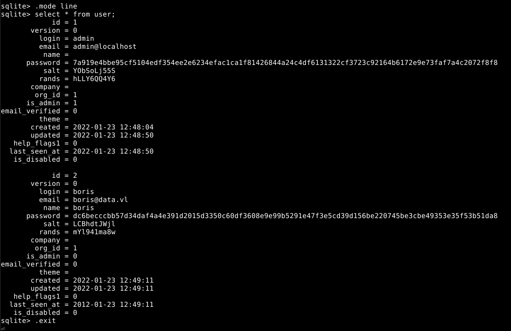

default mode of password hashing in grafana is PBKDF2-HMAC-SHA256 with 10000 iterations

now we prepare the file for hashcat with this template: `user:sha26:iterations:base64_salt:base64_hash`

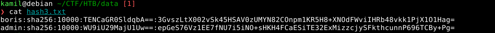

now we are ready to crack

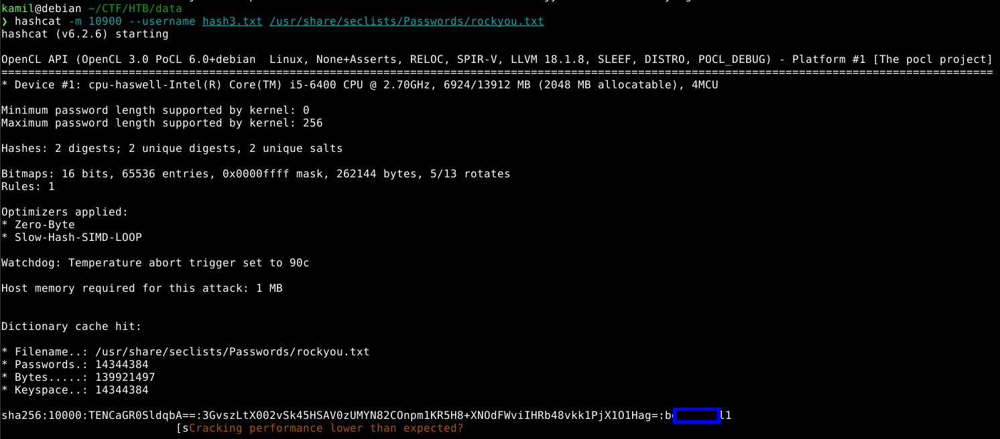

we found some password, we can try to login as boris via ssh, it works we can grab user flag

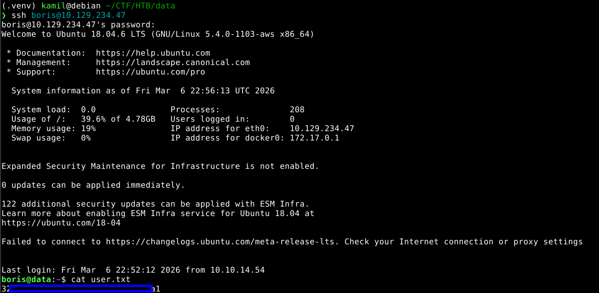

we can check sudo permissions

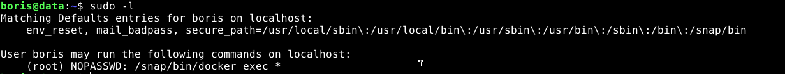

we can run ps to check docker process running

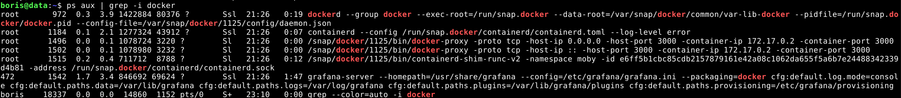

by running ps we know the grafana container id that we will use to escape

we can use this command to start our escape:

```
sudo /snap/bin/docker exec -u 0 --privileged -it e6ff5b1 /bin/sh 
```

we entered running grafana instance as root user in privileged mode

then we can check devices with `fdisk -l`

then we created new directory `/mnt/host` and mounted sda1 there using `mount /dev/sda1 /mnt/host`

then we change main catalog with `chroot /mnt/host /bin/bash` 

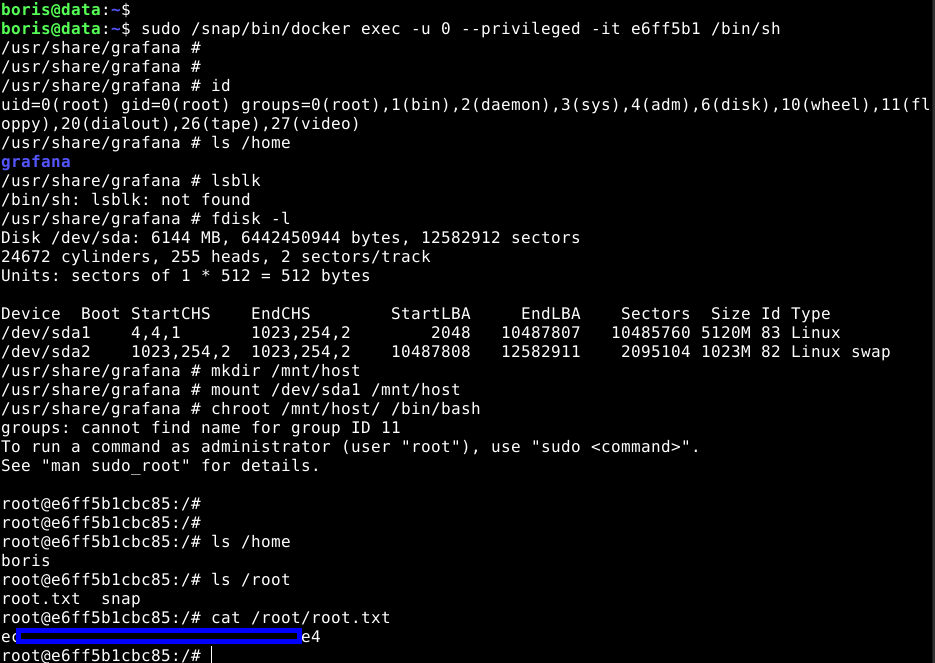

we can add our ssh public key to gain true root access

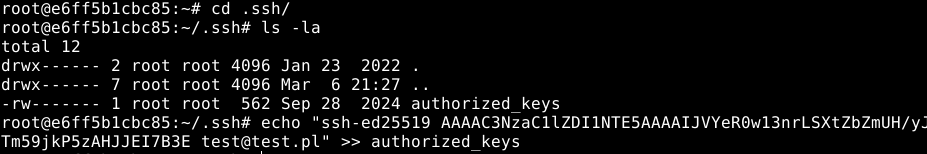

now we have true root access via ssh

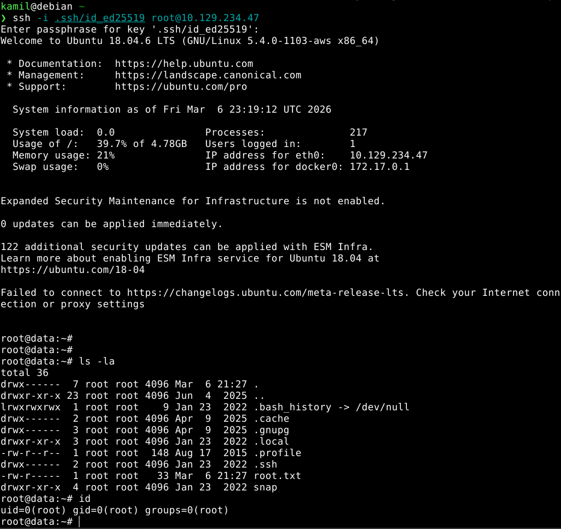

# MACHINE PWNED