# Forgotten CTF - HackTheBox Room
# **!! SPOILERS !!**
#### This repository documents my walkthrough for the **Forgotten** CTF challenge on [HackTheBox](https://app.hackthebox.com/machines/Forgotten). 
---

we see open ports 22 and 80

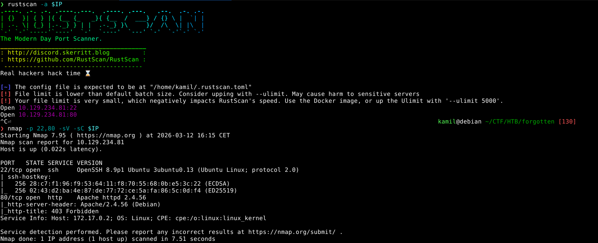

we can fuzz the web directories

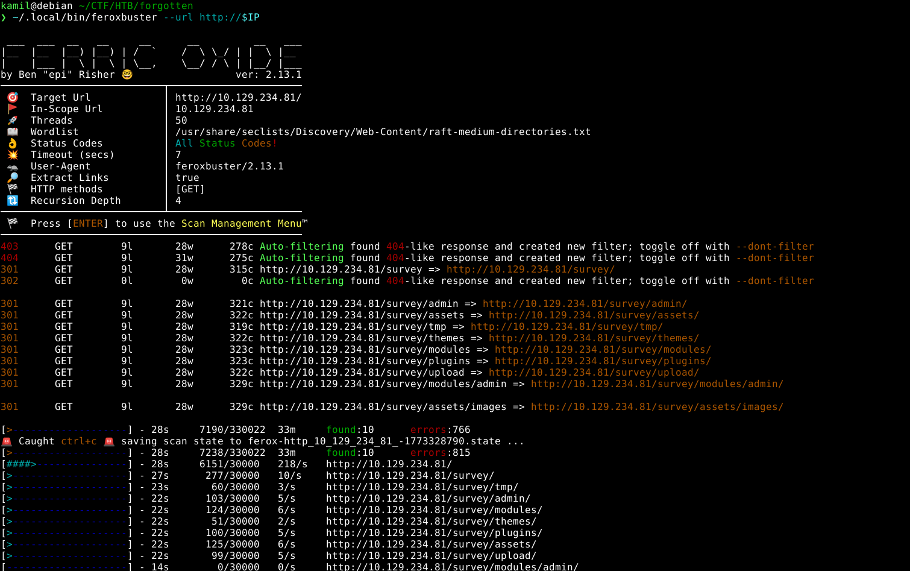

we see `/survey` endpoint

we can check what is it, we see limesurvey instalation panel

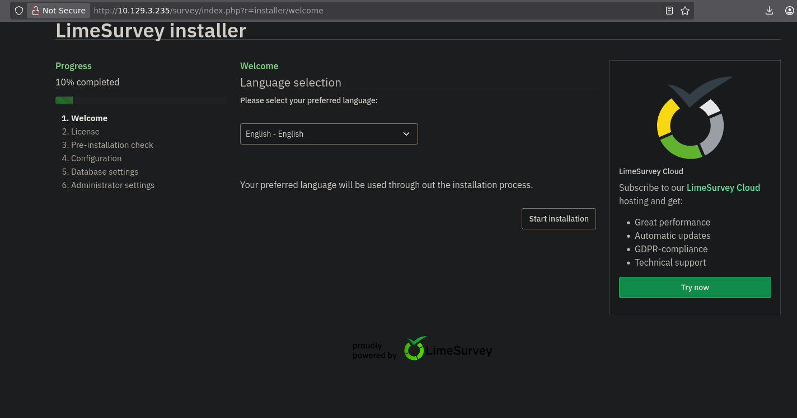

we can create our own database instance and connect it to the limesurvey configuration

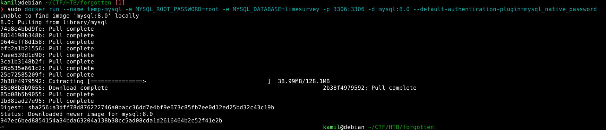

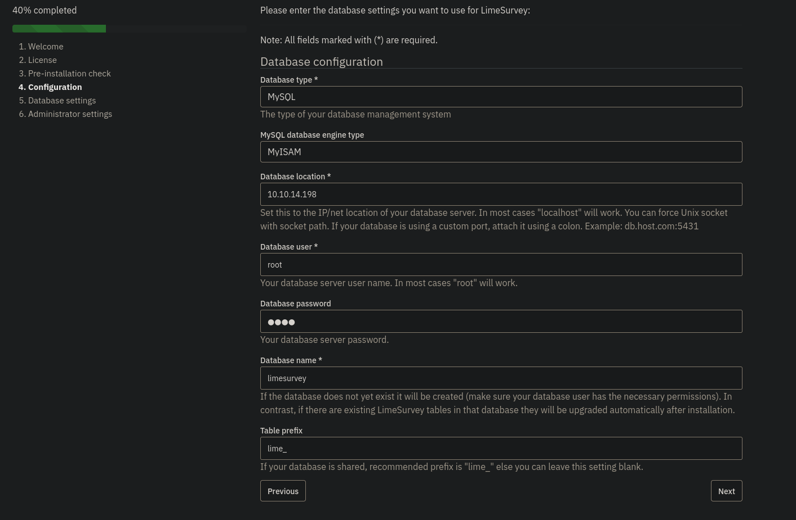

now we create admin account

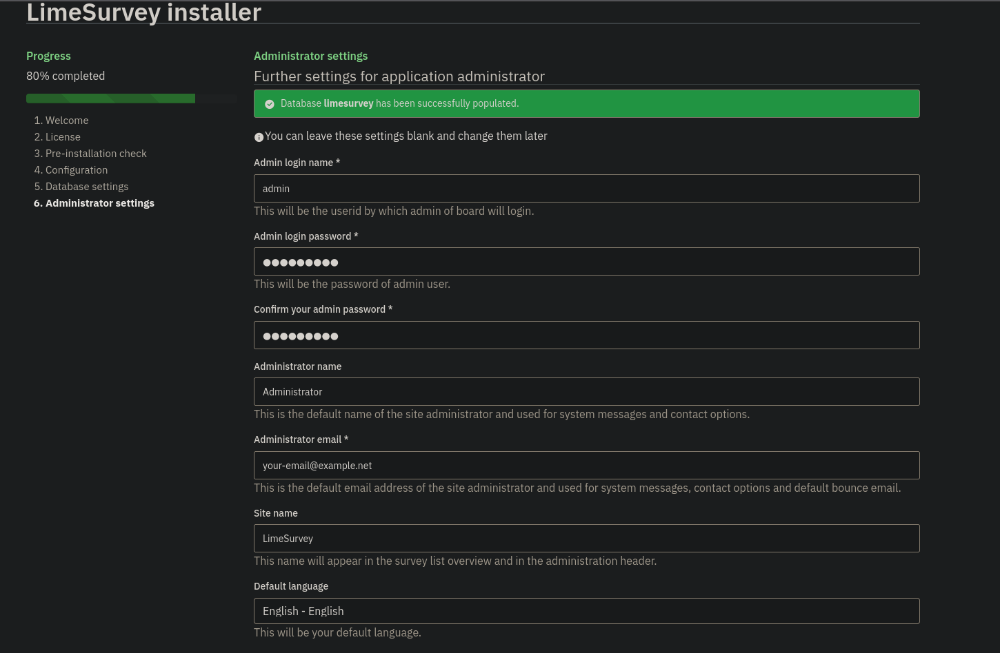

now we login as new admin user

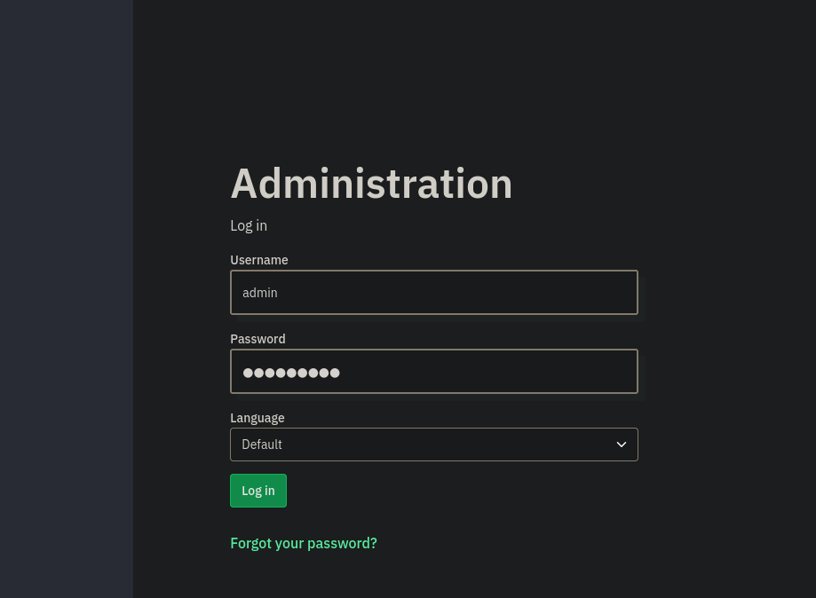

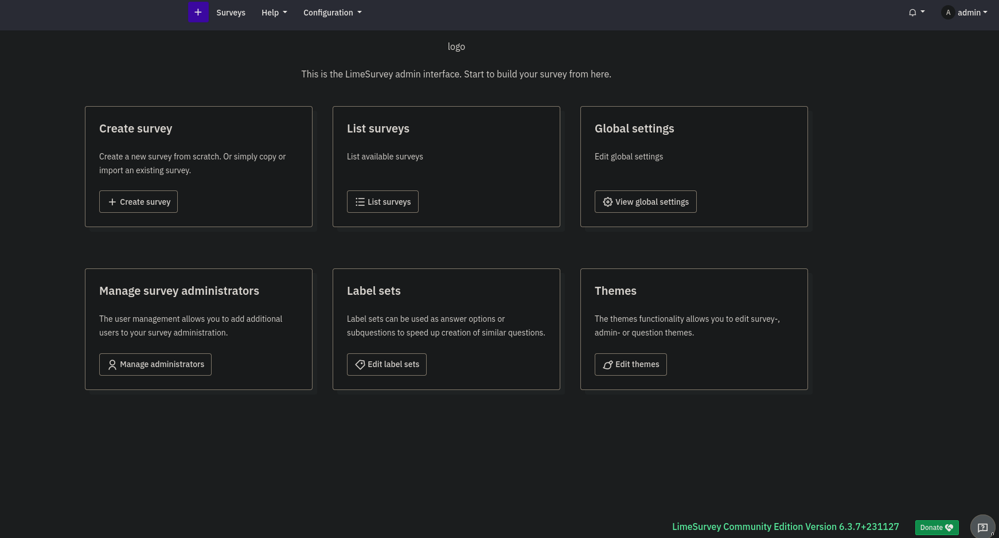

we can check the limesurvey version

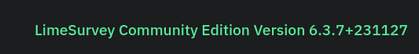

this version is vulnerable to authenticated RCE, we can upload our own plugin with simple php reverse shell, we also need `config.xml` file that is easy to find on github, next we archive those 2 files into one .zip file

now we can upload our malicious plugin

here we see our imported malicious plugin

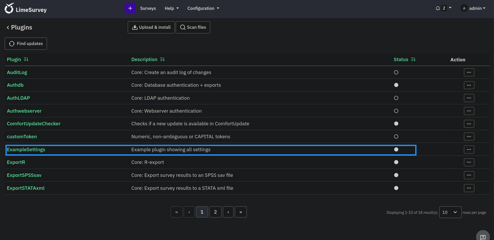

now we can head to `http://IP/survey/upload/plugins/ExampleSettings/php-rev.php` to start a reverse shell

we recieved reverse shell

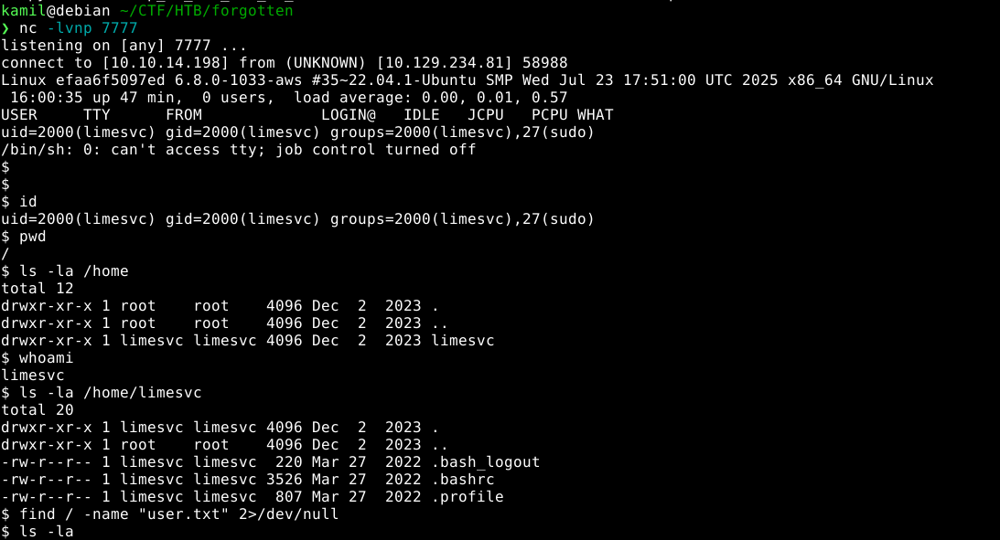

we see that we are inside docker container

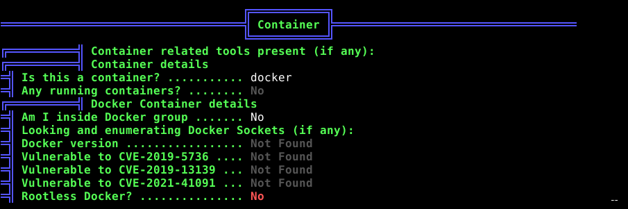

if we check path variables with export command we see LIMESURVEY_PASS we can try to use it as a password

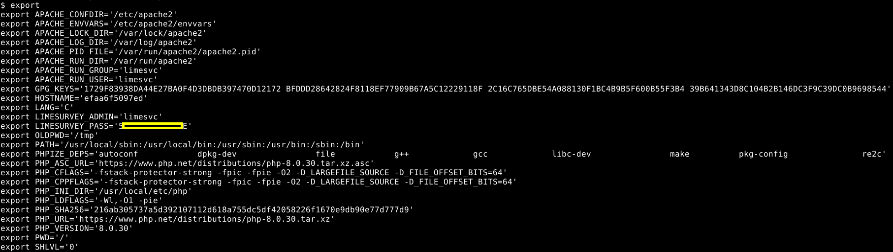

we can use this password to login via ssh as normal user and escape the container, we can also grab user flag

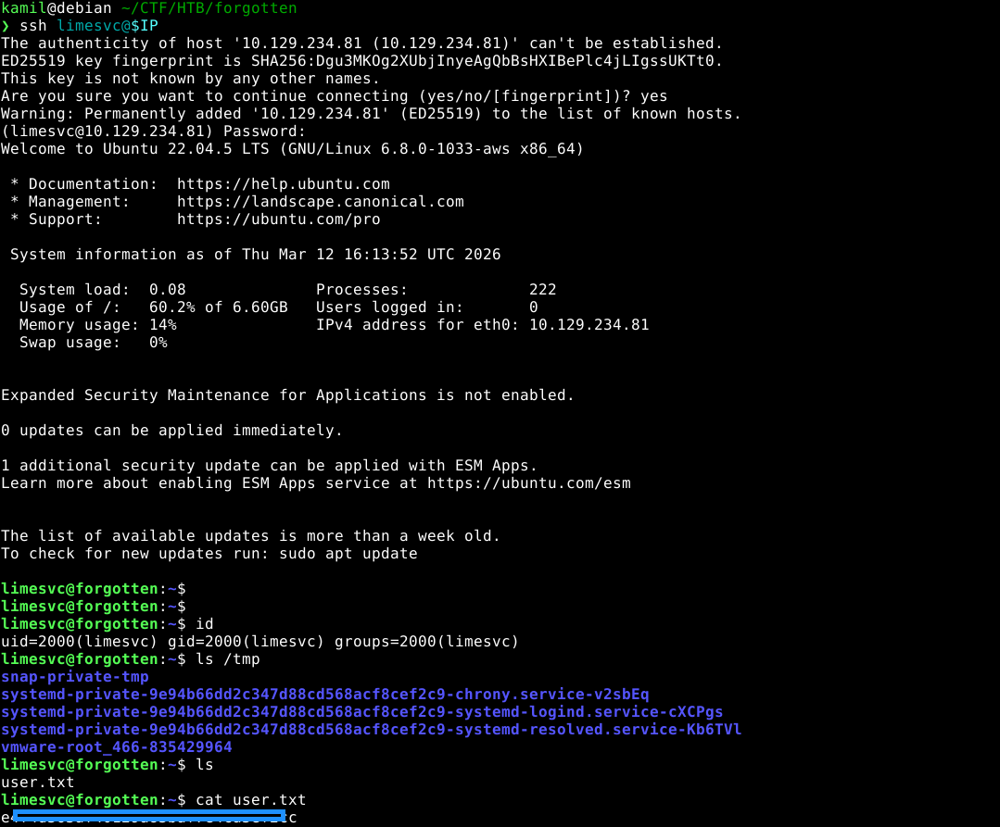

the same password can also be used to check for sudo permissions with `sudo -l`

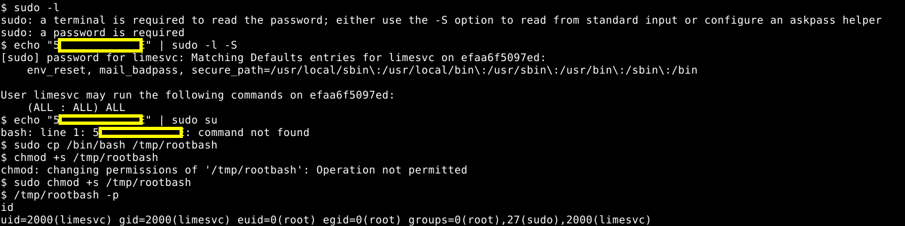

we see that we can run anything as sudo so we can copy `/bin/bash` with SUID permissions, now we have root access inside container

in the `/opt/limesurvey` we see limesurvey files outside of the container

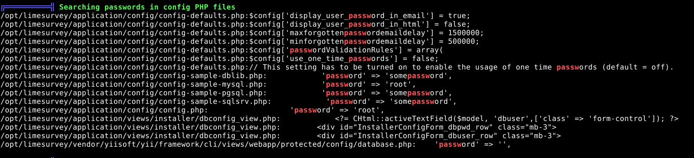

we see that `/opt/limesurvey` seems the same as `/var/www/html/survey` inside the container, we can check if the folder is shared by creating simple file and observe the result

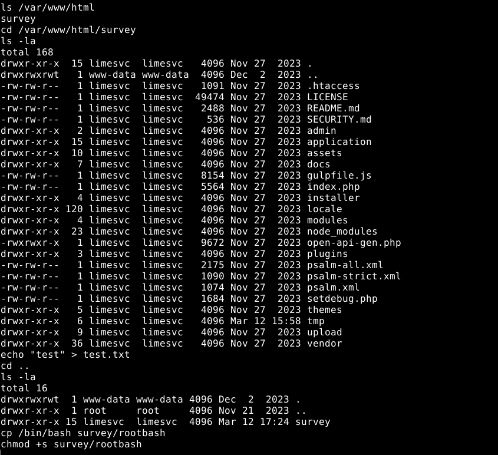

we see that the file appeared

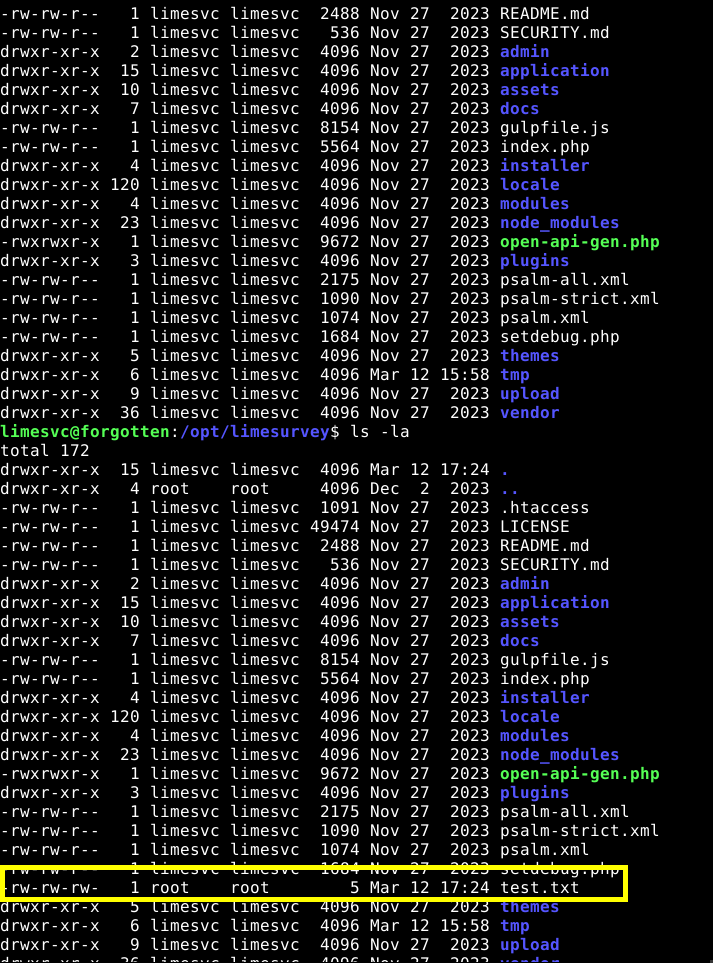

we see that the file was created as root so we can try to copy `/bin/bash` with SUID once again

we see `rootbash` appeared highlited as red, it means we will be able to run it as root

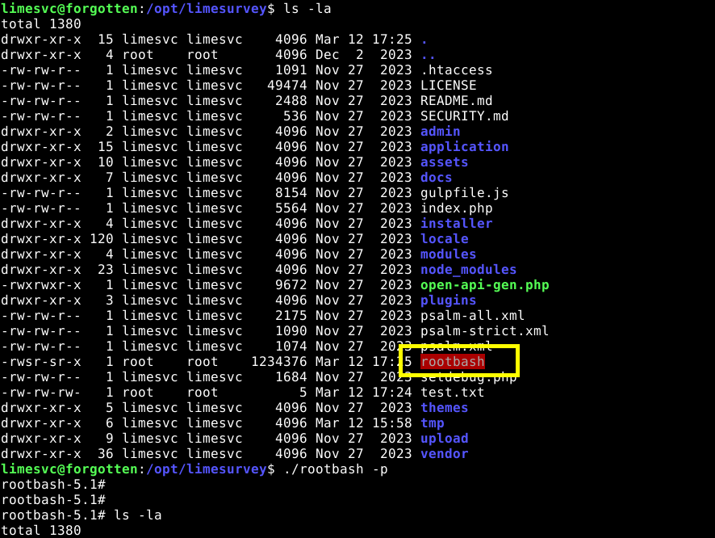

now we have root access on machine, we can grab root flag

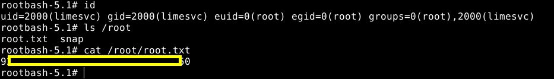

# MACHINE PWNED

