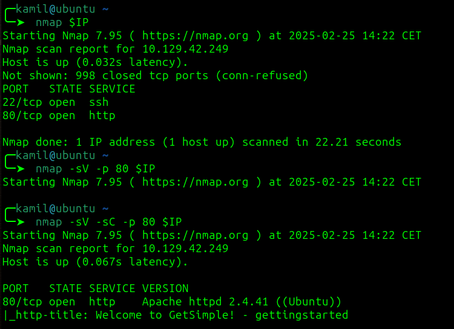
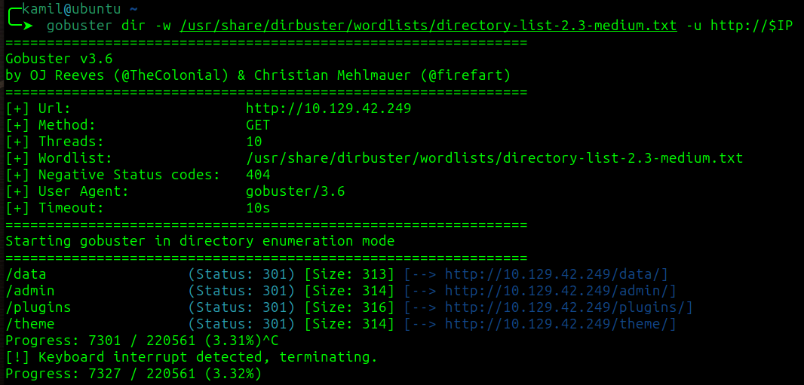
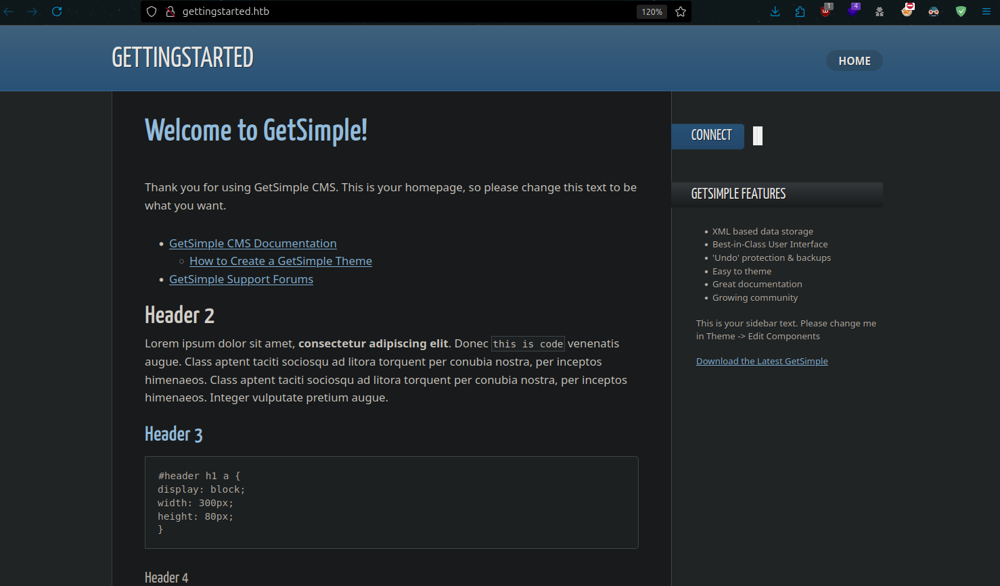
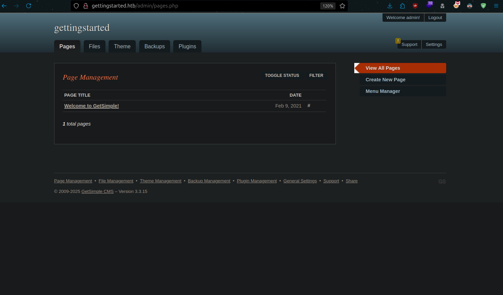
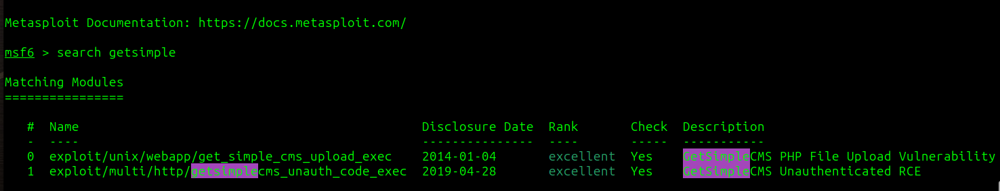
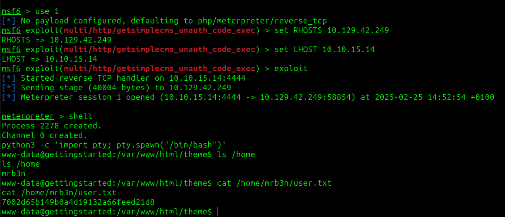
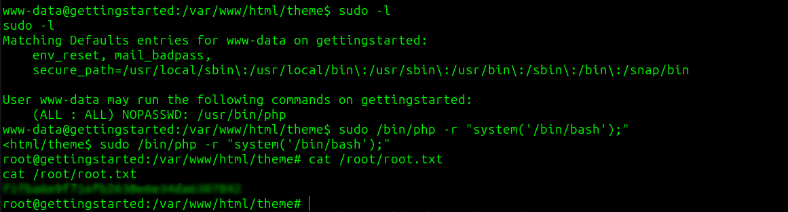

# GettingStarted CTF - HAckTheBox Academy Room
# **!! SPOILERS !!**
#### This repository documents my walkthrough for the **GettingStarted** CTF challenge on [HackTheBox Academy](https://tryhackme.com/r/room/pokemon). 
---
First nmap scan



Gobuster scan



The main page



page seems to use GetSimple CMS, gobuster showed admin panel, i tried most common default credentials and they worked `admin:admin`



i tried to use file upload function to upload webshell but I couldnt do it so i checked `metasploit` for known exploits



i will try the RCE exploit

setting `RHOST` as victim, `LHOST` as attacker
then using command shell to use standard shell instead of meterpreter
and then python one-liner to stabilize shell

```
python3 -c 'import pty; pty.spawn("/bin/bash")'
```



Found user flag

now using `sudo -l` 

chatGPT suggested to use this command to gain root access

```
sudo /bin/php -r "system('/bin/bash');"
```

nad now we have root access 



# MACHINE PWNED
