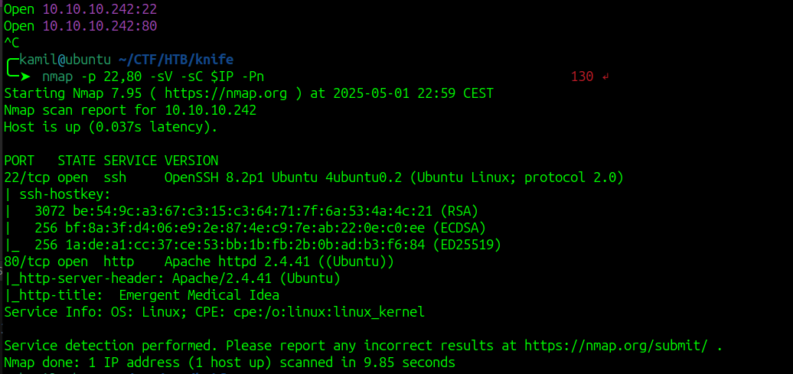
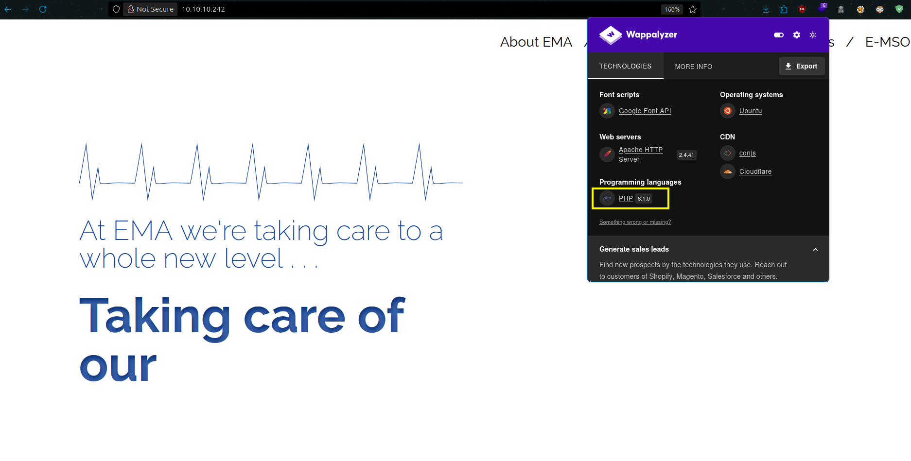
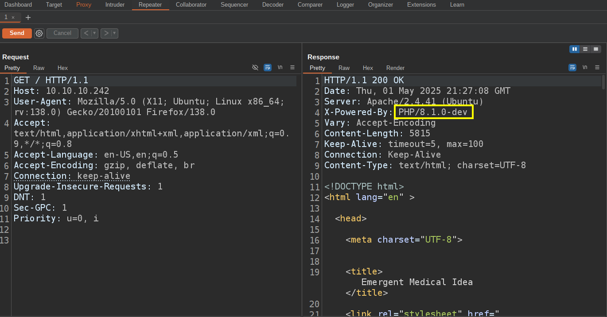
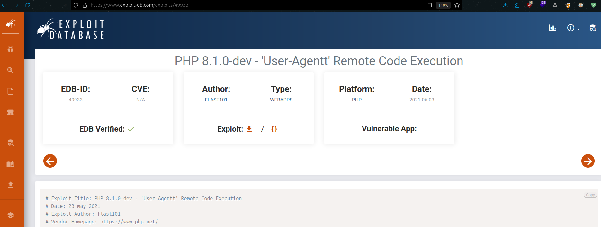
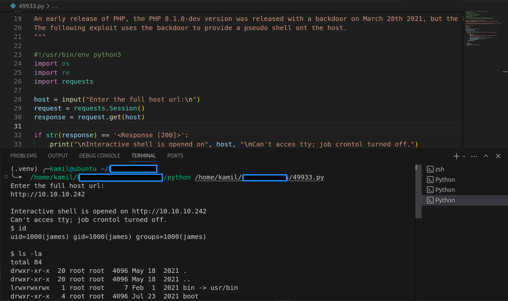
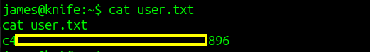
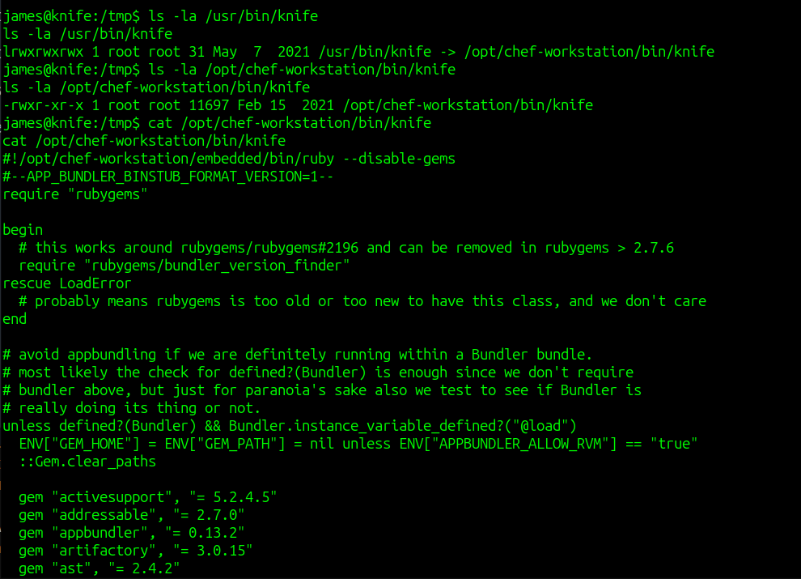
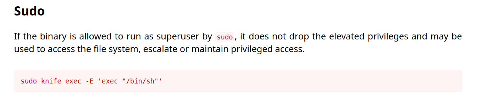
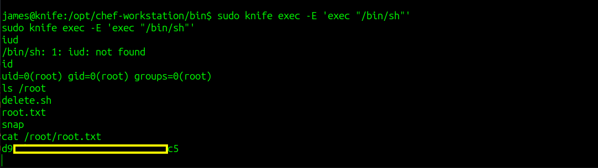

# Knife CTF - HackTheBox Room
# **!! SPOILERS !!**
#### This repository documents my walkthrough for the **Knife** CTF challenge on [HackTheBox](https://app.hackthebox.com/machines/Knife). 
---

we found 2 open ports 22 and 80



i didnt find any interesting things by doing enumeration 



by looking at the request we see that server uses old and vulnerable php version 8.1.0, that has known RCE exploit



we can use python script from `https://www.exploit-db.com/exploits/49933`



by executing the script and providing full url to server we now have access as james



we can grab user flag



by lookin at `sudo -l` output we see that we can run sudo on /usr/bin/knife




we can check GTFObins if there is a way to gain root shell



we need to use this line:

```
sudo knife exec -E 'exec "/bin/sh"'
```

we have root access and root flag



# MACHINE PWNED
