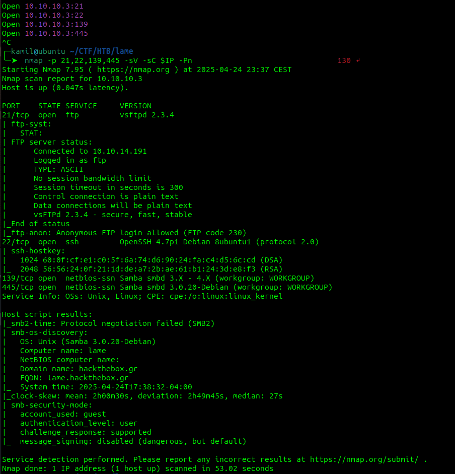
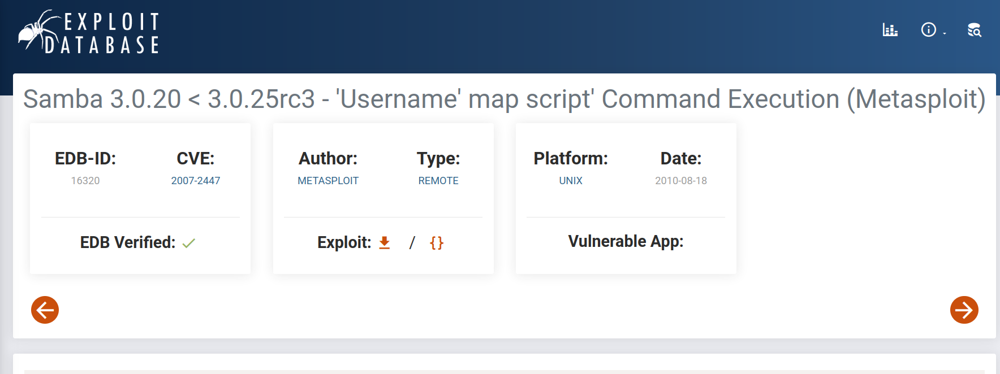
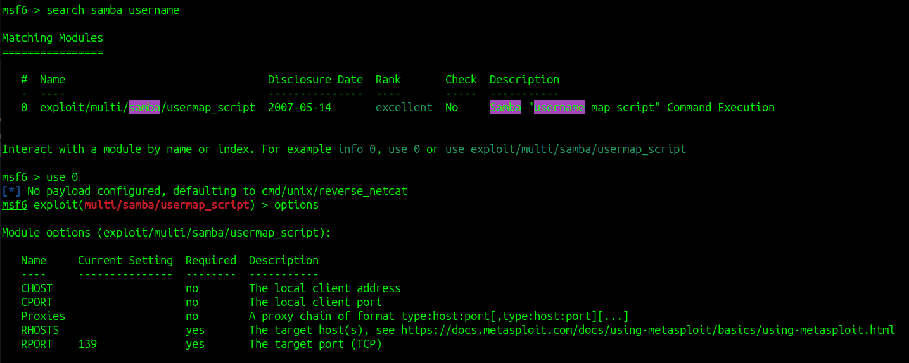
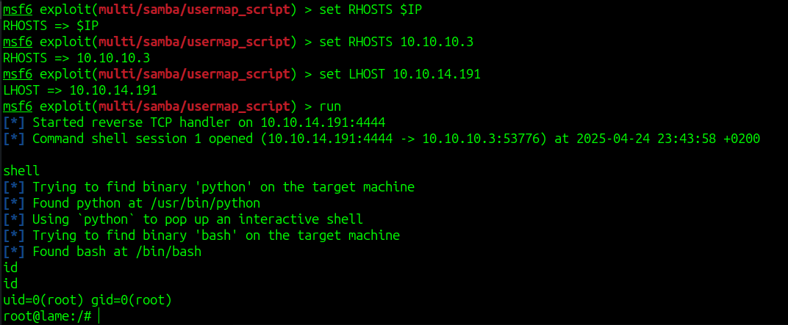
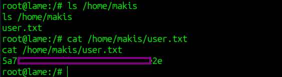
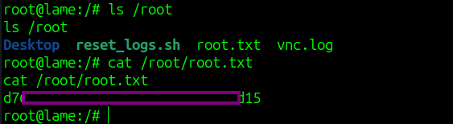

# Lame CTF - HackTheBox Room
# **!! SPOILERS !!**
#### This repository documents my walkthrough for the **Lame** CTF challenge on [HackTheBox](https://app.hackthebox.com/machines/Lame). 
---

we see 4 open ports: 21, 22, 139, 445

after scanning the versions we see old and vulnerable versions of vsftpd and smb

after googling the `smb 3.0.20 exploit` we found CVE-2007-2447

we can use metasploit to run the attack

we need to provide the RHOSTS and LHOST for attack to work

after running the payload we got shell as root

we can grab user flag 

and root flag

# MACHINE PWNED
