# Photobomb CTF - HackTheBox Room
# **!! SPOILERS !!**
#### This repository documents my walkthrough for the **Photobomb** CTF challenge on [HackTheBox](https://app.hackthebox.com/machines/Photobomb). 
---

we see open ports 22 and 80

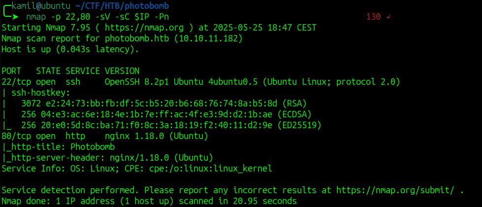

from websiter source code we see intersting file `photobomb.js` and `/printer` route 

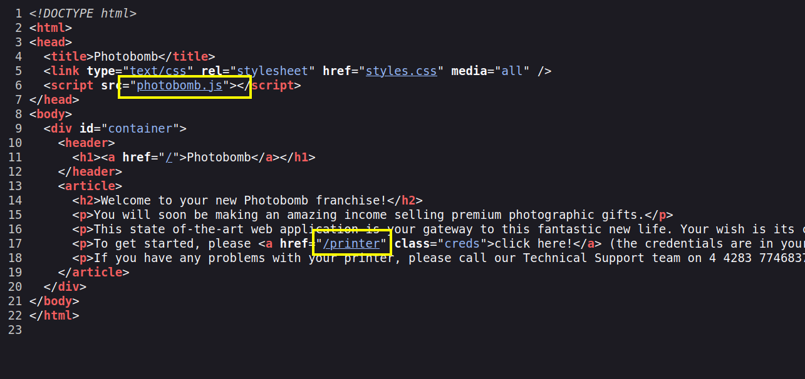

the /printer is protected with basic HTTP auth

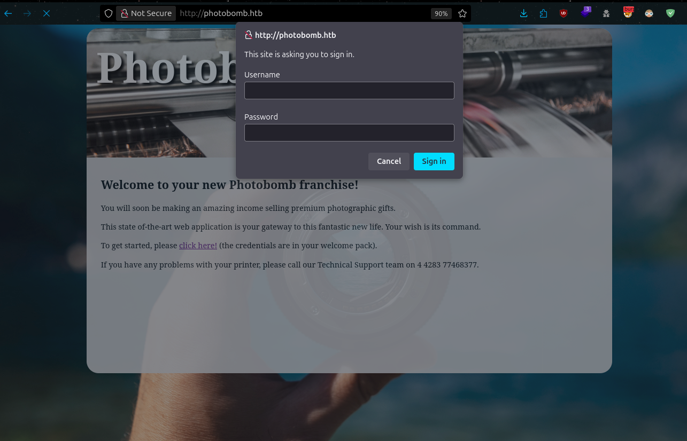

in js file wee see some credentials that might work

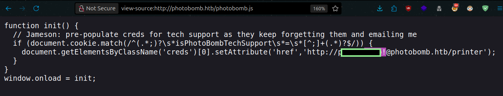

they worked and we can access /printer

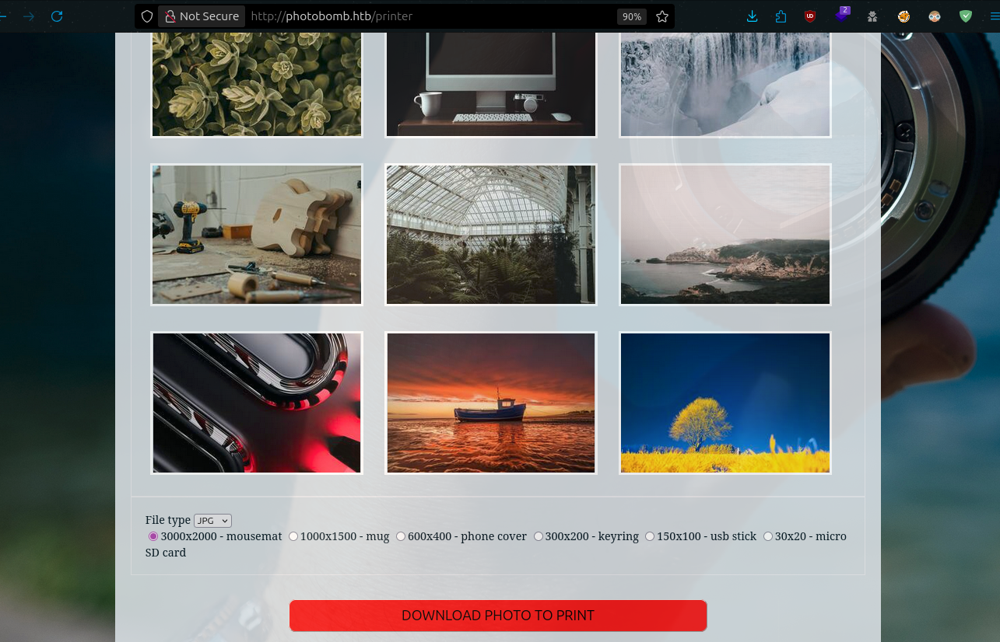

if we capture the request that is send while clicking "Download photo to print" we see 3 parameters: photo, filetype, dimensions

if we try to manipulate those parameters we can simply find that filetype paramter is vulnerable to command injection

we can use payload `png;sleep+5`, the response takes much longer than standard one, we have Blind command injection, we dont see the result (if we use `png;id`) but we know that command is being executed because the system is stalling

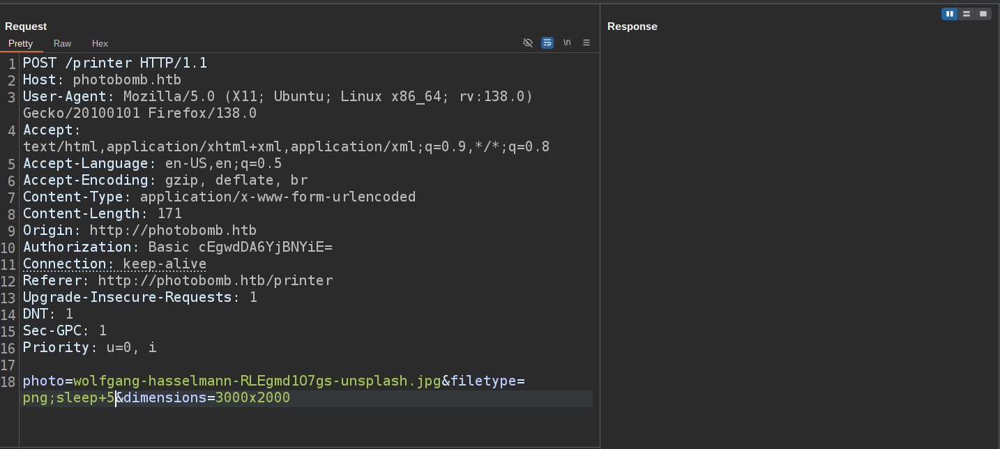

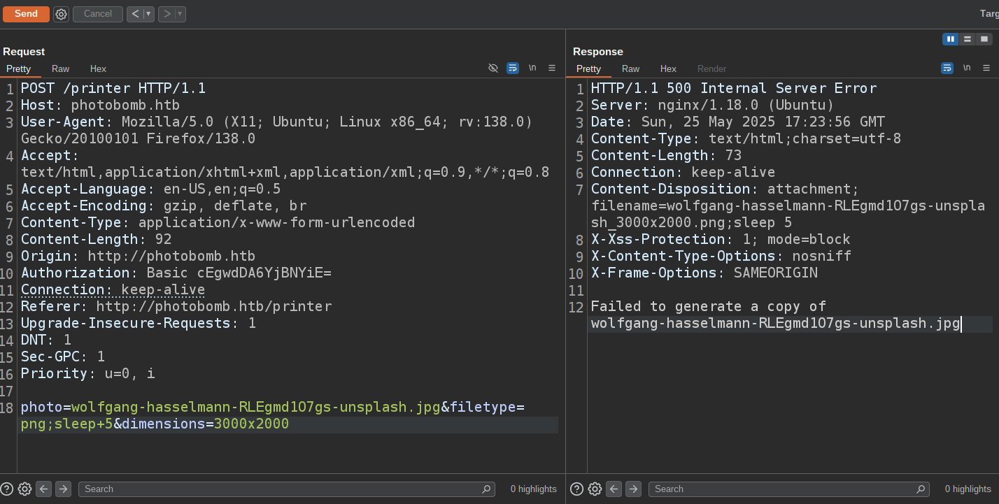

we can now create the payload that will send reverse shell to us

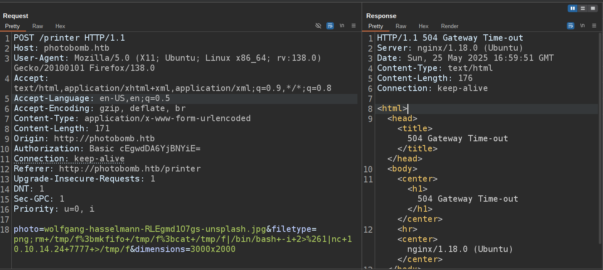


we got reverse-shell access as wizard and we can grab user flag

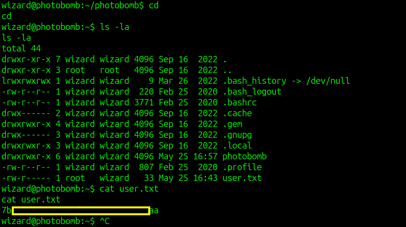

we can run linpeas

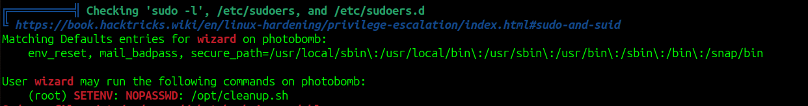

from linpeas we see that we can run sudo on some script `/opt/cleanup.sh` with SETENV

we can inspect the cleanup.sh code

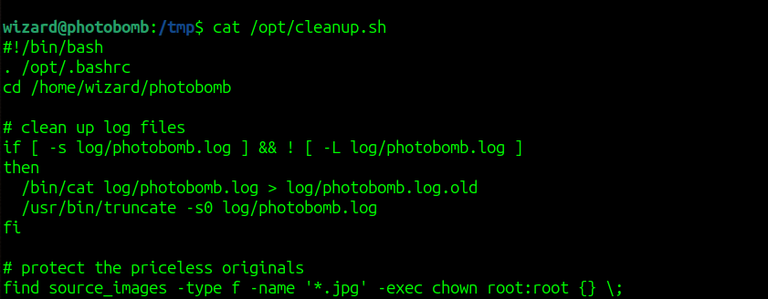

we see that find command is run without absolute path so we can create our own malicious version of it 

```
$ cd /tmp
$ mkdir find && cd find
$ nano find

--
Content of the file:
cp /bin/bash /tmp/bashroot && chmod +s /tmp/bashroot
--

$ chmod +x find
```

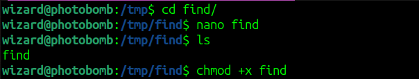

now we can run this command to execute our malicious script as root user to copy the /bin/bash with SUID

```
sudo PATH=/tmp/find:$PATH /opt/cleanup.sh
```

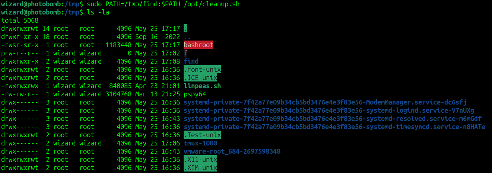

it worked now we use `/tmp/bashroot -p` to gain root shell

we got root access and root flag

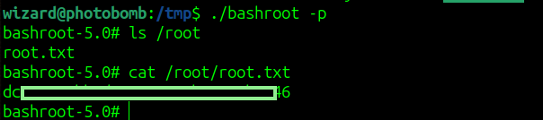

# MACHINE PWNED
