# UnderPass CTF - HackTheBox Room
# **!! SPOILERS !!**
#### This repository documents my walkthrough for the **UnderPass** CTF challenge on [HackTheBox](https://app.hackthebox.com/machines/UnderPass). 
---

scanning 2 open ports 22 and 80

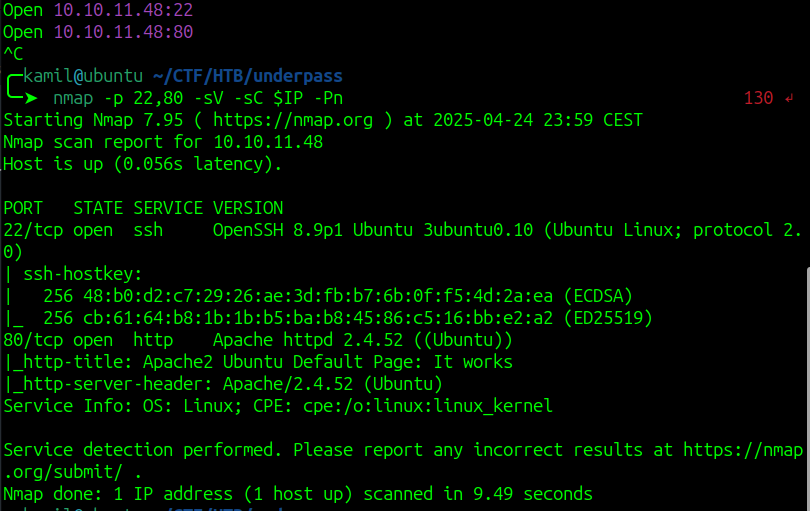

using feroxbuster to find hidden files, but didnt seem to work

we only see default apache website

i tried enumerating ports harder and doing UDP scan 

```
sudo nmap -sS -sU -T4 -A -v 10.10.11.48
```

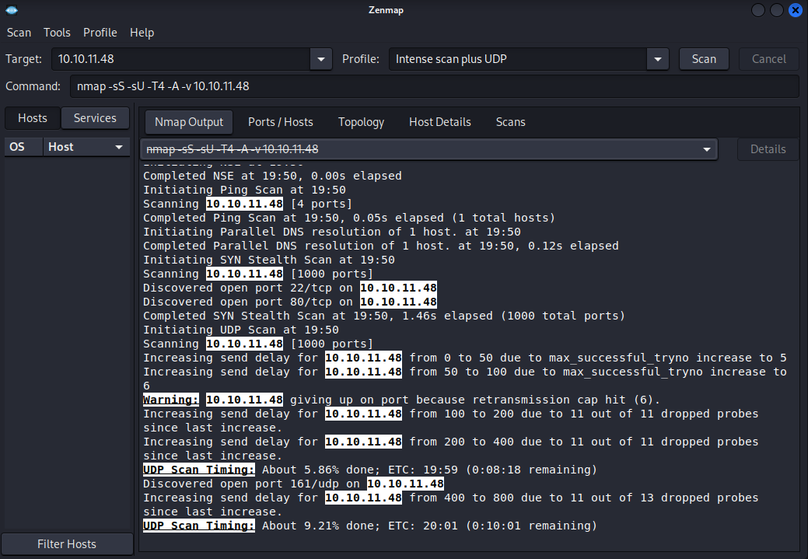

and we found port 161 snmp

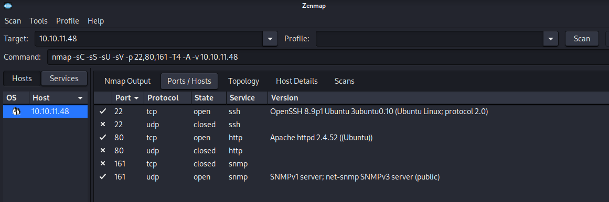

we can run snmp-check to gain more information

```
snmp-check 10.10.11.48
```

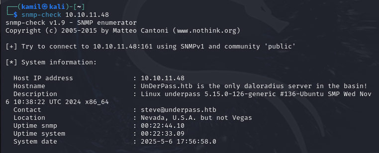

from snmp-check we know about host: underpass.htb and that server might be running `daloradius`

after googling, the root directory of daloradius is /daloradius so we can try to enumerate it 

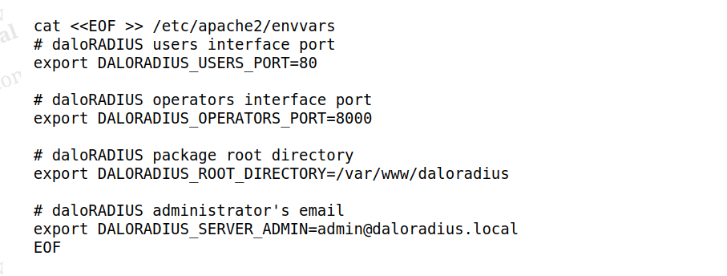

it worked we now see hidden directories

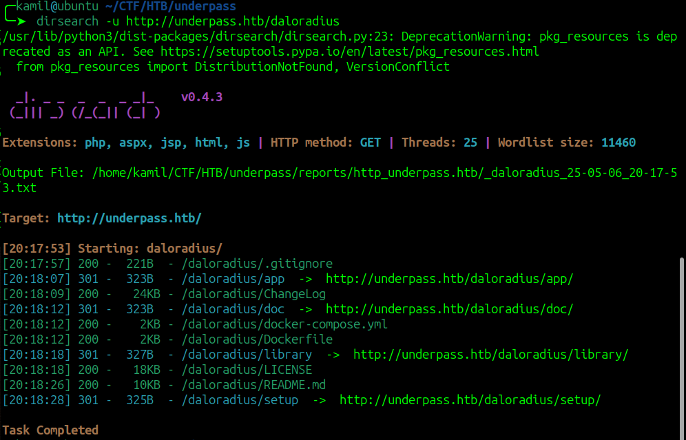

we cam check the `Dockerfile` and `.gitignore` 

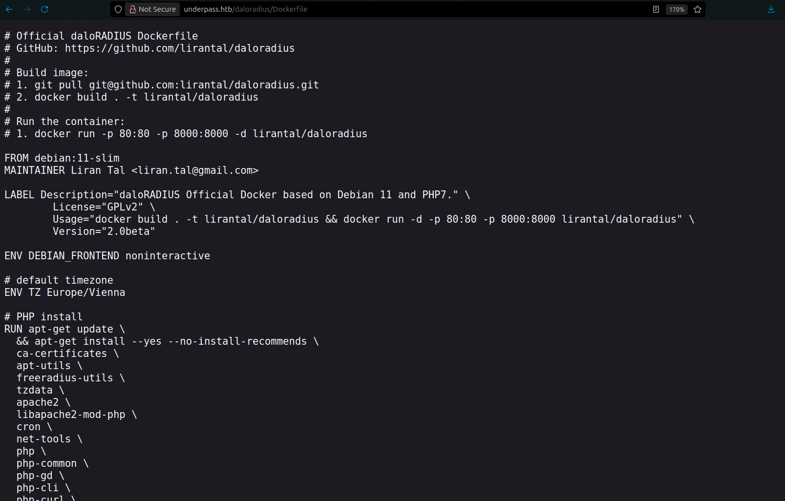

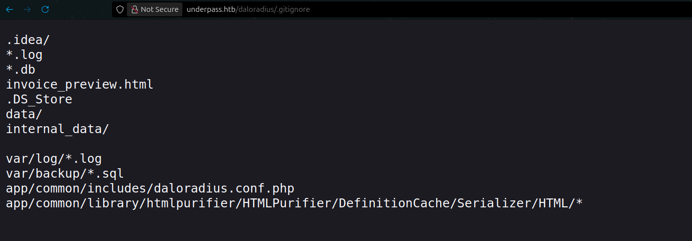

after running scan on /daloradius/app we see more hidden content

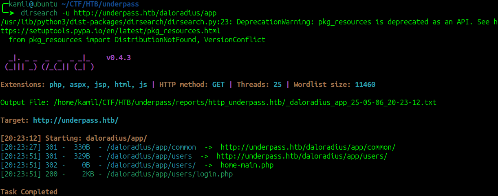

we found /users and /operators

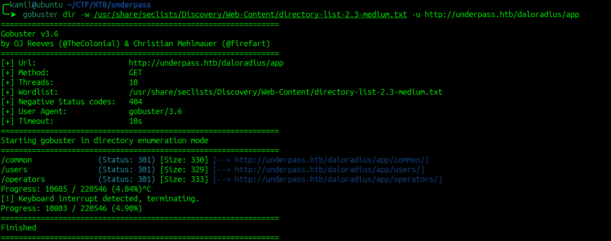

we also know about login.php in users and in operators

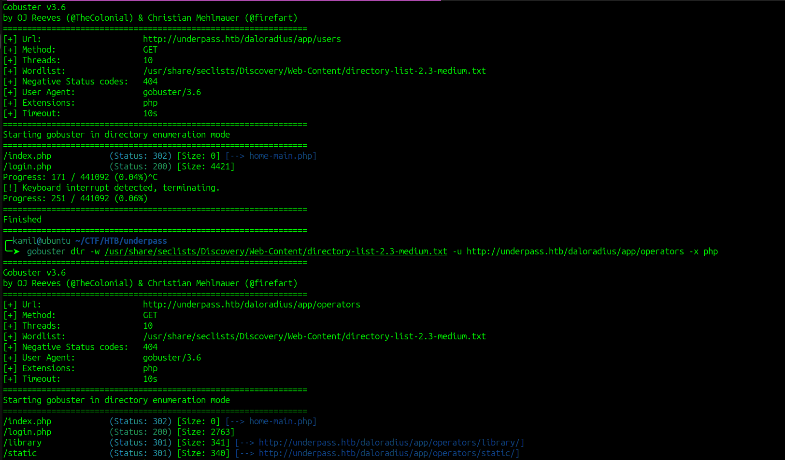

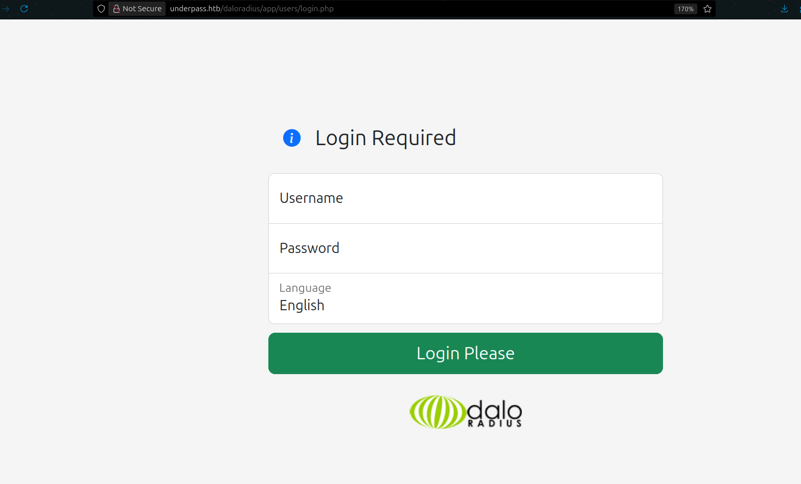

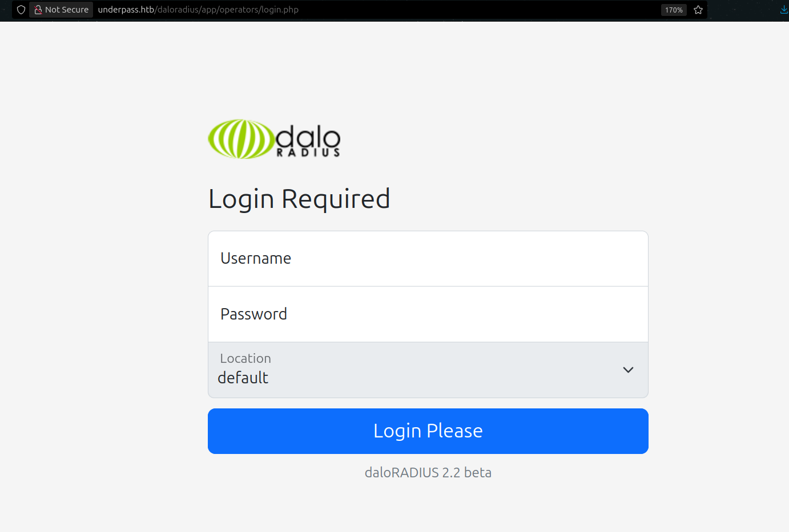

we can check for default credentiasl for daloradius, i tried administrator:radius and they worked we see some admin panel

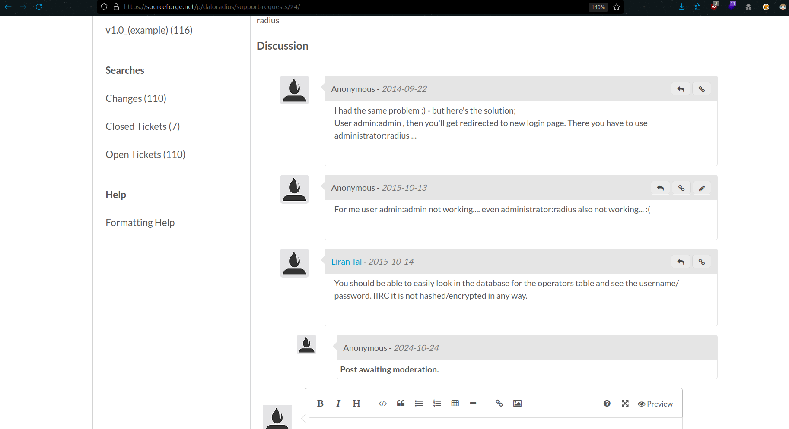

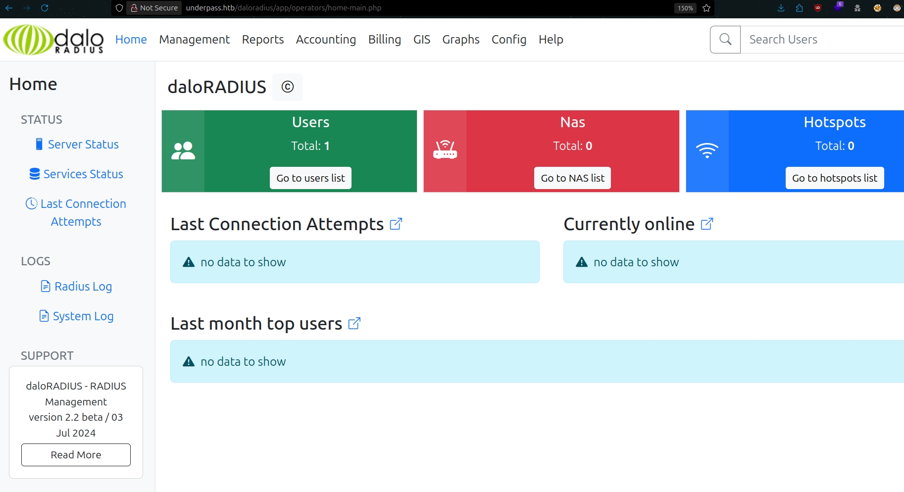

now we can go to `Management -> List Users` to find a user with some password, this is not an actual password is a md5 digest

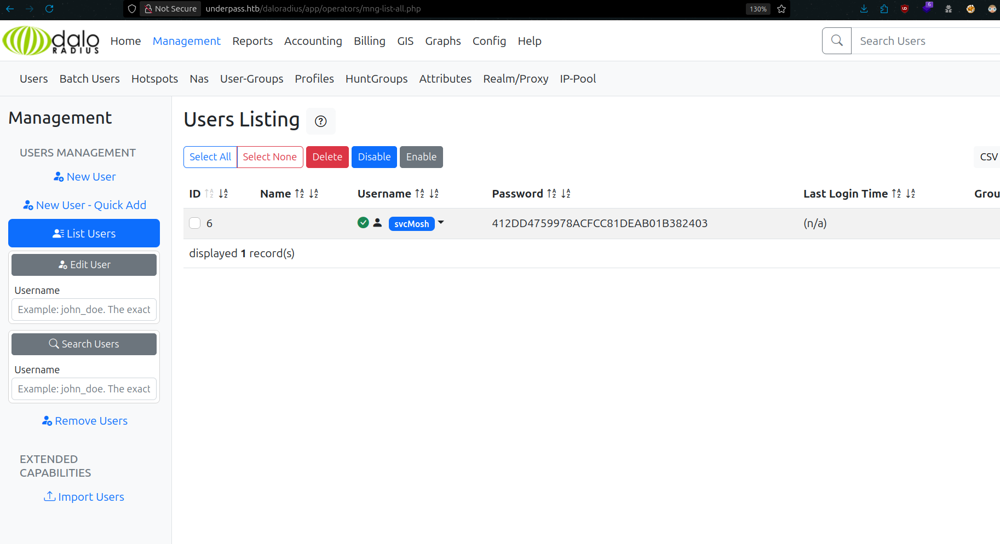

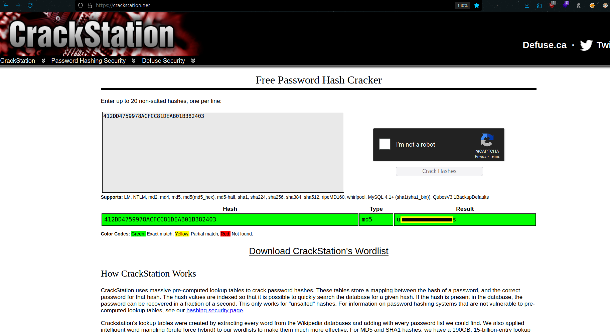

and we have ssh access and user flag

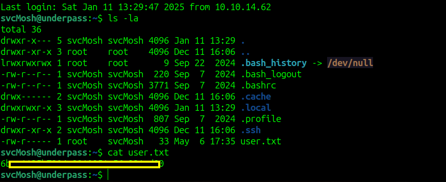

from sudo -l output we see that we can start mosh-server as root

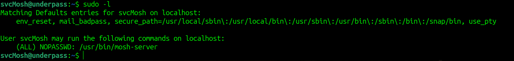

to gain root access we need to start the server and then connect to it or use this one-liner

```
mosh --server="sudo /usr/bin/mosh-server" localhost
```

we should get root shell and root flag

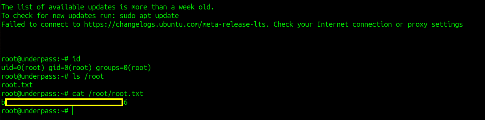

# MACHINE PWNED
