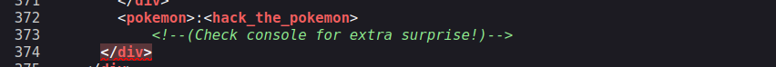

# Gotta Catch'em All! CTF - TryHackMe Room
# **!! SPOILERS !!**
#### This repository documents my walkthrough for the **Gotta Catch'em All!** CTF challenge on [TryHackMe](https://tryhackme.com/r/room/pokemon). 
---
First nmap scan

```
nmap -sV -sC 10.10.110.250
```


Standard nmap scan shows `http` and `ssh`

Found strange comment in format suggesting some logging credentials



ssh `pokemon:hack_the_pokemon` based on comment on website


found zip file on `Desktop`


after unziping content of the grass-type.txt is : `50 6f 4b 65 4d 6f 4e 7b 42 75 6c 62 61 73 61 75 72 7d`

using CyberChef to decode from HEX


i also used linpeas to find privesc factor but found files to get later

```
scp ~/linpeas.sh pokemon@VICTIM_IP:/tmp/
```


then i found weird directories in `/Videos` 


it look like another credentials so trying `ssh ash@VICTIM`


> [!Important]
> it worked and we also got root access

now getting the files i left for later


decoding from Caser cipher


we got 3/4 of flags 

using find to find file with "fire-type" in name based on previous flags

```
find / -type f -iname "*fire-type*" 2>/dev/null
```


using CyberChef to decode from base64


# MACHINE PWNED
