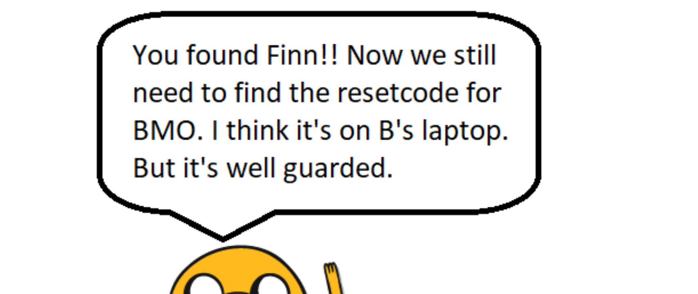
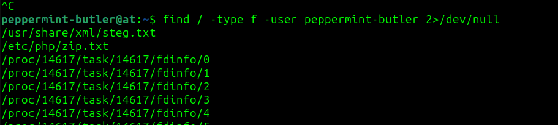
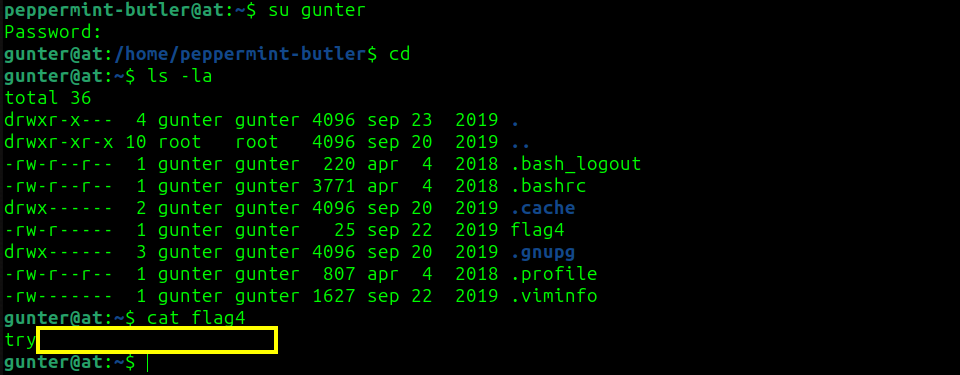
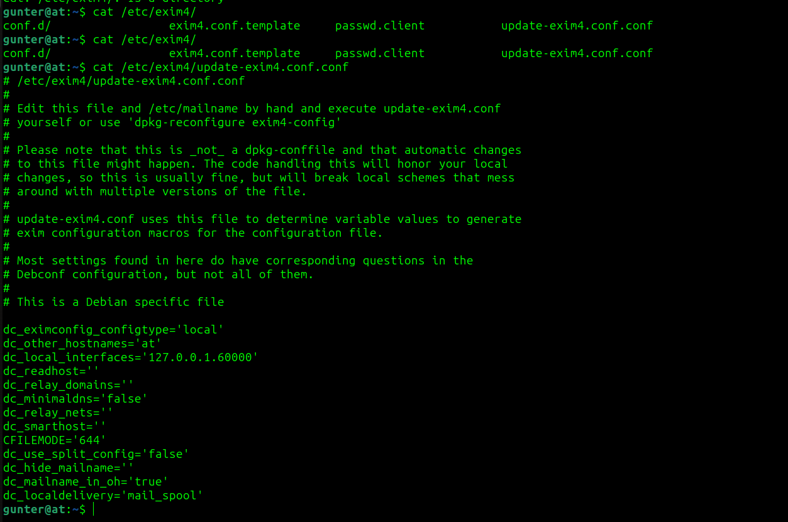

# Adventure Time CTF - TryHackMe Room
# **!! SPOILERS !!**
#### This repository documents my walkthrough for the **Adventure Time** CTF challenge on [TryHackMe](https://tryhackme.com/room/adventuretime). 
---

we see 4 open ports: 21, 22 ,80 and 443


there is 6 files on ftp server


after long enumeration i finally found something, there is hidden folder `/candybar`


on the site we see hidden base32 code that after decoding is `Palpnh rwtrz iwt HHA rtgixuxrpit udg rajth.`


this is simple ROT13 


we should check the certificate


we can add new doamins to `/etc/hosts`: land-of-ooo.com, adventure-time.com

we found jake 



now we found fidden folder `/yellowdog` using feroxbuster again


inside `/yellowdog` there is another hidden folder called `/bananastock` (it is line 102249 in file)


on this site we have some code 


```
_/..../.\_.../._/_./._/_./._/...\._/._./.\_/..../.\_..././.../_/_._.__/_._.__/_._.__
```


it is morse code

we found another dir `/yellowdog/bananastock/princess`


we see coded message inside comment on site: 


```
Secrettext = 0008f1a92d287b48dccb5079eac18ad2a0c59c22fbc7827295842f670cdb3cb645de3de794320af132ab341fe0d667a85368d0df5a3b731122ef97299acc3849cc9d8aac8c3acb647483103b5ee44166
    Key = my cool password
    IV = abcdefghijklmanopqrstuvwxyz
    Mode = CBC
    Input = hex
    Output = raw
```

after decrypting the message we get `the magic safe is accessibel at port 31337. the magic word is: `


after using nc to access the service we get the `The new username is: apple-guards`


now we have username and password so we can login into ssh

we got flag 1 !!!


all the users on the machine


we see info about hidden file and we also know that it was marceline that hid the file so using find command to find the file


```
find / -type f -user marceline 2>/dev/null
```

we found file called helper in /etc/fonts


the file is elf executable but if we use strings we see some another path `/usr/share/misc/guard.sh`

if we check the guard file we found marceline password and we have access as her


we found flag 2 !!


if we take a look at `I-got-a-secret.txt` there is another puzzle to solve


these puzzle is Spoon Programming Language and it gives following output: `ApplePie`


we dont have the next username, but we can try the nc once more, if we provide the word we get another credentials


peppermint-butler:That Black Magic

we found flag 3 !!


next we see .jpg file, after downloading it we see a hint that there could be something hiding inside the file, trying diffrent passwords with seghide and stegseek doesnt seem to work

we can use this command to look for peppermint-butler files 



we found something interesting `/usr/share/xml/steg.txt`


we found hidden zip file but it is password protected, the password for the zip file is in other wierd file `/etc/php/zip.txt`


now we have full access to `secrets.txt` from the zip, we see the hint for gunter password


we can generate our password list using crunch:

```
crunch 18 18 -t "The Ice King s@@@@" > ice
```

now we can use hydra to brute force next user 

```
hydra -l gunter -P ice ssh://10.10.71.210
```

we can let it run for few hours but i skipped this part and found the right word in other writeup

we got flag 4 !!



after looking at linpeas output we see SUID for exim4


we can check exim4 config file 



to gain root access we need to use this python script `https://github.com/AzizMea/CVE-2019-10149-privilege-escalation/blob/master/wizard.py` but we need to change the port to 60000

after creating file we need to execute it 2 times

```
$ python3 exploit.py
$ python3 exploit.py
```

now we have root access 


last flag is in `/home/bubblegum/Secrets/bmo.txt`


# MACHINE PWNED
