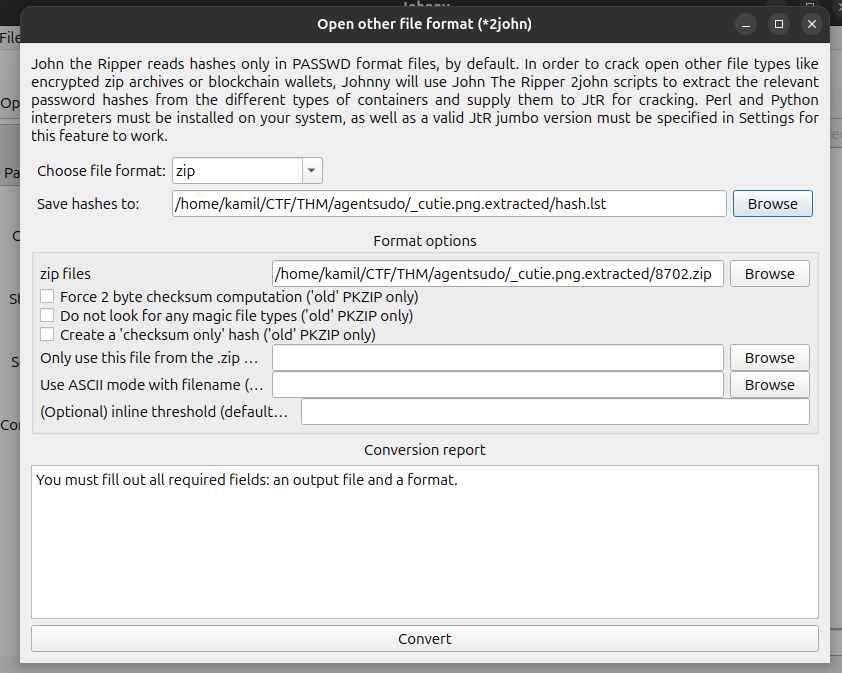

# Agent Sudo CTF - TryHackMe Room
# **!! SPOILERS !!**
#### This repository documents my walkthrough for the **Agent Sudo** CTF challenge on [TryHackMe](https://tryhackme.com/room/agentsudoctf). 
---

nmap scan 


on the website we see note from agent `R` telling us that we should change user-agent to our own codename, i think that other codenames could also be one letter so i created a file with all the letters and prepared sniper attack in burpsuite


there is one odd response with 302 code suggesting redirection 


now checking the website as `user-agent: C` and we see a note to `chris` (having a weak password) we also know about potential agent `J`
i tried changing user-agent to J but it doesnt seem to work


didnt find hidden folders with feroxbuster

tryhackme suggest to find FTP password so i will try log in as chris to ftp (chris should hace weak password)


it worked only for FTP


few files including 2 images and a txt note


note says that password is hidden inside image

after using binwalk we see that there is something in file `cutie.png`


extracting files with `binwalk -e cutie.png`

there are 3 file `365` `365.zlib` oraz `8702.zip`, zlib and zip files are password protected so i will try JohnTheRipper



we cracked the hash and now we have password to zip file


`7z x 8702.zip`

we have another note `To_agentR.txt`


string QXJlYTUx is decoded to Area51 from base64

tryhackme says we need to find `STEG password` , so there should a message hidden inside a file (probably the other picture), i will try the Area51 as a password 

```
steghide extract -sf cute-alien.jpg 
```

in `cute-alien.jpg` was hiding `message.txt`


ok so now we know that next known user is james and we got his password

trying to ssh as james worked and now we got user flag


we also need to provide the name of the incident from photo, just using google image searching and finding foxnews article, the answer is `Roswell alien autopsy` 

i started with linpeas to find PE factor


found nothing interesting but `sudo -l` output is intriguing

found the `CVE-2019-14287 -> sudo Vulnerability Allows Bypass of User Restrictions`


our machine sudo version is 1.8.21p so its vulnerable 

we just need to run simple command

```
$ sudo -u#-1 /bin/bash
```
and now we are root and we can grab a root flag and we also know the answer to the last question, who is agent R


## MACHINE PWNED
