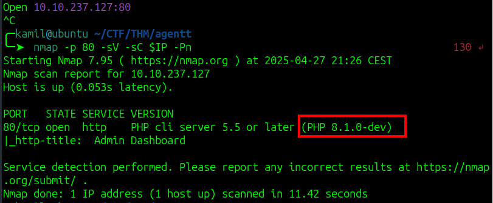
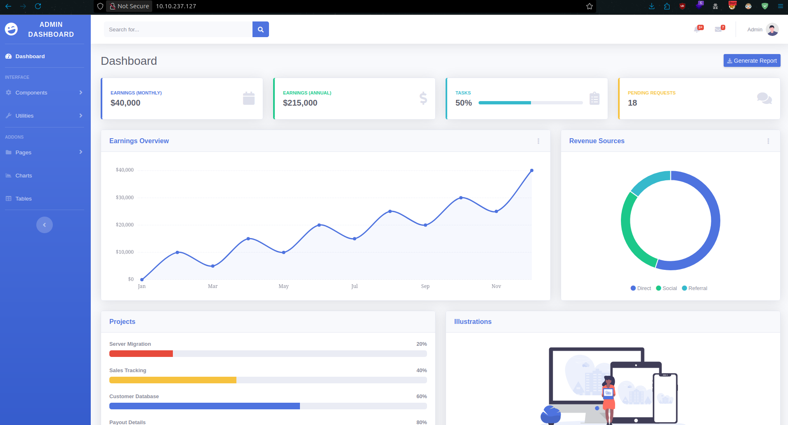
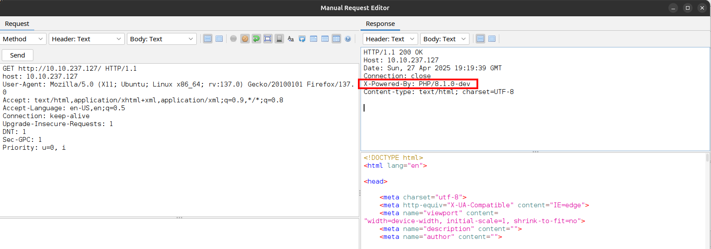
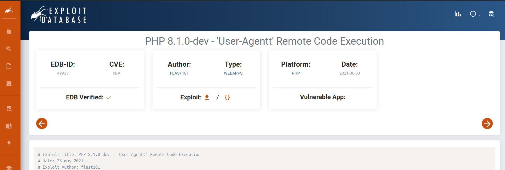
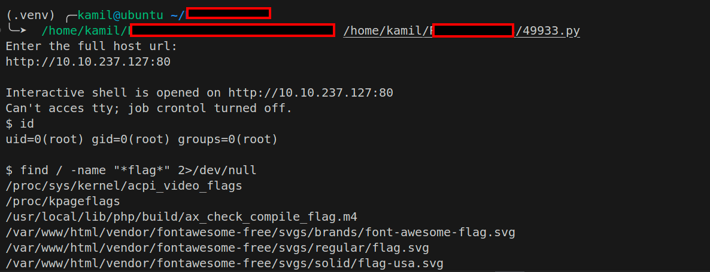
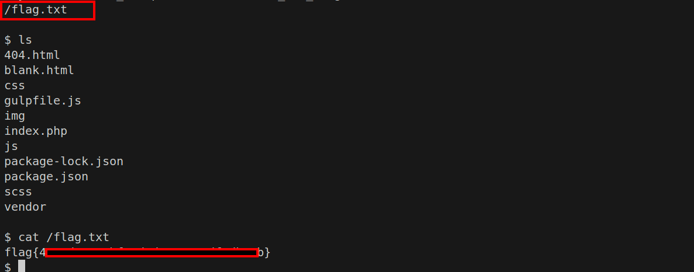

# Agent T CTF - TryHackMe Room
# **!! SPOILERS !!**
#### This repository documents my walkthrough for the **Agent T** CTF challenge on [TryHackMe](https://tryhackme.com/room/agentt). 
---

from scan we see open port 80



we are supposed to look for weird header in http communication





from nmap scan and also by looking at the server response we see that server uses `(PHP 8.1.0-dev)`, this php version has very serius exploit that allows remote code execution

we can google  `PHP 8.1.0-dev exploit` to find simple script to exploit this `https://www.exploit-db.com/exploits/49933`



then we run the script with python and just provide the link to the website



we got shell as root

now we need to find flag, we can use simple find command

```
find / -name "*flag*" 2>/dev/null
```



# MACHINE PWNED
