# Anonforce CTF - TryHackMe Room
# **!! SPOILERS !!**
#### This repository documents my walkthrough for the **Anonforce** CTF challenge on [TryHackMe](https://tryhackme.com/r/room/bsidesgtanonforce). 
---
#### I will be using  my own tool [QuickEnumTool](https://github.com/KamilCzajczyk/QuickEnumTool) for enumeration.

```
python3 cli.py 10.10.89.98 /usr/share/wordlists/dirb/common.txt 
```

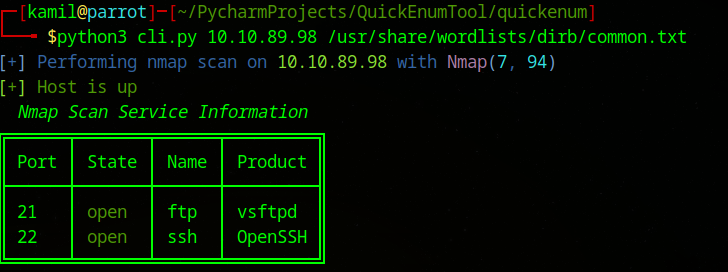

Ports `21 ftp` and ` 22 ssh ` open


I start by connecting to `FTP` 


``` 
ftp 10.10.89.98
```


I tried `name: anonymous password: anonymous` and succesfully logged to ftp as anonymous user


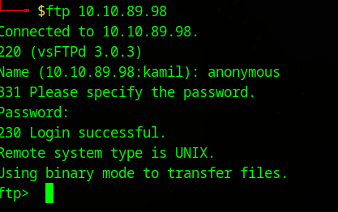

Now I list files with `ls`

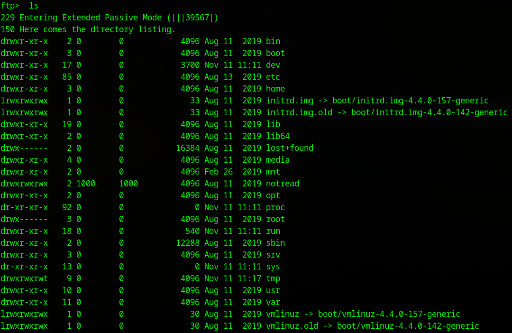

Now i check home folder, there is melodias user folder with user flag `user.txt`. 

Then I use `get user.txt` to download user flag

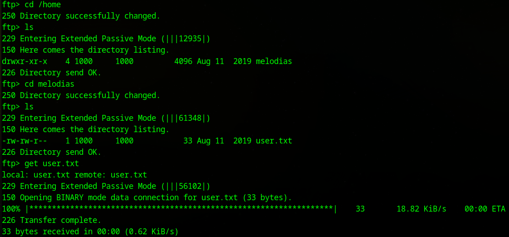

> [!IMPORTANT]
> First flag from `user.txt` : `606083fd33beb1284fc51f411a706af8`

There is also interesting folder called `notread`

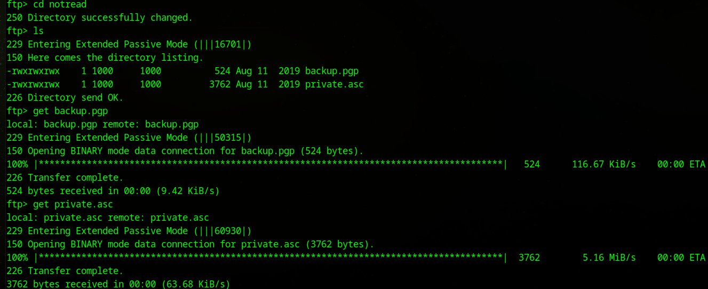

In this folder we see `backup.pgp` and `private.asc`

`backup.pgp` file:

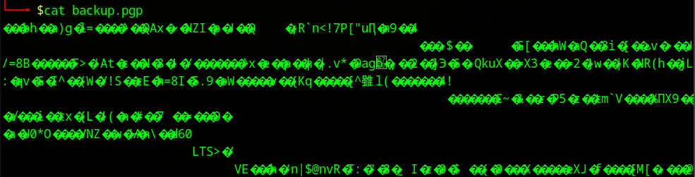

`private.asc` file:

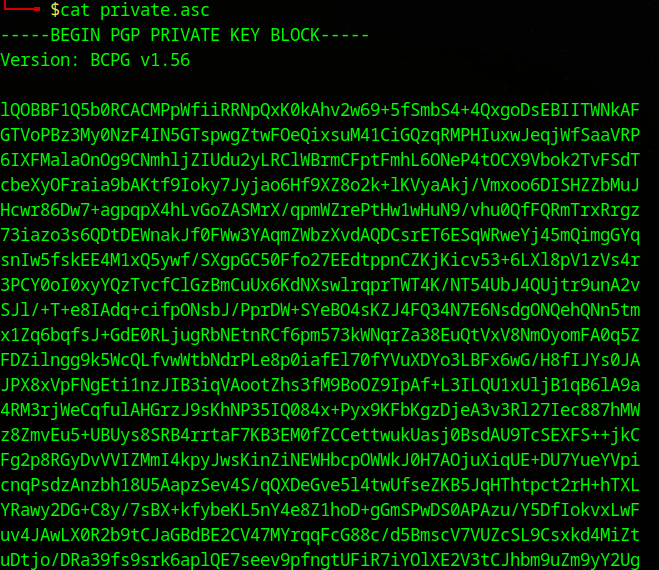

Usinn `johnny` to get hash and crack it 

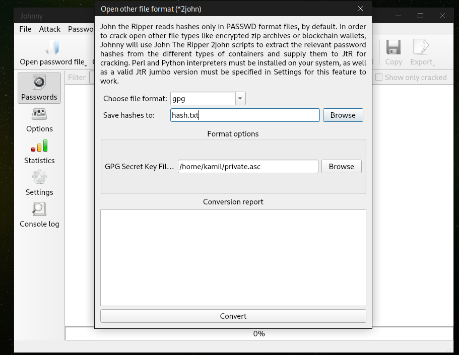

Now we attack the hash with rockyou.txt

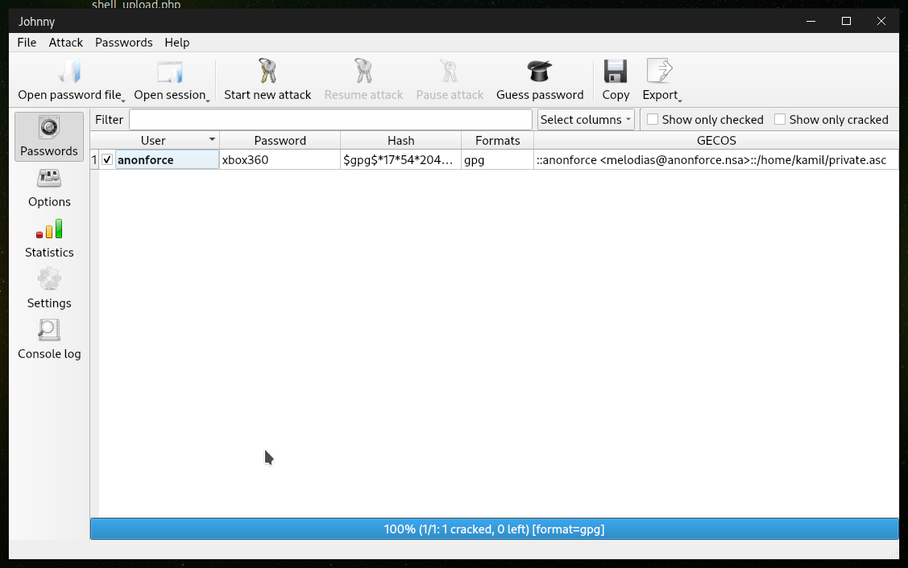

Program found our hash to be `xbox360`

Importing secret key with `passphrase: xbox360`

``` 
gpg --import private.asc
```

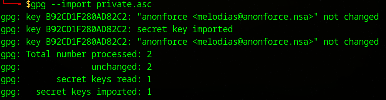

After importing a key, we can see the content of the backup.pgp

``` 
gpg --decrypt backup.pgp
```

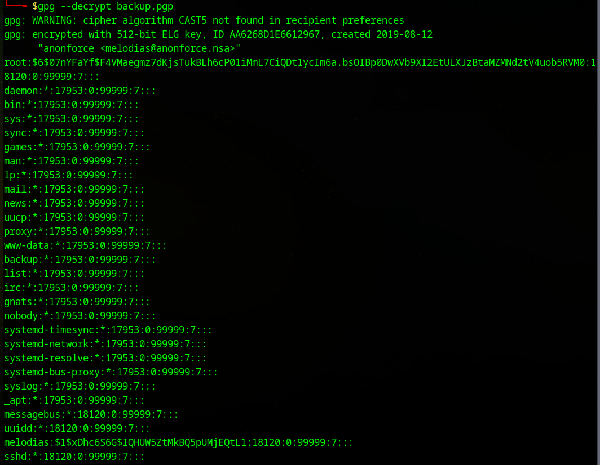

This look like a copy of `/etc/shadow` file

I will use `hashcat` to try to crack `root` and `melodias` passwords

```
hashcat -a 0 -m 1800 root_hash.txt /usr/share/wordlists/rockyou.txt 
```


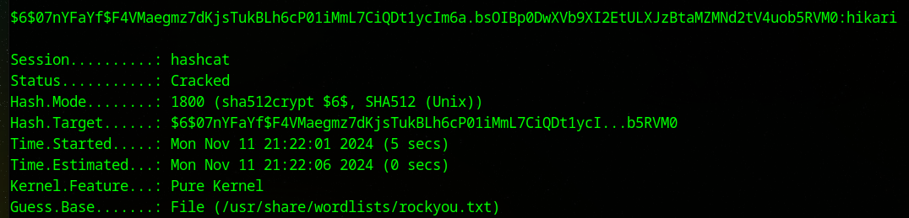

> [!IMPORTANT]
> Root  `password` : `hikari`

Now I use `ssh root@IP` with newly found password `hikari` to login as root to machine

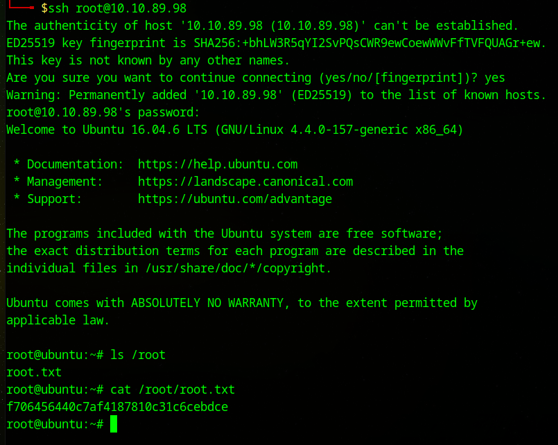

> [!IMPORTANT]
> Second flag from `root.txt` : `f706456440c7af4187810c31c6cebdce`

# MACHINE PWNED
