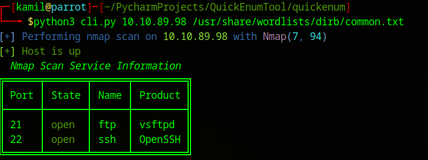
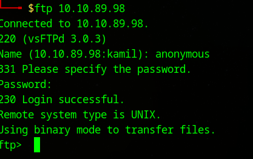
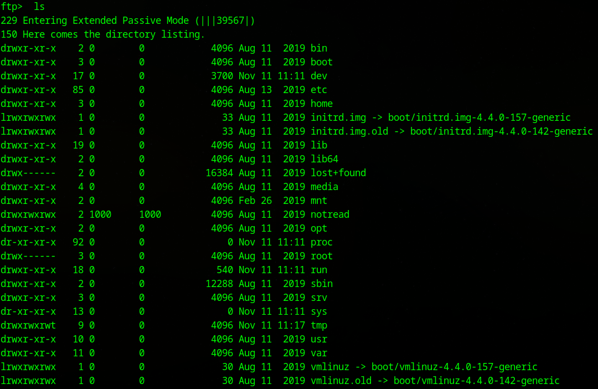
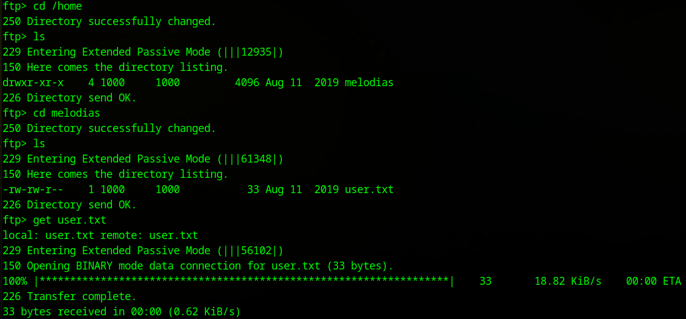
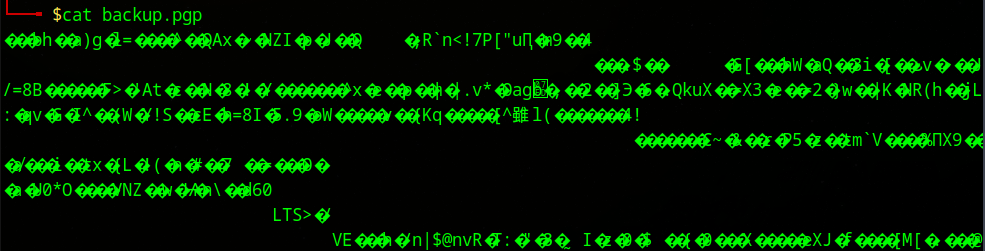

# Anonforce CTF - TryHackMe Room
# **!! SPOILERS !!**
#### This repository documents my walkthrough for the **Anonforce** CTF challenge on [TryHackMe](https://tryhackme.com/r/room/bsidesgtanonforce). 
---
#### I will be using  my own tool [QuickEnumTool](https://github.com/KamilCzajczyk/QuickEnumTool) for enumeration.

```
python3 cli.py 10.10.89.98 /usr/share/wordlists/dirb/common.txt 
```



Ports `21 ftp` and ` 22 ssh ` open


I start from connecting to `FTP` 


```ftp 10.10.89.98```


I tried `name: anonymous password: anonymous` and succesfully logged to ftp as anonymous user




Now I list files with `ls`



Now i check home folder, there is melodias user folder with user flag `user.txt`. 

Then I use `get user.txt` to download user flag



> [!IMPORTANT]
> First flag from `user.txt` : `606083fd33beb1284fc51f411a706af8`

There is also interesting folder called `notread`


In this folder we see `backup.pgp` and `private.asc`




