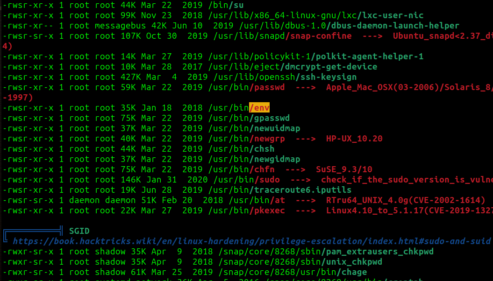

# Anonymous CTF - TryHackMe Room
# **!! SPOILERS !!**
#### This repository documents my walkthrough for the **Anonymous** CTF challenge on [TryHackMe](https://tryhackme.com/room/anonymous). 
---

after scanning we see 4 open ports


we know about ftp and smb

after connecting to FTP as anonymous we can download 3 files


there is nothing interesting for now

i used `smbclient -L //10.10.206.132 ` 


we know that there is a share called pics

after taking a look at that share we see 2 images


nothing interesting inside of them

i changed `clean.sh` from FTP server to generate reverse shell, this file has execute permission so maybe it is run by cronjob


i will try to remove original version of the file from FTP and put my own malicious version with reverse shell we need to use 

```
put clean.sh clean.sh
```


it worked we have access as and we can grab user flag


i copied linpeas and found `/usr/bin/env` with SUID flag



checked GTFObins for PE factor

i used this one-liner to spawn root shell

```
/usr/bin/env /bin/sh -p
```

it worked, we have root access and root flag


# MACHINE PWNED
