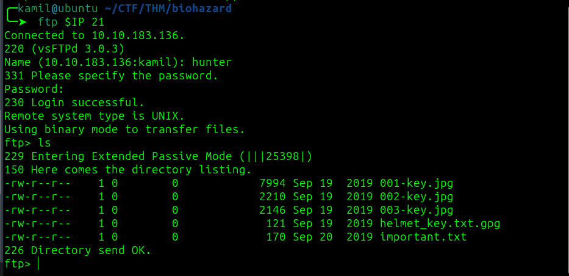

# Biohazard CTF - TryHackMe Room
# **!! SPOILERS !!**
#### This repository documents my walkthrough for the **Biohazard** CTF challenge on [TryHackMe](https://tryhackme.com/room/biohazard). 
---

after scanning we see 3 open ports including 21, 22, 80


on the website we see answer for the next question: `stars alpha team`

after going to `/mansionmain` we check the source code to find new directory `/diningRoom/`


on `/diningRoom/` after inspecting source code we see some base32 string `SG93IGFib3V0IHRoZSAvdGVhUm9vbS8=` 


after decoding there is next hint `How about the /teaRoom/`, we can also find next flag emblem after going to `10.10.183.136/diningRoom/emblem.php`


emblem: `emblem{}`

after inputing our emblem to the form nothing happens, but we know about /teaRoom/

by going to teaRoom we know that there is `/artRoom/`, we can also grab lockpick	 

lockpick: `lock_pick{}`

in the `artRoom` we found `MansionMap.html` with other locations:

```
/diningRoom/  
/teaRoom/     
/artRoom/     
/barRoom/     
/diningRoom2F/  
/tigerStatusRoom/  
/galleryRoom/   
/studyRoom/
/armorRoom/    
/attic/    
```


in the `/barRoom` we need lockpick, then we we find `musicNote.html` with some string `NV2XG2LDL5ZWQZLFOR5TGNRSMQ3TEZDFMFTDMNLGGVRGIYZWGNSGCZLDMU3GCMLGGY3TMZL5` it is base32, after decoding we got the music_sheet flag

music_sheet: `music_sheet{}`

now we have access to secret bar room where we can grab gold emblem

gold_emblem: `gold_emblem{}`

then we are asked to input emblem, inputing gold_emblem doesnt work but inputing first emblem works now we see string `rebecca`

after going to `/diningRoom2F/` we see another weird string in the source code `Lbh trg gur oyhr trz ol chfuvat gur fgnghf gb gur ybjre sybbe. Gur trz vf ba gur qvavatEbbz svefg sybbe. Ivfvg fnccuver.ugzy` after decoding from ROT13 we get 


```
You get the blue gem by pushing the status to the lower floor. The gem is on the diningRoom first floor. Visit sapphire.html
```

after going to `/diningRoom/sapphire.html` we have blue_jewel flag

blue_jewel: `blue_jewel{}` 

in the `tigerStatusRoom` we can input gem flag, after that we got another hint: 

```
crest 1:
S0pXRkVVS0pKQkxIVVdTWUpFM0VTUlk9
Hint 1: Crest 1 has been encoded twice
Hint 2: Crest 1 contanis 14 letters
Note: You need to collect all 4 crests, combine and decode to reavel another path
The combination should be crest 1 + crest 2 + crest 3 + crest 4. Also, the combination is a type of encoded base and you need to decode it
```
by going to `/galleryRoom` we find another note:

```
crest 2:
GVFWK5KHK5WTGTCILE4DKY3DNN4GQQRTM5AVCTKE
Hint 1: Crest 2 has been encoded twice
Hint 2: Crest 2 contanis 18 letters
Note: You need to collect all 4 crests, combine and decode to reavel another path
The combination should be crest 1 + crest 2 + crest 3 + crest 4. Also, the combination is a type of encoded base and you need to decode it
```

we need to get back to `/dinningRoom` and input the gold_emblem flag then we get another cipher `klfvg ks r wimgnd biz mpuiui ulg fiemok tqod. Xii jvmc tbkg ks tempgf tyi_hvgct_jljinf_kvc`, by going to `dcode.fr` and using the hint that this is `vigenere-cipher` we can decode our next hint (we also know that our key is rebecca)


```
there is a shield key inside the dining room. The html page is called the_great_shield_key
```

by going to `/dinningRoom/the_great_shield_key.html` we found shield_key

shield_key: `shield_key{}`

now we have access to `/armorRoom` where we find the next hint:

```
crest 3:
MDAxMTAxMTAgMDAxMTAwMTEgMDAxMDAwMDAgMDAxMTAwMTEgMDAxMTAwMTEgMDAxMDAwMDAgMDAxMTAxMDAgMDExMDAxMDAgMDAxMDAwMDAgMDAxMTAwMTEgMDAxMTAxMTAgMDAxMDAwMDAgMDAxMTAxMDAgMDAxMTEwMDEgMDAxMDAwMDAgMDAxMTAxMDAgMDAxMTEwMDAgMDAxMDAwMDAgMDAxMTAxMTAgMDExMDAwMTEgMDAxMDAwMDAgMDAxMTAxMTEgMDAxMTAxMTAgMDAxMDAwMDAgMDAxMTAxMTAgMDAxMTAxMDAgMDAxMDAwMDAgMDAxMTAxMDEgMDAxMTAxMTAgMDAxMDAwMDAgMDAxMTAwMTEgMDAxMTEwMDEgMDAxMDAwMDAgMDAxMTAxMTAgMDExMDAwMDEgMDAxMDAwMDAgMDAxMTAxMDEgMDAxMTEwMDEgMDAxMDAwMDAgMDAxMTAxMDEgMDAxMTAxMTEgMDAxMDAwMDAgMDAxMTAwMTEgMDAxMTAxMDEgMDAxMDAwMDAgMDAxMTAwMTEgMDAxMTAwMDAgMDAxMDAwMDAgMDAxMTAxMDEgMDAxMTEwMDAgMDAxMDAwMDAgMDAxMTAwMTEgMDAxMTAwMTAgMDAxMDAwMDAgMDAxMTAxMTAgMDAxMTEwMDA=
Hint 1: Crest 3 has been encoded three times
Hint 2: Crest 3 contanis 19 letters
Note: You need to collect all 4 crests, combine and decode to reavel another path
The combination should be crest 1 + crest 2 + crest 3 + crest 4. Also, the combination is a type of encoded base and you need to decode it
```

by using shield_key we can also access `/attic/` where we find last note: 

```
crest 4:
gSUERauVpvKzRpyPpuYz66JDmRTbJubaoArM6CAQsnVwte6zF9J4GGYyun3k5qM9ma4s
Hint 1: Crest 2 has been encoded twice
Hint 2: Crest 2 contanis 17 characters
Note: You need to collect all 4 crests, combine and decode to reavel another path
The combination should be crest 1 + crest 2 + crest 3 + crest 4. Also, the combination is a type of encoded base and you need to decode it
```

we still dont have access to `/studyRoom`

now (by hahing all 4 crests) we can decode the notes (i recommend using `cyberchef.org`)

#### Decoding crest 1
1. from base64 -> KJWFEUKJJBLHUWSYJE3ESRY=
2. from base32 -> RlRQIHVzZXI6IG

final procuct: `RlRQIHVzZXI6IG`
we know that crest contains 14 letters

#### Decoding crest 2
1. from base32 -> 5KeuGWm3LHY85cckxhB3gAQMD
2. from base58 -> h1bnRlciwgRlRQIHBh

final procuct: `h1bnRlciwgRlRQIHBh`
we know that crest contains 18 letters

#### Decoding crest 3
1. from base64 -> `00110110 00110011 00100000 00110011 00110011 00100000 00110100 01100100 00100000 00110011 00110110 00100000 00110100 00111001 00100000 00110100 00111000 00100000 00110110 01100011 00100000 00110111 00110110 00100000 00110110 00110100 00100000 00110101 00110110 00100000 00110011 00111001 00100000 00110110 01100001 00100000 00110101 00111001 00100000 00110101 00110111 00100000 00110011 00110101 00100000 00110011 00110000 00100000 00110101 00111000 00100000 00110011 00110010 00100000 00110110 00111000`
2. from Binary -> `63 33 4d 36 49 48 6c 76 64 56 39 6a 59 57 35 30 58 32 68`
3. from Hex -> c3M6IHlvdV9jYW50X2h

final procuct: `c3M6IHlvdV9jYW50X2h`
we know that crest contains 19 letters

#### Decoding crest 4
1. from base58 -> `70 5a 47 56 66 5a 6d 39 79 5a 58 5a 6c 63 67 3d 3d`
2. from Hex -> pZGVfZm9yZXZlcg==

final procuct: `pZGVfZm9yZXZlcg==`
we know that crest contains 19 letters

####

final product is `RlRQIHVzZXI6IGh1bnRlciwgRlRQIHBhc3M6IHlvdV9jYW50X2hpZGVfZm9yZXZlcg==` now we have ftp credentials


we successffully logged to ftp, we see a few files



after downloading and reading `important.txt` we know abut new directory `/hidden_closet/` and key inside encrypted text file

using steghide on `001-key.jpg` 

```
steghide extract -sf 001-key.jpg
```

there was hidden file that contains: `cGxhbnQ0Ml9jYW`

after using `exiftool 002-key.jpg` i found comment containing: `5fYmVfZGVzdHJveV9`


after using `binwalk -e 003-key.jpg` i found hidden zip file containing another txt file with: `3aXRoX3Zqb2x0`

after combining all clues we get: `cGxhbnQ0Ml9jYW5fYmVfZGVzdHJveV93aXRoX3Zqb2x0` -> `pl...[REDACTED]...lt`

now we have passphrase for `helmet_key.txt.gpg`, using `gpg --decrypt helmet_key.txt.gpg` to decrypt the message

now we have helmet_key flag


helmet_key: `helmet_key{}`

now we should get access to `/studyRoom/` and `/hidden_closet/`

after going to `/hidden_closet/` we find 
`MO_DISK1.txt` containing -> `wpbwbxr wpkzg pltwnhro, txrks_xfqsxrd_bvv_fy_rvmexa_ajk` and `wolf_medal` containing -> `SSH password: T...[REDACTED]...s`

after going to `/studyRoom/` we find `doom.tar.gz` using

```
tar -xvzf doom.tar.gz
```
in the archive we find txt file `eagle_medla` containing -> `SSH user: umbrella_guest`


now we have full ssh credentials and also know the name of stars bravo team leader : enrico

after accessing ssh and using ls -la i found odd looking directory called `.jailcell`, there was a note suggesting that the traitor is: weasker, at the end  of the file there is a note `MO disk 2: albert`


we can read `/home/weasker/weasker_note.txt` we know that ultimate form is `Tyrant`


now again using dcode.fr to decode (we are decoding string that we found in /hidden_closet/) from vigenere cipher but using key `albert` and we got ->
`weasker login password, st...[REDACTED]..._pig`


now we can change user to weasker, after running `sudo -l` we know that we can just use `sudo bash` to gain root access and root flag 


# MACHINE PWNED
