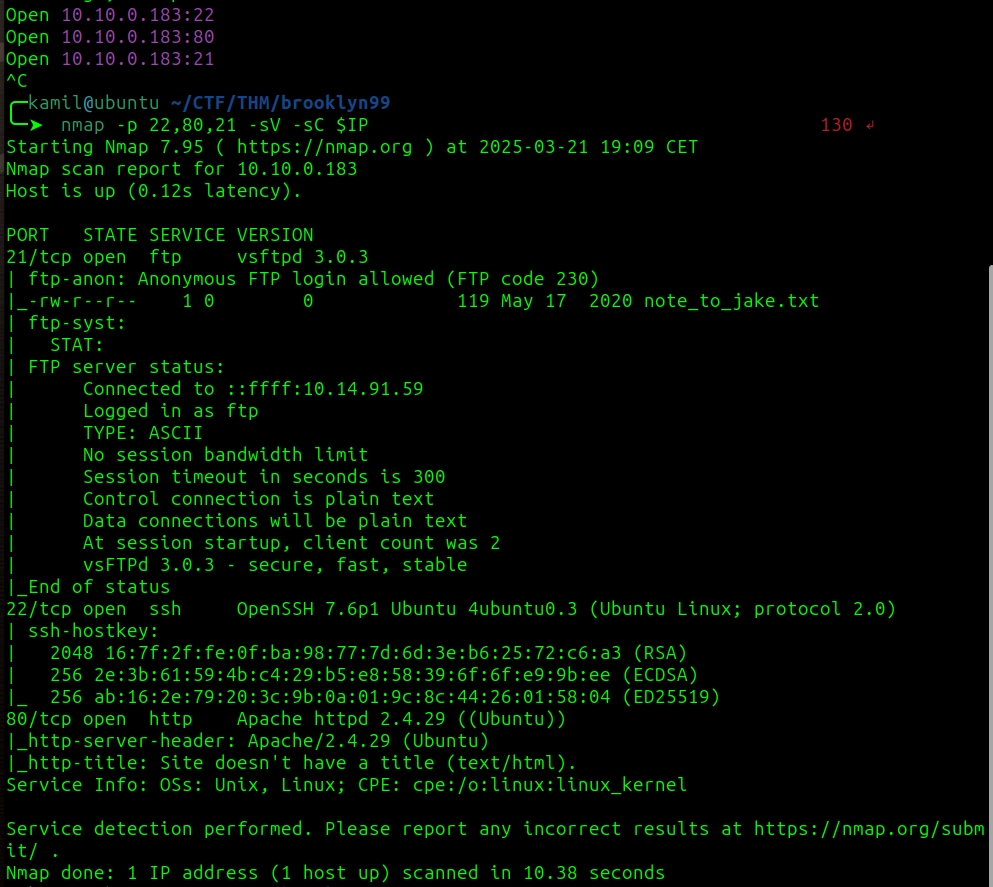
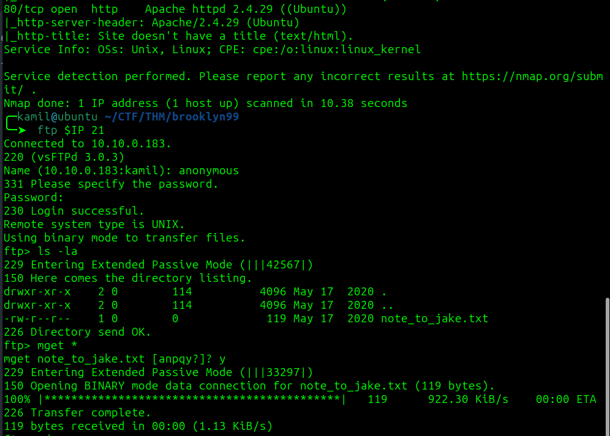
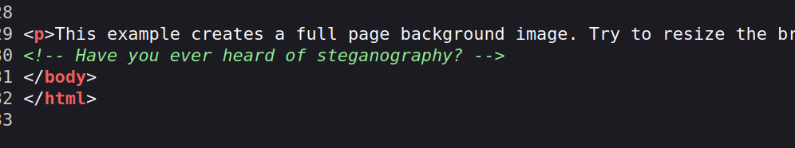
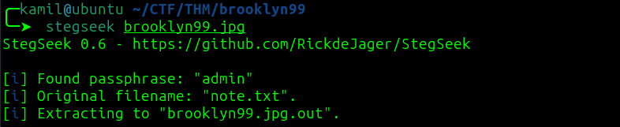
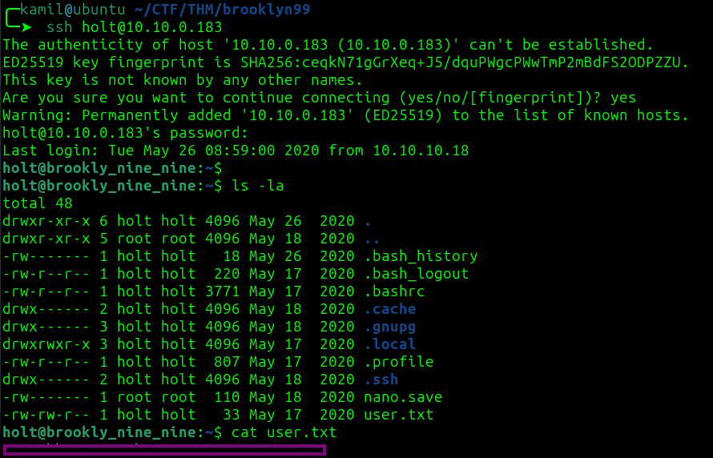
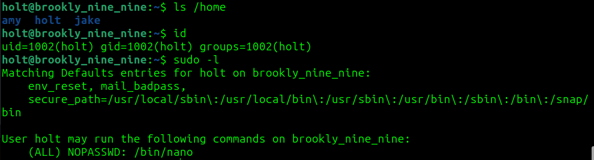
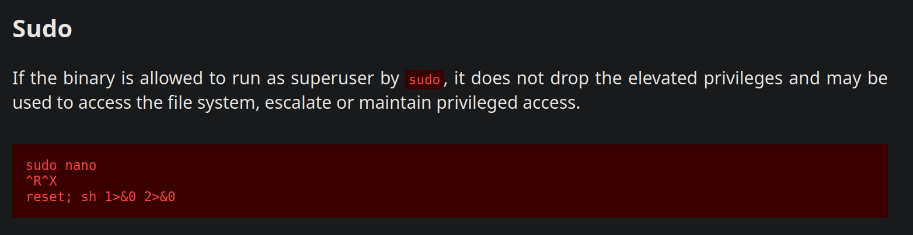
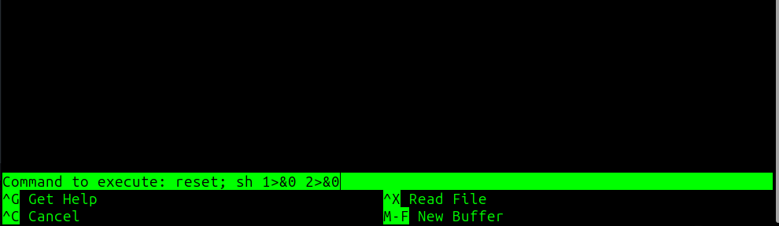
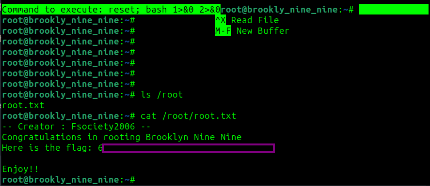

# Brooklyn Nine Nine CTF - TryHackMe Room
# **!! SPOILERS !!**
#### This repository documents my walkthrough for the **Brooklyn Nine Nine** CTF challenge on [TryHackMe](https://tryhackme.com/room/brooklynninenine). 
---


scanning shows 3 open ports 80, 21, 22



first investigating ftp



now we know about potential weak password for users `jake`, there could also be users: `amy` and `holt`

on the website we see a comment about steganography



i donwloaded the background image and used 

```
stegseek brooklyn99.jpg
```



there is a note with holt password 

we got user access to ssh and user flag



I got some additional information and `sudo -l` output for holt



we can use nano to create root shell according to GTFObins



we need to use:

```
$ sudo /bin/nano
$ Ctrl + R
$ Ctrl + X
$ reset; sh 1>&0 2>&0 
```


now we have root access and root flag



# MACHINE PWNED
