# Brute It CTF - TryHackMe Room
# **!! SPOILERS !!**
#### This repository documents my walkthrough for the **Brute It** CTF challenge on [TryHackMe](https://tryhackme.com/room/bruteit). 
---

after running a quick scan

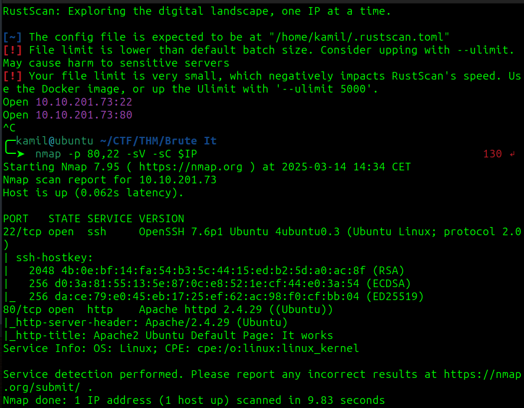

we know about 2 open ports 22 and 80, from scan we also know that 
there are running `OpenSSH 7.6p1` and `Apache 2.4.29` on `ubuntu`


after running feroxbuster we know about hidden `/admin` directory, 

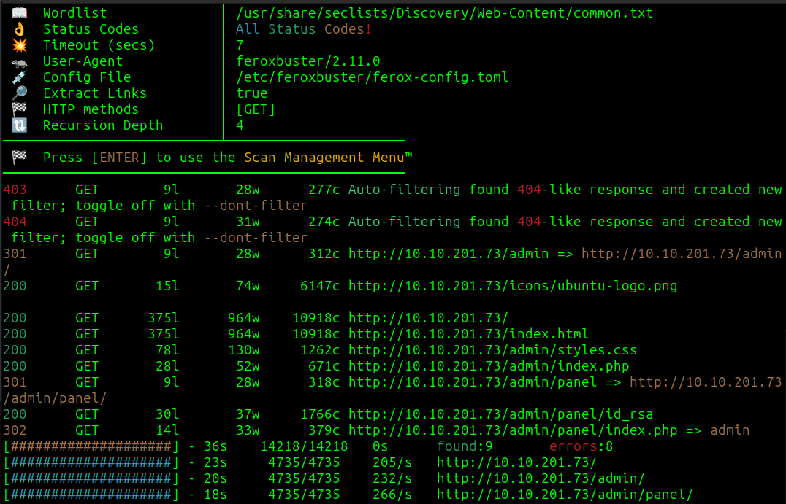

after inspoecting the source code we know about user `admin`

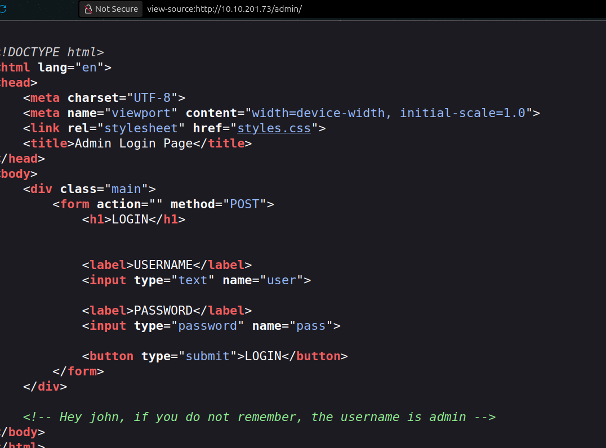

this is our login request in BurpSuite

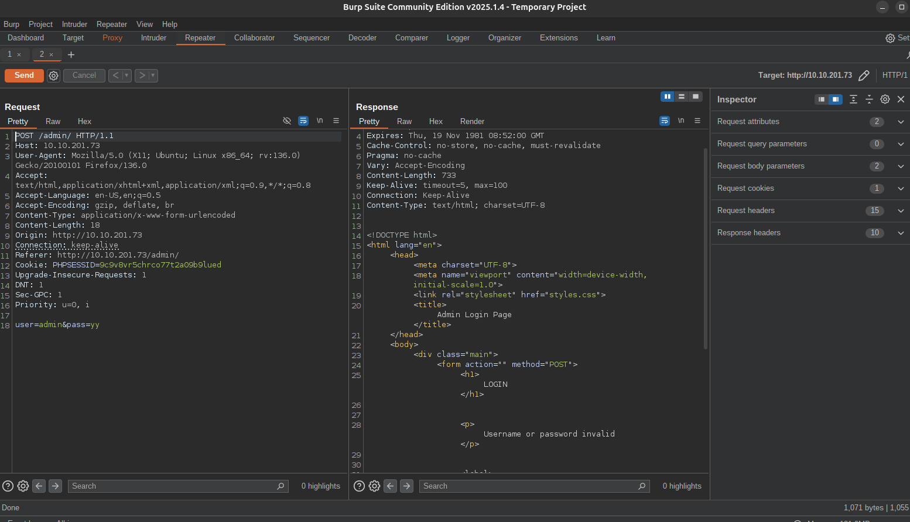

using hydra to brute force the login

```
hydra -l admin -P /usr/share/wordlists/rockyou.txt 10.10.201.73 http-post-form "/admin/:user=^USER^&pass=^PASS^:F=invalid"
```

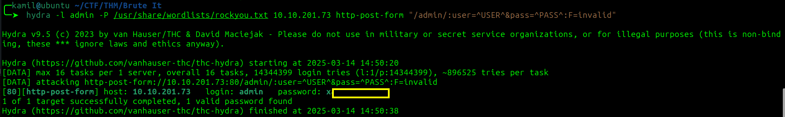


we found john's RSA praivate key, key is encrypted so we need to use john to brute-force it

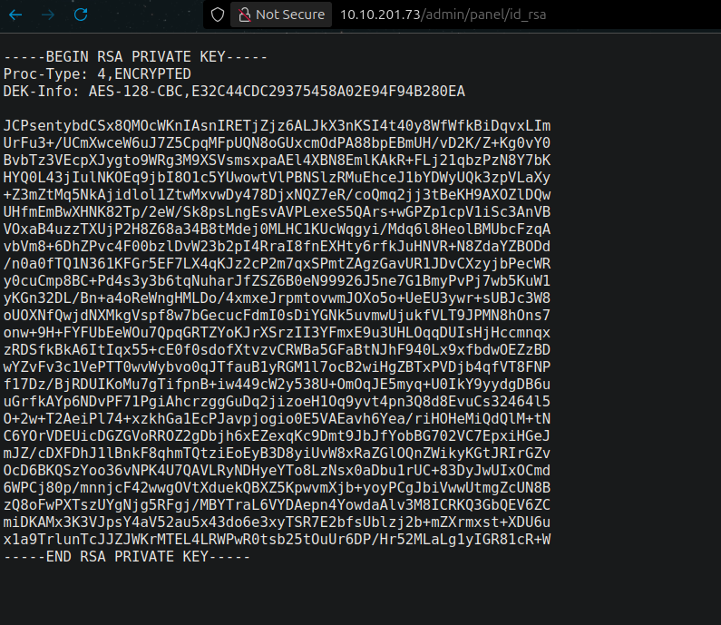

```
$ ssh2john key > hash
$ john hash --wordlist=/usr/share/wordlists/rockyou.txt
``` 
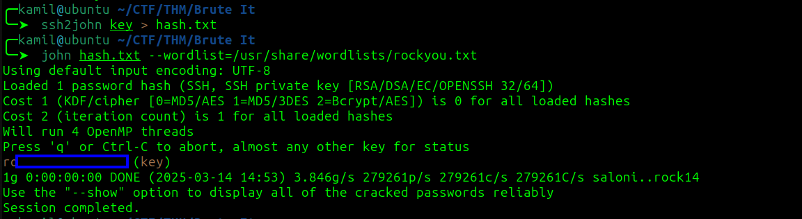

we got a passphrase 

we got user access and user flag

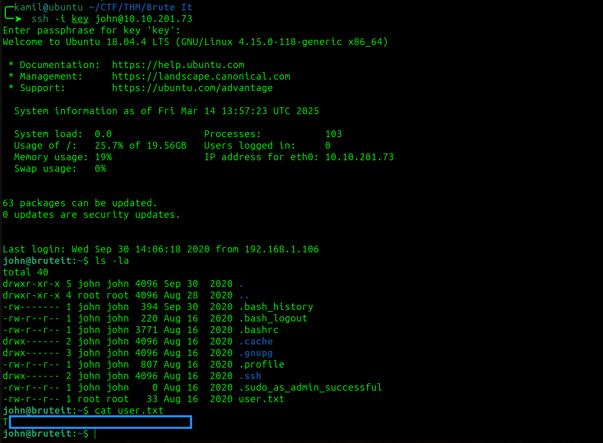

linpeas found that we can use cat as sudo

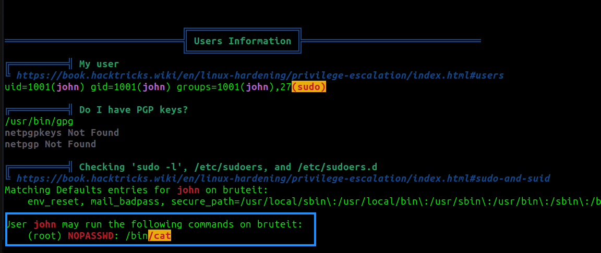

checking GTFObins

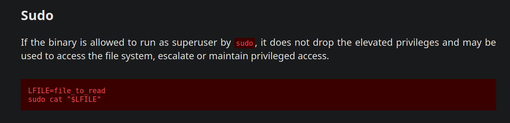

we need to do few things, first grabbing the content of `/etc/shadow` and `/etc/passwd`

```
$ LFILE=/etc/shadow
$ sudo cat "$LFILE"
$ LFILE=/etc/passwd
$ sudo cat "$LFILE"
```

passwd file:

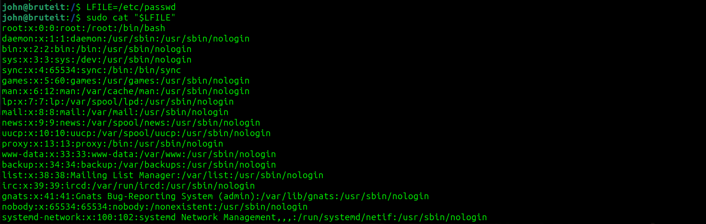

shadow file:

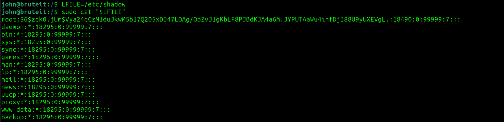

then we need to use `unshadow passwd shadow > hash.txt` (or use johnny GUI), now we can crack the hash using john or john GUI

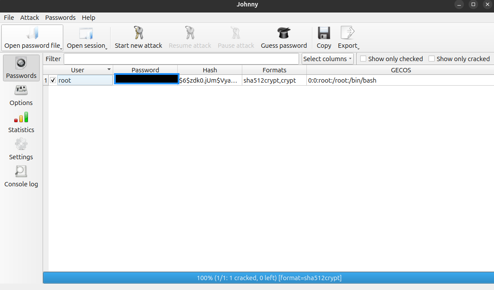

we have root password 

now we have root access and root flag

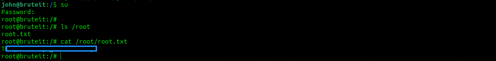

# MACHINE PWNEDs

