# Cat Pictures 2 CTF - TryHackMe Room
# **!! SPOILERS !!**
#### This repository documents my walkthrough for the **Cat Pictures 2** CTF challenge on [TryHackMe](https://tryhackme.com/room/catpictures2). 
---

we see open ports: 22,80,222,1337,3000,8080

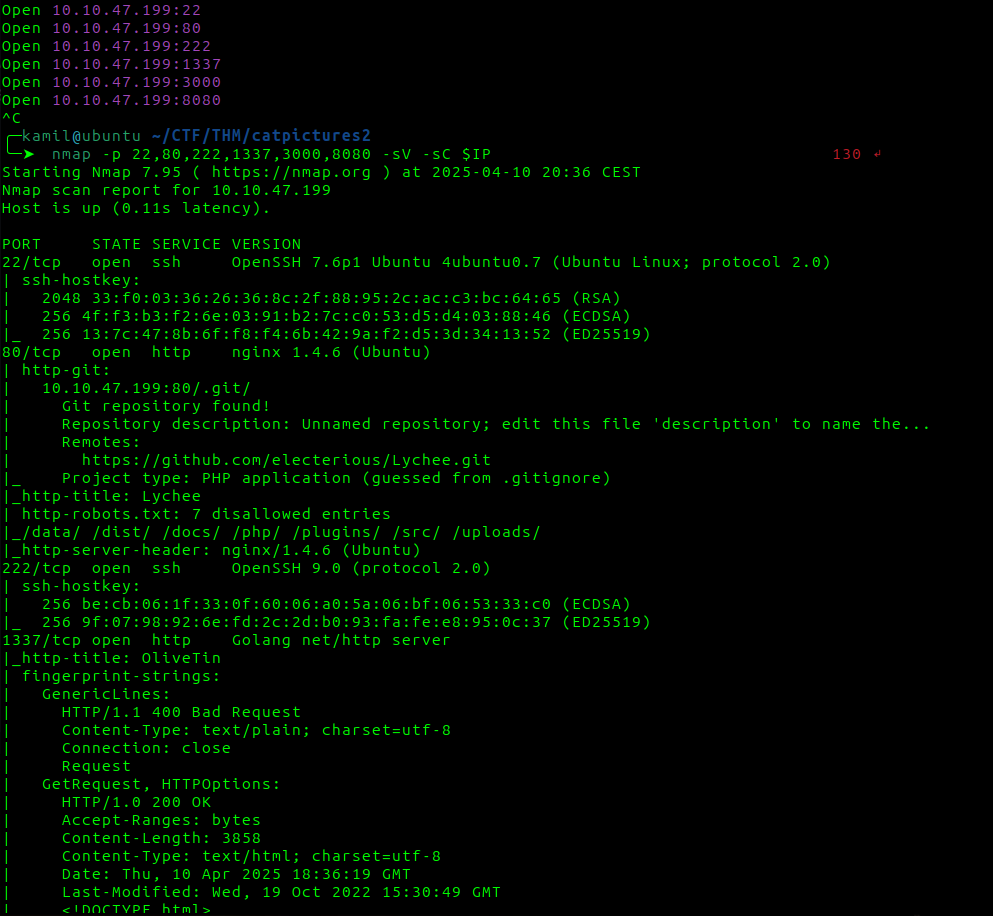

feroxbuster scan but we dont have permissions for most of them

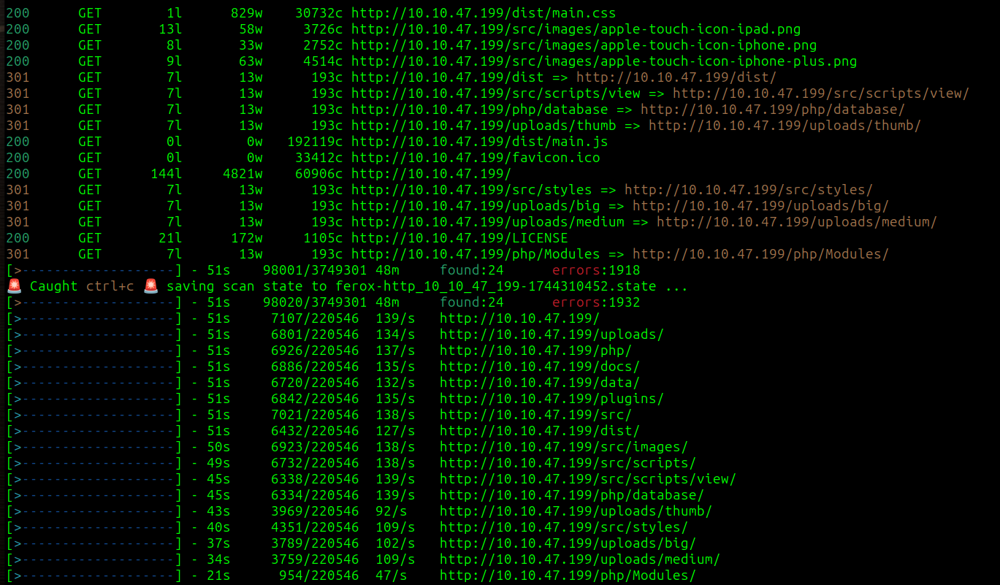

in one of the pictures we see Description: strip metadata

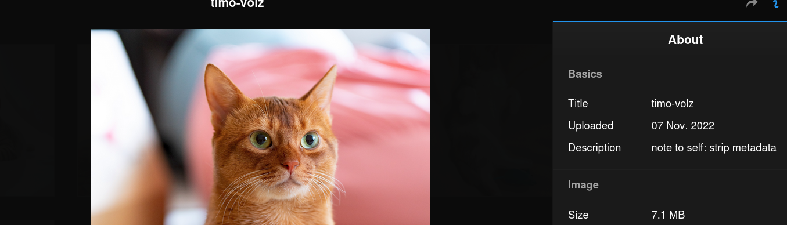

if we run exiftool on this picture we can find `:8080/REDACTED.txt`

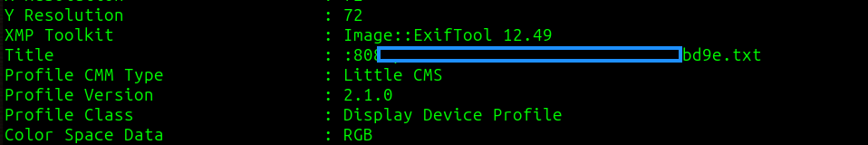

from this txt file we got user and password

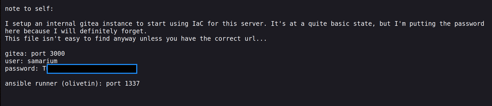

now we can login into gitea on port 3000, we can find first flag there

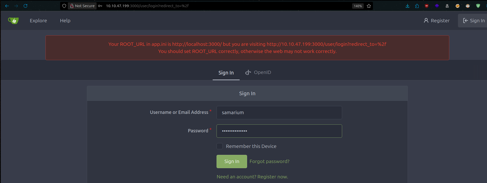

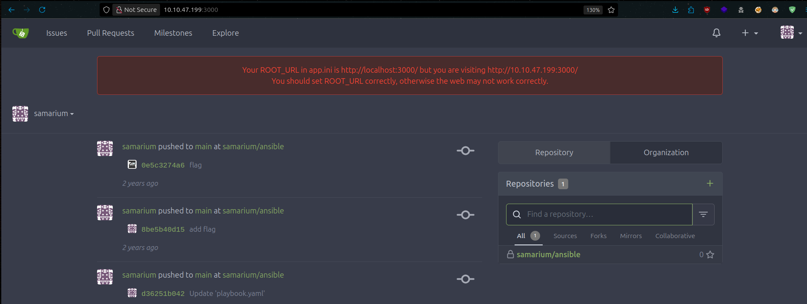

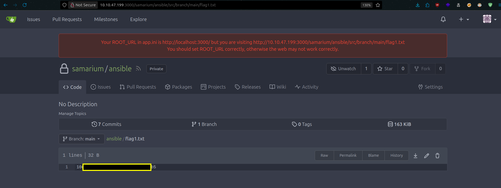

if we head to port 1337 we can see actions that we can execute 

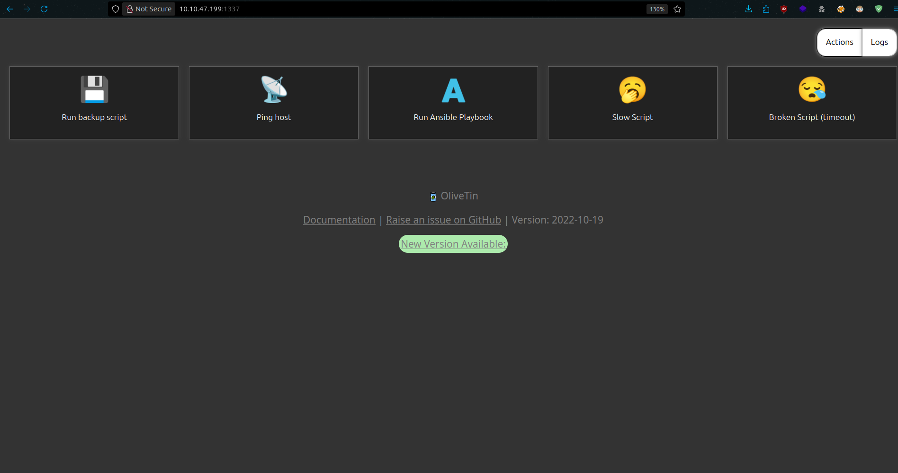

by look at logs of the action, we see that ansible code is executing

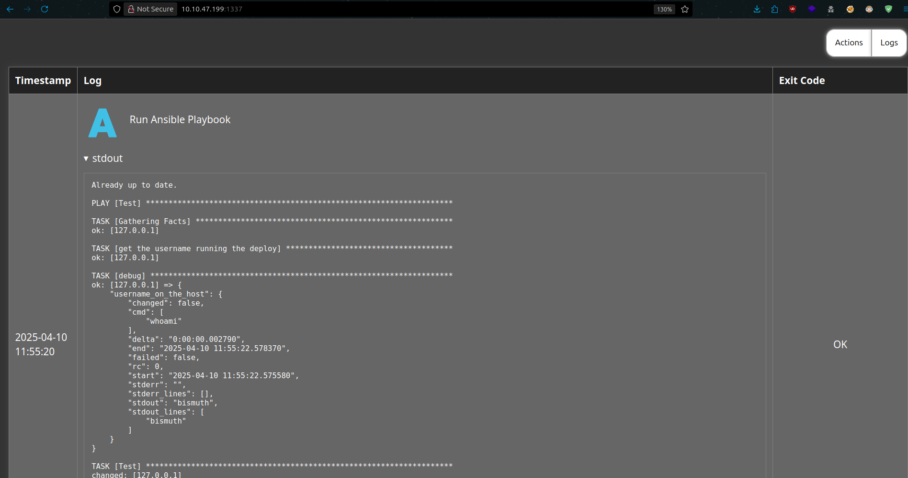

we can modify it to include reverse shell

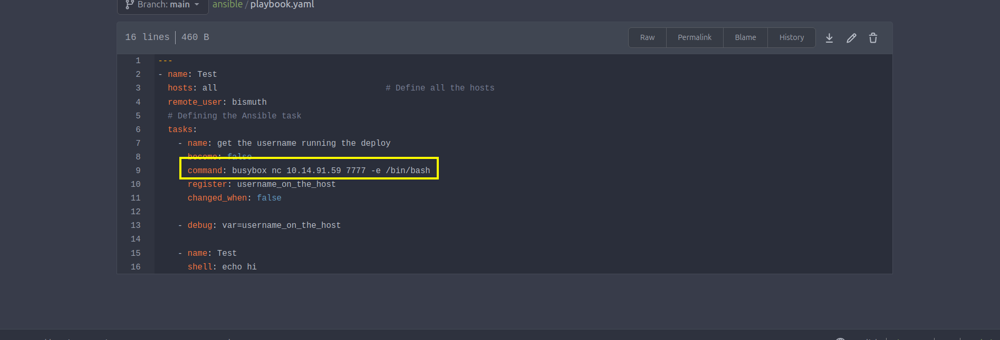

we got access as bismuth we can grab second flag, we also can grab his private key for stable access

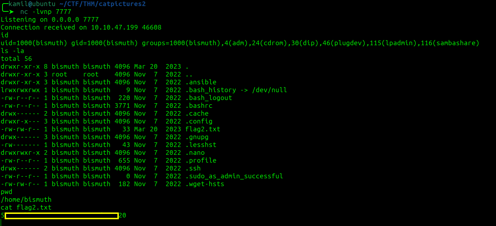

after transfering linpeas we see that we have vulnerable sudo version

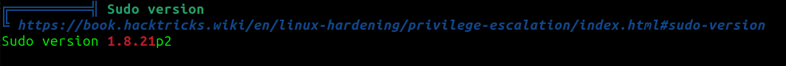

we can use this to exploit `https://github.com/blasty/CVE-2021-3156`

```
--- our machine ---
$ git clone https://github.com/blasty/CVE-2021-3156
$ tar -czvf exp.gz.tar CVE-2021-3156

--- victim machine ---
$ tar xopf exp.gz.tar
$ cd CVE-2021-3156/
$ make
$ ./sudo-hax-me-a-sandwich
$ ./sudo-hax-me-a-sandwich 1
```

now we have root access and root flag

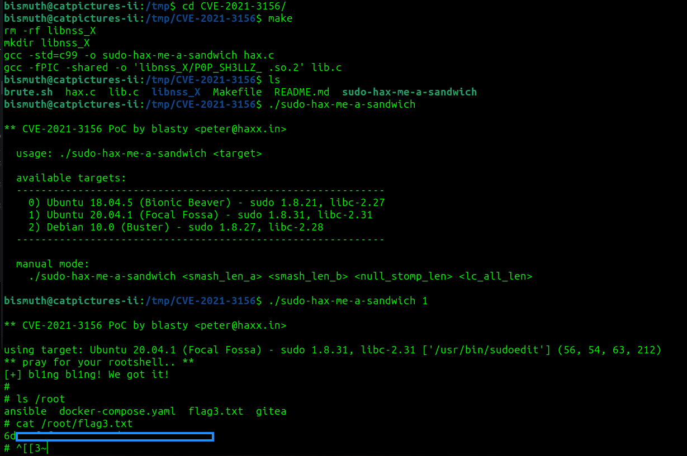

# MACHINE PWNED
