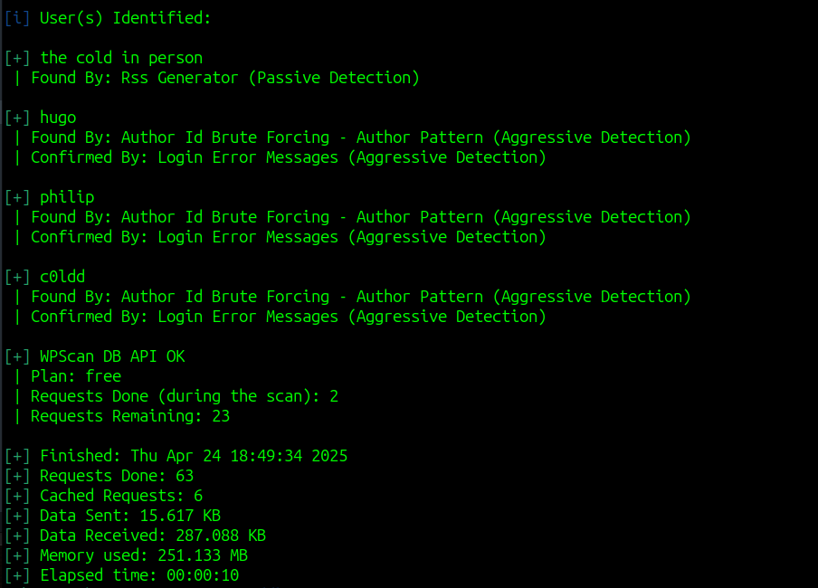
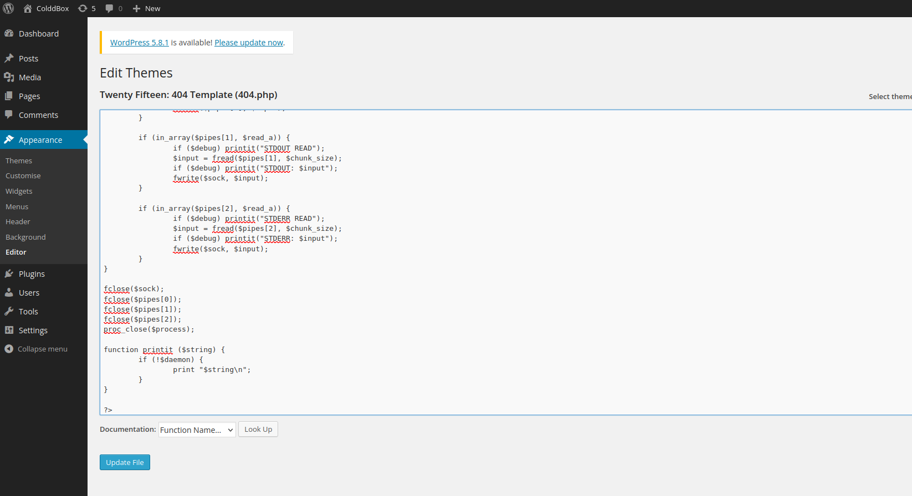
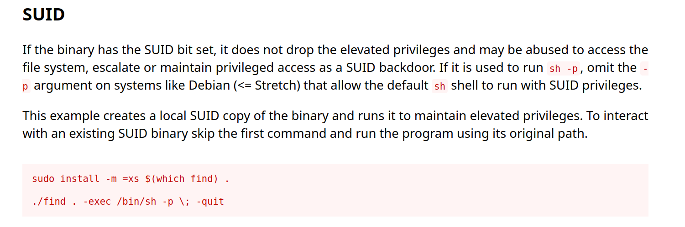

# ColddBox: Easy CTF - TryHackMe Room
# **!! SPOILERS !!**
#### This repository documents my walkthrough for the **ColddBox: Easy** CTF challenge on [TryHackMe](https://tryhackme.com/room/colddboxeasy). 
---

we see open ports 80 and 4512


from main page we see that there is a wordpress


wordpress login page


we can use wpscan to enumerate users

```
wpscan --url http://$IP:80 -v --no-update --enumerate vp,u
```



we found users: hugo, philip, c0ldd

now we can try to brute-force the login using wpscan

```
wpscan --url http://$IP -v --usernames c0ldd --passwords /usr/share/seclists/Passwords/xato-net-10-million-passwords-10000.txt --no-update
```


it worked we found valid password


now we can upload our reverse shell code to some 404.php and access it `http://10.10.X.X/wp-content/themes/twentyfifteen/404.php`



we have access as `www-data`


here we can see some hidden note


running linpeas we can see the SUID for /usr/bin/find we can try to run a command suggested by GTFObins




```
/usr/bin/find . -exec /bin/sh -p \; -quit
```

now we have root access we can grab user flag


and root flag


# MACHINE PWNED
