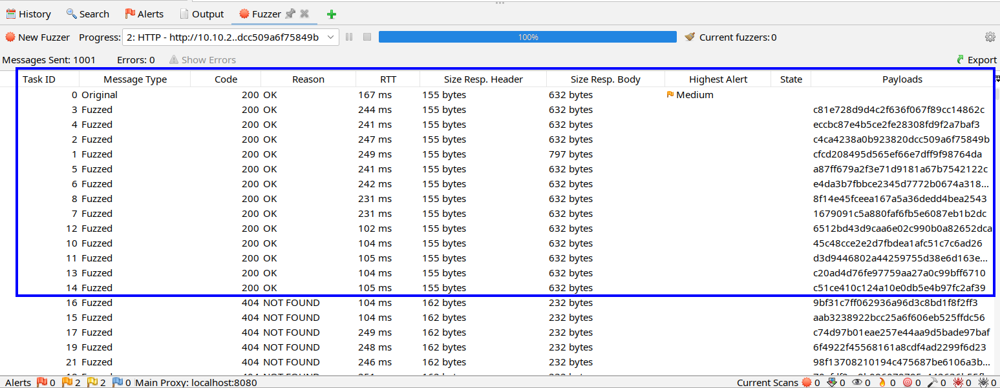

# Corridor CTF - TryHackMe Room
# **!! SPOILERS !!**
#### This repository documents my walkthrough for the **Corridor** CTF challenge on [TryHackMe](https://tryhackme.com/room/corridor). 
---

we see open port 80 

on the website we see a picture with doors that we can click

in the source code we see a image map with diffrent long values that look like hashes

they are indeed md5 and they go from 1 to 13, so we can see a pattern

we know about potential IDOR so we can follow the pattern and fuzz other locations

we can use ZAP proxy and choose numbers from 0 to 1000, then we can add a processor to create md5 hash of the number value and then try to access an endpoint

we found 15 responses with 200 OK status codes, the original map contains 13 endpoints

in endpoint with hash representing 14 there is nothing interesting

in endpoint with hash representing 0 there is a flag

# FLAG OBTAINED
