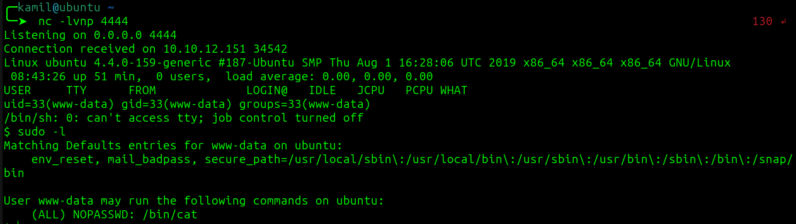

# Dav CTF - TryHackMe Room
# **!! SPOILERS !!**
#### This repository documents my walkthrough for the **Dav** CTF challenge on [TryHackMe](https://tryhackme.com/r/room/bsidesgtdav). 
---
Using nmap to scan for open ports


Only `80 http` open

Gobuster scan 

```
gobuster dir -w /snap/seclists/current/Discovery/Web-Content/common.txt -u http://10.10.12.151
```


Found `/webdav` with 401 status code 

Trying default credentials that I found online user: `wampp` password: `xampp`

Logged in!

We see directory with `passwd.dav` file

Using cadaver 


I created standard .php file with a `reverse shell` from here [Github pentestmonkey](https://github.com/pentestmonkey/php-reverse-shell)

Remember to change `$ip` and `$port` to your own machine and port


Using put command to upload standard PHP reverse shell


Now we see our file, by clicking on the file we will send our reverse shell.

Starting `nc -lvnp 4444` and waitnig for connection

It worked


Now `sudo -l` to gain info



We can use `cat` command as root without password

> [!IMPORTANT]
> User flag from `user.txt` : `449b40fe93f78a938523b7e4dcd66d2a`

Now final command to see root flag 

```
sudo /bin/cat /root/root.txt

```


> [!IMPORTANT]
> Root flag from `root.txt` : `101101ddc16b0cdf65ba0b8a7af7afa5`

