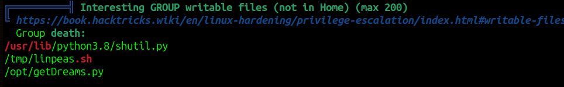

# Dreaming CTF - TryHackMe Room
# **!! SPOILERS !!**
#### This repository documents my walkthrough for the **Dreaming** CTF challenge on [TryHackMe](https://tryhackme.com/room/dreaming). 
---

we see open ports 22 and 80


main page is apache default page


we need to perform directory scanning with feroxbuster


we found some `pluck-4.7.13`

we try to access it


by clicking on admin we can find login page


i randomly guessd password : password

now we see some admin panel  


i also found some pluck file upload exploit here `https://www.exploit-db.com/exploits/49909`


we need to download the file and run the command

```
python3 49909.py 10.10.81.102 80 password /app/pluck-4.7.13
```


after running the script we got link to our shell

```
http://10.10.81.102:80/app/pluck-4.7.13/files/shell.phar
```

we got access to p0wnyshell


we see other users death, lucien, morpheus


there is something interesting in /opt


in /opt/test.py we found some plain-text password


i used simple reverse shell to switch to terminal, then i tried to login as lucien with password that i found


it worked we have first flag


we see some history of commands, most notable is mysql connection which we can simply recreate


```
mysql -u lucien -p[REDACTED]
```


we can take a look inside library database


we also see sudo -l output, we can run some python script as death


we cant look directly into this script, but we see a script with the same name in /opt directory, we


script takes data from database that we have seen, data isnt sanitized so we could input additional row to databse with malicious content

```
> use library;
> insert into dreams (dreamer, dream) values (";/bin/bash","");
```

now when the script runs it will execute something like : `echo ; /bin/bash` and we should get shell as death

```
sudo -u death /usr/bin/python3 /home/death/getDreams.py
```


i did something wrong and it works but we need to use exit to see the result of the commands run as death


i made it work by using reverse shell command, now we have stable access as death


we can grab another credentials from getDreams.py file and connect via ssh 


in /home/morpheus we see some python script that creats backup


after installing pspy64 we see that there is a proccess that runs the script


we can edit the function /usr/lib/python3.8/shutil.py 




script uses copy2() so we can add our malicious code to it and create reverse shell to get access as morpheus, now we need to wait 


we can grab last flag


this user can sudo su without password so we got root access


# MCHINE PWNED
