# Gallery CTF - TryHackMe Room
# **!! SPOILERS !!**
#### This repository documents my walkthrough for the **Gallery** CTF challenge on [TryHackMe](https://tryhackme.com/room/gallery666). 
---

after using rustscan we know about 2 open ports 80 and 8080

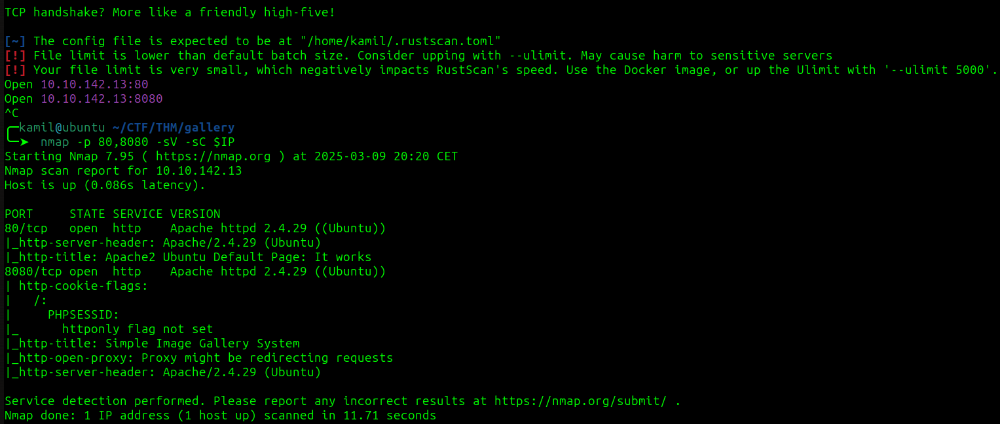

scanning port 80 with ferox

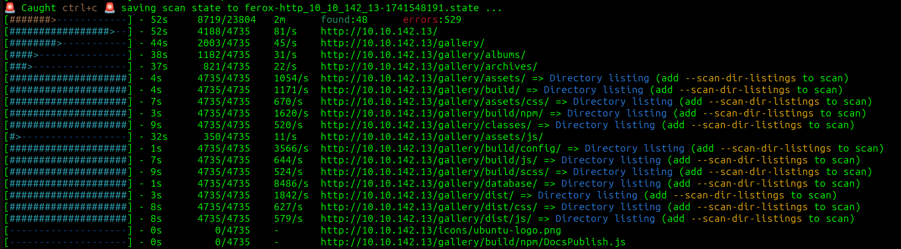

after heading to `http://ip/gallery` we see login form, we also have answer to next question CMS is a `simple image gallery` 

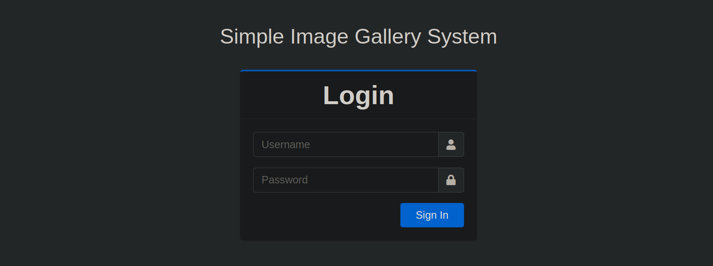

i tried simple sql injection login: `admin' or 1=1 -- -` password: `test` and we are redirected to admin panel

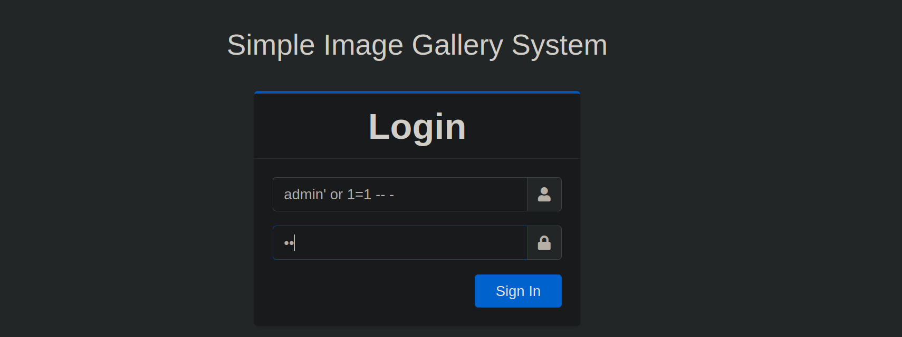

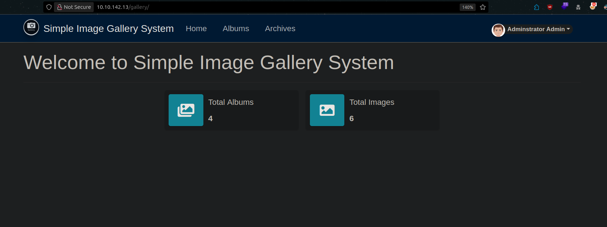

ok i tried few things and found a way to get reverse shell as `www-data`

in MyAccount section we can change the avatar, i uploaded `webshell.php` from pentestmonkey and started the listener then need to click update to update the profile then we should have access to shell

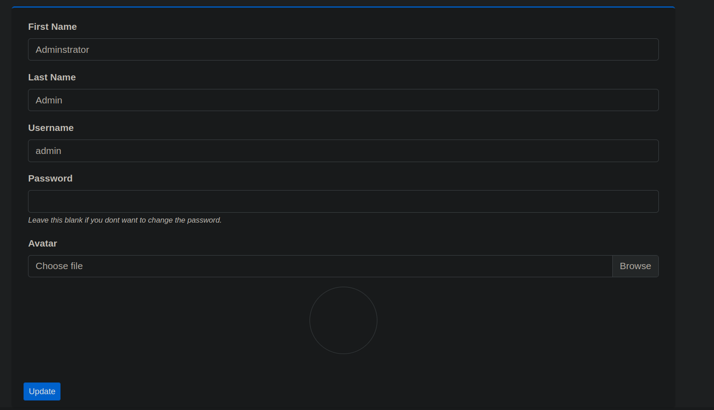

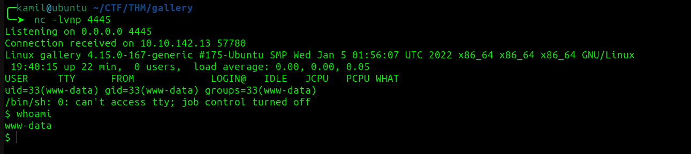

we see 2 home folders `mike` and `ubuntu`

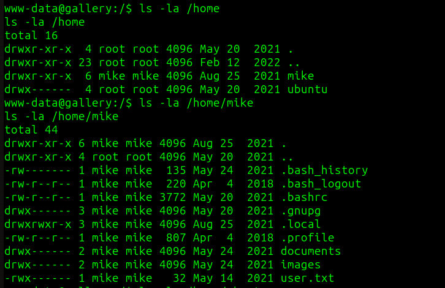

i started from looking at the source code of the page

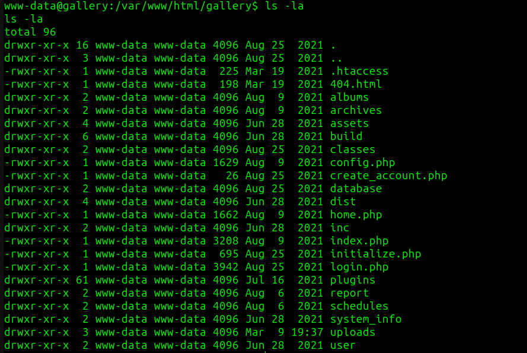

i found something interesting in `initialize.php` we have some information about a database in the system, i used `mysql -u gallery_user -p` then provided a password that was included in `initialize.php` next we use commands below

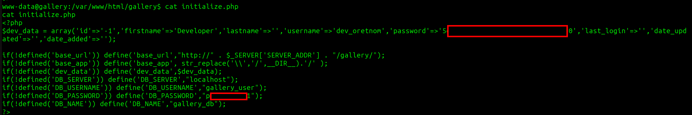

```
$ show databases;
$ use gallery_db;
$ show tables;
$ select * from users;
```
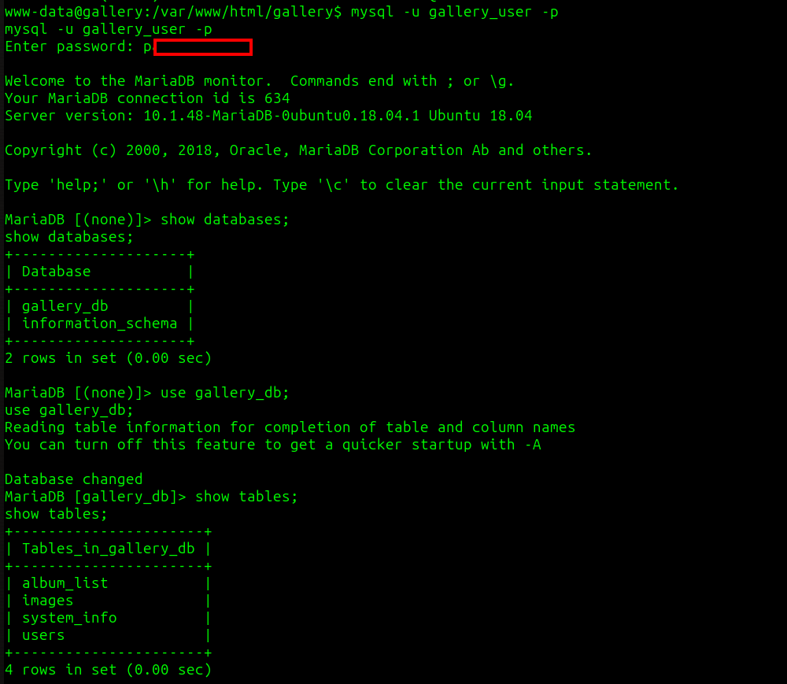

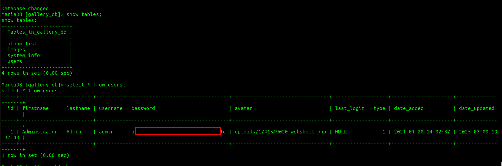

now we got password hash for the admin user `a22...[REDACTED]...531c` i tried to crack it but i couldnt

i copied linpeas.sh into victim machine and found weird file `rootkit.sh` in `/opt` directory, but it seems like something for later i still need to login as mike

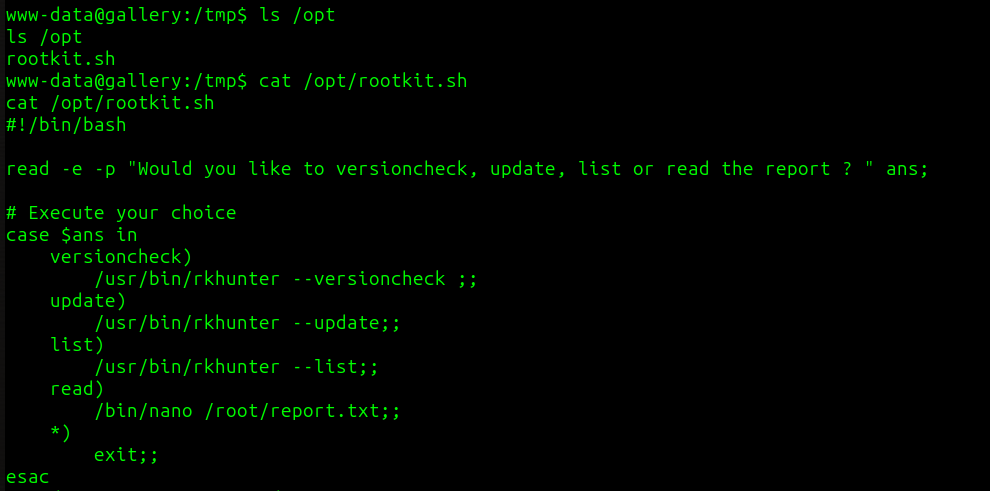

then i spotted that in `/var/backup/mike_home_backup/.bash_history` there are some `sudo -l` commands it also seems like he typed his password before hitting enter on sudo -l so i will try this string as a mike password `b3s...[REDACTED]...0xx`

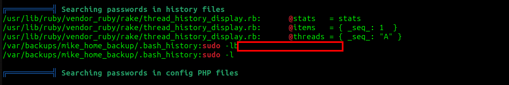

it worked now we have access as mike and user flag

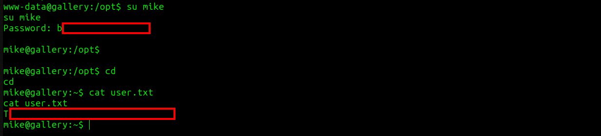

i checked the `sudo -l`

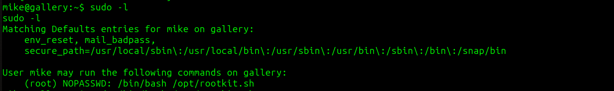

to gain access as root we probably need to use `sudo /bin/bash /opt/rootkit.sh` and then we need to chose option `read` we should get access to `/root/report.txt` via nano (to do this we need to have stable shell)

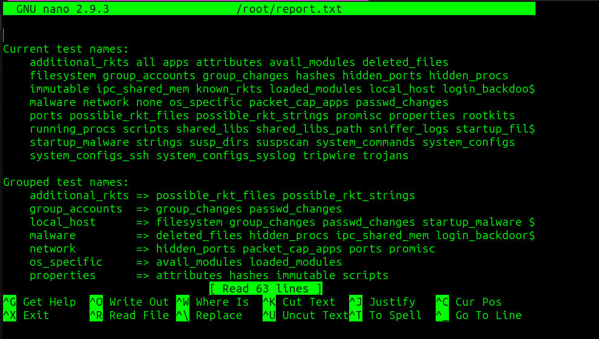

now we need to check how to PE in GTFOBins using nano, we need to use `Ctrl + R` then `Ctrl + X` and then type `reset; sh 1>&0 2>&0`

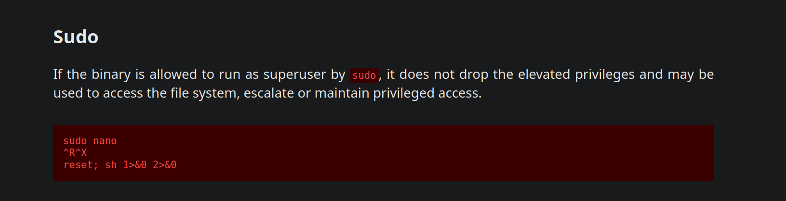

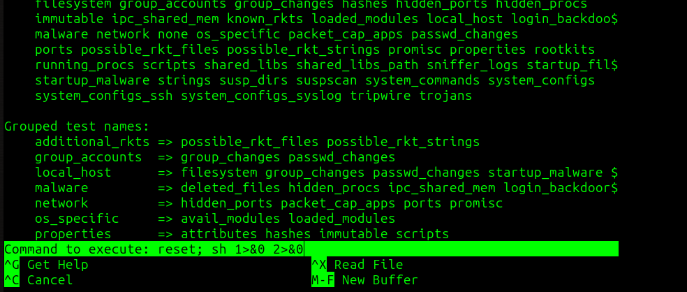

it worked (but its pretty bugged)

now we have root access and root flag

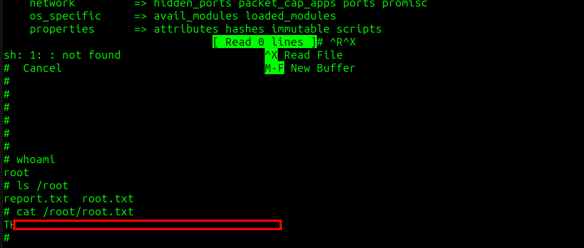

# MACHINE PWNED
